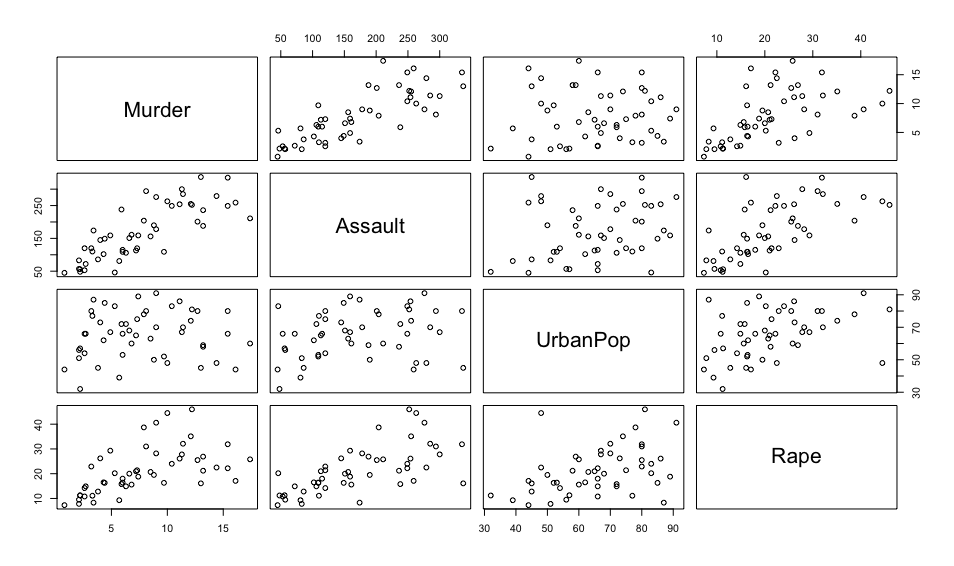
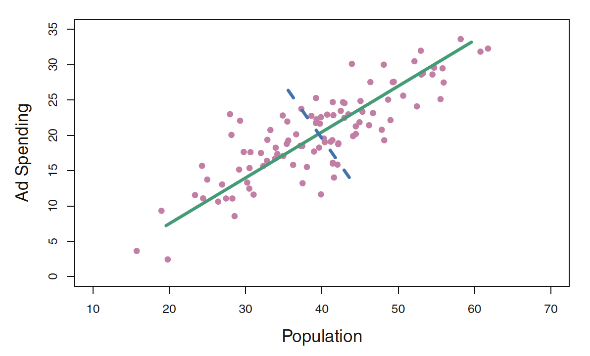
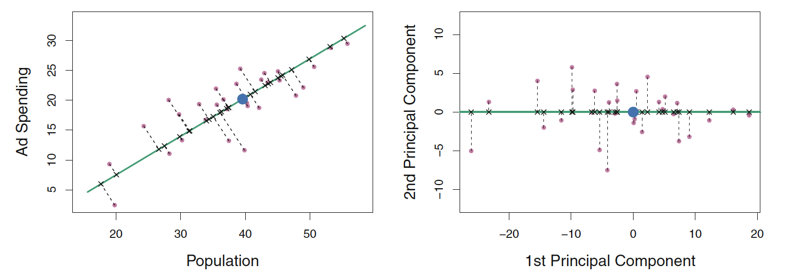
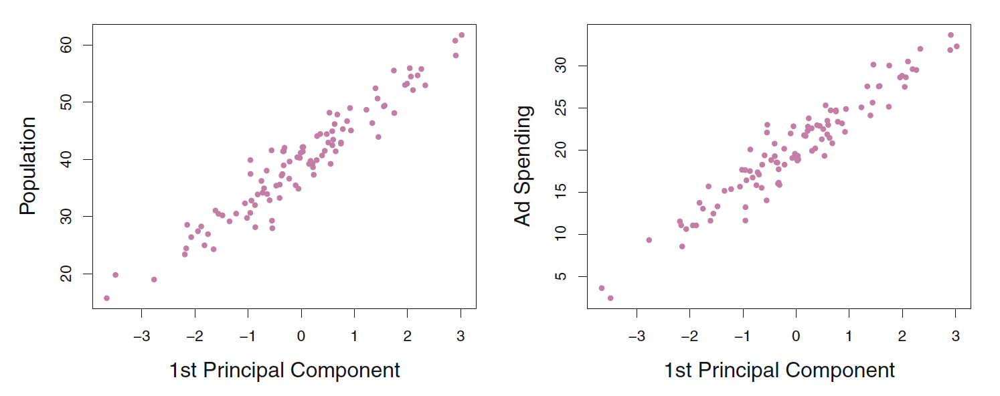
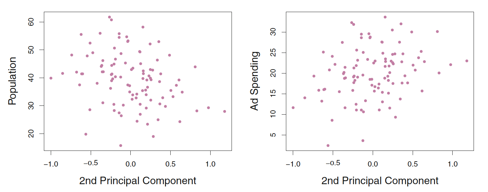
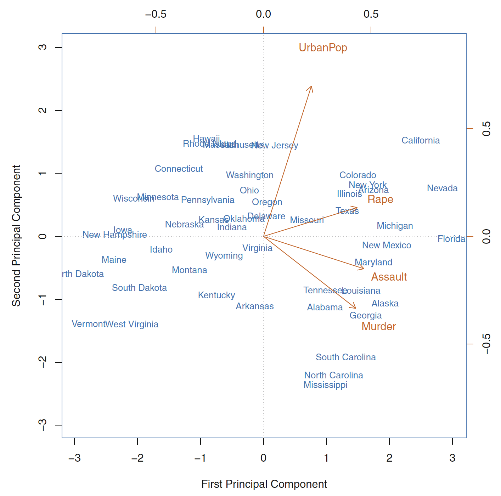
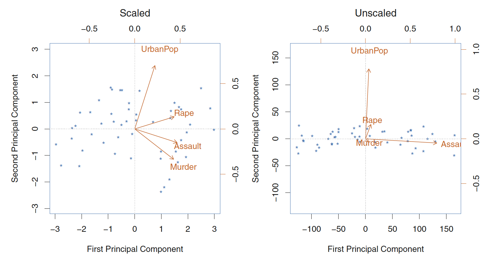
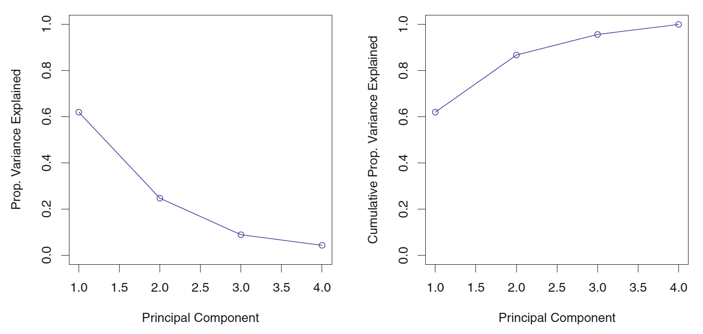

# Introduction

## Supervised vs. Unsupervised learning

- Supervised Learning definition
    - $n$ observations. 
        - Each containing features $X_1, X_2, ..., X_p$ and responses $Y$.
    - Regression and classification are widely known examples.

- Unsupervised Learning definition
    - $n$ observations. 
        - Each containing features $X_1, X_2, ..., X_p$.
    - Objective: Discover interesting properties about the data.
        - Better data visualization
        - Reduce computational complexity
        - Discover groups among data points

## Usefulness of Unsupervised Learning (Examples)

- Cancer research: Look for subgroups within the patients or within the genes in order to better understand the disease

- Online shopping site: Identify groups of shoppers as well as groups of items within each of those shoppers groups.

- Search engine: Search only a subset of the documents in order to find the best one for retrieval.

+++

## General Challenges of Unsupervised Learning

- In general, unsupervised learning methods are
    - more subjective
    - hard to assess results

- There is usually no obvious ground-truth to compare to

- Remedy: 
    - Unsupervised methods are usually part of a bigger goal
    - Evaluate them as how they contribute to such bigger goal
    
- Examples:
    - How clustering shoppers improved your recommendation algorithm?
    - How clustering documents reduced computational complexity and what was the cost involved?

## Unsupervised Learning techniques

Covered in this module:

- PCA (Principal Component Analysis)
    - Data Visualization
    - Data pre-processing

- Clustering
    - Discovering unknown subgroups in the data
    - k-means clustering
    - Hierarchical clustering

# Data Visualization

## Data Visualization

- We want to visualize $n$ observations with $p$ features

- Two-dimensional scatterplots of data

- Crime statistics per 100000 residents in 50 states of USA.

- Crime types: Assault, Murder and Rape.

- UrbanPop: Percent of the population in each state living
in urban areas.

## Data Visualization

- Two-dimensional scatterplots of data
    - $p(p-1)/2$ such scatterplots
    - each contain small fraction of the total information present in the dataset

- We want to find low dimensional representation of the data that captures most of the info as possible
    - Perfect scenario: 2 or 3 dimensions.

- **PCA: finds low dimension that captures most of the variability of the data**

# Principal Component Analysis (PCA)

## Principal Component Analysis (PCA)

- Discussed before in the context of Principal Components Regression
    - Turn large set of correlated variables into smaller set of orthogonal ones.
    
- This module focuses on PCA as a tool for data exploration

# PCA - Recap

## Principal Component Analysis (PCA)

- We want to create a $n \times M$ matrix $Z$, with $M < p$.

- The column $Z_m$ of $Z$ is the $m$-th principal component.

$$Z_m = \sum_{j=1}^{p} \phi_{jm} X_j \quad \text{subject to} \quad \sum_{j=1}^p \phi_{jm}^2 = 1$$

- We want $Z_1$ to have the highest possible variance.
    - That is, take the direction of the data where the observations vary the most.
    - Without the constrain we could get higher variance by increasing $\boldsymbol \phi_j$

## Principal Component Analysis (PCA)

- $Z_2$ should be uncorrelated to $Z_1$, and have the highest variance, subject to this constrain.
    - The direction of $Z_1$ must be perpendicular (or orthogonal) to the direction of $Z_2$

- And so on ...

- We can construct up to $p$ PCs that way.
    - In which case we have captured all the variability contained in the data
    - We have created a set of orthogonal predictors
    - But have **not** accomplished dimensionality reduction

## PCA Example - Ad spending

- The population size (pop) and ad spending (ad) for $100$ different cities are shown as purple circles. 

- The green solid line indicates the first principal component. 

- The blue dashed line indicates the second principal component.

## PCA Example - Ad spending (II)

 

- A subset of the advertising data. 

- Left: 1st PC 
    - The dimension along which the data vary the most
    - The line that is closest to all $n$ of the observations. 

- Right: Rotated so that the 1st PC direction coincides with the x-axis.

## PCA Example - Ad spending (III)

 

- Plots 1st PC scores versus population and ad spending. The relationships are strong.

- Strong relationship: the 1st PC appears to capture most of the information contained
in the pop and ad predictors.

## PCA Example - Ad spending (IV)

 

- There is little relationship between 2nd PC and predictors

- Suggesting one only needs the first principal component in order to accurately represent the pop and ad budgets.

## PCA Example: Interpretations

- M-dimension that capture most of the variability contained in the data

- M-dimension that is closest to the data points (average squared euclidean distances)

## PCA - General setup

- Let $\boldsymbol X$ be a matrix with dimension $n \times p$.

- Each column represent a vector of predictors.

- Assume $\boldsymbol \Sigma$ to be the covariance matrix associated with $\boldsymbol X$.

- Since $\Sigma$ is a non-negative definite matrix, it has an eigen-decomposition
$$ \boldsymbol {\Sigma} = \boldsymbol C \boldsymbol \Lambda \boldsymbol C^{-1} $$
    - $\boldsymbol \Lambda = diag(\lambda _1, ..., \lambda _p)$ is a diagonal matrix of (non-negative) eigenvalues in decreasing order, 
    - $\boldsymbol C$ is a matrix where its columns are formed by the eigenvectors of $\boldsymbol {\Sigma}$.

## PCA - General setup (II)

- We want $\boldsymbol Z_1 = \boldsymbol \phi_1 \boldsymbol X$, subject to $||\boldsymbol \phi_1||_2 = 1$ 

- We want $\boldsymbol Z_1$ to have the highest possible variance, $V(\boldsymbol Z_1) = \boldsymbol \phi_1^T \Sigma \boldsymbol \phi_1$

- $\boldsymbol \phi_1$ equals the column eigenvector corresponding with the largest eigenvalue of $\boldsymbol \Sigma$

- The fraction of the original variance kept by the $M$ principal component

$$ R^2 = \frac{\sum _{i=1}^{M} \lambda _i}{\sum _{j=1}^{p}\lambda _j} $$

## Visualizing PC and loading

- Biplot: Represent both the PC scores (point projections) and the loading vectors (orange axis)

- First component: Measure the overall rates of serious crimes.

- Second component: Level of urbanization of the state.

- Crime-related variables are correlated with each other

- UrbanPop variable is less correlated with the other three.

- High crime rates (California) have high first component score

- High level of urbanization (California) have high second component score.

## Scaling the variables

- Not all methodology needs scaling, e.g. linear regression

- PCA **usually** does

- Left: Biplot with scaled variables

- Right: Biplot with unscaled variables

- Assault has by far highest loading on 1st PC because it has the highest variance.

## Uniqueness of PCs

- Each Principal Component loading vector is unique, up to a sign flip.

- Flipping the sign has no effect as the direction of the PC does not change.

- The approximation below will not change because the score vector sign will compensate the flip on the loading vector

$$x_{ij} \approx \sum_{m=1}^{M} z_{im} \phi_{jm}$$

## Proportion of variance explained (PVE)

- Let's assume the variables are centered to have mean zero.

- Total variance present in a dataset:

$$\sum_{j=1}^p Var(X_j) = \sum_{j=1}^p \frac{1}{n} \sum _{i=1}^ {n}x_{ij}^2$$

- Variance explained by the $m$th component:

$$\frac{1}{n} \sum_{i=1}^{n}z_{im}^2 = \frac{1}{n} \sum_{i=1}^{n}\left(\sum_{j=1}^{p}\phi_{jm}x_{ij}\right)^2$$

## Proportion of variance explained (PVE)

- PVE of the $m$th component:

$$\frac{\sum_{i=1}^{n}\left(\sum_{j=1}^{p}\phi_{jm}x_{ij}\right)^2}{\sum_{j=1}^p \sum _{i=1}^ {n}x_{ij}^2}$$

- Cumulative PVE:
    - In total, there are $min(n-1, p)$ principal components, and their PVEs sum to one.

- The fraction of the original variance kept by the $M$ principal component

$$ \frac{\sum _{i=1}^{M} \lambda _i}{\sum _{j=1}^{p}\lambda _j} $$

- where $\lambda$'s are the eigenvalues of the eigen-decomposition of the covariance matrix $\boldsymbol \Sigma$ of $\boldsymbol X$
 

## Deciding how many PCs to use

- There is no objective answer

- Adhoc, by looking at the PVE graph

- Cast the selection based on the usage of the PCs in a supervised learning setting of interest (bigger goal)

## PCA - Examples

- Lab 1: Principal component analysis applied to the `USArrests` dataset.

- Extra: PCA on the New York Times stories

## Recommended Exercise 1

- For the New York Times stories dataset:
    - Create a biplot and explain the type of information that you can extract from the plot.
    - Create plots for the PVE and Cumulative PVE. Describe what type of information you can extract from the plots.
    
The pca-examples.rdata can be downloaded from the Blackboard. 
