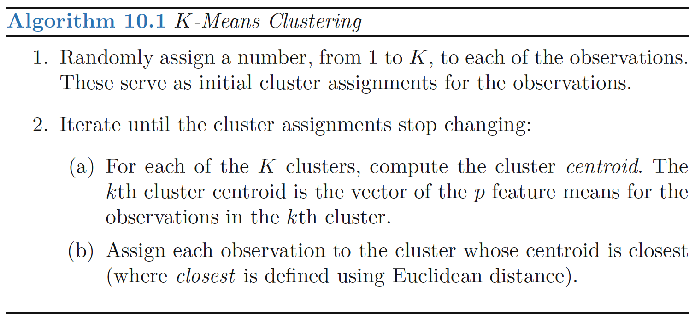
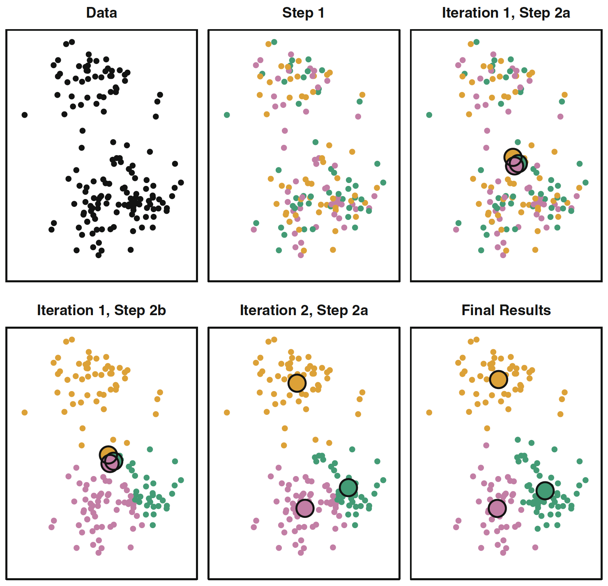
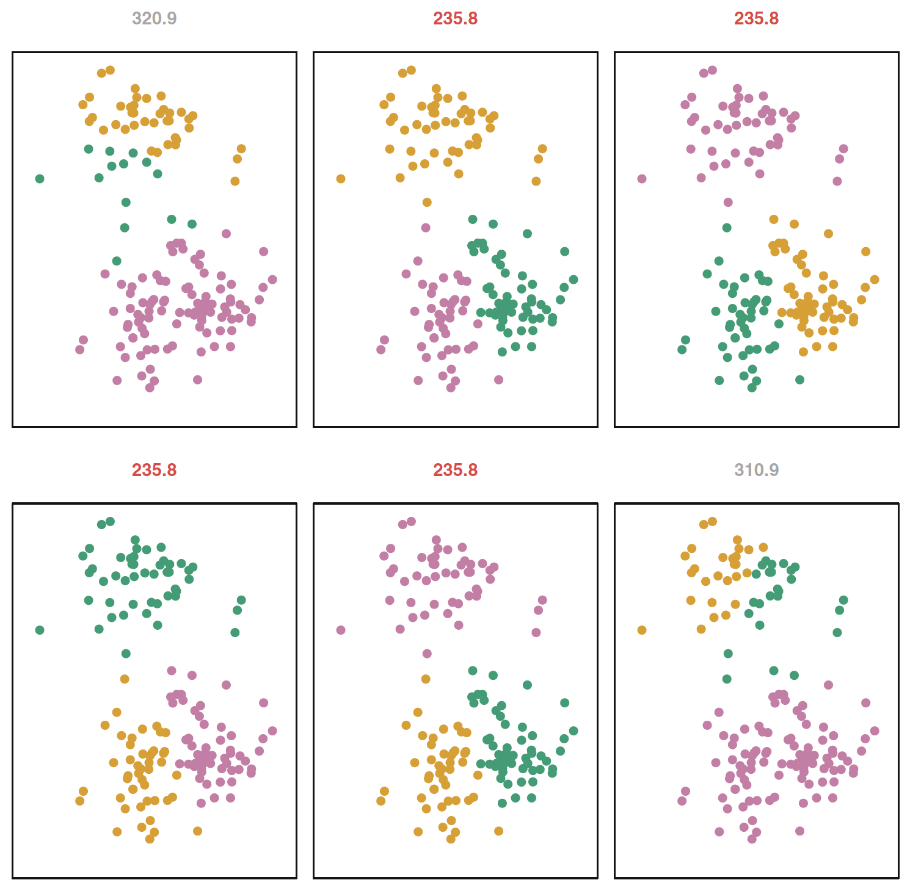
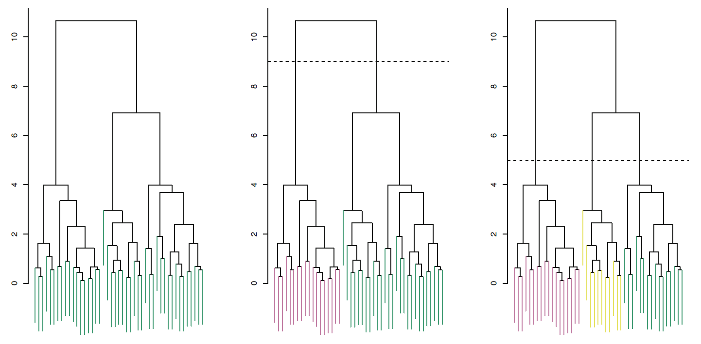
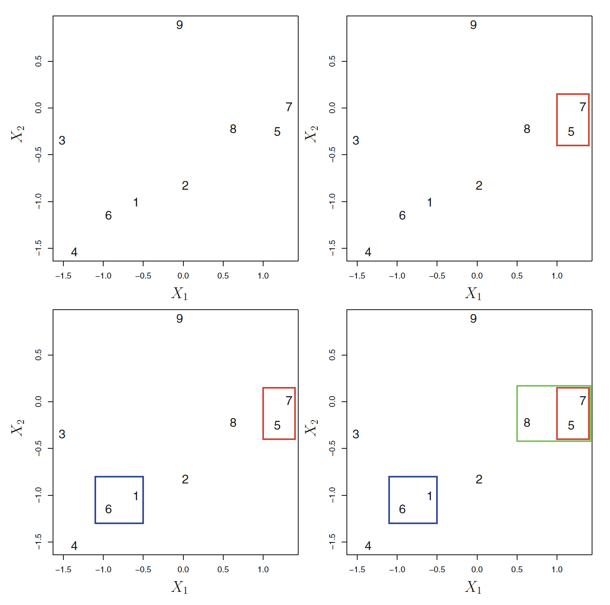
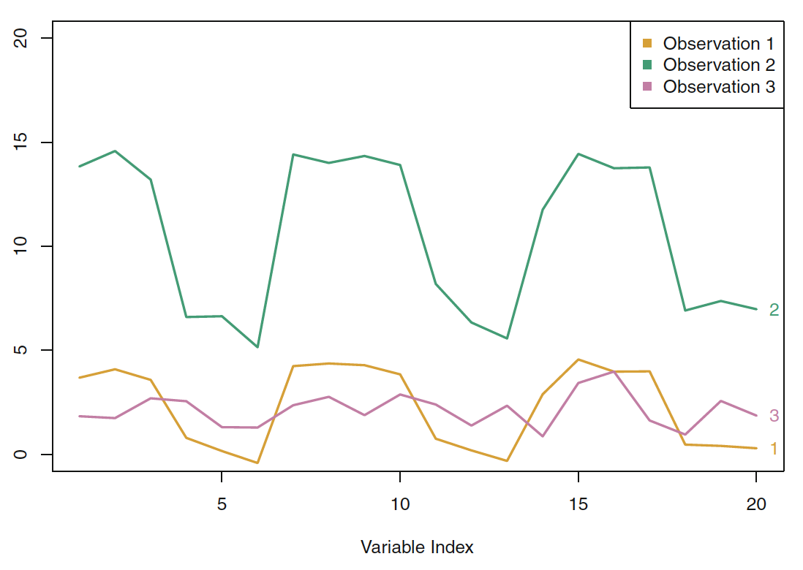
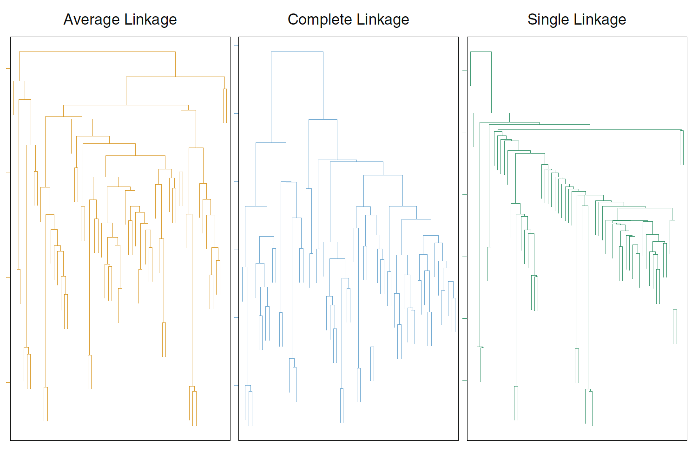
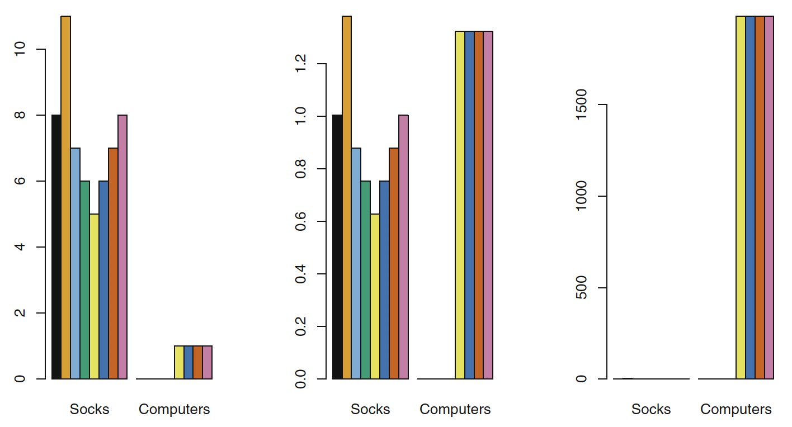

# Clustering methods

## Clustering methods

- Partition the data into different groups
    - Observations within each group are quite similar
    - Observations in different groups are quite different 
    
- Must define what it means to be similar or different
    - Domain specific considerations
    
- Examples:
    - Different types of cancer
    - Market segmentation
    - Search Engine

## PCA vs. Clustering methods

- Both aim to simplify the data via small number of summaries

- PCA looks for a low-dim representation that explains good fraction of variance
    - Principal Components

- Clustering looks for homogeneous subgroups among the observations
    - Clusters

## Types of clustering

- K-means

- hierarchical clustering

# K-means clustering

## K-means clustering

- It is an approach for partitioning a dataset into K distinct, non-overlapping clusters.

- $C_1, ..., C_k$: Sets containing indices of observations in each cluster.

- This sets satisfy two properties:
    - $C_1 \cup C_2 \cup \ldots \cup C_k = \{1,\ldots,n\}$
    - $C_k \cap C_{k'} = \emptyset \text{ for all }k\neq k'$

1) Each observation belongs to at least one of the $K$ clusters.

2) No observation belongs to more than one cluster.

## Within-cluster variation

- A good cluster is one for which the **within-cluster variation** is **as small as possible**

- Within-cluster variation (squared Euclidean distance)

$$W(C_k) = \frac{1}{|C_k|} \sum_{i, i' \in C_k} \sum_{j=1}^{p}(x_{ij} - x_{i'j})^2$$

- As small as possible

$$\underset{C_1, \ldots, C_k}{\text{minimize}}\left\{\sum_{k=1}^{K}W(C_k)\right\}$$

- Squared Euclidean distance is the most common

## K-means algorithm

- Find algorithm to solve:

$$\underset{C_1, \ldots, C_k}{\text{minimize}}\left\{\sum_{k=1}^{K} \frac{1}{|C_k|} \sum_{i, i' \in C_k} \sum_{j=1}^{p}(x_{ij} - x_{i'j})^2 \right\}$$

- Difficult problem: $K^n$ ways to partition $n$ observations into $K$ clusters.

- Fortunately, there is a simple algorithm that can provide a local optimum

## K-means algorithm

## Recommended Exercise 2

Show that the algorithm in the previous slide is guaranteed to decrease the value of the objective

$$\underset{C_1, \ldots, C_k}{\text{minimize}}\left\{\sum_{k=1}^{K} \frac{1}{|C_k|} \sum_{i, i' \in C_k} \sum_{j=1}^{p}(x_{ij} - x_{i'j})^2 \right\}$$

at each step. 

## K-means algorithm

- A simulated data set with 150 observations in two-dimensional space. 

- K = 3

- Final result is obtained after 10 iterations

## K-means algorithm

- Depend on random start conditions, need to run multiple times and select the best run

- K-means performed six times with random initial conditions

- K = 3

- Above is the value of objective function

## K-means algorithm

- Potential disadvantage of K-means, we need to select K
    - But this is not always a disadvantage, e.g. search engine

## Recommended exercise 3

Perform k-means clustering in the New York Times stories dataset. 

The pca-examples.rdata can be downloaded from the Blackboard. 

# Hierarchical Clustering

## Hierarchical Clustering

- Does not require us to commit to a particular choice of K in advance

- Produces an attractive tree-based representation called dendogram

- We will describe bottom-up or agglomerative clustering
    - Most common type of hierarchical clustering

- Other approach available is called Divisive or "top down" approach

    
## Interpreting a dendogram

- The height of the cut in the dendogram serves the same role as K in K-means clustering
    - Not always clear where to make the cut
    
- Clusters obtained by cutting the vertical axis at a lower level are always nested within clusters obtained by cutting at a higher level.

## Dendograms can be misleading

- The lower in the tree fusions occur -> more similar

- The height of the fusion, as measured on the vertical axis, indicates how different the two observations are.
    - We should not draw conclusions based on the horizontal axis    
    
- It is tempting but incorrect to conclude that observations 9 and 2 are quite similar to each other.
    - observation 9 is no more similar to observation 2 than it is to observations 8, 5, and 7.

## Hierarchical structure

- Not always suited for a arbitrary dataset

- Group of people 
    - evenly split between male and female 
    - evenly split between americans, japanese and french
    - best division in two groups -> gender
    - best division in three groups -> nationality
    - not nested

- This explains why hierarchical clusters can sometimes yield worse results than K-means for a given number of clusters

## The hierarchical clustering algorithm

1. Start at the botton of the dendogram
    - Each of the $n$ observations is treated as its own cluster
2. Fuse the two clusters that are more similar to each other
    - There are now $n-1$ clusters
3. Repeat step 2 until there are only one cluster

- Dissimilarity measure
    - We need to chose a dissimilarity measure

- Linkage
    - Extend the concept of dissimilarity from a pair of observation to a pair of groups of observations

## The hierarchical clustering algorithm

- First few steps of the hierarchical clustering algorithm
    - Euclidean distance
    - Complete linkage

- 5 and 7

- 6 and 1

- 8 and {5, 7} using complete linkage

## Choice of dissimilarity measure

- Euclidean distance is most common dissimilarity measure to use.

- But there are other options

- Correlation-based distance
    - Correlation focus on shape of the observation profile rather than their magnitude

- Correlation-based distance: 
    - Two observations are similar if their features are highly correlated
    - Even though observed values might be far apart according to Euclidean distance

## Correlation-based distance

- Three observations with measure on 20 variables

- Observations 1 and 3
    - close to each other in Euclidean distance
    - weakly correlated -> large correlation-based distance
    
- Observations 1 and 2
    - Different values for each variable -> large euclidean distance
    - Strongly correlated

## Online retailer example

- Online retailer example
    - Identify subgroups of similar shoppers
    - Matrix with shoppers (rows) and items (columns)
    - Value indicate number of times a shopper bought an item
    
- Euclidean distance
    - Infrequent shoppers will be clustered together
    - The amount of itens bought matters
    
- Correlation distance
    - Shoppers with similar preference will be clustered together
    - Including both high and low volumes shoppers

## Linkage

- Need to extend the concept between dissimilarity between pairs of observations to pairs of groups of observations

- Linkages
    - Complete: Maximal intercluster dissimilarity
    - Single: Minimal intercluster dissimilarity
    - Average: Mean intercluster dissimilarity

- Compute all pairwise dissimilarities between the observations in cluster A and the observations in cluster B. 

- Then apply the appropriate function to compute either Complete, Single and Average linkage

## Linkage

- Dendogram depends strongly on the type of linkage used 

- Average and complete linkage tend to yield more balanced clusters.

## Scaling variable

- Usually wise to scale the variables

- Eight online shoppers (each with one color)

- (Left) Number of pairs of socks, and computers -> Socks will dominate

- (Center) Number of itens, scaled -> The weight of computer increase

- (Right) Number of dollar spent -> Computers will dominate

- Which case is better depend on the application and objectives

## Recommended exercise 4

Perform hierarchical clustering in the New York Times stories dataset. 

The pca-examples.rdata can be downloaded from the Blackboard. 

## Summary of the decisions involved

- Should standardize the variables?
    - Usually yes

- K-means clustering
    - What K?

- Hierarchical clustering:
    - dissimilarity measure?
    - Linkage?
    - Where to cut the dendogram?

- With these methods, there is no single right answer—any solution that exposes some 
interesting aspects of the data should be considered.

## Extra slides

- Blog post applying k-means clustering on data from Twitter
    - http://thinktostart.com/cluster-twitter-data-with-r-and-k-means/
- Blog post applying hierarchical clustering on data based on the complete works of william shakespeare
    - https://www.r-bloggers.com/clustering-the-words-of-william-shakespeare/ 
