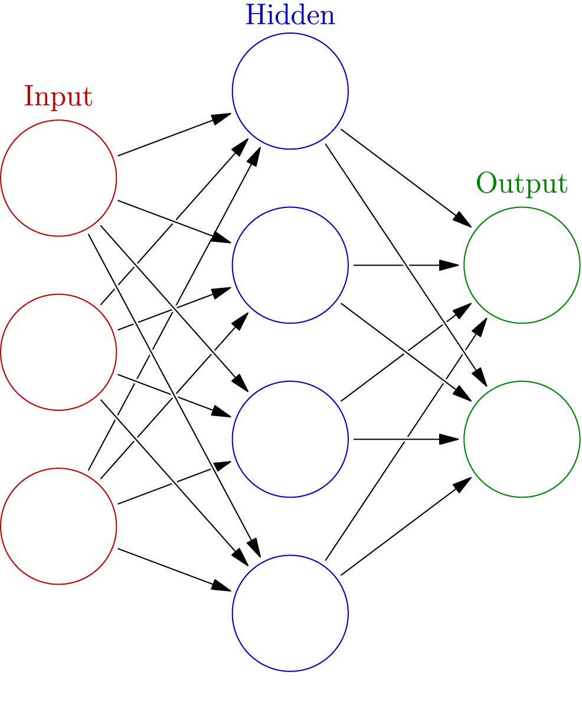

(last changes: 12.04 typos)

```{r setup, include=FALSE}
knitr::opts_chunk$set(echo = TRUE,tidy=TRUE,message=FALSE,warning=FALSE)
```

# Solutions to recommended exercises

## Theoretical

###a) 

Write down the equation describing this network. What would you call such a network?

```{r, out.width="300pt",echo=FALSE}
knitr::include_graphics("drawNNp4h4h4o3.png")
```

This is a 4-4-4-3 feedforward network, with bias nodes for both hidden and output layers. Equation for node $c$, $c=1,\ldots,3$ in the output layer:

$$
y_c({\bf x})=\phi_o(\beta_{0c}+\sum_{m=1}^4 \beta_{mc}z_{m})=\phi_o(\beta_{0c}+\sum_{m=1}^4 \beta_{mc}\phi_{h*}(\gamma_{0m}+\sum_{l=1}^4 \gamma_{lm}\phi_h(\alpha_{0l}+\sum_{j=1}^4 \alpha_{jl}x_{j})))
$$

###b) 

The following image is the illustration of an artificial neural network at Wikipedia. 


```{r, out.width="300pt",echo=FALSE}

```

<https://commons.wikimedia.org/wiki/File:Colored_neural_network.svg>

* What can you say about this network architecture

It is not clear if the network has 2 inputs and one bias node to feed into the hidden layer, or 3 inputs and no bias node. Then the hidden layer has 4 nodes and no bias node, and the output layer has 2 nodes. So either 2-4-2 or 3-4-2.

* What do you think it can be used for (regression/classification)?

This can be used for regression with two responses (modelling both weight and quality of paper sheets?). If we have a classifiation problem with two classes then we usually use only one output node, but is is possible to use softmax activation for two classes, but that is very uncommon.

###c) 

Given a the following problems, what are sensible feedforward network architectures (depth, width, activation function) and methods (loss function, algorithms) that you would explore?

* Regression with on univariate response, 10 possible covariates, 500 observations.

We have 10 input nodes and 1 output node. Since we only have 500 observation we should not estimate too many paramters, and with one layer with 5 hidden nodes we have $(10+1)*5+(5+1)*1=61$ and with 10 hidden nodes we have $(10+1)*10+(10+1)*1=121$. For a statistician having 121 parameters to estimate with 500 observations is a bit much. But, if regularization is added to the network that might work.

Activation hidden: ReLU if non-linearities.
Activation output: linear
Loss function: mean squared error

* Classification with two classes, 100 possible covariates, 10000 observations.

We have many covariates, and probably not all are equal important, and with 10000 observations we may afford to have more than one hidden layer. 

Activation hidden: ReLU.
Activation output: sigmoid
Loss function: binary cross-entropy

* Classification with 10 classes, image data (like the MNIST), 50000 observations.

The MNIST data has 256 input variables, and with so many observations we may go for for than one hidden layer, and many nodes. 
Activation hidden: ReLU.
Activation output: softmax
Loss function: categorical cross-entropy


###d) 

What are the similarities and differences beween a feedforward neural network with one hidden layer with `linear` activation and `sigmoid` output (one output) and logistic regression?

When the hidden layer has a linear activation the model is only linear in the original covariates, so adding the extra hidden layer will not add non-linearity to the model. The feedforward model may find latent structure in the data in the hidden layer, but in general logistic regression should be a better choice.

###e) 

In a feedforward neural network you may have $10000$ weights to estimate but only $1000$ observations. How is this possible?

This is possible because the neural network is fitted using iterative methods. But, there is not one unique solutions here, and the network will benefit greatly by adding some sort of regulariztion, like weight decay and early stopping.

###f) 

Which network architecture and activation functions does this formula give?
$$ \hat{y}_1({\bf x})=\beta_{01}+\sum_{m=1}^5 \beta_{m1}\cdot \max(\alpha_{0m}+\sum_{j=1}^{10} \alpha_{jm}x_j,0)$$

This is a feedforward network with 10 input node, a bias term for the hidden layer, 5 nodes in the hidden layer with ReLU activiation function, a bias term for the output layer, linear activation function for an output layer with only one node.

How many parameters are estimated in this network?
$(10+1)*5+(5+1)=61$.

###g) 
Which network architecture and activation functions does this formula give?

$$ \hat{y}_1({\bf x})=(1+\exp(-\beta_{01}-\sum_{m=1}^5 \beta_{m1}\max(\gamma_{0m}+\sum_{l=1}^{10} \gamma_{lm}\max(\sum_{j=1}^{4}\alpha_{jl}x_j,0),0))^{-1}$$

Feedforward network with two hidden layers. Input layer has 4 nodes and no bias term for the first hidden layer, first hidden layer has 10 nodes and ReLU activation and a bias term for the second hidden layer, second hidden layer has 5 nodes and ReLU activiation, and a bias term for the output node. One node in output layer with sigmoid activiation.

How many parameters are estimated in this network?
$4*10+(10+1)*5+(5+1)=101$.

###h) 
In a regression setting: Consider

* a sum of non-linear functions of each covariate in Module 7
* a sum of many non-linear functions of sums of covariates in feedforward neural networks (one hidden layer, non-linear activation in hidden layer) in Module 11.

Explain how these two ways of thinking differ? Pros and cons?

In module 7 we had an additive model of non-linear function, and to add interactions we would do that manually. Each coefficient estimated would be rather easy to interpret. 
For neural nets we know that with one hidden layer and squashing type activation we can fit any function (regression), but may need many nodes - and then the interpretation might not be so easy. Interactions is automatically handled with the non-linear function of sums.

### i) 

What is the most interesting aspect of neural network (your opinion)? How would you compare how feedforward neural networks are fitted as compared to fitting multiple linear regression and logistic regression? Compare how model selection (which covariates) are performed.

The most interesting aspect:

* what has been achived by neural networks since 2012
* the simple mathematical formula for the sequentially layered dense nets
* the graphical presentation of the model in a network
* the impressive number of parameters that may be estimated with gradient based methods

## Practical

You should be able to (all with the `nnet` package)

* Fit regression 

See Boston house price example for fitting with `nnet`.

* Fit classification with two classes

The difference to the fitting of more than two classes is that sigmoid activation in the output node (one node) is chosen and that binary entropy loss is chosen. Else, see solution to more that two classes.

* Fit classifiation with more than two classes

See example with ZIP-codes in the end of the module page, and also the MNIST data example.


