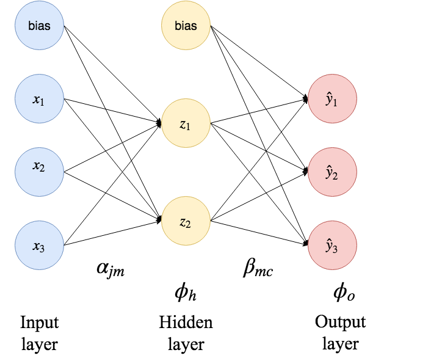
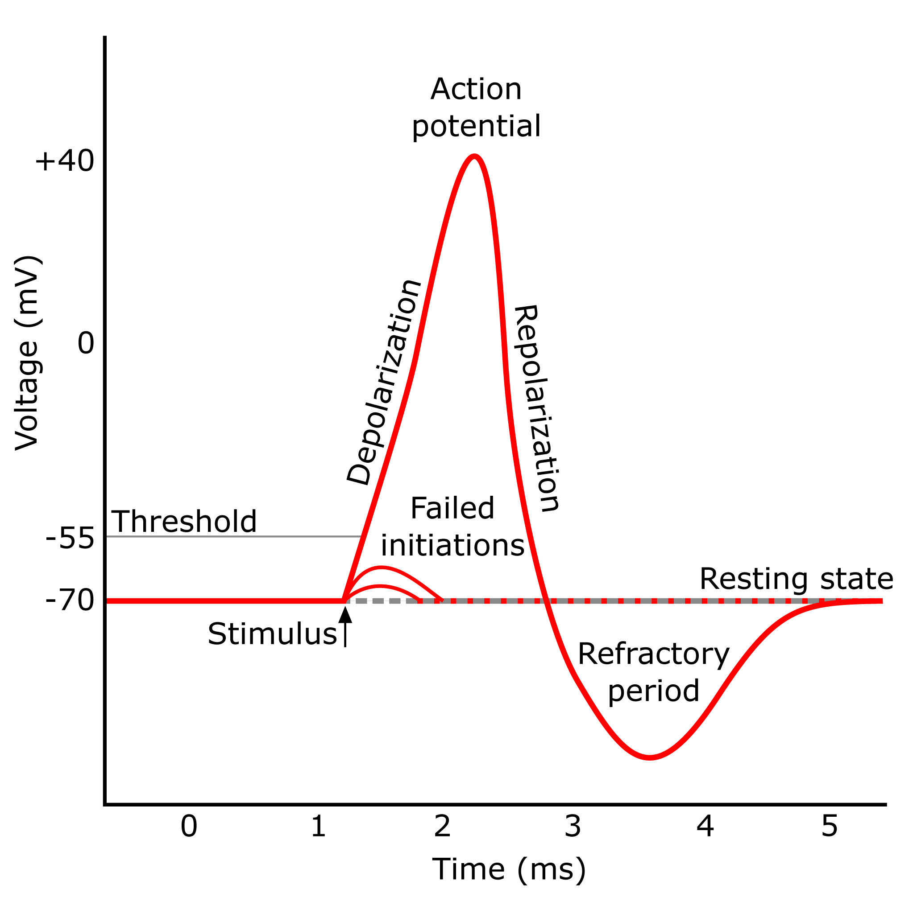
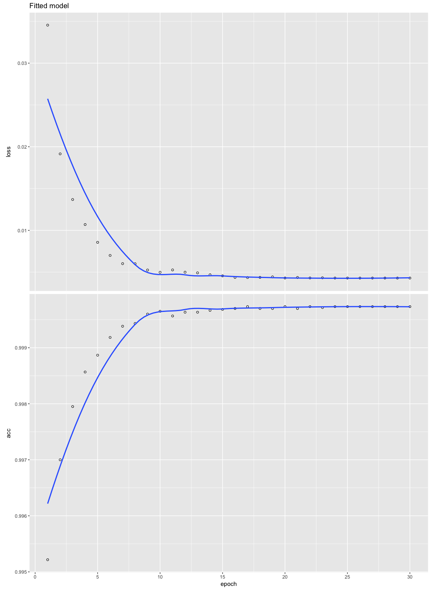

```{r setup, include=FALSE}
showsol<-TRUE
library(knitr)
opts_chunk$set(tidy.opts=list(width.cutoff=68),tidy=TRUE)
knitr::opts_chunk$set(echo = TRUE,tidy=TRUE,message=FALSE,warning=FALSE,strip.white=TRUE,prompt=FALSE,
                      cache=TRUE, size="scriptsize")
whichformat="latex"
```

---

Last update: March 19, 2020

--- 

# Acknowledgements

* A lot of this material stems from Mette Langaas and her TAs (in particular Thea Roksv\aa g, who developed the set of slides, but also Mette Langaas and Julia Debik). Thanks to Mette for the permission to use the material!

---

## Learning material for this module


Todo

\vspace{2mm}

<!-- * [Classnotes 25.03.2019](https://www.math.ntnu.no/emner/TMA4268/2019v/notes/M11L1notes.pdf) -->
<!-- * [Classnotes 28.03.2019](https://www.math.ntnu.no/emner/TMA4268/2019v/notes/M11L2notes.pdf) -->

See also _References and further reading_ (last slide), for further reading material.


---

## What will you learn?

$~$

* Translating from statistical to neural networks language
    + linear regression
    + logistic regression
    + multiclass (multinomial) regression

$~$    
    
* Feedforward networks
 
$~$

* Neural network parts: model -- method -- algorithm -- recent developents

$~$

* Deep learning
    + the timeline
    + Keras
 

---


# Introduction

* Neural networks (NN) were first introduced in the 1990's. 

* Shift from statistics to computer science and machine learning, as they are highly parameterized

* Statisticians were skeptical: ``It's just a nonlinear model''.

* After the first hype, NNs were pushed aside by boosting and support vector machines.

* Revival since 2010: The emergence of _\textcolor{red}{Deep learning}_ as a consequence of improved computer resources, some innovations, and applications to image and video classification, and speech and text processing

---

## Why a module on neural networks?

$~$

* Every day you read about the success of AI, machine learning -- and in particular _\textcolor{red}{deep learning}_.

$~$

* In the last five years the field of deep learning has gone from low level performance to excellent performance -- particularly in image recognition and speech transcription.


$~$

* Deep learning is based on a layered artificial neural network structure.

$~$

So we first need to understand: what is a _neural network_?

---


\centering
{width=50%}

Neuron and myelinated axon, with signal flow from inputs at dendrites to outputs at axon terminals. Image credits: By Egm4313.s12 (Prof. Loc Vu-Quoc) <https://commons.wikimedia.org/w/index.php?curid=72816083>


---

* There are several (self-study) learning resources (some listed under 'further references') that the student my turn to for further knowledge into deep learning, but this presentation is heavily based on @kerasR, with added formulas and theory.
* There is a new IT3030 [deep learning course at NTNU](https://www.ntnu.no/studier/emner/IT3030#tab=omEmnet).


\centering
{width=30%} {width=30%}
 

---

## AI, machine learning and statistics


\includegraphics[angle=-90]{AI_ML_DL.png}

---


* Artificial intelligence (AI) dates back to the 1950s, and can be seen as _the effort to automate intellectual tasks normally performed by humans_ (page 4, @kerasR). 

$~$

* AI was first based on hardcoded rules (like in chess programs), but turned out to be intractable for solving more complex, fuzzy problems.

$~$

* With the field of _machine learning_ the shift is that a system is _trained_ rather than explicitly programmed.


<!--  -->

---

## Machine learning

$~$

* Machine learning is related to mathematical statistics, but differs in many ways.

$~$

* ML deals with much larger and more complex data sets than what is usually done in statistics. 

$~$

* The focus in ML is oriented towards _\textcolor{red}{engineering}_, and ideas are proven _empirically_ rather than theoretically (which is the case in mathematical statistics).

$~$

According to @kerasR (page 19): 
\vspace{2mm}
\begin{quote}
Machine learning isn't mathematics or physics, where major advancements can be done with a pen and a piece of paper. It's an engineering science.
\end{quote}

---

# From statistics to artificial neural networks

Recapitulate from Module 3 with the bodyfat dataset that contained the following variables.

* `bodyfat`: % of body fat.
* `age`: age of the person.
* `weight`: body weighth.
* `height`: body height.
* `neck`: neck thickness.
* `bmi`: bmi.
* `abdomen`:  circumference of abdomen.
* `hip`: circumference of hip.

---

We will now look at modelling the `bodyfat` as response and using all other variables as covariates - this will give us

* one numerical output (response), and
* seven covariates
* one intercept

Let $n$ be the number of observations in the training set, here $n=243$.

---

## Multiple linear regression model

(from Module 3)

$~$

We assume 
$$
 Y_i=\beta_0 + \beta_1 x_{i1}+\beta_2 x_{i2}+\cdots + \beta_p x_{ip}+\varepsilon_i={\boldsymbol x}_i^T{\boldsymbol\beta}+\varepsilon_i \ ,
$$

for $i=1,\ldots,n$, where $x_{ij}$ is the value $j$th predictor for the $i$th datapoint, and ${\boldsymbol\beta}^\top = (\beta_0,\beta_1,\ldots,\beta_p)$ the regression coeffficients.

$~$


We used the compact matrix notation for all observations $i=1,\ldots,n$ together:
$${\boldsymbol Y}={\boldsymbol {X}} \boldsymbol{\beta}+{\boldsymbol{\varepsilon}}  \ .$$ 


---

Assumptions:

1. $\text{E}(\boldsymbol{\varepsilon})=\boldsymbol{0}$.
2. $\text{Cov}(\boldsymbol{\varepsilon})=\text{E}(\boldsymbol{\varepsilon}\boldsymbol{\varepsilon}^T)=\sigma^2\boldsymbol{I}$.
3. The design matrix has full rank, $\text{rank}({\bf X})=p+1$. (We assume $n>>(p+1)$.)

The classical _normal_ linear regression model is obtained if additionally

4. $\boldsymbol\varepsilon\sim N_n({\boldsymbol 0},\sigma^2 {\bf I})$ holds. Here $N_n$ denotes the $n$-dimensional multivarate normal distribution.

---

### From statistical model to network architecture

$~$

How can our statistical model be represented as a network?

$~$

We need _\textcolor{red}{new concepts}_:

$~$

* Covariates $\rightarrow$ _input nodes_ in an _input layer_.

$~$

* The intercept $\rightarrow$  _bias_ node. 

$~$

* The response $\rightarrow$ _output node_ in an _output layer_.

$~$

* The regression coefficients $\rightarrow$ _weights_ (often written on the arrows from the inputs to the output layer).


---

\vspace{-20mm}

\scriptsize
```{r, echo=F}
library(nnet)
library(NeuralNetTools)
library(dplyr)
library(ggplot2)
path <- "../3LinReg/data/"
d.bodyfat <- read.table(paste(path,"bodyfat.clean.txt",sep=""),header=T)
d.bodyfat <- d.bodyfat[,c("bodyfat","age","gewicht","hoehe","bmi","neck","abdomen","hip")]
names(d.bodyfat) <- c("bodyfat","age","weight","height","bmi","neck","abdomen","hip")
fit=lm(bodyfat~ age + weight + height + bmi + neck + abdomen + hip,data=d.bodyfat)

fitnnet=nnet(bodyfat~ age + weight + height + bmi + neck + abdomen + hip,data=d.bodyfat,
             linout=TRUE,size=0,skip=TRUE,maxit=1000,
             entropy=FALSE)
# NB default is one hidden layer but avoided with size=0, but then skip=TRUE is needed,
```

```{r motivating, echo=FALSE, fig.width=7, fig.height=7,fig.align = "center",out.width='80%'}
plotnet(fitnnet)
```


\normalsize
* All lines going into the output node signifies that we multiply the covariate values in the input nodes with the weights (regression coefficients), and then sum. 
* This sum can be sent through a socalled _activition function_ (here just the identity function).

---

* _\textcolor{red}{Regression notation:}_

\begin{equation*}
 Y_i=\beta_0 + \beta_1 x_{i1}+\beta_2 x_{i2}+\cdots + \beta_p x_{ip}+\varepsilon_i \ .
\end{equation*}

$~$

* _\textcolor{red}{Neural network notation:}_
\begin{equation*}
y_1({\boldsymbol x}_i)=\phi_o(w_0+w_1 x_{i1}+\cdots + w_p x_{ip}) \ ,
\end{equation*}
where $\phi_o(x)=x$ (identity function).

---

* We do not say anything of what is random and fixed, and do not make any assumption distribution of a random variable.

* In the statistics world we would have written $\hat{y}_1({\boldsymbol x}_i)$ to specify that we are estimating a predicted  value of the response for the given covariate value. To be able to distinguish this predicted response from the observed response we use the notation:
$$ \hat{y}_1({\boldsymbol x}_i)=\phi_o(w_0+w_1 x_{i1}+\cdots + w_p x_{ip})$$

The only difference to our MLR model is then that we would have called the $w$s $\hat{\beta}$s instead.


---

### Statistical parameter estimation
\vspace{2mm}

* In multiple linear regression, the parameters $\boldsymbol\beta$ are estimated with maximum likelihood and least squares (equivalent under Normal assumption).

$~$ 

* **Remember**: The estimator $\hat{\boldsymbol \beta}$ is found by minimizing the RSS for a multiple linear regression model:
$$
\begin{aligned} \text{RSS} &=\sum_{i=1}^n (y_i - \hat y_i)^2 = \sum_{i=1}^n (y_i - \hat \beta_0 - \hat \beta_1 x_{i1} - \hat \beta_2 x_{i2} -...-\hat \beta_p x_{ip} )^2 \\
&= \sum_{i=1}^n (y_i-{\boldsymbol x}_i^T \boldsymbol \beta)^2=({\boldsymbol Y}-{\boldsymbol X}\hat{\boldsymbol{\beta}})^T({\boldsymbol Y}-{\boldsymbol X}\hat{\boldsymbol{\beta}}) \ .\end{aligned}
$$
Solution:
$$ \hat{\boldsymbol\beta}=({\boldsymbol X}^T{\boldsymbol X})^{-1} {\boldsymbol X}^T {\boldsymbol Y} \ .$$

---

### Neural networks: loss function and gradient descent
\vspace{4mm}

We now translate what we did for the regression setup into the neural networks world:
\vspace{2mm}

1. Replace the parameters $\boldsymbol\beta$ with _network weights_ $\boldsymbol w$.

2. Replace the RSS in our _training data set_ with the following _\textcolor{red}{loss function}_  (_mean squared error_)
$$ J({\boldsymbol w})=\frac{1}{n}\sum_{i=1}^n (y_i-{\hat{y}_1({\boldsymbol x}_i)})^2 \ ,$$
where $J({\boldsymbol w})$ indicates that the unknown parameters are the weights ${\boldsymbol w}$.

---

3.  Replace _minimizing_ the loss function (RSS) via
     + calculate the derivative of the loss function with respect to each of our parameters
     + solve the $(p+1)$ linear equations.
     
     $~$
     
     $\rightarrow$ _\textcolor{red}{more general minization procedures}_ that work also when the loss function does not have a closed form.


---

## Finding optimal weights: Algorithm

\vspace{2mm}

1. Let $t=0$ and denote the given initial values for the weights ${\boldsymbol w}^{(t)}$,
\vspace{2mm}
2. Until convergence, repeat
    a) Calculate the predictions ${\hat{y}_1({\boldsymbol x}_i)}$
    b) calculate the loss function $J({\boldsymbol w}^{(t)})$,
    c) find the gradient (direction) in the $(p+1)$-dimensional space of the weights, and evaluate this at the current weight values $\nabla J({\boldsymbol w}^{(0)})={\frac{\partial J}{\partial {\boldsymbol w}}}({\boldsymbol w}^{(0)})$
    d) go with a given step length (learning rate) $\lambda$ in the direction of the negative of the gradient of the loss function to get 
$${\boldsymbol w}^{(t+1)}={\boldsymbol w}^{(t)} - \lambda \nabla J({\boldsymbol w}^{(t)})$$
    e) Set $t=t+1$, go to a) and continue to e) several times until you arrive at a (local) optimum
\vspace{2mm}
3. The final values of the weights in that $(p+1)$ dimensional space are our parameter estimates and your network is _trained_.

<!-- ### Finding optimal weights (schematic description) -->

<!-- $~$ -->

<!-- 1. Initialize weights by random numerical values. -->

<!-- 2. Calculate the predicted values $\hat{y}_1({\boldsymbol x}_i)$ for each observation. -->

<!-- 3. Calculate the loss function $J(\boldsymbol{w})$, which we want to minimize. -->

<!-- 4. Calculate the _gradient of a function_ (it gives the _direction of the steepest ascent_) in the $(p+1)$- dimensional space of real numbers (for $p+1$ weights).  -->

<!-- 5. Update weights in our $p+1$-dimensional in the direction of the _negative of the gradient_ we _decreases the loss function_ most quickly. The _step length_ ("_learning rate_") determines how far we go in an iteration.  -->

<!-- 6. Iterate steps 2--6 until convergence. -->

<!-- 7. Return final weights. -->

<!-- --- -->

---

### Gradient descent and local minima

$~$


\center
<!-- {width=50%} -->
{width=60%}

\tiny (https://github.com/SoojungHong/MachineLearning/wiki/Gradient-Descent)

$~$
$~$

\flushleft
\normalsize
Other figures that give good illustration of the optimization problem in @kerasR:

$~$

* 2.11: SGD down a 1D loess curve
* 2.12: Gradient descent down a 2D loss surface
* 2.13: local and global minimum


---

### Backpropagation
\vspace{2mm}

* In neural networks the gradient part of the gradient descent algorithm is implemented efficiently in an algorithm called _backpropagation_ (see later).

\vspace{4mm}

Here we compare 

* the MLR solution with `lm` 
* the neural network solution with `nnet` \footnote{which in fact improves upon the gradient descent with Hessian information and the BFGS-algorithm. BFGS is a quasi-Newton method (also known as a variable metric algorithm), specifically that published simultaneously in 1970 by Broyden, Fletcher, Goldfarb and Shanno. This uses function values and gradients to build up a picture of the surface to be optimized.}

---

### Continuous outcome

$~$

Linear regression vs.\ neural networks: an example.

$~$

\scriptsize

```{r}
fit=lm(bodyfat~ age + weight + height + bmi + neck + abdomen + hip,data=d.bodyfat)
fitnnet=nnet(bodyfat~ age + weight + height + bmi + neck + abdomen + hip,data=d.bodyfat,
             linout=TRUE,size=0,skip=TRUE,maxit=1000,
             entropy=FALSE)
cbind(fitnnet$wts,fit$coefficients)
```

---

## Binary outcome: Diabetes
\vspace{2mm}

Aim is to predict if a person has diabetes\footnote{Logistic regression is the "hello world" of machine learning.}. The data stem from a population of women of Pima Indian heritage in the US, available in the R `MASS` package. The following information is available for each woman:

$~$

* `diabetes`: `0`= not present, `1`= present
* `npreg`: number of pregnancies
* `glu`: plasma glucose concentration in an oral glucose tolerance test
* `bp`: diastolic blood pressure (mmHg)
* `skin`: triceps skin fold thickness (mm)
* `bmi`: body mass index (weight in kg/(height in m)$^2$)
* `ped`: diabetes pedigree function.
* `age`: age in years


---

### The statistical model: Logistic regression

$~$

* $i=1,\ldots, n$ observations in the training set. We will use $r$ (instead of $p$) to be the number of covariates, to avoid confusion with the probability $p$.

$~$

* The binary reponse $Y_i \in \{1, 0\}$ with
$$\text{P}(Y_i =1 ) = p_i$$
and $$\log \Big ( \frac{p_i}{1-p_i}\Big ) = \beta^\top {\boldsymbol x}_i \ ,$$
where $\log(\frac{x}{1-x})$ is the _logistic function_ .

---

* Therefore 
$$
p_i = \frac{\exp(\beta^\top {\boldsymbol x}_i)}{1+\exp(\beta^\top {\boldsymbol x}_i)} = \frac{1}{1+\exp(-\beta^\top {\boldsymbol x}_i)} \ .
$$

$~$

* This function is S-shaped, and ranges between 0 and 1 (so the $p_i$ is between 0 and 1).


```{r,echo=FALSE, fig.width=5, fig.height=3,fig.align = "center",out.width='60%'}
library(ggplot2)
ggplot(data.frame(x=c(-6,5)), aes(x))+
  xlab(expression(x))+
  ylab(expression(p))+
    stat_function(fun=function(x) exp(x)/(1+exp(x)), geom="line", colour="red",lwd=2)
#    stat_function(fun=function(x) exp(2*x)/(1+exp(2*x)), geom="line", colour="orange")+
#          stat_function(fun=function(x) exp(0.8*x)/(1+exp(0.8*x)), geom="line", colour="blue")+
#    stat_function(fun=function(x) exp(1+x)/(1+exp(1+x)), geom="line", colour="red",linetype="dashed")+
#    stat_function(fun=function(x) exp(1+2*x)/(1+exp(1+2*x)), geom="line", colour="orange",linetype="dashed")+
#          stat_function(fun=function(x) exp(1+0.8*x)/(1+exp(1+0.8*x)), geom="line", colour="blue",linetype="dashed")+
#  scale_colour_manual("0+k x",values = c("red", "orange","blue"),labels=c("1","2","0.8"))

```

---


### Parameter estimation in the statistical model

(Maximum likelihood)
\vspace{2mm}

* Given $n$ independent pairs of covariates and responses  $\{x_i, y_i\}$, the log-likelihood function of a logistic regression model can be written as:
\vspace{-2mm}

<!-- $$L(\boldsymbol{\beta}) = \prod_{i=1}^n L_i(\boldsymbol{\beta}) = \prod_{i=1}^n f(y_i; \boldsymbol{\beta}) = \prod_{i=1}^n (p_i)^{y_i}(1-p_i)^{1-y_i},$$ -->
<!-- where $\boldsymbol{\beta} = (\beta_0, \beta_1, \beta_2, \ldots, \beta_r)^T$ enters into $p_i$. -->

<!-- * It is easier (and equivalent) to maximize the log-likelihood: -->

<!-- \begin{align*} \ln(L(\boldsymbol{\beta}))&=l(\boldsymbol{\beta}) =\sum_{i=1}^n \Big ( y_i \ln p_i + (1-y_i) \ln(1 - p_i )\Big ) \\ &= \sum_{i=1}^n \Big ( y_i \ln \Big (\frac{p_i}{1-p_i} \Big) + \ln(1-p_i) \Big ) \\ -->
<!-- &= \sum_{i=1}^n \Big (y_i (\beta_0 + \beta_1 x_{i1}+\cdots + \beta_r x_{ir}) - \ln(1 + e^{\beta_0 + \beta_1 x_{i1}+\cdots + \beta_p x_{ir}} \Big ).\end{align*} -->

$$ \ln(L(\boldsymbol{\beta}))=l(\boldsymbol{\beta}) =\sum_{i=1}^n \Big ( y_i \ln p_i + (1-y_i) \ln(1 - p_i )\Big ) \ .$$

* Maximiation: set the $r+1$ partial derivatives (to form the gradient) to 0.

<!-- * This gives us a set of $r+1$ non-linear equations in the $\beta_j$s. -->
<!-- * This set of equations does not have a closed form solution. -->


\small

* No closed form solution, thus we use a _\textcolor{red}{gradient-based method}_ (the Newton-Raphson or [Fisher scoring algorithm](https://en.wikipedia.org/wiki/Scoring_algorithm) to find $\hat\beta$ and $SD(\hat\beta)$:
$$
\beta^{(t+1)}=\beta^{(t)} + {\boldsymbol F}({\boldsymbol \beta}^{(t)})^{-1} s(\beta^{(t)}) \ ,
$$
where the gradient of the log-likelihood ${\boldsymbol s}({\boldsymbol \beta})=\frac{\partial l}{\partial \boldsymbol \beta}$ is called the score vector, and here the new quantity ${\boldsymbol F}({\boldsymbol \beta}^{(t)})^{-1}$ is called the inverse _expected Fisher information matrix_. 

<!-- and is the expected value of the negative of the gradient of the score vector (the negative of the Hessian matrix of the loglikelihood), and also the covariance matrix of the score vector. -->


---

### The neural network model: architecture and activation function

$~$

* Remember: in the neural network (NN) version of _linear regression_, we had:
$$ y_1({\boldsymbol x}_i)=w_0+w_1 x_{i1}+\cdots + w_r x_{ir} \ , $$
with activation function $\phi_o(x)=x$.

$~$

* In the NN version of _logistic regression_ we instead have the _\textcolor{red}{sigmoid activation function}_
$\phi_o(x)=\frac{1}{1+\exp(-x)}$, often denoted as $\sigma(x)$. Again, we prefer to use $\hat{y}_1({\boldsymbol x}_i)$ and get:

$$ 
\hat{y}_1({\boldsymbol x}_i)=\frac{1}{1+\exp(-(w_0+w_1 x_{i1}+\cdots + w_r x_{ir}))} \in (0,1) \ . 
$$
 

---

### Neural networks: loss function and gradient descent

\vspace{2mm}

* For NNs we use _\textcolor{red}{binomial cross-entropy loss}_
$$ J({\boldsymbol w})=-\frac{1}{n}\sum_{i=1}^n (y_i\ln({\hat{y}_1({\boldsymbol x}_i)})+(1-y_i)\ln(1-{\hat{y}_1({\boldsymbol x}_i)}) \ , $$
which is a scaled version of the negative of the binomial loglikelihood!

$~$

* Optimization is done also with gradient descent, but we need the chain rule (due to the activation function) to get the partial derivatives for the gradient direction. 

$~$

* Same backpropagation algorithm is again applicable, using the activation and loss functions given here.

---

### Parameter estimation vs. network weights

$~$

\scriptsize
```{r,echo=FALSE}
library(MASS)
Pima.tr$diabetes=as.numeric(Pima.tr$type)-1
Pima.te$diabetes=as.numeric(Pima.te$type)-1
train=Pima.tr[,c(1:7,9)]
test=Pima.te[,c(1:7,9)]
colnames(test)=colnames(Pima.te)[c(1:7,9)]
```

```{r}
fitlogist=glm(diabetes~npreg+glu+bp+skin+bmi+ped+age,data=train,family=binomial(link="logit"))
summary(fitlogist)
```

---

\tiny

```{r}
set.seed(787879)
library(nnet)
fitnnet=nnet(diabetes~npreg+glu+bp+skin+bmi+ped+age,
             data=train,linout=FALSE,size=0,skip=TRUE,maxit=1000,
             entropy=TRUE,Wts=fitlogist$coefficients+rnorm(8,0,0.1))
# entropy=TRUE because default is least squares
cbind(fitnnet$wts,fitlogist$coefficients)
```

$~$

\normalsize
By setting `entropy=TRUE` we minimize the cross-entropy loss.

---

```{r,echo=TRUE, fig.width=8, fig.height=8,fig.align = "center",out.width='90%'}
plotnet(fitnnet)
```

---

But, there may also exist local minima.

$~$

\scriptsize
```{r}
set.seed(123)
fitnnet=nnet(diabetes~npreg+glu+bp+skin+bmi+ped+age,
             data=train,linout=FALSE,size=0,skip=TRUE,maxit=10000,
             entropy=TRUE,Wts=fitlogist$coefficients+rnorm(8,0,1))
cbind(fitnnet$wts,fitlogist$coefficients)
```

---

Why can NN and logistic regression lead to such different results?

<!-- At least when using no hidden layer, they optimize the same thing. However, the optimization approaches are different, with the Fisher scoring algorithm being more reliable. -->

---

# Multiclass regression

\textbf{Which type of iris species?}

$~$

The `iris` flower data set was introduced by the British statistician and biologist Ronald Fisher in 1936. 

* **Three plant species**: \{setosa, virginica, versicolor\}.
* **Four features**: `Sepal.Length`, `Sepal.Width`, `Petal.Length` and `Petal.Width`.  

$~$ 

The aim is to predict the species of an iris plant.

---

### The statistical model

$~$

We only briefly mentioned multiclass regression in module 4.

\vspace{4mm}


* Assume we have independent observation pairs $({\boldsymbol x}_i, Y_i)$, where the covariate vector ${\boldsymbol x}_i$ consists of the same measurements for each response category.

$~$

* Each observation can only belong to one response class, $Y_i \in \{1, \ldots ,C\}$.

$~$

* _\textcolor{red}{Dummy variable coding}_ of the response in a $C$-dimensional vector: ${\boldsymbol y}_i=(0,0,\ldots,0,1,0,\ldots,0)$ with a value of $1$ in the $c^{th}$ element of ${\boldsymbol y}_i$ if the class is $c$.

---

* Probabilities that the response is category $c$ for subject $i$
$$p_{ic}=P(Y_i=c)  \ ,$$
where $\sum_{c=1}^C p_{ic}=1$. In statistics we do not model $p_{i1}$, because $p_{i1}=1-\sum_{c=2}^{C} p_{ic}$, and $\beta_1=0$.

$~$

* Generalization of the logistic regression model:
$$p_{ic}=P(Y_i=c)= \frac{\exp({\boldsymbol x}_i^T{\boldsymbol \beta}_c)}{1+\sum_{s=2}^{C}\exp({\boldsymbol x}_i^T{\boldsymbol \beta}_s)}$$

<!-- See the difference to $p_i=P(Y_i=1)= \frac{\exp({\boldsymbol x}_i^T{\boldsymbol \beta})}{1+\exp({\boldsymbol x}_i^T{\boldsymbol \beta})}$ for two classes. -->

An observation is classified to the class with the highest probability, $\underset{c}{\text{argmax}}(p_{ic})$.

<!-- **Q**: How many parameters are we estimating? -->

---

### Parameter estimation in the statistical model
\vspace{2mm}

* The likelihood of the multinomial regression model can be written as
$$ \ln(L({\boldsymbol \beta})\propto \sum_{i=1}^n \sum_{c=1}^C y_{ic}\ln(p_{ic}) \ ,$$
where $p_{iC}=1-p_{i1}-p_{i2}-\cdots -p_{i,C-1}$, and the regression parameters enter via the $p_{ic}$s.

* Parameter estimation is done in the same way as for the logistic regression, with the Fisher scoring algorithm (with score vector and Fisher information matrix).

* However (and this might be confusing), an efficient function in R also relies on neural networks for optimization (see below).

---


### Neural network architecture and activation function
\vspace{4mm}

* The neural network uses the dummy variable coding of the responses, called _\textcolor{red}{one-hot coding}_.

* Builds an output layer with $C$ nodes and corresponding 0/1 targets (responses).

---

### Softmax

* The activation function for the ouput layer is called _\textcolor{red}{softmax}_. For each class $c=1,\ldots, C$ it is given as
$$
\hat{y}_c({\boldsymbol x}_i) = \frac{\exp({\boldsymbol x}_i^T{\boldsymbol w}_c)}{\sum_{s=1}^{C}\exp({\boldsymbol x}_i^T{\boldsymbol w}_s)} \ ,
$$
where each ${\boldsymbol w}_s$ is a $r+1$ dimensional vector of weights.

* Note: there is some redundancy here, since $\sum_{c=1}^C {\hat y}_{c}({\boldsymbol x}_i)=1$, so we could have had $C-1$ output nodes, but this is not done.

* The focus of neural networks is not to interpret the weights, and there is no need to assume full rank of a matrix with output nodes.

**Q:** How many parameters are we estimating?

---

### Neural networks: loss function and gradient descent

* For parameter estimation we looked at maximizing the log-likelihood of the statistical model. For neural networks the negative of the multinomial loglikelihood is a scaled version of the _categorical cross-entropy loss_
$$ J({\boldsymbol w})=-\frac{1}{n}\sum_{i=1}^n\frac{1}{C} \sum_{c=1}^C (y_{ic}\ln({\hat{y}_c({\boldsymbol x}_i)}) \ .$$

* The optimization is done using gradient descent, with minor changes from what was done for the logistic regression due to the added sum and the small change in the activation function.


---

### Fitting multinomial regression vs a neural network

First select a training sample

```{r,echo=F}
ird <- data.frame(rbind(iris3[,,1], iris3[,,2], iris3[,,3]),
        species = factor(c(rep("s",50), rep("c", 50), rep("v", 50))))
```

\scriptsize
```{r}
library(nnet)
set.seed(123)
train = sample(1:150, 50)
iris_train = ird[train, ]
iris_test = ird[-train, ]
```

\normalsize
Then fit the `nnet()` (by default using the softmax activation function)
<!-- using the `softmax` activation function: -->

\scriptsize
```{r}
iris.nnet <- nnet(species ~ ., data = ird, subset = train, size = 0, skip=TRUE,rang = 0.1, decay = 5e-4, maxit = 200)
```

---

How many weights have been estimated? What does the graph look like?

\scriptsize
```{r}
summary(iris.nnet)
```

---
  
```{r iris_nnet, echo=FALSE, fig.width=9, fig.height=9,fig.align = "center",out.width='90%'}
plotnet(iris.nnet)
```


---

Fitting the multinomial regression. This is also done with nnet, but using a wrapper `multinom`, which uses the `entropy` activation function.

\scriptsize
```{r,tidy=FALSE}
library(caret)
fit=multinom(species~ -1 + .,family=multinomial, data=iris_train)
summary(fit)
```

---

Problem: `multinom()` seems to fit an intercept _plus_ an offset note (B):

```{r iris_fit, echo=FALSE, fig.width=9, fig.height=9,fig.align = "center",out.width='80%'}
plotnet(fit)
```

<!-- Solution would be to use `multinom(species~  -1 + .,family=multinomial, data=iris_train)` -->

---

### The performance of multinomial regression vs nnet

\scriptsize
```{r}
testclass=predict(fit,new=iris_test)
confusionMatrix(data=testclass,reference=iris_test$species)$table

table(predict(iris.nnet, iris_test, type = "class"),iris_test$species)
```

---

For more on multinomial regression with R, check [here](https://www.r-bloggers.com/%F0%9F%93%8A-multinomial-regression-in-r/).

---

## Summing up

* Fitting a _multiple linear regression_
     + can be achived by building a neural network with one input layer and one node in the output layer,
     + linear activation function,
     + and mean squared loss,
     
* _Classification with two classes_ can be performed using logistic regression, and this
     + by building a neural network with one input layer and one node in the output layer,
     + sigmoid activation function,
     + and binary cross-entropy loss.
     + Remember: this will only give linear boundaries between the classes (in the output space).

---

* Classification with $C$ classes, $C>2$, can be performed using multinomial regression,
     + by building a neural network with one input layer and $C$ nodes in the output layer,
     + softmax activation function,
     + and categorical cross-entropy loss.
     + Also here: this will only give linear boundaries between the classes (in the output space).

---

* We have seen that parameters (weights) can be found using gradient descent algorithms:
     + activation function "must" be differentiable
     + step length (learning rate) must be set
* But, we have now only looked at linear models — which give linar boundaries in the classification case — now we need to move on to allow for non-linearities!

# Feedforward networks

In feedforward networks we have only connections (weights) forward in the network, and no feedback connections that sends the output of the model back into the network. The word _multi-layer perceptron_ (MLP) and _sequentially layered_ networks are also used

The examples of MLR, logistic regression and multiclass regression are examples of feedfeedward networks without any socalled _hidden layers_ (between the input and output layers).

We may have no hidden layer, one (to be studied next), or many.

The number of hidden layers is called the _depth_ of the network, and the number of nodes in a layer is called the _width_ of the layer.

---

The idea of using many layers of many nodes is inspired from neuroscience, but today we don't have the goal to model the brain — but instead to approximate function to perform statistical generalizations and maybe also insight into the problem at hand.

Now we will see how adding _hidden layers_ with _non-linear activation functions_ between the input and output layer will make nonlinear statistical models.

---

## The single hidden layer feedforward network


The word neuron and node can be used interchangeably. We stick with greek letters $\alpha$ and $\beta$ for parameters, but call them weights.

We use the following notation:

1. Inputs (input layer nodes), $j=1,\dots p$: $x_1, x_2, \ldots, x_p$, or as a vector ${\boldsymbol x}$.
2. The nodes in the hidden layer, $m=1,\ldots, M$: $z_1, z_2, \ldots, z_m$, or as vector ${\boldsymbol z}$, and the hidden layer activation function $\phi_h$.
$$
z_m({\boldsymbol x})=\phi_h(\alpha_{0m}+\sum_{j=1}^p \alpha_{jm}x_{j})
$$
where $\alpha_{jm}$ is the weight from input $j$ to hidden node $m$, and $\alpha_{0m}$ is the bias term for the $m$th hidden node. The hidden nodes can be thought of as _latent variables_.

---


3. The node(s) in the output layer, $c=1,\ldots C$: $y_1, y_2, \ldots, y_C$, or as vector ${\boldsymbol y}$, and output layer activation function $\phi_o$.
$$
\hat{y}_c({\boldsymbol x})=\phi_o(\beta_{0c}+\sum_{m=1}^M \beta_{mc}z_{m}({\boldsymbol x}))
$$
where $\beta_{mc}$ is from hidden neuron $m$ to ouput node $c$, and $\beta_{0c}$ is the bias term for the $c$th output node.

---

To sum up: $c=1,\ldots C$: $y_1, y_2, \ldots, y_C$, where $y_c$ is given as

$$
\hat{y}_c({\boldsymbol x})=\phi_o(\beta_{0c}+\sum_{m=1}^M \beta_{mc}z_{m})=\phi_o(\beta_{0c}+\sum_{m=1}^M \beta_{mc}\phi_h(\alpha_{0m}+\sum_{j=1}^p \alpha_{jm}x_{j}))
$$

**Hands on:**

* Identify p, M, C in the network figure below, and relate that to the $y_{c}({\boldsymbol x})$ equation.
* How many parameters need to be estimated for this network?
* What decides the value of $p$ and $C$?
* What is the connection between problem, $\phi_o$ and $C$?

---


\centering
{width=80%}

---


### Special case with linear activation function for the hidden layer


$$
\hat{y}_c({\boldsymbol x})=\phi_o(\beta_{0c}+\sum_{m=1}^M \beta_{mc}z_{m})=\phi_o(\beta_{0c}+\sum_{m=1}^M \beta_{mc}\phi_h(\alpha_{0m}+\sum_{j=1}^p \alpha_{jm}x_{j}))
$$

Here we assume that $\phi_h(z)=z$, called linear or identity activiation:

$$
\hat{y}_c({\boldsymbol x})=\phi_o(\beta_{0c}+\sum_{m=1}^M \beta_{mc}(\alpha_{0m}+\sum_{j=1}^p \alpha_{jm}x_{j}))
$$

**Q:** Does this look like something you have seen before?

---

For regression (linear output activation also) we have looked at a similar model in Module 6: principal component regression. Then the weights $\alpha_{jm}$ were not estimated, but were defined to be the eigenvectors corresponding to the of the $m$th largest eigenvalue of the estimated covariance matrix of the covariates ${\boldsymbol x}_i$. Therefore we may think of the hidden nodes as _latent variables_. In PCR only the $\beta$s were estimated using the responses (and the latent variables).

In Module 6 we also touched upon Partial least squares, where the latent variables were found with the help of the response $y$. Here both the $\alpha$s and $\beta$s were estimated.

In Module 4 we only considered "ordinary logistic regression", but we could have used the principal components in place of the original covariates — which then could have been depictured as a feedforward network with one hidden layer, but where only the $\beta$s were estimated.

---

## Universal approximation property

We may think of the goal of a feedforward network to approximate some function $f$, mapping our input vector ${\boldsymbol x}$ to an output value ${\boldsymbol y}$ (as we saw with regression and classification).

What type of mathematical function can a feedforward neural network with one hidden layer and linear output activation represent?

---

According to @goodfellow, page 198: The _universal approximation theorem_ says that a feedforward network with

* a _linear output layer_
* at least one hidden layer with a "squashing" activation function and "enough" hidden units

can approximate any (Borel measurable) function from one finite-dimensional space (our input layer) to another (our output layer) with any desired non-zero amount of error.

The theorem has been shown both for the sigmoid (logistic) and ReLU activation functions in the hidden layer.

---

**The rectified linear unit ReLU** $\phi_h(a)=\max(0,a)$

```{r,echo=FALSE}
x=seq(-3,3,length=3)
y=pmax(0,x)
qplot(x,y,geom="line",main="ReLU")
```

---

Earlier, the default activation function for the hiddan layer was the sigmoid, but now the ReLU is default activiation function to be used in the hidden layer(s) of a feedforward network — in particular when more than one hidden layer is used. The ReLU function is piecewise linear, but in total non-linear.

---

Even though a large feedforward network with one hidden layer may be able to represent a desired function, we may not be able to estimate the parameters of the function,

* we may choose a too many or too few nodes in the hidden layer
* our optimization routine may fail
* we may overfit/underfit the training data

Therefore, sometimes networks with more than one hidden layer is used — with fewer total number of nodes but more layers. A network with many hidden layers is called a _deep network_.

---

In module 7 we looked at additive models of "complex" functions (splines) of one covariate each.

Now we look at many rather simple non-linear function of linear combinations of covariates, and non-linear functions of non-linear functions of linear combinations of covariates.

**Q:** Is one better than the other when it comes to interpretation, and to prediction?


---

### The `nnet` R package

In order to not make this too complex (since we only have one week to work with this module), we will use the `nnet` R package by Brian Ripley (instead of the currently very popular `keras` package for deep learning — however, we will also present the `keras` package for completeness).

`nnet` fits one hidden layer with sigmoid activiation function. The implementation is not gradient descent, but instead BFGS using `optim`.

<!-- The function `nnetHess`can be used to check if a local minimum has been found. -->

**Description:** Fit single-hidden-layer neural network, possibly with skip-layer connections.

Usage:
(for formula class): `nnet(formula, data, weights, ..., subset, na.action, contrasts = NULL)`

`nnet(x, y, ...)`

---

Some arguments to `nnet()`

* formula, or x and y
* x= input variables, matrix or data frame
* y= response (target) values, if factor=classification
* size: number of units in the hidden layer. Can be zero if there are skip-layer units.
* data: the dataset to be used
* subset: index of entries in data that is the training sample

If the response in formula is a factor, an appropriate classification network is constructed; this has one output and entropy fit if the number of levels is two, and a number of outputs equal to the number of classes and a softmax output stage for more levels.

---

* linout: switch for linear output units. Default logistic output units.
* entropy: switch for entropy (= maximum conditional likelihood) fitting. Default by least-squares.
* softmax	switch for softmax (log-linear model) and maximum conditional likelihood fitting. linout, entropy, softmax and censored are mutually exclusive.
* censored: A variant on softmax, in which non-zero targets mean possible classes. Thus for softmax a row of (0, 1, 1) means one example each of classes 2 and 3, but for censored it means one example whose class is only known to be 2 or 3.
* skip: switch to add skip-layer connections from input to output.
* decay: parameter for weight decay. Default 0.
* maxit: maximum number of iterations. Default 100.
* MaxNWts: The maximum allowable number of weights. There is no intrinsic limit in the code, but increasing MaxNWts will probably allow fits that are very slow and time-consuming.

---

# Examples

## Boston house prices

The objective here is to predict the median price of homes in a given Boston suburb in the mid-1970s, and 10 input variables are given.

This data set is both available in the `MASS` and `keras` R package.

### Preparing the data

* Few data points: only 506, split between 404 training samples and 102 test samples (this split already done in the `keras` library)
* Each feature in the input data (for example, the crime rate) has a different scale, some values are proportions, which take values between 0 and 1; others take values between 1 and 12, others between 0 and 100, and so on.
* The targets are the median values of owner-occupied homes, in thousands of dollars.

---

\scriptsize

```{r}
library(keras)
dataset <- dataset_boston_housing()
c(c(train_data, train_targets), c(test_data, test_targets)) %<-% dataset
str(train_targets)
head(train_data)
library(MASS) #no names for columns - take that from other source
colnames(Boston)
colnames(train_data)=colnames(Boston)[-13]
colnames(test_data)=colnames(Boston)[-13]
```

---

A widespread best practice to deal with such data is to do feature-wise normalization. This is to make the optimization easier with gradient based methods.

\scriptsize
```{r, message=FALSE, warning=FALSE}
org_train=train_data
mean <- apply(train_data, 2, mean)
std <- apply(train_data, 2, sd)
train_data <- scale(train_data, center = mean, scale = std)
test_data <- scale(test_data, center = mean, scale = std)
```

\normalsize
Note that the quantities used for normalizing the test data are computed using the training data. You should never use in your workflow any quantity computed on the test data, even for something as simple as data normalization. This also means that we need to do this standardization again (from scratch) if we need to do cross-validation.

---

Just checking out one hidden layer with 5 units to get going.

\scriptsize

```{r}
library(nnet)
fit5<- nnet(train_targets~., data=train_data,size=5,linout=TRUE,maxit=1000)
summary(fit5)
pred=predict(fit5,newdata=test_data,type="raw")
sqrt(mean((pred[,1]-test_targets)^2))
mean(abs(pred[,1]-test_targets))
```

---

Now, use cross-validation to find the best number of hidden nodes — but that took some time, so only results shown below. Remember the scaling need to be done within the loop.

\scriptsize

```{r,eval=FALSE}
grid=c(5,10,15,20,25,30,50)

k <- 4
set.seed(123)
indices <- sample(1:nrow(train_data))
folds <- cut(indices, breaks = k, labels = FALSE)
# have now assigned the traning data to 4 diffeent folds all of the same size (101)

resmat=matrix(NA,ncol=k,nrow=length(grid))
for (j in 1:k)
{
  thistrain=(1:dim(train_data)[1])[folds!=j]
  thisvalid=(1:dim(train_data)[1])[folds==j]
  mean <- apply(org_train[thistrain,], 2, mean)
  std <- apply(org_train[thistrain,], 2, sd)
  new <- scale(org_train, center = mean, scale = std)
  for (i in 1:length(grid))
  {
    thissize=grid[i]

    fit=nnet(train_targets~., data=new,size=thissize,linout=TRUE,maxit=5000)
    pred=predict(fit,newdata=new[thisvalid,],type="raw")
    resmat[i,j]=sum((pred[,1]-train_targets[thisvalid])^2)
  }}
 mse=apply(resmat,1,sum)/nrow(train_data)
 plot(grid,mse,type="l")
 mse
# 7.727735e+00 2.550359e+00 9.582672e-01 3.458643e-01 4.290271e-01 1.337877e-03 1.786437e-07
```

---

The best model here was the model with 50 nodes, the largest model we tried. Fitting that model on the full training set and testing on the test set

\scriptsize
```{r}
library(nnet)
fit50<- nnet(train_targets~., data=train_data,size=50,linout=TRUE,maxit=5000)
head(summary(fit50))
pred=predict(fit50,newdata=test_data,type="raw")
sqrt(mean((pred[,1]-test_targets)^2))
mae=mean(abs(pred[,1]-test_targets))
mae
```

\normalsize
See here: <https://www.math.ntnu.no/emner/TMA4268/2018v/11NN/11-neural_networks_boston_housing.html> for running two hidden layers of 64 nodes each with `keras`. (This gave a mean absolute error on the test set of 2.682524 after early stopping.)

---

## Using `nnet`

* only one hidden layer available
* only sigmoid hidden layer activation function
* optimization done with an optimization method where the learning rate is automatically calculated
* weight decay ($L_2$ regularization as for the ridge regression) is available (see below)
* optimization is supposed to be done until convergence
* the possible choice of hyper parameter is the number of notes in the hidden layer

**We suggest you use `nnet` in Compulsory exercise 2, Problem 3.**

---


# Neural network parts

We now focus on the different elements of neural networks.

Illustration drawn in class, motivated from Figure 1.9/3.1 from @kerasR.

---

## Model

### Output layer activation

These choices have been guided by solutions in statistics (multiple linear regression, logistic regression, multiclass regression)

* Linear: for regression problems
* Sigmoid: for two-class classification problems
* Softmax: for more than two classes classification problems

Remark: it is important that the output activation is matched with an appropriate loss function.

---

### Hidden layer activation


**Q:** Why can we not just use linar activation function in all hidden layers?

---

**A:** Then each layer would only be able to do linear transformations of the input data and a deep stack of linear layers would still implement a linear operation. The activation functions sigmoid and relu add non-linearity to the model. And, the universial approximation property is dependent on a squashing type activation function.

---

\scriptsize

```{r,echo=FALSE}
library(ggplot2); library(ggpubr)
x=seq(-6,6,length=3)
y=pmax(0,x)
p=qplot(x,y,geom="line",main="ReLU")
pp=ggplot(data.frame(x=c(-6,6)), aes(x))+
  xlab(expression(x))+
  ylab(expression(mu))+
    stat_function(fun=function(x) exp(x)/(1+exp(x)), geom="line", colour="red")+
  ggtitle("Sigmoid")
ggarrange(p,pp)
```

---

* Sigmoid: $g(a)=1/(1+\exp(-a))$. The previous standard choice. These units were found to saturate at a high value when the input was very positive and at a low value when the input was very negative, and that they were only strongly sensitive when the input was close to 0. This saturation lead to problems in the gradient descent routines.

Todo: We may use the problem mentioned here in our recommended exercises:

**However, for our Compulsory exercise 2, Problem 3, there should be quite ok to use sigmoid hidden layer activation in the `nnet` R package (default hidden layer activation is sigmoid, and that can not be changed).**

---

* ReLU: $\phi_h(a)=\max(0,a)$. The standard choice for deep networks (many hidden layers and many nodes) today.

The function is piecewise linear, but in total non-linear. It has shown to be easy to use with gradient descent — even though the function is not differentiable at 0. As we will touch upon later, we don't expect to train a network until the gradient is 0. The derivative from the left at 0 is 0, and the derivative from the right is 1. See @goodfellow page 192 for a discussion on this topic.

When initializing the parameter going into a ReLU node, the advice is to set weight of the bias node to be small and positive, e.g. 0.1, which makes it likely that node will be active (larger than 0) for most inputs in the training set.

---

@goodfellow, page 226, reports this (replacing sigmoid with ReLU) to be one of the major changes that have improved the performance of the feedforward networks.

ReLU can also be motivated from biology.

* For some inputs a biological neuron can be completely inactive
* For some inputs a biological neuron output can be proportional to the input
* But, most of the time a biological neuron is inactive.

According to @goodfellow, page 197, hidden unit design is an _active area of research._

---

Other possible choices for hidden layer activation functions are:

* Radial basis functions: as we looked at in Module 9.
* Softplus: $\phi_h(a)=\ln(1+\exp(a))$
* Hard tanh: $\phi_h(a)=\max(-1,\min(1,a))$

---

### Neural motivation for squashing functions


\centering
{width=70%}

<https://commons.wikimedia.org/wiki/File:Action_potential.svg>

---

### Network architecture


How many nodes in the network and how are the nodes connected to eachother? This depends on the problem, and here experience is important.

We will only consider feedforward networks, where all nodes in one layer is connected to all the nodes in the next layer. The layers are then _fully connected_ and _dense_.

Choosing architecture to us is to chose the _depth of the network (how many hidden layers)_ and the _width of each layer_.

---

However, the recent practice, see e.g. @kerasR, Section 4.5.6 and @goodfellow, page 229, is to

* choose a too large network (too many nodes and/or too many layers) so that if trained until convergence (optimum) then the this would result in overfitting, and
* then use other means to avoid this (various variants of regularization and hyperparameter optimization).

This makes the choice of network architecture to be to _choose a large enough network_. See also Hyperparameter optimization below.

---

## Method

The method part is to choose the loss function for the output layer.

The choice of loss function is closely related to the output layer activation function. To sum up, the popular problem types, output activation and loss functions are:

| Problem | Output activation | Loss function |
|--------------|-----------------------|---------------|
| Regression | `linear` | `mse` |
| Classification (C=2)| `sigmoid` | `binary_crossentropy` |
| Classification (C>2)| `softmax` | `categorical_crossentropy` |

where the mathematical formulas are given for $n$ training samples.

---

Let all network parameters (weights) be denoted by ${\boldsymbol \theta}$.

### Mean squared error
$$ J({\boldsymbol \theta})=\frac{1}{n}\sum_{i=1}^n (y_i-{\hat{y}_1({\boldsymbol x}_i)})^2$$
$\hat{y}_1({\boldsymbol x}_i)$ is the output from the linear output node, and $y_i$ is the response.

---

### Binary cross-entropy
$$ J({\boldsymbol \theta})=-\frac{1}{n}\sum_{i=1}^n (y_i\ln({\hat{y}_1({\boldsymbol x}_i)})+(1-y_i)\ln(1-{\hat{y}_1({\boldsymbol x}_i)})$$

where $\hat{y}_1({\boldsymbol x}_i)$ is the output from the sigmoid output node, and $y_i$ is the 0/1 observed class.

---

### Categorical cross-entropy

$$ J({\boldsymbol \theta})=-\frac{1}{n}\sum_{i=1}^n\frac{1}{C} \sum_{c=1}^C (y_{ic}\ln({\hat{y}_c({\boldsymbol x}_i)})$$
where $\hat{y}_c({\boldsymbol x}_i)$ is the output from the softmax output node $c$ and $y_{ic}$ is the observed one-hot coding (0/1) for class $c$.

---

### Overall

Due to how estimation is done (see below), the loss functions chosen "need" to be:

* differentiable
* possible to compute for each single training data point (or a mini-batch — to be explained soon)

In the 1980-1990s the mean squared error was the prominent loss function also for classification problems, but this has subsequently changed — motivated by the spread of maximum likelihood from statistics to machine learning.

Observe that we have only given the formula for the loss function, and not explicitly assumed anything about any probability distribution of the responses (not even assumed that the responses are random variables). However, we know which statistical model assumptions would give the loss functions as related to the negative of the loglikelihood.

---

## Optimizors

Let the unknown parameters be denoted ${\boldsymbol \theta}$ (what we have previously denotes as $\alpha$s and $\beta$s), and the loss function to be minimized $J({\boldsymbol \theta})$.

Illustration: Figure 1.9 from @kerasR (again).

---

### Gradient descent

Let $\nabla J({\boldsymbol \theta}^{(t)})$ be the gradient of the loss function evaluated at the current estimate ${\boldsymbol \theta}^{(t)}$, then a step $t+1$ of the algorithm the new values (estimates) of of the parameters are given as:

$${\boldsymbol \theta}^{(t+1)}={\boldsymbol \theta}^{(t)} - \lambda \nabla_{\boldsymbol \theta} J({\boldsymbol \theta}^{(t)})$$

The _learning rate_ $\lambda$ is often set to some small value. In `keras` the default learning rate is $0.01$.

Remember that the gradient is the vector of partical derivative of the loss function with respect to each of the parameter in the network.

**Q**: Why are we moving in the direction of the negative of the gradient? Why not the positive?

---

### Mini-batch stochastic gradient descent (SGD)

The loss function is computed as a mean over all training examples.

$$J({\boldsymbol \theta})=\frac{1}{n}\sum_{i=1}^n J({\boldsymbol x}_i, y_i)$$

This means that the gradient will also be a mean over the gradient contribution from each training example.

$$\nabla_{\boldsymbol \theta} J({\boldsymbol \theta})=\frac{1}{n}\sum_{i=1}^n \nabla_{\boldsymbol \theta} J({\boldsymbol x}_i, y_i)$$

To build a network that generalizes well, it is important to have many training examples, but that would make us spend a lot of time and computer resources at calculating each gradient descent step.

---

We observe that we may see the gradient as an average over many individual gradients, and think of this as an estimator for an expectation. This expectation can we (also) approximate by the average gradient over just a _mini-batch_ (random sample) of the observations.

The idea here is that the optimizer will converge much faster if they can rapidly compute approximate estimates of the gradient, instead of slowly computing the exact gradient (using all training data).

In addition with multicore systems, mini-batches may be processed in parallell and the batch size is often a power of 2 (32 or 256).

It also turns out that small batches also serves as a regularization effect maybe due to the variability they bring to the optimization process.

---

In the 4th video (on backpropagation) from 3Blue1Brown there is nice example of one trajectory from gradient decent and one from SGD (13:50 minutes into the video):
<https://www.youtube.com/watch?v=tIeHLnjs5U8>

---

This means that for (mini-batch) stochastic gradient descent we do as follows:

1. Divide all the training samples randomly into mini-batches.
2. For each mini-batch: Make predictions of the reponses in the mini-batch in a _forward pass_.
3. Compute the loss for the training data in this batch.
4. Compute the gradient of the loss with regard to the model's parameters (_backward pass_) based on the training data in the batch. $\nabla_{\boldsymbol \theta}^* J({\boldsymbol \theta}^{(t)})$
5. Update all weighs, but just using the average gradient from the mini-batch ${\boldsymbol \theta}^{(t+1)}={\boldsymbol \theta}^{(t)} - \lambda \nabla_{\boldsymbol \theta} ^* J({\boldsymbol \theta}^{(t)})$
6. Repeat 2-5 until convergence. (Could have gone back to 1, but often not done.)

---

* The algorithm defined above is called mini-batch SGD. The Stochastic part comes from the fact that we are randomly sampling batches from the training data.
* Stochastic gradient descent (SGD) for size equals to 1.
* Mini-batch SGD is a compromise between SGD (one sample per iteration) and full gradient descent (full dataset per iteration)

---

### Backpropagation algorithm

Computing the analytical expression for the gradient $\nabla J$ is not difficult, but the numerical evaluation may be expensive. The Backpropagation algorithm is an simple and inexpensive way to calculate the gradient.

The chain rue is used to compute derivatives of functions of other functions where the derivatives are known, this is done efficiently with backpropagation.

Backpropagation starts with the value of the loss function and works backward from the top layers to the bottom layers, applying the chain rule to compute the contribution that each parameter have in the loss value.

---

More information:

* Mathematical details in @goodfellow Section 6.5 (pages 204-238),
* 3Blue1Brown: video overview: <https://www.youtube.com/watch?v=Ilg3gGewQ5U> and chain rule maths <https://www.youtube.com/watch?v=tIeHLnjs5U8>

---

### Variations of SDG — with adaptive learning rates

General concept:

* momentum term: previous gradients are allowed to contribute.

<!-- * decay the learning rate linearly until iteration $\tau$: $\lambda_k=(1-\delta)\lambda_0+\delta \lambda{\tau}$, where $\delta=k/\tau$. After iteration $\tau$ the learning rate is kept constant. -->


Named variants: In `keras` the "default optimizer" is RMSprop.

* AdaGrad: individually adapt the learning rates of all model parameters by scaling them inversely proportional to the square root of the sum of all their historical squared values. (Nice properties for convex problems, but with non-linear hidden activation function we do not have a convex problem.)
* RMSprop: modification to AdaGrad in non-convex setting. Scales with exponentially weighted moving average instead of all historical squared gradient values.

---

### Further reading on optimizers

* [Keras documentation for Optimizers](https://keras.io/optimizers/)
* [An overview of gradient descent optimization algorithms](http://ruder.io/optimizing-gradient-descent/index.html)
* [Overview	of	mini-batch	gradient	descent](http://www.cs.toronto.edu/~tijmen/csc321/slides/lecture_slides_lec6.pdf)
* Andrew Ng explains about RMSprop in Coursera course: [Improving Deep Neural Networks: Hyperparameter tuning, Regularization and Optimization](https://www.coursera.org/learn/deep-neural-network/lecture/BhJlm/rmsprop)

---

## Regularization

@goodfellow, Chapter 7, define regularization as _any modification we make to a learning algorithm that is intended to reduce its generalization error but not its training error_.

We looked at regularization in Module 6, where our aim was to trade _increased bias_ for _reduced variance_. Another way of looking at this is we need not focus entirely on finding the model of "correct size", but instead find a large model that has been regularized properly.

In Module 6 we looked in particular at adding a penalty to the loss function. The penalties we looked at were of type absolute value of parameter ($L_1$, lasso, where we looked at this as model selection) and square value of parameter ($L_2$, ridge regression). This can also done for neural networks.

In neural networks, _weight decay_ is the expression for adding a $L_2$-penalty to the loss function, and is available in the `nnet` R package.

---

Other versions of regularization are _dataset augmentation_ and _label smoothing_:

* Dataset augmentation means adding fake data to the dataset, in order that the trained model will generalize better. For some learning task it is straightforward to create the new fake data — for image data this can be done by rotating and scaling the images.

* Label smoothing is motivated by the fact that the training data may contain errors in the reponses recorded, and replaced the one-hot coding for $C$ classes with $\epsilon/(C-1)$ and $1-\epsilon$ for some small $\epsilon$.

---

### Early stopping
 (Based on @goodfellow, Section 7.8)

The most commonly used for of regularization is _early stopping_.

If we have chosen a sufficiently large model with the capacity to overfit the training data, we would observe that the training error decreases steadily during training, but the error on the validation set at some point begins to increase.

If we stop the learning early and return the parameters giving the test performance on the validation set, this model would hopefully be a better model than if we trained the model until convergence — and this model will then also give a better test set error.

---

It is possible to think of the number of _training steps_ as a hyperparameter. This hyperparameter can easily be set, and the cost is just that we need to monitor the performance on the validation set during training. Alternatively, cross-validation can be used.

One strategy is to first find the optimal stopping time for the training based on the valiation set (or with cross-validation with small data sets), and then retrain the full training set (including the validation part) and stop at the selected stopping time.

Why is early stopping a regularization technique? By early stopping the optimization procedure has only seen a relatively small part of the parameter space in the neighbourhood of the intitial parameter value. See @goodfellow, page 250 for a relationship with $L_2$ regularization.

---

### Hyperparameter optimization

How to avoid overfitting:

* reduce network size,
* collect more observations,
* regularization (including early stopping and drop-out)

The network architacture, the number of batches to run before terminating the optimzation, the drop-out rate, are all examples of hyperparameters that need to be chosen in a sensible way before fitting the final model.

It is important that the hyperparameters are chosen on a validation set or by cross-validation.

However, a "popular" term is _validation-set overfitting_ and refers to using the validation set to decide many hyperparameters, so many that you may effectively overfit the validation set.

---

In statistics we use design of experiments to explore these hyperparameters, and just using marginal grids (one hyperparameter at a time) is common in machine learning.

Example on DOE:hyperparameter optimization with boosting (which of cause also can be used for neural networks). Article: Design of experiments and response surface methodology to tune machine learning hyperparameters, with a random forest case-study (2018), Gustavo A. Lujan-Moreno, Phillip R. Howard, Omar G. Rojas, Douglas Montgomery, Expert Systems with Applications, Volume 109, <https://doi.org/10.1016/j.eswa.2018.05.024>


---

### Dropout

$~$

(Based on @goodfellow, Section 7.12, and @kerasR 4.4.3)

Dropout was developed by Geoff Hinton and his students.

* During training: randomly _dropout_ (set to zero) outputs in a layer. Drop-out rates may be chosen between 0.2 and 0.5.
* During test: not dropout, but scale done the layer output values by a factor equal to the drop-out rate (since now more units are active than we had during training)

Alternatively, the drop-out and scaling (now upscaling) can be done during training.

---

One way to look at dropout is on the lines of what we did in Module 8 when we used bootstrapping to produced many data sets and then fitted a model to each of them and then took the average (bagging). But randomly dropping out outputs in a layer, this can be looked as mimicking bagging — in an efficient way.

See @goodfellow, Section 7.12 for more insight into the mathematics behind drop-out.

---

<https://www.reddit.com/r/MachineLearning/comments/4w6tsv/ama_we_are_the_google_brain_team_wed_love_to/>

The following is a direct quotation.

figplucker: **How was 'Dropout' conceived? Was there an 'aha' moment?**

geoffhinton (2 years ago)

There were actually three aha moments. One was in about 2004 when Radford Neal suggested to me that the brain might be big because it was learning a large ensemble of models. I thought this would be a very inefficient use of hardware since the same features would need to be invented separately by different models. Then I realized that the "models" could just be the subset of active neurons. This would allow combinatorially many models and might explain why randomness in spiking was helpful.

Soon after that I went to my bank. The tellers kept changing and I asked one of them why. He said he didn't know but they got moved around a lot. I figured it must be because it would require cooperation between employees to successfully defraud the bank. **This made me realize that randomly removing a different subset of neurons on each example would prevent conspiracies and thus reduce overfitting.**

I tried this out rather sloppily (I didn't have an adviser) in 2004 and it didn't seem to work any better than keeping the squared weights small so I forgot about it.

Then in 2011, Christos Papadimitriou gave a talk at Toronto in which he said that the whole point of sexual reproduction was to break up complex co-adaptations. He may not have said it quite like that, but that's what I heard. It was clearly the same abstract idea as randomly removing subsets of the neurons. So I went back and tried harder and in collaboration with my grad students we showed that it worked really well.

---

## Metrics

Provides different forms to measure how well the predictions are compared with the true values.

* `accuracy`: Percentage of correct classifications
* `mae`: Mean absolute error.

These metrics can be monitored during training (on validation set) or in the end on the test set, and can be the basis for the choice when to top training.

# Deep learning

## Timeline
(based on @kerasR)

Neural networks were investigated in "toy form" in the 1950s.
The first big step was taken in the 1980s when the backpropagation algorithm were developed (rediscovered) to perform gradient descent in an efficient way.

In 1989 (Bell Labs, Yann LeCun) used convolutional neural networks to classifying handwritten digits, and _LeNet_ was used in the US Postal Service for reading ZIP codes in the 1990s.

Not so much seen (?) activity in the neural network field in the 2000s.

---

In 2011 neural networks with many layers (and trained with GPUs) were performing well on image classification tasks. The [_ImageNet_](http://www.image-net.org/) classification challenge (classify high resolution colour images into 1k different categories after training on 1.4M images) was won by solutions with deep convolutional neural networks (convnets). In 2011 the accuracy was 74.3%, in 2012 83.6% and in 2015 96.4%.

From 2012, convnets is the general solution for computer vision tasks. Other application areas are natural language processing.

---

## Deep?

Deep learning does not mean a deeper understanding, but refers to sucessive layers of representations - where the number of layers gives the _depth_ of the model. Often tens to hundreds of layers are used.

Deep neural networks are not seen as models of the brain, and are not related to neurobiology.

A deep network can be seen as many stages of _information-destillation_ (@kerasR, page 9), where each stage performes a simple data transformation. These transformations are not curated by the data analyst, but is estimated in the network.

In statistics we first select a set of inputs, then look at how these inputs should be transformed (projections in simple form or high-dimensional and nonlinear forms), before we apply some statistical methods. This transformation step can be called _feature engineering_ and has been automated in deep learning.

---

_Deep Learning is an algorithm which has no theoretical limitations of what it can learn; the more data you give and the more computational time you provide, the better it is._

Geoffrey Hinton (Google)

---

In addition, this built-in feature engineering of the deep network is not performed in a greedy fashion, but _jointly_ with estimating/learning the full model.

The success of deep learning is dependent upon the breakthroughts in hardware development, expecially with faster CPUs and massively parallell graphical processing units (GPUs). Tensor processing units (TPUs) is the next step.

Achievements of deep learning includes high quality (near-human to super human) image classification, speech recognition, handwriting transcription, machine translation, digital assistants, autonomous driving, advertise targeting, web searches, playing Go and chess.

---

## The R keras package

Earlier good programming skills in C++ was essential to work in deep learning. In addition also skills on programming for GPUs were needed (e.g NVIDIA CUDA programming interface). With the launch of the Keras library now users may only need basic skills in Python or R.

[Keras](https://keras.io/) can be seen as a way to use LEGO bricks in deep learning. To quote the web-page:

_Keras is a high-level neural networks API, written in Python and capable of running on top of TensorFlow, CNTK, or Theano. It was developed with a focus on enabling fast experimentation. Being able to go from idea to result with the least possible delay is key to doing good research._

---

[Tensorflow](https://www.tensorflow.org/) is a _symbolic-tensor manipulation_ framework that also can perform autodifferentiation.

A tensor is defined by its number of axis (below), shape (dimension) and data type (double, integer, character)

* 0D tensor is a scalar
* 1D tensor is a vector
* 2D tensor is a matrix - and the two _axis_ of the tensor is the rows and columns
* 3D tensor generalization of a matrix, and may be used for time series data
* 4D tensors may be used for images (samples, height, width, channels), and
* 5D tensors may be used for video (as 4D, plus frames).

Tensor operations (reshaping, dot product) are performed in TensorFlow.

The use of Tensorflow in R Keras is referred to as "using Tensorflow as a backend engine". Tensorflow is the default backend.

---

More information on the R solution: <https://keras.rstudio.com/>

Cheat-sheet for R Keras: <https://github.com/rstudio/cheatsheets/raw/master/keras.pdf>

---

### Simple data analysis workflow

1. Select training and test data
2. Define the model(s): layers, nodes in layers, activation function
3. Configure the learning process by choosing a loss function, an optimizer, and some metrics to monitor. If needed decide on an evaluation protocol (validation set, cross-validation, iterated cross-validation)
4. Perform any needed preprocessing of data to fit the choices in 2 and 3
5. Fit the model to the data
6. Make preditions for test data or use the model

---

@kerasR Section 4.5 has the following recommentations for step 3+5:

* Develop a first model that performs better than a basic baseline (maybe the basic baseline could be standard statistics solutions)
* Develop a model that overfits the data
* Regularize and tune hyperparameters

Here is a tutorial: <https://keras.rstudio.com/articles/tutorial_overfit_underfit.html>

---

## MNIST dataset
This is a larger image version of the handwritten digits data set (a different version, ZIP-codes is found under Recommended exercises).

This data analysis is based on <https://www.math.ntnu.no/emner/TMA4268/2018v/11NN/8-neural_networks_mnist.html> and the `R keras` cheat sheet.
An advanced version using convolutional neural nets is found here: <https://www.math.ntnu.no/emner/TMA4268/2018v/11NN/12-neural_networks_convolution_mnist.html>

---

Objective: classify the digit contained in an image (128 $\times$ 128 greyscale).
Problem type: Multiclass classification based on image data.

\scriptsize
```{r, echo=FALSE}
library(keras)
mnist <- dataset_mnist()
# Training data
train_images <- mnist$train$x
train_labels <- mnist$train$y
# Test data
test_images <- mnist$test$x
test_labels <- mnist$test$y
# Plotting some of the training images
par(mfrow=c(2,4),mar=c(0,1,0,0))
plot(as.raster(train_images[2,,], max = 255))
plot(as.raster(train_images[4,,], max = 255))
plot(as.raster(train_images[28,,], max = 255))
plot(as.raster(train_images[32,,], max = 255))
plot(as.raster(train_images[47,,], max = 255))
plot(as.raster(train_images[59,,], max = 255))
plot(as.raster(train_images[561,,], max = 255))
plot(as.raster(train_images[622,,], max = 255))
```

---

Labels for the training data:
```{r, echo=FALSE}
table(train_labels)
```

---

### 1. Training and test data

60 000 images for training and 10 000 images for testing.

\scriptsize

```{r}
# Training data
train_images <- mnist$train$x
train_labels <- mnist$train$y

# Test data
test_images <- mnist$test$x
test_labels <- mnist$test$y
org_testlabels<- test_labels
```

\normalsize 
The `train_images` is a tensor (generalization of a matrix) with 3 axis, `(samples, height, width)`.

---

### 2. Defining the model

In this case we are using a `layer_dense` (fully connected) which expects an input tensor of rank equal to two `(sample, features)` where each `sample` should contain `28*28=784` pixels. Adding a bias term (intercept) is default for `layer_dense`.

\scriptsize

```{r}
network <- keras_model_sequential() %>%
  layer_dense(units = 512, activation = "relu", input_shape = c(28*28)) %>%
  layer_dense(units = 10, activation = "softmax")
summary(network)
```

\normalsize
As activation function we use `relu` for the hidden layer, and `softmax` for the output layer - since we have 10 classes (where one is correct each time). We could have included more layers in our model - and then maybe used early stopping if our model was chosen too big.

---

### 3. Configure the learning process

We next need to choose the loss function we will use, which is cross-entropy, and then the version of the optimizer. Here htis is RMSprop. Finally, which measure - metrics - do we want to monitor in our training phase? Here we choose accuracy (=percentage correctly classified).

\scriptsize
```{r, message=FALSE, warning=FALSE}
network %>% compile(
  optimizer = "rmsprop",
  loss = "categorical_crossentropy",
  metrics = c("accuracy")
)

```

---

### 4. Preprocessing to match with model inputs and outputs

The training data is scored in an array of dimension (60000, 28, 28) of type integer with values in the [0, 255] interval.
The data must be reshaped into the shape the network expects (28*28). In addition the grey scale values are scales to be in the [0, 1] interval.

Also, the response must be transformed from 0-10 to a vector of 0s and 1s (dummy variable coding) aka one-hot-coding.

\scriptsize
```{r}
train_images <- array_reshape(train_images, c(60000, 28 * 28))
train_images <- train_images / 255
train_labels <- to_categorical(train_labels)

test_images <- array_reshape(test_images, c(10000, 28 * 28))
test_images <- test_images / 255
test_labels <- to_categorical(test_labels)
```

---

###5. Fit the model

\scriptsize
```{r, eval=FALSE,tidy=FALSE}
fitted<-network %>% fit(train_images, train_labels,
 epochs = 30, batch_size = 128)
library(ggplot2)
plot(fitted)+ggtitle("Fitted model")
```


\centering
{width=50%}


---

###6. Evaluation and prediction

\scriptsize
```{r,eval=FALSE}
network %>% evaluate(test_images,test_labels)
testres=network %>% predict_classes(test_images)
#$loss
#[1] 0.1194063
#$acc
#[1] 0.9827
confusionMatrix(factor(testres),factor(org_testlabels))
```

```{r,eval=FALSE,tidy=FALSE}
Confusion Matrix and Statistics

          Reference
Prediction    0    1    2    3    4    5    6    7    8    9
         0  971    0    3    0    1    2    5    1    1    1
         1    1 1128    2    0    0    0    2    2    2    3
         2    1    1 1009    3    3    0    2    7    2    0
         3    0    1    2  997    0   11    1    3    4    3
         4    1    0    2    0  969    1    4    2    3    7
         5    0    1    0    1    0  871    3    0    1    4
         6    3    2    2    0    3    4  940    0    1    0
         7    1    1    4    2    1    0    0 1002    2    3
         8    2    1    7    0    0    2    1    4  953    1
         9    0    0    1    7    5    1    0    7    5  987

Overall Statistics

               Accuracy : 0.9827
                 95% CI : (0.9799, 0.9852)
    No Information Rate : 0.1135
    P-Value [Acc > NIR] : < 2.2e-16

                  Kappa : 0.9808
 Mcnemar's Test P-Value : NA

```


---

## Kaggle

[Kaggle](https://www.kaggle.com/) has hosted machine-learning competitions since 2010, and by looking at solutions to competitions it is possible to get an overview of what works. In 2016-2017 gradient boosting methods won the competitions with structured data ("shallow" learning problems), while deeplearning won perceptual problems (as image classification), @kerasR (page 18). Kaggle has helped (and is helping) the rise in deep learning.

---

## Other analyses

### Boston housing price

taken from @kerasR: <https://www.math.ntnu.no/emner/TMA4268/2018v/11NN/11-neural_networks_boston_housing.html>

### Movie data base
<https://www.math.ntnu.no/emner/TMA4268/2018v/11NN/9-neural_networks_imdb.html>

### Reuters data

<https://www.math.ntnu.no/emner/TMA4268/2018v/11NN/10-neural_networks_reuters.html>

# Summing up


* Feedforward network architecture: mathematical formula - layers of multivariate transformed (`relu`, `linear`, `sigmoid`) inner products - sequentially connected.
* What is the number of parameters that need to be estimated? Intercept term (for each layer) is possible and is referred to as "bias term".
* Loss function to minimize (on output layer): regression (mean squared), classification binary (binary crossentropy), classification multiple classes (categorical crossentropy) — and remember to connect to the correct choice of output activiation function: mean squared loss goes with linear activiation, binary crossentropy with sigmoid, categorical crossentropy with softmax.
* How to minimize the loss function: gradient based (chain rule) back-propagation - many variants.
* Technicalities: `nnet` in R
* Optional: `keras` in R. Use of tensors. Piping sequential layers, piping to estimation and then to evaluation (metrics).

---

## Not covered


(The first two topics are covered in @kerasR)

Recurrent networks: extending the feedforward network to also have feedback connections. This is a popular type of network to analyse time series data and natural language applications.

Convolutional networks: some layers in a sequential network contain operations specially suitable for grid-like topology (images). Convolution is used in place of general layer (where we do matrix multiplication) in at least one layer. A popular operation is _pooling_.

Explanable AI (XAI): how to use methods on the network or the predictions of the network to figure out the underlying reasoning of the network. Popular methods are called LIME (local linear regression), Shaply (concept from game theory). The `DALEX` R package contains different socalled _explainers_ <https://arxiv.org/abs/1806.08915>.


---

#  References and further reading

* <https://youtu.be/aircAruvnKk> from 3BLUE1BROWN - 4 videos - using the MNIST-data set as the running example
* Look at how the hidden layer behave: <https://playground.tensorflow.org>
* @ESL,Chapter 11: Neural Networks
* @casi, Chapter 18: Neural Networks and Deep Learning
* @kerasR
* @goodfellow (to be used in IT3030)
* Explaining backpropagation <http://neuralnetworksanddeeplearning.com/chap2.html>
* Slides from MA8701 (Thiago Martins) <https://www.math.ntnu.no/emner/MA8701/2019v/DeepLearning/>


# Acknowledgements


