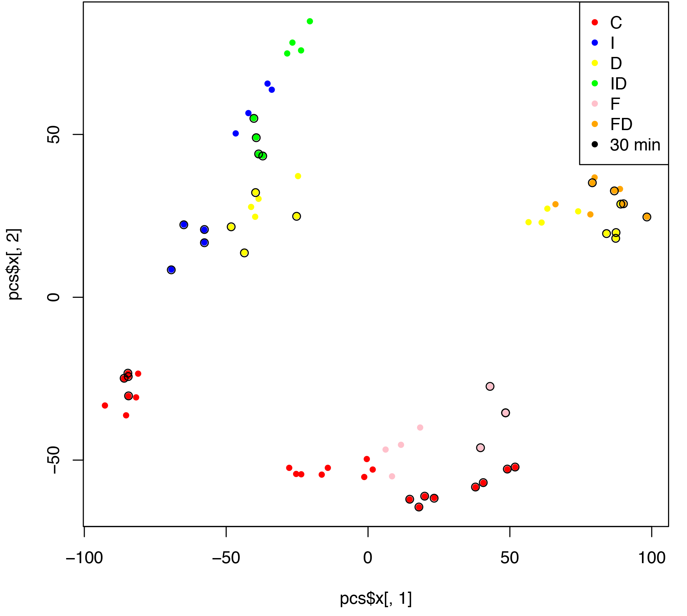

```{r setup, include=FALSE}
showsol<-TRUE
library(knitr)
opts_chunk$set(tidy.opts=list(width.cutoff=68),tidy=TRUE)
knitr::opts_chunk$set(echo = TRUE,tidy=TRUE,message=FALSE,warning=FALSE,strip.white=TRUE,prompt=FALSE,
                      cache=TRUE, size="scriptsize")
whichformat="latex"
```

---

Last update: April 17, 2020

--- 

# Overview

$~$

* Course content and learning outcome
\vspace{2mm}

* Overview of modules and core course topics (with exam type questions)
\vspace{2mm}

* Some cautionary notes

---

Some of the figures and slides in this presentation are taken (or are inspired) from @james.etal.


<!-- --- -->

<!-- # Course content -->
<!-- Statistical learning, multiple linear regression, classification, resampling methods, model selection/regularization, non-linearity, support vector machines, tree-based methods, unsupervised methods, neural nets. -->

---

# Learning outcomes of TMA4268

1. **Knowledge.** The student has knowledge about the most popular statistical learning models and methods that are used for _prediction_ and _inference_ in science and technology. Emphasis is on regression- and classification-type statistical models.

2. **Skills.** The student can, based on an existing data set, choose a suitable statistical model, apply sound statistical methods, and perform the analyses using statistical software. The student can present, interpret and communicate the results from the statistical analyses, and knows which conclusions can be drawn from the analyses, and what are the caveats.  

$~$

**And**: you got to be an expert in using the R language and writing R Markdown reports.


---

# Core of the course

Supervised and unsupervised learning:

* _\textcolor{red}{Supervised}_: regression and classification
    + examples of regression and classification type problems
    + how complex a model to get the best fit? flexiblity/overfitting/underfitting.
    + the bias-variance trade-off
    + how to find the perfect fit - validation and cross-validation (or AIC-type solutions)
    + how to compare different solutions 
    + how to evaluate the fit - on new unseen data

\vspace{2mm}    
 * _\textcolor{red}{Unsupervised}_: how to find structure or groupings in data?

and of cause all **the methods** (with underlying models) to perform regression, classification and unsupervised learning. We have gained some theoretical understanding, but in some cases deeper theoretical background and understanding of the models is provided in other statistics courses.


---

\centering

Figure 2.7 from @ISL

---

# The modules


## 1. Introduction 

$~$

* Examples, the modules, required background in statistics and 
* Introduction to R 


---

## 2. Statistical learning 

$~$

* Model complexity
    + Prediction vs. interpretation.  
    + Parametric vs. nonparametric. 
    + Inflexible vs. flexible.
    + Overfitting vs. underfitting
* Supervised vs. unsupervised. 
* Regression and classification.
* Loss functions: quadratic and 0/1 loss.
* Bias-variance trade-off (polynomial example): mean squared error, training and test set.
* Vectors and matrices, rules for mean and covariances, the multivariate normal distribution.
* Model complexity and the bias-variance trade-off is important in "all" subsequent modules.


---

## 3. Linear regression 

$~$

* The classical normal linear regression model on vector/matrix form.
* Parameter estimators and distribution thereof. Model fit.
* Confidence intervals, hypothesis tests, and interpreting R-output from regression.
* Qualitative covariates, interactions.
* This module is a stepping stone for all subsequent uses of regression in Modules 6, 7, 8, and 11.


---

## 4. Classification (Mainly two-class problems)
 
$~$

* Bayes classifier: classify to the most probable class gives the minimize the expected 0/1 loss. We usually do not know the probability of each class for each input. The Bayes optimal boundary is the boundary for the Bayes classifier and the error rate (on a test set) for the Bayes classifier is the Bayes error rate. 

$~$

* Two paradigms (not in textbook): 
    * _\textcolor{red}{Diagnostic}_ (directly estimating the posterior distribution for the classes). Example: KNN classifier, logistic regression.
    * _\textcolor{red}{Sampling}_ (estimating class prior probabilities and class conditional distribution and then putting together with Bayes rule). Examples: LDA, QDA with linear or quadratic class boundaries.
      
$~$

* ROC curves, AUC, sensitivity and specificity of classification methods.

---

```{r,echo=FALSE,eval=TRUE,fig.height=5,fig.width=8}
attach(iris)
library(class)
library(MASS)
library(dplyr)
library(ggpubr)

testgrid = expand.grid(Sepal.Length = seq(min(iris[,1]-0.2), max(iris[,1]+0.2), 
              by=0.05), Sepal.Width = seq(min(iris[,2]-0.2), max(iris[,2]+0.2), 
              by=0.05))
iris_lda = lda(Species~Sepal.Length+Sepal.Width, data=iris, prior=c(1,1,1)/3)
res = predict(object = iris_lda, newdata = testgrid)
Species_lda = res$class
postprobs=res$posterior
iris_lda_df = bind_rows(mutate(testgrid, Species_lda))
iris_lda_df$Species_lda = as.factor(iris_lda_df$Species_lda)
iris0_plot = ggplot(iris, aes(x=Sepal.Width, y=Sepal.Length, 
                              color=Species))+geom_point(size=2.5)
irislda_plot = iris0_plot + geom_point(aes(x = Sepal.Width, y=Sepal.Length, 
                            colour=Species_lda), data=iris_lda_df, size=0.8)
iris_qda = qda(Species~Sepal.Length + Sepal.Width, data=iris, prior=c(1,1,1)/3)
Species_qda = predict(object = iris_qda, newdata = testgrid)$class

iris_qda_df = bind_rows(mutate(testgrid, Species_qda))
iris_qda_df$Species_qda = as.factor(iris_qda_df$Species_qda)

gridprobs=

irisqda_plot = iris0_plot + geom_point(aes(x = Sepal.Width, y=Sepal.Length, 
                            colour=Species_qda), data=iris_qda_df, size=0.8)
```

```{r,echo=FALSE}
ggarrange(irislda_plot,irisqda_plot)
```

---

```{r, echo=FALSE, message=FALSE, warning=FALSE}
library(class)
library(dplyr)
library(ggpubr)
set.seed(9)

Sigma = matrix(c(2, 0, 0, 2), 2, 2)

mu1 = c(1, 1)
mu2 = c(3, 3)

X1 = mvrnorm(100, mu=mu1, Sigma=Sigma)
X2 = mvrnorm(100, mu=mu2, Sigma=Sigma)

class = c(rep("A",100), rep("B", 100))
class = as.factor(class)

df = data.frame(rbind(X1, X2), class)

test = expand.grid(x = seq(min(df[,1]-1), max(df[,1]+1), by=0.2), y=seq(min(df[,2]-1), max(df[,2]+1), by=0.2))


## k = 1
classif = knn(df[,1:2], test=test, cl=df[,3], k=1, prob=TRUE)
prob = attr(classif, "prob")

dataf = bind_rows(mutate(test, prob=prob, class="A", prob_cls=ifelse(classif==class, 1, 0)),
                  mutate(test, prob=prob, class="B", prob_cls=ifelse(classif==class, 1, 0)))

gg = ggplot(dataf)+geom_point(aes(x=x, y=y, colour=class), data=mutate(test, class=classif), size=0.01) 
gg = gg + geom_contour(aes(x=x, y=y, z=prob_cls, group=class, color=class), data=dataf, bins=2,size=0.5)
gg = gg + geom_point(aes(x=x, y=y, col=class), size=2, data=data.frame(x=df[,1], y=df[,2], class=df[,3]))
gg = gg + ggtitle("k = 1")+xlab("X1")+ylab("X2")

# k = 3
classif3 = knn(df[,1:2], test=test, cl=df[,3], k=3, prob=TRUE)
prob3 = attr(classif3, "prob")

dataf3 = bind_rows(mutate(test, prob=prob3, class="A", prob_cls=ifelse(classif3==class, 1, 0)),
                    mutate(test, prob=prob3, class="B", prob_cls=ifelse(classif3==class, 1, 0)))

gg3 = ggplot(dataf3)+geom_point(aes(x=x, y=y, colour=class), data=mutate(test, class=classif3), size=0.01)
gg3 = gg3 + geom_contour(aes(x=x, y=y, z=prob_cls, group=class, color=class), data=dataf3, bins=2, size=0.5)
gg3 = gg3 + geom_point(aes(x=x, y=y, col=class), size=2, data=data.frame(x=df[,1], y=df[,2], class=df[,3]))
gg3 = gg3 + ggtitle("k = 3")+xlab("X1")+ylab("X2")

## k = 10

classif10 = knn(df[,1:2], test=test, cl=df[,3], k=10, prob=TRUE)
prob10 = attr(classif10, "prob")

dataf10 = bind_rows(mutate(test, prob=prob10, class="A", prob_cls=ifelse(classif10==class, 1, 0)),
                  mutate(test, prob=prob10, class="B", prob_cls=ifelse(classif10==class, 1, 0)))

gg10 = ggplot(dataf10)+geom_point(aes(x=x, y=y, colour=class), data=mutate(test, class=classif10), size=0.05)
gg10 = gg10 + geom_contour(aes(x=x, y=y, z=prob_cls, group=class, color=class), data=dataf10, bins=2, size=0.5)
gg10 = gg10 + geom_point(aes(x=x, y=y, col=class), size=2, data=data.frame(x=df[,1], y=df[,2], class=df[,3]))
gg10 = gg10 + ggtitle("k = 10")+xlab("X1")+ylab("X2")

## k = 150

classif150 = knn(df[,1:2], test=test, cl=df[,3], k=150, prob=TRUE)
prob150 = attr(classif150, "prob")

dataf150 = bind_rows(mutate(test, prob=prob150, class="A", prob_cls=ifelse(classif150==class, 1, 0)),
                  mutate(test, prob=prob150, class="B", prob_cls=ifelse(classif150==class, 1, 0)))

gg150 = ggplot(dataf150)+geom_point(aes(x=x, y=y, colour=class), data=mutate(test, class=classif150), size=0.05)
gg150 = gg150 + geom_contour(aes(x=x, y=y, z=prob_cls, group=class, color=class), data=dataf150, bins=2, size=0.5)
gg150 = gg150 + geom_point(aes(x=x, y=y, col=class), size=2, data=data.frame(x=df[,1], y=df[,2], class=df[,3]))
gg150 = gg150 + ggtitle("k = 150")+xlab("X1")+ylab("X2")

ggarrange(gg,gg3,gg10,gg150)
```

--- 

Logistic regression gives a probability, given a certain value of the covariats $P(Y=1 \, | \, \boldsymbol{x})$.

```{r,echo=F,fig.width=6,fig.height=4.5,out.width="90%"}
library(ggplot2)
library(AICcmodavg)
data(beetle)
xx <- seq(45,80,0.01)
eta <- -14.578 + 0.2455*xx
ppi <- exp(eta)/(1+exp(eta))
dd <- data.frame(xx=xx,ppi=ppi)
ggplot(beetle, aes(x = Dose, y = Mortality_rate)) + theme_bw() +
geom_point() +
xlab("x") + ylab("Pr(Y=1)")  +
geom_line(aes(xx, ppi,colour = "red"), dd, size=1.2) + 
  scale_color_discrete(guide = FALSE)
```

 


---

## 5. Resampling methods 

$~$

**Cros-validation**

* Data rich situation: Training-validation and test set.
* Validation set approach
* Cross-validation for regression and for classification.
* LOOCV, 5 and 10 fold CV
* good and bad issues with validation set, LOOCV, 10-fold CV
* bias and variance for $k$-fold cross-validation.
* Selection bias -- the right and wrong way to do cross-validation

$~$

**The Bootstrap**

* Idea: Re-use the same data to estimate a statistic of interest by _sampling with replacement_.  

---

## 6. Linear model selection and regularization:

$~$

Subset-selection. Discriminate:

* _\textcolor{red}{Model selection}_: estimate performance of different models to choose the best one. 
* _\textcolor{red}{Model assessment}_: having chosen a final model, estimate its performance on new data.

$~$

How?

\vspace{2mm}  

* Model selection by 
    * Subset selection (best subset selection or stepwise model selection)
    * Penalizing the training error: AIC, BIC, $C_p$, Adjusted $R^2$.
    * Cross-validation.

\vspace{2mm}  
* Model assessment by 
    * Cross-validation.


---

* Shrinkage methods
    + ridge regression: quadratic L2 penalty added to RSS 
    + lasso regression: absolute L1 penalty added to RSS
    + no penalty on intercept, not scale invariant: center and scale covariates
    
    $~$
    
* Dimension reduction methods:
    + principal component analysis: eigenvectors, proportion of variance explained, scree plot
    + principal component regression
    + partial least squares 
    
    $~$
    
* High dimensionality issues: multicollinearity, interpretation.

---


---

 

---


 

---

## 7. Moving beyond linearity 

$~$

* Modifications to the multiple linear regression model - when a linear model is not the best choice. First look at one covariate, combine in "additive model".

* Basis functions: fixed functions of the covariates (no parameters to estimate).

* Polynomial regression: multiple linear regression with polynomials as basis functions.

* Step functions - piece-wise constants. Like our dummy variable coding of factors.

* Regression splines: regional polynomials joined smoothly - neat use of basis functions. Cubic splines very popular.

---

* Smoothing splines: smooth functions - minimizing the RSS with an additional penalty on the second derivative of the curve. Results in a natural cubic spline with knots in the unique values of the covariate. 

* Local regressions: smoothed $K$-nearest neighbour with local regression and weighting. In applied areas `loess` is very popular.

* (Generalized) additive models (GAMs): combine the above. Sum of (possibly) non-linear instead of linear functions.


---


 
---

## 8. Tree-based methods

$~$

* Method applicable both to regression and classification ($K$ classes) and will give non-linear covariate effects and include interactions between covariates. 

* A tree can also be seen as a division of the covariate space into non-overlapping regions.

* Binary splits using only at the current best split:  _greedy strategy_.

* Minimization criterion: residual sums of squares (RSS), Gini index or cross-entropy.
      
* Stopping criterion: When to stop: decided stopping criterion - like minimal decrease in RSS or less than 10 observations in terminal node.

* Prediction:
    * Regression: Mean in box $R_j$
    * Classification: Majority vote or cut-off on probabiity. 

---

* _Pruning_: Grow full tree, and then prune back using pruning strategy: cost complexity pruning.


To improve prediction (but worse interpretation):

* _Bagging_ (bootstrap aggregation): draw $B$ bootstrap samples and fit one full tree to each, used the average over all trees for prediction. 

* _Random forest_: as bagging but only $m$ (randomly) chosen covariates (out of the $p$) are available for selection at each possible split. Rule of thumb for $m$ is $\sqrt{p}$ for classificaton and $p/3$ for regression.

* Out-of-bag estimation can be used for model selection - no need for cross-validation.

* Variable importance plots: give the total amount of decrease in RSS or Gini index over splits of a predictor - averaged over all trees.

* _Boosting_: fit one tree with $d$ splits, make residuals and fit a new tree, adjust residuals partly with new tree - repeat. 

---


## 9. Support vector machines

$~$

* SVM can be used both classification and regression, but we have only studied two-class classification.

\vspace{2mm}

* Aim: find high dimensional hyperplane that separates two classes $f({\bf x})=\beta_0+{\bf x}^T \boldsymbol\beta=0$. If $y_if({\bf x}_i)>0$ observation ${\bf x}_i$ is correctly classified.

\vspace{2mm}

* Central: maximizing the distance (on both sides) from the class boundary to the closes observations (the margin $M$). This was relaxed with slack variables (support vector classifiers), and to allow nonlinear functions of ${\bf x}$ by extending an inner product to kernels (support vector machine).

\vspace{2mm}

* Support vectors: observations that lie on the margin or on the wrong side of the margin. 

---

* Kernels: generalization of an inner product to allow for non-linear boundaries and to speed up calculations due to inner products only involve support vectors. Most popular kernel is radial $$K(x_i,x_i')=\exp(-\gamma\sum_{j=1}^p (x_{ij}-x_{i'j})^2) \ . $$


* Tuning parameters: cost and parameters in kernels - chosen by CV.

\vspace{2mm}

* Unfortunately not able to present details since then a course in optimization is needed.

\vspace{2mm}

* Nice connection to non-linar and ridged version of logistic regression - comparing hinge loss to logistic loss - but then without the computational advanges of the kernel method.

---


## 10. Unsupervised learning 

$~$

* Principal component analysis: 
     + Mathematical details (eigenvectors corresponding to covariance or correlation matrix) also in TMA4267. 
     + Understanding loadings, scores and the biplot, choosing the number of principal components from proportion of variance explained or scree-type plots (elbow).
     
\vspace{2mm}

* Clustering:
     + $k$-means: number of clusters given, iterative algorithm to classify to nearest centroid and recalculate centroid
     + hierarchical clustering: choice of distance measure, choice of linkage method (single, average, complete), 

---

\centering
```{r,echo=FALSE,out.width="70%"}
# reading data on consumption of different beverages for countries
drink <- read.csv("https://www.math.ntnu.no/emner/TMA4267/2017v/drikke.TXT",sep=",",header=TRUE)
drink <- na.omit(drink)
# looking at correlation between consumptions
drinkcorr=cor(drink)
pcaS <- prcomp(drink,scale=TRUE) # scale: variables are scaled 
biplot(pcaS,scale=0,cex=0.6) # scale=0: arrows scaled to represent the loadings
```

---

PCA for quality control

\centering
{width=80%}


---

Hierarchical clustering for visualization

\centering
{width=70%}


---

## 11. Neural networks
 
### Topics in Module 11:

* Feedforward network architecture: mathematical formula - layers of multivariate transformed (`relu`, `linear`, `sigmoid`) inner products - sequentially connected. 
* What is the number of parameters that need to be estimated? Intercept term (for each layer) is possible and is referred to as "bias term".
* Loss function to minimize (on output layer): regression (mean squared), classification binary (binary crossentropy), classification multiple classes (categorical crossentropy) — and remember to connect to the correct choice of output activiation function: mean squared loss goes with linear activation, binary crossentropy with sigmoid, categorical crossentropy with softmax.
* How to minimize the loss function: gradient based (chain rule) back-propagation - many variants.

---

* Technicalities: `nnet` in R
* Optional (not on reading list): `keras` in R. Use of tensors. Piping sequential layers, piping to estimation and then to evaluation (metrics).

 


---

# After TMA4268 - what is next?

What are the statistical challenges we have not covered?

Do you want to learn more about the methods we have looked at in this course? And also methods that are more tailored towards specific types of data? Then we have many statistics courses that you may choose from.

An overview of statistics courses and also information on the statistics staff (for bachelor and master supervision)
<https://folk.ntnu.no/mettela/Talks/3klinfo20190325.html>

---

On behalf of the teaching staff - Michail, Andreas, Thiago and Mette- 

**thank you for attending this course  - hope to see you for the exam supervision - and good luck on May 23!**

---

# References


