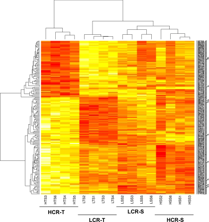

```{r setup, include=FALSE}
knitr::opts_chunk$set(echo = TRUE,tidy=TRUE,message=FALSE,warning=FALSE,strip.white=TRUE,prompt=FALSE,
                       cache = TRUE, size="scriptsize")
```

Last changes: 13.01.2020

---

# Acknowledgements

This course had been built up by Mette Langaas at NTNU in 2018 and 2019. I am using a lot of her material, and material from her TAs, throughout the course. 

**I would like to thank Mette for her great work and for the permission to use her material!**


---

# Learning outcomes of TMA4268

1. **Knowledge.** The student has knowledge about the most popular statistical learning models and methods that are used for _prediction_ and _inference_ in science and technology. Emphasis is on regression- and classification-type statistical models.

2. **Skills.** The student can, based on an existing data set, choose a suitable statistical model, apply sound statistical methods, and perform the analyses using statistical software. The student can present, interpret and communicate the results from the statistical analyses, and knows which conclusions can be drawn from the analyses, and what are the caveats. 


---

# Learning material

<!-- \begin{center} -->
<!-- \colorbox{lightgray}{\begin{minipage}{11cm} -->
1) \textbf{The main learning source is the textbook by James, Witten, Hastie, Tibshirani (2013)}: "An Introduction to Statistical Learning".
The textbook can be downloaded here: https://www-bcf.usc.edu/~gareth/ISL/
<!-- \end{minipage}} -->
<!-- \end{center} -->

    * The ebook an also be downloaded from Springer: https://www.springer.com/gp/book/9781461471370 (NB, need to be on NTNU network or via vpn.)

    * There are 15 hours of youtube videos by two of the authors of the book, Trevor Hastie an Rob Tibshirani -the inventors of statistical learning - all links [here](https://www.r-bloggers.com/in-depth-introduction-to-machine-learning-in-15-hours-of-expert-videos/)


2) All the lecture notes, \textbf{including any classnotes} made on the board (not necessarily available online).

3) \textbf{Additional reading material will be clearly indicated in the modules and on the course page.}


---

# Course page

All the relevant information for the course can be found here:

https://wiki.math.ntnu.no/tma4268/2020v/start

On each module page, all the relevant learning material and exercises (incl. solutions) will be provided in due time.

---

# The Statistical Learning Team 2020

## The TAs:

* [Martina Hall](https://www.ntnu.no/ansatte/martina.hall); PhD student
* [Michail Spitieris](https://www.ntnu.no/ansatte/michail.spitieris); PhD student

## The Lecturers

* [Stefanie Muff](https://www.ntnu.edu/employees/stefanie.muff); Associate Professor
* [Thiago Guerrera Martins](https://www.ntnu.no/ansatte/thiago.guerrera); NTNU/AIAscience (Modules 6 & 10)
* [Andreas Strand](https://www.ntnu.no/ansatte/andreas.strand); PhD student (Module 7)

---


# Who is this course for?

## Primary requirements
* Bachelor level: 3rd year student from Science or Technology programs, and master/PhD level students with interest in performing statistical analyses.
* Statistics background: TMA4240/45 Statistics, ST1101+ST1201 (probability theory and statistical methods), or equivalent.

* No background in statistical software needed: but we will use the R statistical software extensively in the course. Knowing python will make this easier for you!

* Not a prerequisist but a good thing with knowledge of computing - preferably an introductory course in informatics, like TDT4105 or TDT4110.

---

## Overlap
\vspace{2mm}

* [TDT4173](https://www.ntnu.no/studier/emner/TDT4173#tab=omEmnet) Machine learning and case based reasoning: courses differ in philosophy (computer science vs. statistics).

* [TMA4267](https://www.ntnu.no/studier/emner/TMA4267#tab=omEmnet) Linear Statistical Models: useful to know about multivariate random vectors, covariance matrices and the multivariate normal distribution. Overlap only for Multiple linear regression (M3).

---


# About the course

## Focus: Statistical theory **and** doing analyses

* The course has focus on **statistical theory**, but we apply all models and theory using (mostly) available function in R and real data sets. 

* It is important that the student in the end of the course **can analyse all types of data** (covered in the course) - not just understand the theory. 

* And vice versa - the student must also **understand** the model, methods and algorithms used. 

---


## Teaching philosophy


&nbsp;  

* Divide the topics of the course into modular units with specific focus.

&nbsp;   

* This (hopefully) facilitates learning?
 
&nbsp;   

* Two weeks without lectures (but supervision of exercises)

---

## Course content: The 12 Modules

\vspace{2mm}


* **Module 1**: Introduction (this module) 
* **Modules 2 - 11**: 
    2) Statistical learning
    3) Multiple linear regression
    4) Classification
    5) Resampling methods
    6) Model selection/regularization
    7) Non-linearity
    8) Support vector machines
    9) Tree-based methods
    10) Unsupervised methods
    11) Neural nets
* **Module 12**: Summing up  


---

## Learning methods, activities and grading
$~$

* Lectures, exercises and works (projects). 

&nbsp;  


* Portfolio assessment is the basis for the grade awarded in the course. This portfolio comprises 
    + a written final examination (80%).
    + works (projects) ($2\times 10\%=20\%$). 
    
&nbsp;  

* The results for the constituent parts are to be given in %-points, while the grade for the whole portfolio (course grade) is given by the letter grading system. Retake of examination may be given as an oral examination. The lectures are given in English.


---

## The lectures 

\vspace{2mm}  

**Mondays at 10.15-12.00 in S1 and Fridays at 14.15-16.00 in S4**

* We have $2\cdot 2$ hours of lectures every week (except when working with the compulsory exercises).
* **Note**: The **first lecture of each module will be on Fridays**, the second lecture on **Mondays**, and the exercise that corresponds to this module on Thursdays. See [here](https://github.com/stefaniemuff/statlearning/blob/master/TMA4268_schedule2020.pdf) for a tentative schedule.


* Some weeks the Monday lecture will be _interactive_ or with some self-study / exercise component, where _\textcolor{red}{active learning}_ is in focus.

* The other weeks (modules 3, 4, 6, 8, 10 and 11) the Monday lecture is a plenary lecture in S1.

* **I suggest that you always bring your laptop to the Monday lecture.**

* In the **first week of the course** we need time for an R workshop!

---

## The weekly supervision sessions 
&nbsp;  

**Thursdays 08.15-10:00 in Smia**
&nbsp;  
&nbsp;  

* For each module *recommended exercises* are uploaded. These are partly 
    * theoretical exercises (from book or not)
    * computational tasks
    * data analysis

* These are supervised in the weekly exercise slots. 

* Solutions will be provided to check yourself (no grading).

---

## The compulsory exercises

* We will have **two compulsory exercises**, each with a maximal score of 50 points.

* These are supervised in the weekly exercise slots and there will be one week without lectures (only with supervision) for each compulsory exercise.

* Focus: theory, analysis in R, and interpretation.

* Work in **groups of maximum 3**; handed in on Blackboard and be written in R Markdown (both .Rmd and .pdf handed in).

* The TAs grade the exercises.

* This gives 20% of the final evaluation in the course, the written exam the remaining 80%.


---

* The **first compulsory exercises** will be held after Modules 1-5. 
  
  \hspace{8mm} Suggested submission deadline: 
  
  \hspace{8mm} **Thursday, 20. Februar 2020, 12:00h**.

\vspace{8mm}

* The **second compulsory exercise** will be held after Modules 6-10.
 
  \hspace{8mm}Suggested submission deadline: 
  
  \hspace{8mm}**Monday, 13. April 2020, 12:00h**.

---

## Tentative schedule

\vspace{2mm}

A tentative schedule (i.e., with continous updates) can be found under the following link (als available from our course page):

\vspace{2mm}

[https://github.com/stefaniemuff/statlearning/blob/master/TMA4268_schedule2020.pdf](https://github.com/stefaniemuff/statlearning/blob/master/TMA4268_schedule2020.pdf)

---

## The lecture material

\vspace{2mm}

* All the material presented in class will be available on our course webpage (https://wiki.math.ntnu.no/tma4268/2020v/start).

* There will be both a .pdf and an .Rmd version of the lecture notes. This will allow you to check and use the code that I use to generate the slides. 

* For exercises, we provide a .pdf, .Rmd and an .html version.


---

# Student active learning

Student's learning styles are different! Felder and Silverman (1988) suggested the following learning style axes:

1) **active - reflective**: How do you process information: actively (through physical activities and discussions), or reflexively (through introspection)?

2) **sensing-intuitive**: What kind of information do you tend to receive: sensitive (external agents like places, sounds, physical sensation) or intuitive (internal agents like possibilities, ideas, through hunches)?

3) **visual-verbal:** Through which sensorial channels do you tend to receive information more effectively: visual (images, diagrams, graphics), or verbal (spoken words, sound)? Many students have a visual learning style!

4) **sequential - global**: How do you make progress: sequentially (with continuous steps), or globally (through leaps and an integral approach)?


---

## We try!

\vspace{2mm}

* $\ldots$ to acknowledging these different learning style axes.

* $\ldots$  to choose teaching styles that match the learning styles of as many students as possible. 


\vspace{-3mm}

* $\ldots$  to provide learning environments, opportunities, interactions, and tasks that help to learn deeper.  

* $\ldots$  to provide guidance and support that challenges students based on their current ability. 


We will now focus on _active_ and _reflective_ learning styles and learning methods.

---

## Active vs. reflective learning styles

\vspace{2mm}

**Reflective learning methods**

* Plenary lectures
* Reading textbook
* Self study

\vspace{4mm}

**Active learing methods**

* Pause in plenary lecture to ask questions and let students think and/or discuss.
* In-class quizzes 
<!-- (with the NTNU invention Kahoot!) - individual and team mode. -->
* Projects - individual or in groups 
* Group discussion
* Interactive lectures


 

---

# Test your learning style

\vspace{2mm}

If you are interested in your learning style, we are very grateful if you can fill out this questionnaire:

[https://innsida.ntnu.no/forms/view.php?id=221738](https://innsida.ntnu.no/forms/view.php?id=221738)

* The intro is in Norwegian.
* The questionnaire is in English.
* If you have questions, contact Mettee Langaas (mette.langaas@ntnu.no).
* You will get an email with your results. 
* We have been given permission to collect these data for research.

---

# Who are you - and what are your expectations?

&nbsp; 

In class - go to [https://app.klicker.uzh.ch/join/bkx](https://app.klicker.uzh.ch/join/bkx) to answer these questions. 

<!-- ## Study programme  -->

<!-- * MTFYMA FysMat ( ) -->
<!-- * BMAT ( ) -->
<!-- * MSMNFNA Master in Mathematical Sciences ( ) -->
<!-- * Other ( ) -->


<!-- ## Study year -->

<!-- * 1 or 2 ( ) -->
<!-- * 3 ( ) -->
<!-- * 4 ( ) -->
<!-- * 5, >5 or PhD ( ) -->

<!-- --- -->

<!-- ## Have you/will you take TMA4267 Linear Statistical Models? -->

<!-- * Yes, previously= in 2019 or earlier ( ) -->
<!-- * Yes, now= in 2020 ( ) -->
<!-- * Yes, planned for 2021 or later ( ) -->
<!-- * Not planned ( ) -->

<!-- ## Do you know R? -->

<!-- * No ( ) -->
<!-- * No, and I do not want to learn R ( ) -->
<!-- * Yes, but only the basics ( ) -->
<!-- * Yes, in depth ( ) -->

<!-- --- -->

<!-- ## Plenary lectures on Monday mornings at 8.15-10 - do you plan to attend? -->

<!-- * Yes ( ) -->
<!-- * No, this is too early ( ) -->
<!-- * No, since I rarely attend lectures. ( ) -->
<!-- * No, for some other reason ( ) -->

<!-- ## What do you think will be most fun in TMA4268? -->

<!-- * Learning new statistical theory ( ) -->
<!-- * Trying out statistical theory in R ( ) -->
<!-- * Analysing data ( ) -->
<!-- * Learn new hot topics ( ) -->


---

# Reference group

**At least 3 members, ideally one from different programmes**

* At least one from IndMat, year 3
* Any programme, year 4
* Not IndMat

Volunteers?

* Andreas Matre, andrmatr@stud.ntnu.no (3 year Bachelor)
* Sara Elise Wøllo, saraew@stud.ntnu.no (Industrial Mathematics) 
* John Lau, johnlau@stud.ntnu.no (Other)

Thanks to the three people that volunteered. 

---

# Module 1
## Aims of the first module

* An introduction to statistical learning. What is it?

* Types of problems we will look at

* **Introduction to R and RStudio ** 
<!-- introductory course on R with Rbeginner and Rintermediate -->

<!-- * Key concepts from your first course in statistics -- that you will need now, mixed with notation for this course -->

---

## Learning material for this module

* Our textbook James et al (2013): An Introduction to Statistical Learning - with Applications in R (ISL). Chapter 1 (Introduction) and 2.3 (Lab: Introduction to R). 


* [\texttt{Rbeginner}](https://htmlpreview.github.io/?https://github.com/stefaniemuff/statlearning/blob/master/Exercise1/Rbeginner.html), [\texttt{Rintermediate}](https://htmlpreview.github.io/?https://github.com/stefaniemuff/statlearning/blob/master/Exercise1/Rintermediate.html), and
[\texttt{Rplots}](https://htmlpreview.github.io/?https://github.com/stefaniemuff/statlearning/blob/master/Exercise1/Rplots.html)

\vspace{3mm}

_Recommended_:

* Watch the video lecture for Chapter 1 by Hastie and Tibshirani [here](https://www.r-bloggers.com/in-depth-introduction-to-machine-learning-in-15-hours-of-expert-videos/).


* Background on Matrix Algebra: [Härdle and Simes (2015) - Chapter 2: A short excursion into Matrix Algebra](https://link.springer.com/chapter/10.1007/978-3-662-45171-7_2) (on the reading list for TMA4267 Linear statistical models). 


<!-- ## Added after the lecture -->

<!-- * [Classnotes 07.01.2019](https://www.math.ntnu.no/emner/TMA4268/2019v/notes/M1L1notes.pdf)  -->

---

# What is statistical learning?

* Refers to _a vast set of tools to understanding data_ (text book, p. 1). 

\vspace{1mm}

* Main distinction: _\textcolor{red}{Supervised}_ versus _\textcolor{red}{unsupervised learning}_.

\vspace{1mm}

<!-- * The ``chain'' of statistical learning:  -->

<!-- model $\rightarrow$ method $\rightarrow$ algorithm $\rightarrow$ analysis $\rightarrow$ interpretation -->

* Both **prediction** and **understanding** (inference $\rightarrow$ drawing conclusions). 

\vspace{1mm}

* Statistical learning is **a statistical discipline**, but the boarders are becoming more blurred.


---

# Statistical Learning vs. ``Machine Learning'' 

\vspace{2mm}

* Machine learning is more focused on the algorithmic part of learning, and is a _discipline in computer science_. 

\vspace{2mm}

* But many methods/algorithms are common to both fields.


---

# Statistical Learning vs. ``Data Science''

Data science

* The aim is to extract knowledge and understanding from data.
\vspace{2mm}

* Requires a combination of statistics, mathematics, numerics, computer science and informatics. 

This encompasses the whole process of data acquisition/scraping, going from unstructured to structured data, setting up a data model, performing data analysis, implementing tools and interpreting results. 

In statistical learning we will not work on the two first above (acquisition and unstructured to structured).


[R for Data Science](http://r4ds.had.co.nz/) is an excellent read and relevant for this course!

---

# Problems you will learn to solve


There are **three main types of problems** discussed in this course:

* Regression (supervised)

* Classification (supervised)

* Unsupervised methods

using data from science, technology, industry, economy/finance, ...

---

# Example 1: Regression (Etiology of CVD)

* The Framingham Heart Study investigates the underlying causes of cardiovascular disease (CVD) (see <https://www.framinghamheartstudy.org/>). 
<!--(In Norway we have the Health survey of Nord-Trondelag, HUNT - but not with data available for teaching.)-->

* Aim: modelling systolic blood pressure (\texttt{SYSBP}) using data from $n=2600$ persons. 

* For each person in the data set we have measurements of the following seven variables.

\scriptsize

* `SYSBP` systolic blood pressure (mmHg),
* `SEX` 1=male, 2=female,
* `AGE` age (years), 
* `CURSMOKE` current cigarette smoking at examination: 0=not current smoker, 1= current smoker,
* `BMI` body mass index,
* `TOTCHOL` serum total cholesterol (mg/dl),
* `BPMEDS` use of anti-hypertensive medication at examination: 0=not currently using, 1=currently using.
\normalsize

---


```{r CVDread, eval=TRUE, echo=FALSE, fig.width=7, fig.height=6,fig.align = "center",out.width='100%'}
#this data set is not publicly available
thisds=dget("https://www.math.ntnu.no/emner/TMA4315/2017h/data/BPtma4267P2.dd")
thisds$SEX=as.factor(thisds$SEX)
thisds$CURSMOKE=as.factor(thisds$CURSMOKE)
thisds$BPMEDS=as.factor(thisds$BPMEDS)
library(ggplot2)
library(GGally)
ggpairs(thisds, aes(colour=SEX), title="Framingham Heart Study")
```

What does this plot show?

Red: male; turquoise: female

---

* Diagonal: density plot (generalization of histogram), or barplot.
* Lower diagonals: scatterplot, histograms
* Upper diagonals: correlations values, boxplots, barplots

---

### Etiology of CVD

\vspace{2mm}

The question: 
**What are the factors that cause high SBP?**

\vspace{2mm}

So we are interested in _inference_ (explanation) and not predction!


\vspace{4mm}

* A _multiple normal linear regression model_ was fit to the data set with 
$$-\frac{1}{\sqrt{\texttt{SYSBP}}}$$ 
as response (output) and all the other variables as covariates (inputs). 

* The results are used to formulate hypotheses about the etiology of CVD - to be studied in new trials.

---

\scriptsize
```{r CVDanalyse, eval=TRUE,include=TRUE,message=FALSE,results="hold"}
modelB=lm(-1/sqrt(SYSBP)~SEX+AGE+CURSMOKE+BMI+TOTCHOL+BPMEDS,data=thisds)

summary(modelB)
```
\normalsize

---

# Example 2: Classification (iris plants)

The `iris` flower data set is a very famous multivariate data set introduced by the British statistician and biologist Ronald Fisher in 1936. 

$~$

The data set contains

* **three plant species** \{setosa, virginica, versicolor\} 
* **four features measured** for each corresponding sample: 
      + `Sepal.Length`
      + `Sepal.Width`
      + `Petal.Length`
      + `Petal.Width`.   

---


```{r iris_pic, echo=FALSE, fig.cap="Iris plant with sepal and petal leaves", out.width = '150pt'}
knitr::include_graphics("iris.png")
```

\tiny
<http://blog.kaggle.com/2015/04/22/scikit-learn-video-3-machine-learning-first-steps-with-the-iris-dataset/>

---

\scriptsize
```{r iris, include=TRUE}
head(iris)
```
\normalsize

---

Aim: correctly classify the species of an iris plant from sepal length and sepal width.

```{r iriscont, echo=FALSE}
library(ggplot2)
library(GGally)
ggpairs(iris, aes(colour=Species), title="Classification of Iris plants")
# irisplot = ggplot(data=iris, aes(x = Sepal.Length, y = Sepal.Width)) 
# irisplot = irisplot + geom_point(aes(color=Species)) 
# irisplot = irisplot + xlab("Sepal Length") + ylab("Sepal Width")
# irisplot = irisplot + ggtitle("Classification of Iris plants")
# irisplot
```

---

## Linear boundaries
\vspace{1mm}

In this plot the small black dots represent correctly classified iris plants, while the red dots represent misclassifications. The big black dots represent the class means.

&nbsp;  
  

```{r irislda, echo=FALSE, fig.width=6, fig.height=4.5,out.width="10cm"}
library(klaR)
drawparti(iris$Species, iris$Sepal.Length, iris$Sepal.Width,  prec=301, gs=20,  method="lda", image.colors=c("#F8766D", "#00BA38", "#619CFF"), xlab="Sepal Length", ylab="Sepal Width", print.err=0)
legend("topright", title="Species", legend=c("setosa", "versicolor", "virginica"), fill=c("#F8766D", "#00BA38", "#619CFF"),  inset=.02 , cex=0.8)
```


---

## Non-linear boundaries
\vspace{1mm}

Sometimes a more suitable boundary is not linear.  
&nbsp;  
  
```{r irisqda,  echo=FALSE, fig.width=6, fig.height=4.5,out.width="10cm"}
drawparti(iris$Species, iris$Sepal.Length, iris$Sepal.Width, prec=301, gs=20,  method="qda", image.colors=c("#F8766D", "#00BA38", "#619CFF"), print.err=0, xlab="Sepal Length", ylab="Sepal Width")
legend("topright", legend=c("setosa", "versicolor", "virginica"),title="Species", fill=c("#F8766D", "#00BA38", "#619CFF"),  inset=.02 , cex=0.8)

```

---

# Example 3: Unsupervised methods (Gene expression)

* In a collaboration with researchers the Faculty of Medicine and Health the relationship between inborn maximal oxygen uptake and skeletal muscle gene expression was studied. 
* Rats were artificially selected for high- and low running capacity (HCR and LCR, respectively), 
* Rats were either kept seditary or trained. 
* Transcripts significantly related to running capacity and training were identified.
<!--  (moderated t-tests from two-way anova models, false discovery rate controlled).  -->
* To further present the findings heat map of the most significant transcripts were presented (high expression are shown in red and transcripts with a low expression are shown in yellow).
* This is hierarchical cluster analysis with pearson correlation distance measure.


---

```{r heatmap_pic, echo=FALSE, fig.cap="Heat map of the most significant transcripts. Transcripts with a high expression are shown in red and transcripts with a low expression are shown in yellow.", out.width = '150pt'}

```


\tiny
More:
<https://www.ncbi.nlm.nih.gov/pmc/articles/PMC2585023/>

---

# Example 4: Unsupervised methods (Network clustering)
\vspace{2mm}

Finding clusters in protein-protein-interaction networks.
\vspace{2mm}


---

# Plan for this week

## Thursday January 9, 8.15-10.00 in Smia 

* Workshop for R and RStudio

* Stefanie, Martina and Michail present

\vspace{4mm}

## Friday January 10, 14.15-16.00 in S4

* Lecture 1 of Module 2

 <!-- (??, ?? and Stefanie present) -->

<!-- * 14.15: Stefanie explains about the plan for the R workshop  -->
<!-- * 14.15-14.25: Work in groups with overview questions on "R, Rstudio, CRAN and GitHub - and R Markdown" -->
<!-- * 14.25-14.30: Plenum: a few words on what we found and what is useful for us. -->
<!-- * 14.30-15.00: Work alone/in pairs/triplets with [Rbeginner.html](https://www.math.ntnu.no/emner/TMA4268/2019v/Rbeginner.html)  and/or [Rintermediate.html](https://www.math.ntnu.no/emner/TMA4268/2019v/Rintermediate.html). -->
<!-- * 15.00-15.15: Break - serve fruits on table 1. -->
<!-- * 15.15-18.00: Continue to work with [Rbeginner.html](https://www.math.ntnu.no/emner/TMA4268/2019v/Rbeginner.html) and [Rintermediate.html](https://www.math.ntnu.no/emner/TMA4268/2019v/Rintermediate.html). -->

<!-- I will interrupt and talk in plenum if there are common issues that all need to know/pay attention to. -->

---

# Getting started with R


\vspace{2mm}


- Install R (use the Norwegian CRAN mirror):
<https://www.r-project.org>

\vspace{2mm}

- Install Rstudio
<https://www.rstudio.com/products/rstudio/>


\vspace{4mm}

If you need help on installing R and RStudio on you laptop computer, contact orakel@ntnu.no. 


---

## R, Rstudio, CRAN and GitHub

\vspace{2mm}

1) What is R?
<https://www.r-project.org/about.html>
\vspace{2mm}

2) What is RStudio?
<https://www.rstudio.com/products/rstudio/>
\vspace{2mm}

3) What is CRAN?
<https://cran.uib.no/>
\vspace{2mm}

4) What is GitHub and Bitbucket? Do we need GitHub or Bitbucket in our course?
<https://www.youtube.com/watch?v=w3jLJU7DT5E> and
<https://techcrunch.com/2012/07/14/what-exactly-is-github-anyway/>

<!-- 5) What is R Markdown? (More rmarkdown to Module 2 part 2) -->

<!-- 1-minute introduction video: <https://rmarkdown.rstudio.com/lesson-1.html> -->

<!-- Then, if more is needed also a chapter from the Data Science book: <http://r4ds.had.co.nz/r-markdown.html> -->

<!-- We will use R Markdown for writing the Compulsory exercise reports in our course. -->

<!-- 6) What is `knitr`? -->
<!-- <https://yihui.name/knitr/> -->

---

## Getting to work with RStudio

\vspace{6mm}

$\rightarrow$ Short demo in class.

---

## A first look at R and RStudio

\vspace{6mm}

* [Rbeginner.pdf](https://github.com/stefaniemuff/statlearning/blob/master/1Intro/Rbeginner.pdf) 
* [Rbeginner.Rmd](https://github.com/stefaniemuff/statlearning/blob/master/1Intro/Rbeginner.Rmd) 

---

## A second look at R and probability distributions

\vspace{6mm}

* [Rintermediate.pdf](https://github.com/stefaniemuff/statlearning/blob/master/1Intro/Rintermediate.pdf)
* [Rintermediate.Rmd](https://github.com/stefaniemuff/statlearning/blob/master/1Intro/Rintermediate.Rmd)

To see solutions added to the files, add -sol to filename to get

* [Rintermediate-sol.html](https://github.com/stefaniemuff/statlearning/blob/master/1Intro/Rintermediate-sol.html)

---

## And resources about plots 

\vspace{6mm}

* [Rplots.pdf](https://github.com/stefaniemuff/statlearning/blob/master/1Intro/Rplots.pdf)
* [Rplots.Rmd](https://github.com/stefaniemuff/statlearning/blob/master/1Intro/Rplots.Rmd)


To see solutions added to the files, add -sol to filename to get

* [Rplots-sol.html](https://github.com/stefaniemuff/statlearning/blob/master/1Intro/Rplots-sol.html)

---

## Additional nice R resources

\vspace{2mm}

* P. Dalgaard: Introductory statistics with R, 2nd edition, Springer, which is also available freely to NTNU students as an ebook: [Introductory Statistics with R](https://link.springer.com/book/10.1007/978-0-387-79054-1).

\vspace{1mm}

* Grolemund and Hadwick (2017): "R for Data Science",  <http://r4ds.had.co.nz>

\vspace{1mm}

* Hadwick (2009): "ggplot2: Elegant graphics for data analysis" textbook: <https://ggplot2-book.org/>

\vspace{1mm}

* [Overview of cheat sheets from RStudio](https://www.rstudio.com/resources/cheatsheets/)

<!-- * Looking for nice tutorials: try [Rbloggers!](https://www.r-bloggers.com/) -->

* Questions on R: ask the course staff, colleagues, and [stackoverflow](https://stackoverflow.com/).


---

# Acknowledgements

Thanks to Julia Debik for contributing to this module page.


---

# Supplement: Exam from 2019

This is the digital exam held in Inspera.

* [Problem set](https://www.math.ntnu.no/emner/TMA4268/Exam/V2019e.pdf) 
* [Tentative solutions](https://www.math.ntnu.no/emner/TMA4268/Exam/e2019sol.html) 
* [Grading document](https://www.math.ntnu.no/emner/TMA4268/Exam/gradingdocumentV2019.pdf)

However, please note that this was the exam created by Mette Langaas and her team, and not by us. The recommended and compulsory exercises will give you hints abou the exam, so we highly recommend you will work on them.

