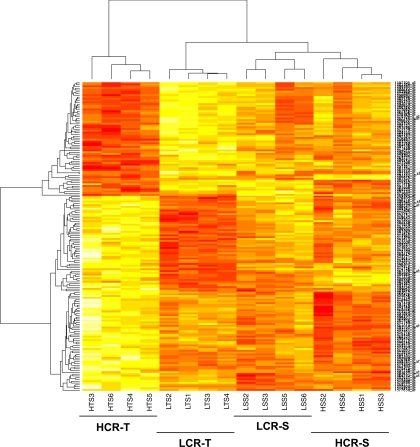
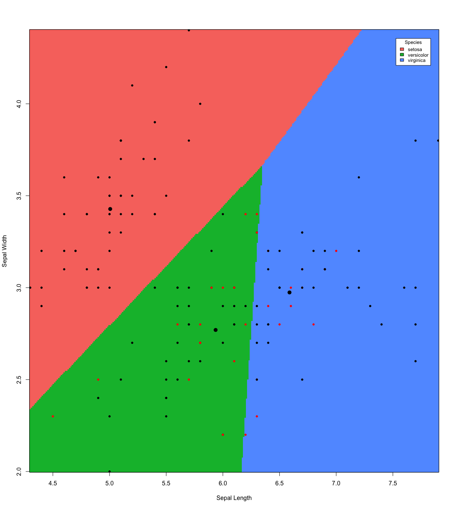

```{r setup, include=FALSE}
knitr::opts_chunk$set(echo = TRUE,tidy=TRUE,message=FALSE,warning=FALSE,strip.white=TRUE,prompt=FALSE)
```

<!--no packages specified to be needed for this module
```{r eval=FALSE,include=TRUE}
install.packages("rmarkdown")
install.packages("devtools")
#library(devtools) # before installing from github
#install_github("yixuan/prettydoc")
install.packages("prettydoc")
install.packages("car")
install.packages("ggplot2")
install.packages("klaR")
install.packages("ISLR")
install.packages("ggpubr")
install.packages("glmnet")
install.packages("gamlss.data")
install.packages("tidyverse")

```
-->

# Aims of the module

* what is statistical learning?
* which types of problems will you learn to solve?
* who is this course for: course overview and learning outcome, activities and team
* short presentation of course modules
* more practical details of the course (Blackboard)
* who are you - and what is your background?
* key concepts from your first course in statistics -- that you will need now, mixed with notation for this course
* the role of R and RStudio: introductory course on R with Rbeginner and Rintermediate 

[Classnotes 08.01.2018](https://www.math.ntnu.no/emner/TMA4268/2018v/TMA4268ClassnotesL1.pdf) from the second hour (notation and key concepts). 
Link to background on Matrix Algebra:[[https://link.springer.com/chapter/10.1007/978-3-662-45171-7_2|Härdle and Simes (2015) - A short excursion into Matrix Algebra]] (on the reading list for TMA4267 Linear statistical models).


### Learning material for this module
Our textbook James et al (2013): An Introduction to Statistical Learning - with Applications in R (ISL). Chapter 1 and 2.3. [Rbeginner](https://www.math.ntnu.no/emner/TMA4268/2018v/Rbeginner.html) and [Rintermediate](https://www.math.ntnu.no/emner/TMA4268/2018v/Rintermediate.html)

---

# What is statistical learning?
refers to _a vast set of tools to understanding data_ (according to our text book, page 1).

We focus on the whole chain: model-method-algorithm-interpretation, and we both focus on prediction and understanding (inference). Statistical learning is a statistical discipline.

So, what is the **difference between machine learning and statistical learning**?

Well, machine learning is more focused on the algorithmic part of learning, and is a discipline in computer science. 

But, many methods/algorithms are common to the fields of statistical learning and machine learning.

---

#What about data science? 

In data science the aim is to 

*extract knowledge and understanding from data, and 
*requires a combination of statistics, mathematics, numerics, computer science and informatics. 

This encompasses the whole process of data acquisition/scraping, going from unstructured to structured data, setting up a data model, performing data analysis, implementing tools and interpreting results. 

[R for Data Science](http://r4ds.had.co.nz/) is an excellent read and relevant for this course!

---

# Problems your will learn to solve

## Etiology of CVD - problem and data

The Framingham Heart Study is a study of the etiology (i.e. underlying causes) of cardiovascular disease (CVD), with participants from the community of Framingham in Massachusetts, USA <https://www.framinghamheartstudy.org/>. (In Norway we have the Health survey of Nord-Trøndelag, HUNT - but not with data available for teaching.)

We will focus on modelling systolic blood pressure using data from $n=2600$ persons. For each person in the data set we have measurements of the following seven variables

* `SYSBP` systolic blood pressure (mmHg),
* `SEX` 1=male, 2=female,
* `AGE` age (years) at examination, 
* `CURSMOKE` current cigarette smoking at examination: 0=not current smoker, 1= current smoker,
* `BMI` body mass index ( $kg/m^2$ ),
* `TOTCHOL` serum total cholesterol (mg/dl), and
* `BPMEDS` use of anti-hypertensive medication at examination: 0=not currently using, 1=currently using.

---

```{r CVDread, eval=TRUE,echo=FALSE,message=FALSE}
#this data set is not publicly available
thisds=dget("https://www.math.ntnu.no/emner/TMA4315/2017h/BPtma4267P2.dd")
#dim(thisds)
#colnames(thisds)
thisds$SEX=as.factor(thisds$SEX)
library(ggplot2)
library(GGally)
ggpairs(thisds, aes(colour=SEX), title="Framingham Heart Study")
```

---

## Etiology of CVD - model 

* A _multiple normal linear regression model_ was fitted to the data set with $-\frac{1}{\sqrt{SYSBP}}$ as response (output) and all the other variables as covariates (inputs). 
* The results are used to formulate hypotheses about the etiology of CVD - to be studied in new trials.

```{r CVDanalyse, eval=TRUE,include=TRUE,message=FALSE,results="hold"}
modelB=lm(-1/sqrt(SYSBP)~SEX+AGE+CURSMOKE+BMI+TOTCHOL+BPMEDS,data=thisds)
summary(modelB)$coeff; summary(modelB)$r.squared;summary(modelB)$adj.r.squared
```

```{r CVDanalyse2, eval=TRUE,include=TRUE,message=FALSE,results="hold"}
summary(modelB)
```

---

## Classification of iris plants

<figure><figcaption>Image taken from: http://blog.kaggle.com/2015/04/22/scikit-learn-video-3-machine-learning-first-steps-with-the-iris-dataset/</figcaption></figure>

The `iris` flower data set is a multivariate data set introduced by the British statistician and biologist Ronald Fisher in 1936. The data set contains three plant species \{setosa, virginica, versicolor\} and four features measured for each corresponding sample: `Sepal.Length`, `Sepal.Width`, `Petal.Length` and `Petal.Width`.   


---

```{r iris, include=TRUE}
head(iris)
```


---
Aim: correctly classify the species of an iris plant from sepal length and sepal width.

```{r iriscont, echo=FALSE}
library(ggplot2)
library(GGally)
ggpairs(iris, aes(colour=Species), title="Classification of Iris plants")
# irisplot = ggplot(data=iris, aes(x = Sepal.Length, y = Sepal.Width)) 
# irisplot = irisplot + geom_point(aes(color=Species)) 
# irisplot = irisplot + xlab("Sepal Length") + ylab("Sepal Width")
# irisplot = irisplot + ggtitle("Classification of Iris plants")
# irisplot
```

---
One method: In this plot the small black dots represent correctly classified iris plants, while the red dots represent misclassifications. The big black dots represent the class means.
```{r irislda, echo=FALSE}
library(klaR)
drawparti(iris$Species, iris$Sepal.Length, iris$Sepal.Width,  prec=301, gs=20,  method="lda", image.colors=c("#F8766D", "#00BA38", "#619CFF"), xlab="Sepal Length", ylab="Sepal Width", print.err=0)
legend("topright", title="Species", legend=c("setosa", "versicolor", "virginica"), fill=c("#F8766D", "#00BA38", "#619CFF"),  inset=.02 , cex=0.8)
```

---

Competing method: Sometimes a more suitable boundary is not linear.
```{r irisqda, echo=FALSE}
drawparti(iris$Species, iris$Sepal.Length, iris$Sepal.Width, prec=301, gs=20,  method="qda", image.colors=c("#F8766D", "#00BA38", "#619CFF"), print.err=0, xlab="Sepal Length", ylab="Sepal Width")
legend("topright", legend=c("setosa", "versicolor", "virginica"),title="Species", fill=c("#F8766D", "#00BA38", "#619CFF"),  inset=.02 , cex=0.8)

```
---

## Gene expression in rats

* In a collaboration with the Faculty of Medicine the relationship between inborn maximal oxygen uptake and skeletal muscle gene expression was studied. 
* Rats were artificially selected for high- and low running capacity (HCR and LCR, respectively), 
* and either kept seditary or trained. 
* Transcripts significantly related to running capacity and training were identified (moderated t-tests from two-way anova models, false discovery rate controlled). 
* To further present the findings heat map of the most significant transcripts were presented (high expression are shown in red and transcripts with a low expression are shown in yellow).
* This is hierarchical cluster analysis with pearson correlation distance measure.

---

<figure></figure>


More:
<https://www.ncbi.nlm.nih.gov/pmc/articles/PMC2585023/>

---

# Main types of problems

* Regression
* Classification
* Unsupervised methods: e.g. clustering

using data 
from science, technology, industry, economy/finance, ...

---

# Who is this course for?

## Primary requirements
* Bachelor level: 3rd year student from Science or Technology programs, and master/PhD level students with interest in performing statistical analyses.
* Statistics background: TMA4240/45 Statistics or equivalent.
* No background in statistical software needed: but we will use the R statistical software extensively in the course. 
* Not a prerequisist but a good thing with knowledge of computing - preferably an introductory course in informatics, like TDT4105 or TDT4110.

## Overlap
* TDT Data mining and case based reasoning: courses differ in philosophy (computer science vs. statistics). See Bb under FAQ for more details.
* TMA4267 Linear Statistical Models: useful to know about multivariate random vectors, covariance matrices and the multivariate normal distribution. Overlap only for Multiple linear regression (M3).

---

## Focus: _both_ statistical theory and running analyses

* The course has focus on _statistical theory_, but all models and methods on the reading list will also be investigated using (mostly) available function in R and real data sets. 
* It it important that the student in the end of the course _can analyses all types of data_ (covered in the course) - not just understand the theory. 
* And vice versa - this is not a "we learn how to perform data analysis"-course - the student must also _understand the model, methods and algorithms used_. 
* There is a final written exam (70% on final grade) in addition to compulsory exercises (30% on final grade).

---

# About the course
## Course content
Statistical learning, multiple linear regression, classification, resampling methods, model selection/regularization, non-linearity, support vector machines, tree-based methods, unsupervised methods, neural nets.

## Learning outcome

1. **Knowledge.** The student has knowledge about the most popular statistical learning models and methods that are used for _prediction_ and _inference_ in science and technology. Emphasis is on regression- og classification-type statistical models.

2. **Skills.** The student knows, based on an existing data set, how to choose a suitable statistical model, apply sound statistical methods, and perform the analyses using statistical software. The student knows how to present the results from the statistical analyses, and which conclusions can be drawn from the analyses. 

---

## Learning methods and activities

* Lectures, exercises and works (projects). 
* Portfolio assessment is the basis for the grade awarded in the course. This portfolio comprises a written final examination (70%) and works (projects) (30%). 
The results for the constituent parts are to be given in %-points, while the grade for the whole portfolio (course grade) is given by the letter grading system. Retake of examination may be given as an oral examination. The lectures may be given in English.

**Textbook:** James, Witten, Hastie, Tibshirani (2013): "An Introduction to Statistical Learning". 

**Tentative reading list:** the whole book + the module pages+ three compulsory exercises.

---

## Course team

**Lecturers:**

* Mette Langaas (IMF/NTNU)
* Thiago G. Martins (AIAscience and IMF/NTNU)

**Teaching assistents (TA)**

* Thea Roksvåg (head TA)
* Andreas Strand 
* Martina Hall

---

# Teaching philosophy in this course

##The modules
* divide the topics of the course into modular units with specific focus 
* smaller units (time and topic) facilitates learning? 

There will be 12 modules= introduction (this module) + the 10 topics listed previously+ summing up=12 weeks.

---

##The lectures
* We have 2*2hrs of lectures every week (except when working with the compulsory exercises).
* Each week is a new topic and a new module
* Each new module always starts with a motivating example.
* We focus on:
    + statistical theory
    + application of theory to real (and simulated) data using the R language and the RStudio IDE
    + interpretation of results
    + assumptions and limitations of the models and methods
    + extra material wrt theory is either given on the module page or linked to from other sources
    + possible extensions and further reading (beyond the scope of this course) are given in the end of the module page
* Each week the second lecture often ends with a Kahoot! quiz (w/wo bots?)

---

##The weekly supervision sessions
For each module *recommended exercises* are given. These are partly 
* theoretical exercises (from book or not)
* computational tasks
* data analysis

These are supervised in the weekly exercise slots.

---

##The compulsory exercises

* There are three compulsory exercises, each gives a maximal score of 10 points.
* These are supervised in the weekly exercise slots (and also in the lecture slots the week of the hand-in deadline).
* Focus is both on theory and analysis and interpretation in R.
* Students can work in groups (max size 3) and work must be handed in on Blackboard and be written in R Markdown (both .Rmd and .pdf handed in).
* The TAs grade the exercises (0-10 points).
* This gives 30% of the final evaluation in the course, and the written exam the final 70%.

---

# The course modules 

Due dates for compulsory exercises to be decided with in collaboration with the students.

(PL=plenary lecture in F2/EL1, IL=interactive lecture in Smia, E=exercise in Smia)

###1. Introduction [Ch 1, ML] 2018-w2 (PL: 08.01, IL: 10.01 and E: 12.01)

* About the course
* Key concepts in statistics.
* Intro to R and RStudio

---

###2. Statistical Learning [Ch 2, ML] 2018-w3 (PL: 15.01, IL: 17.01 and E: 19.01)

* Estimating $f$ (regression, classification), prediction accuracy vs model interpretability.
* Supervised vs. unsupervised learning
* Bias-variance trade-off
* The Bayes classifier and the KNN - a flexible method for regression and classification

For the IL on 17.01 we target students that does not plan to take TMA4267 Linear statistical models, and we work with random vectors, covariance matrices and the multivariate normal distribution (very useful before Modules 3 and 4).

---

###3. Linear Regression [Ch 3, ML] 2018-w4  (PL: 22.01, PL: 24.01 and E: 26.01)

* Simple and multiple linear regression: model assumptions and data sets
* Inference: Parameter estimation, CI, hypotheses, model fit
* Coding of qualitative predictors
* Problems and extensions
* Linear regression vs. KNN.

---

###4. Classification [Ch 4, ML] 2018-w5  (PL: 29.01, PL: 31.01 and E: 02.02)

<figure></figure>

* When to use classification (and not regression)?
* Logistic regression
* Linear discriminant analysis LDA and quadratic discriminant analysis QDA
* Comparison of classificators


### Part 1: Modules 2-4

is finished with 
compulsory exercise 1 w6 E: 05.02 (F2), 07.02 (Smia) and 09.02 (Smia) DUE DATE=14.02?

---

###5. Resampling methods [Ch 5, ML] 2018-w7 (PL: 12.02, PL: 14.02, E: 16.02)
Two of the most commonly used resampling methods are cross-validation and the bootstrap. Cross-validation is often used to choose appropriate values for tuning parameters. Bootstrap is often used to provide a measure of accuracy of a parameter estimate.

* Training, validation and test sets
* Cross-validation
* The bootstrap

---

###6. Linear Model Selection and Regularization [Ch 6, TGM] 2018-w8 (PL: 19.02, PL: 21.02, E: 23.02)

* Subset selection
* Shrinkage methods (ridge and lasso)
* Dimension reduction with principal components
* Issues when working in high dimensions

---

###7. Moving Beyond Linearity [Ch 7, ML/AS] 2018-w9 (PL: 26.02, PL: 28.02, E: 02.03 )

* Polynomial regression
* Step functions
* Basis functions
* Regression and smoothing splines
* Local regression
* Generalized additive models

---

###8. Tree-Based Methods [Ch 8, ML/TR] 2018-w10 (PL: 05.03, PL: 07.03, E: 09.03)

* Classification and regression trees
* Trees vs linear models
* Bagging, boosting and random forests

### Part 2: Modules 5-8

is finished with 

compulsory exercise 2 w11 E: 12.02 (F2), 14.02 (Smia), 16.02 (Smia): DUE DATE= 21.03?

---

###9. Support Vector Machines [Ch 9] 2018-w12+14 (PL: 19.03, no activity 21.03 and 23.03)

**Easter break 2018-w13 **

###9. Support Vector Machines [Ch9, ML] 2018-w12+14 (PL: 04.04, E: 06.04)

* Maximal margin classifiers
* Support vector classifiers
* Support vector machines
* Two vs. many classes
* SVM vs. logistic regression

---

###10. Unsupervised learning [Ch 10, TGM] 2018-w15 (PL: 09.04, PL: 11.04, E:13.04)

<figure></figure>

* Principal component analysis
* Clustering methods

---

###11. Neural Networks 2018-w16 [TGM] (PL: 16.04, PL: 18.04, E: 20.04)

* Network design
* Fitting neural networks
* Issues in training neural networks

### Part 3: Modules 9-11

is finished with compulsory exercise 3 w 17 E:25.04 (EL1), 27.04 (where?): DUE DATE=30.04.

---

###12. Summing up and exam preparation 2018-w17 (PL: 23.04)

* Overview - common connections
* Exam and exam preparation.

---

# Who are the students?

## Study programme and year:

* Industrial Maths, year 3
* BMAT
* Other study programmes year 3 or bachelor level?
* Industrial Maths year 4 (or 5)
* Master in Mathematical Sciences
* Other study programmes year 4 (or 5)
* PhD students

## TMA4267 Linear Statistical Models or not?

* TMA4267 in 2017 (or earlier)
* TMA4267 in 2018
* No TMA4267 (or 2019 or later)

---

# Practical details - go to Blackboard

[Guest access](https://ntnu.blackboard.com/webapps/blackboard/execute/modulepage/view?course_id=_7960_1&cmp_tab_id=_40192_1&mode=view)

Course information-Course modules-R resources-Compulsory exercises-Reading list and resources-Exam

AND - minimum 3 members of the reference groups:
* IndMat year 3
* Any programme year 4
* Not IndMat

---

# Key concepts (stats) and notation
$\oplus$
(If you have already taken TMA4267 in 2017 you may skip attending this part.)
---

# Recommended questions and exercises: Focus on R and RStudio
for the IL in Smia on 10.01.2018 and E in Smia 12.01.2018: Who plans to attend?

## R, Rstudio, CRAN and GitHub - and R Markdown 

What is R?
<https://www.r-project.org/about.html>

What is RStudio?
<https://www.rstudio.com/products/rstudio/>

What is CRAN?
<https://cran.uib.no/>

What is GitHub and Bitbucket? Do we need GitHub or Bitbucket in our course?
<https://www.youtube.com/watch?v=w3jLJU7DT5E> and
<https://techcrunch.com/2012/07/14/what-exactly-is-github-anyway/>

What is R Markdown?
<http://r4ds.had.co.nz/r-markdown.html>

What is `knitr`?
<https://yihui.name/knitr/>

---

## A first look at R and R studio

* [Rbeginner.html](https://www.math.ntnu.no/emner/TMA4268/2018v/Rbeginner.html) 
* [Rbeginner.pdf](https://www.math.ntnu.no/emner/TMA4268/2018v/Rbeginner.pdf) 
* [Rbeginner.Rmd](https://www.math.ntnu.no/emner/TMA4268/2018v/Rbeginner.Rmd) 

## A second look at R and probability distributions

* [Rintermediate.html](https://www.math.ntnu.no/emner/TMA4268/2018v/Rintermediate.html)
* [Rintermediate.pdf](https://www.math.ntnu.no/emner/TMA4268/2018v/Rintermediate.pdf)
* [Rintermediate.Rmd](https://www.math.ntnu.no/emner/TMA4268/2018v/Rintermediate.Rmd)

---

## R resources to check out

* P. Dalgaard: Introductory statistics with R, 2nd edition, Springer, which is also available freely to NTNU students as an ebook: [Introductory Statistics with R](http://link.springer.com/book/10.1007%2F978-0-387-79054-1).

* Grolemund and Hadwick (2017): "R for Data Science",  <http://r4ds.had.co.nz>

* Hadwick (2009): "ggplot2: Elegant graphics for data analysis" textbook: <https://link.springer.com/book/10.1007%2F978-0-387-98141-3>

* R-bloggers: <https://https://www.r-bloggers.com/> is a good place to look for tutorials.

* [Overview of cheat sheets from RStudio](https://www.rstudio.com/resources/cheatsheets/)

* Looking for nice tutorials: try [Rbloggers!](https://www.r-bloggers.com/)

* Questions on R: ask the course staff, fellow students, and [stackoverflow](https://stackoverflow.com/) 
might be useful.

