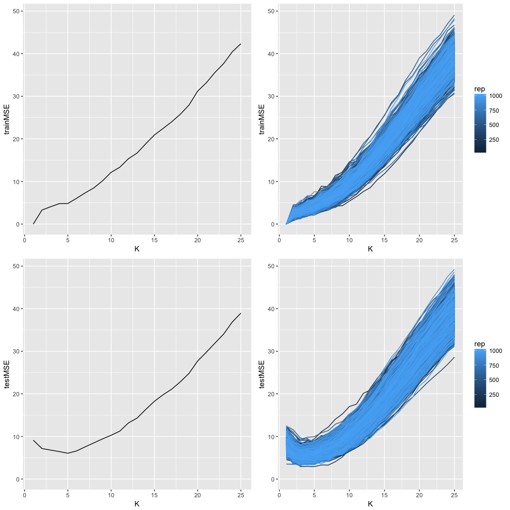

<!-- rmarkdown::render("2RecEx-sol.Rmd","all",encoding="UTF-8") -->
<!-- rmarkdown::render("2RecEx-sol.Rmd","html_document",encoding="UTF-8") -->
<!-- rmarkdown::render("2RecEx-sol.Rmd","pdf_document",encoding="UTF-8") -->

Last changes: (14.01.2019: first version)

---


# Problem 1
a. Observation 1: $\sqrt{(3-1)^2+(3-2)^2}= \sqrt{5}$  
Observation 2: $\sqrt{(2-1)^2+(0-2)^2}= \sqrt{5}$  
Observation 3: $\sqrt{(1-1)^2+(1-2)^2}= 1$  
Observation 4: $\sqrt{(0-1)^2+(1-2)^2}= \sqrt{2}$  
Observation 5: $\sqrt{(-1-1)^2+(0-2)^2}= \sqrt{8}$  
Observation 6: $\sqrt{(2-1)^2+(1-2)^2}= \sqrt{2}$  
Observation 7: $\sqrt{(1-1)^2+(0-2)^2} = 2$
b. The closest point is observation 3. This observation belongs to class A hence the predicted class membership for our test observation is A.
c. The four closest points are observations 3, 7, 4 and 6 with corresponding classes \{A, B, B, B\}. The predited class for our test observation is thus B.
d. If the Bayes decision boundary is highly non-linear, we would choose a $K$ that is not to big, as the decision boundary becomes approximately linear when $K$ tends to infinity
e. We start by installing and loading the `ggplot2` packages.
```{r,warning=FALSE}
#install.packages(ggplot2)
library(ggplot2)
```

We make a data frame with our observations
```{r}
knnframe = data.frame(x1 = c(3, 2, 1, 0, -1, 2, 1), x2 = c(3, 0, 1, 1, 0, 1, 0),  y=as.factor(c("A", "A", "A", "B", "B", "B", "B")))
```
We plot the observations unsing the `ggplot` function. We set `color=y` to obtain a colored response.
```{r}
ggplot(knnframe, aes(x=x1, y=x2, color=y))+geom_point()+theme_minimal()
```

f. 
```{r}
#install.packages(class)
library(class)
knn(train = knnframe[,1:2], cl = knnframe[,3], test = c(1, 2), k=1)
```

g. 
```{r}
knn(train = knnframe[,1:2], cl = knnframe[,3], test = c(1, 2), k=4)
```

```{r}
knn(train = knnframe[,1:2], cl = knnframe[,3], test = c(1, 2), k=7)
```

# Problem 2
We consider a regression problem, where the true underlying curve is $f(x)=-x+x^2+x^3$ and we are considering $x \in [-3,3]$. 

This non-linear curve is only observed with added noise (either a random phenomenon, or unobservable variables influence the observations), that is, we observe $y=f(x)+\varepsilon$. In our example the error is sampled from $\varepsilon\sim N(0,2^2)$.


In real life we are presented with a data set of pairs $(x_i,y_i)$, $i=1,\ldots,n$, and asked to provide a prediction at a value $x$. We will use the method of K nearest neighbour regression to do this here. 

We have a training set of $n=61$ observations $(x_i,y_i)$, $i=1,\ldots,n$. The KNN regression method provides a prediction at a value $x$ by finding the closes $K$ points and calculating the average of the observed $y$ values at these points. 

In addition we have a test set of $n=61$ observations (at the same grid points as for the training set), but now with new observed values $y$. 

We have considered $K=1,\ldots,25$ in the KNN method. Our experiment has been repeated $M=1000$ times (that is, $M$ versions of training and test set). 

## a) Training and test MSE 


In the Figure 2 (above) you see the result of applying the KNN method with $K=1,2,10,25$ to our training data, repeated for $M$ different training sets (blue lines). The black lines show the true underlying curve. 

* Comment briefly on what you see.
* Does a high or low value of $K$ give the most flexible fit?

### Answers:
<span style="color:darkgreen">Here $K=1$ gives predicted values that on average (over the training sets) are not far from the true curve, but the large variability. Increasing the number of neighbours to $K=2$ gives less variance in the preditions, and still on average are not far from the true curve. Increasing the number of neighbours further to $K=10$, the variance is even more reduced, but the valued on the edge of our training set (at =-3 and x=3) are not well estimated, and $K=25$ gives little flexibility to the curve and doesn't fit well, especially on the edges of the data set. Hence, a low value of $K$ gives the most flexible (complex) fit.</span>

In Figure 3 (below) you see mean-squared errors (mean of squared differences between observed and fitted values) for the training set and for the test set (right panel for one training and one test set, and left panel for $M$). 

* Comment on what you see.
* What do you think is the "best" choice for K?

### Answers:
<span style="color:darkgreen">
We see that larger values of $K$ give larger variations in the MSE for both the test and the train set than for the smaller choices of $K$. For the training set, the MSE increases linearly with $K$, i.e. worse fit, but for the test set, there seems to be a small decrease at $K=5$ before it increases again. Based on this, we would choose $K=5$ as the best choice for $K$. </span>

Remark: in real life we do not know the true curve, and need to use the test data to decide on model flexibility (choosing $K$).



## b) Bias-variance trade-off 

Now we leave the real world situation, and assume we know the truth (this is to focus on bias-variance trade-off). You will not observe these curves in real life - but the understanding of the bias-variance trade-off is a core skill in this course!

In the Figure 4 (below) you see a plot of estimated squared bias, estimated variance, true irreducible error and the sum of these (labelled total) and averaged over all values of $x$

The the squared bias and the variance is calculated based on the predicted values and the "true" values (without the added noise) at each $x$.  

* Explain how that is done. Hint: this is what the $M$ repeated training data sets are used for. 
* Focus on Figure 4. As the flexibility of the model increases ($K$ decreases), what happens with
    + the squared bias,  
    + the variance, and  
    + the irreducible error?
* What would you recommend is the optimal value of $K$? Is this in agreement with what you found in a)?

### Answers:

* <span style="color:darkgreen">How this is done?
The bias and variance of $\hat{f(x_0)}$ - when the true value is $f(x_0)$ is defined by
$$
\text{Bias}(\hat f(x_0)) =\text{E}[\hat f(x_0) - f(x_0)]
$$
$$
\text{Var}(\hat f(x_0)) = \text{E}[\hat f(x_0)^2] - \text{E}[\hat f(x_0)]^2
$$
Using the M resamples of the test data, we estimate the mean of  $\hat f(x_0)$ by the average over the $M$ predicted values at $x_0$, $\text{Ave}(\hat{f}(x_0))$, and the variance by the emipircal variance $\frac{1}{M-1} \sum_{i=1}^M (\hat{f}(x_0)-\text{Ave}(\hat{f}(x_0)))^2$.</span>
$$
\text{E}\left[\left(Y-\hat{f}\left(x_0\right)\right)^2\right]=\underbrace{\text{E}(\epsilon)}_{\text{Irredusible error}}+\underbrace{\text{Var}\left(\hat{f}\left(x_0\right)\right)}_{\text{Variance}}+\underbrace{\left[\text{E}\left(\hat{f}\left(x_0\right)\right)-f(x_0))\right]^2}_{\text{Squared bias}}
$$

* <span style="color:darkgreen">
From Figure 4, we se that as K increases the squared bias increases rapidly, the variance is slightly reduced, but the irreducible error stays constant. Looking at the total MSE  (squared bias plus variance) we see that the optimal K-value lies somewhere between 3 and 5.</span>
* <span style="color:darkgreen">
Extra: We observe that the "optimal" $K$ varies for different $x_0$s. For $x_0=-2$ the best $K$ is between 5 and 10. For $x_0=0$ most values of $K$ is ok, and for $x_0=1$ the best is around $K=10$. For $x_0=2.5$ $K$ needs to be below 15. The reason for showing this is to see some of the $x_0$ values in our interval $[-3,3]$ that is given equal weight in deciding the optimal $K$.</span>

Extra: We have chosen to also plot curves at four values of $x$ - Figure 5 (below). Based on these four curves, that would you recommend is the optimal value of $K$? Is this in agreement with what you found previously (averaged over $x$)?


# Problem 3

##a)
We sample from the model $y=x^2+\epsilon$ where $\epsilon \sim \mathcal{N}(0,2^2)$ and $x\in \{-2,-1.9,-1.8,...,3.8,3.9,4\}$. This means that $y \sim \mathcal{N}(x^2,2^2)$. A total of 100 samples from this model are generated for each of the 61 $x$'s.

See comments in code for further explanations.

```{r,message=F,warning=F}
library(ggplot2)
library(ggpubr)
set.seed(2) # to reproduce

M=100 # repeated samplings, x fixed 
nord=20 # order of polynoms


x = seq(-2, 4, 0.1) #We make a sequence of 61 points, x. These are the points for which we evaluate the function f(x).
truefunc=function(x) return(x^2) #The true f(x)=x^2. 
true_y = truefunc(x) #We find f(x) for each element in vector x.

error = matrix(rnorm(length(x)*M, mean=0, sd=2),nrow=M,byrow=TRUE) #Noise (epsilon) is sampled from a normal distribution and stored in this matrix. Each column corresponds to one value of x.
ymat = matrix(rep(true_y,M),byrow=T,nrow=M) + error #The 100 samples or the observations are stored in this matrix.

predarray=array(NA,dim=c(M,length(x),nord))
for (i in 1:M)
{
  for (j in 1:nord)
  {
    predarray[i,,j]=predict(lm(ymat[i,]~poly(x, j,raw=TRUE)))
    #Based on the response y_i and the x_i's, we fit a polynomial model of degre 1,...,20. This means that we assume y_i~Normal(x_i^j,0). 
  }
}
# M matrices of size length(x) times nord
# first, only look at variablity in the M fits and plot M curves where we had 1.

# for plotting need to stack the matrices underneath eachother and make new variable "rep"
stackmat=NULL
for (i in 1:M) stackmat=rbind(stackmat,cbind(x,rep(i,length(x)),predarray[i,,]))
#dim(stackmat)
colnames(stackmat)=c("x","rep",paste("poly",1:20,sep=""))
sdf=as.data.frame(stackmat) #NB have poly1-20 now - but first only use 1,2,20
# to add true curve using stat_function - easiest solution
true_x=x
yrange=range(apply(sdf,2,range)[,3:22])
p1=ggplot(data=sdf,aes(x=x,y=poly1,group=rep,colour=rep))+scale_y_continuous(limits=yrange)+geom_line()
p1=p1+stat_function(fun=truefunc,lwd=1.3,colour="black")+ggtitle("poly1")+theme_minimal()
p2=ggplot(data=sdf,aes(x=x,y=poly2,group=rep,colour=rep))+scale_y_continuous(limits=yrange)+geom_line()
p2=p2+stat_function(fun=truefunc,lwd=1.3,colour="black")+ggtitle("poly2")+theme_minimal()
p10=ggplot(data=sdf,aes(x=x,y=poly10,group=rep,colour=rep))+scale_y_continuous(limits=yrange)+geom_line()
p10=p10+stat_function(fun=truefunc,lwd=1.3,colour="black")+ggtitle("poly10")+theme_minimal()
p20=ggplot(data=sdf,aes(x=x,y=poly20,group=rep,colour=rep))+scale_y_continuous(limits=yrange)+geom_line()
p20=p20+stat_function(fun=truefunc,lwd=1.3,colour="black")+ggtitle("poly20")+theme_minimal()
ggarrange(p1,p2,p10,p20)
```

The upper left plot shows 100 predictions when we assume that $y$ is a linear function of $x$, the upper right plot hows 100 predictions when we assume that $y$ is function of poynomials up to $x^2$, the lower left plot shows 100 predictions when we assume $y$ is a function of polynomials up to $x^{10}$ and the lower right plot shows 100 predictions when assuming $y$ is a function of polynomials up to $x^{20}$.

##b)
Run the code attached and consider the following plots:

```{r,echo=TRUE}
set.seed(2) # to reproduce

M=100 # repeated samplings,x fixed but new errors
nord=20
x = seq(-2, 4, 0.1)
truefunc=function(x) return(x^2)
true_y = truefunc(x)

error = matrix(rnorm(length(x)*M, mean=0, sd=2),nrow=M,byrow=TRUE)
testerror = matrix(rnorm(length(x)*M, mean=0, sd=2),nrow=M,byrow=TRUE)
ymat = matrix(rep(true_y,M),byrow=T,nrow=M) + error
testymat = matrix(rep(true_y,M),byrow=T,nrow=M) + testerror

predarray=array(NA,dim=c(M,length(x),nord))
for (i in 1:M)
{
  for (j in 1:nord)
  {
    predarray[i,,j]=predict(lm(ymat[i,]~poly(x, j,raw=TRUE)))
  }
}  
trainMSE=matrix(ncol=nord,nrow=M)
for (i in 1:M) trainMSE[i,]=apply((predarray[i,,]-ymat[i,])^2,2,mean)
testMSE=matrix(ncol=nord,nrow=M)
for (i in 1:M) testMSE[i,]=apply((predarray[i,,]-testymat[i,])^2,2,mean)

library(ggplot2)
library(ggpubr)

# format suitable for plotting 
stackmat=NULL
for (i in 1:M) stackmat=rbind(stackmat,cbind(rep(i,nord),1:nord,trainMSE[i,],testMSE[i,]))
colnames(stackmat)=c("rep","poly","trainMSE","testMSE")
sdf=as.data.frame(stackmat) 
yrange=range(sdf[,3:4])
p1=ggplot(data=sdf[1:nord,],aes(x=poly,y=trainMSE))+scale_y_continuous(limits=yrange)+geom_line()+theme_minimal()
pall= ggplot(data=sdf,aes(x=poly,group=rep,y=trainMSE,colour=rep))+scale_y_continuous(limits=yrange)+geom_line()+theme_minimal()
testp1=ggplot(data=sdf[1:nord,],aes(x=poly,y=testMSE))+scale_y_continuous(limits=yrange)+geom_line()+theme_minimal()
testpall= ggplot(data=sdf,aes(x=poly,group=rep,y=testMSE,colour=rep))+scale_y_continuous(limits=yrange)+geom_line()+theme_minimal()
ggarrange(p1,pall,testp1,testpall)

library(reshape2)
df=melt(sdf,id=c("poly","rep"))[,-2]
colnames(df)[2]="MSEtype"
ggplot(data=df,aes(x=as.factor(poly),y=value))+geom_boxplot(aes(fill=MSEtype))+theme_minimal()

trainMSEmean=apply(trainMSE,2,mean)
testMSEmean=apply(testMSE,2,mean)
meandf=melt(data.frame(cbind("poly"=1:nord,trainMSEmean,testMSEmean)),id="poly")
ggplot(data=meandf,aes(x=poly,y=value,colour=variable))+geom_line()+theme_minimal()
```

The plots show that the test MSE in general is larger than the train MSE. This is reasonable. The fitted model is fitted based on the training set. Thus, the error will be smaller for the train data than for the test data. Furthermore, the plots show that the difference between the MSE for the test set and the training set increases when the degree of the polynomial increases. When the degree of the polynomial increases, we get a more flexible model. The fitted curve will try to pass through the training data if possible, which typically leads to an overfitted model that performs bad for test data.

##c)
Run the code and consider the following plots:

```{r,echo=TRUE}
meanmat=matrix(ncol=length(x),nrow=nord)
varmat=matrix(ncol=length(x),nrow=nord)
for (j in 1:nord)
{
  meanmat[j,]=apply(predarray[,,j],2,mean) # we now take the mean over the M simulations - to mimic E and Var at each x value and each poly model
  varmat[j,]=apply(predarray[,,j],2,var)
}
# nord times length(x)
bias2mat=(meanmat-matrix(rep(true_y,nord),byrow=TRUE,nrow=nord))^2 #here the truth is

df=data.frame(rep(x,each=nord),rep(1:nord,length(x)),c(bias2mat),c(varmat),rep(4,prod(dim(varmat)))) #irr is 2^2.
colnames(df)=c("x","poly","bias2","variance","irreducible error") #suitable for plotting
df$total=df$bias2+df$variance+df$`irreducible error`
hdf=melt(df,id=c("x","poly"))
hdf1=hdf[hdf$poly==1,]
hdf2=hdf[hdf$poly==2,]
hdf10=hdf[hdf$poly==10,]
hdf20=hdf[hdf$poly==20,]

p1=ggplot(data=hdf1,aes(x=x,y=value,colour=variable))+geom_line()+ggtitle("poly1")+theme_minimal()
p2=ggplot(data=hdf2,aes(x=x,y=value,colour=variable))+geom_line()+ggtitle("poly2")+theme_minimal()
p10=ggplot(data=hdf10,aes(x=x,y=value,colour=variable))+geom_line()+ggtitle("poly10")+theme_minimal()
p20=ggplot(data=hdf20,aes(x=x,y=value,colour=variable))+geom_line()+ggtitle("poly20")+theme_minimal()
ggarrange(p1,p2,p10,p20)
```

We see that the variance (green) increases with the complexity of the model. A linear model gives variance close to zero, while a polynomial of degree 20 gives variance close to 1 (larger at the borders). A more complex model is more flexible as it can turn up and down and change direction fast. This leads to larger variance. (Look at the plot in 2a, there is a larger variety of curves you can make when the degree is 20 compared to if the degree is 1.)

Further, we see that the bias is large for poly1, the linear model. The linear model is quite rigid, so if the true underlying model is non-linear, we typically get large deviations between the fitted line and the training data. If we study the first plot, it seems like the fitted line goes through the training data in $x=-1$ and $x=3$ as the bias is close to zero here (this is confirmed by looking at the upper left plot in 2a).

The polynomial models with degree larger than one lead to lower bias. Recall that this is the training bias: The polynomial models will try to pass through the training points if possible, and when the degree of the polynomial is large they are able to do so because they have large flexibility compared to a linear model.


```{r 2bbiasvariance2,echo=TRUE, eval=TRUE}
hdfatxa=hdf[hdf$x==-1,]
hdfatxb=hdf[hdf$x==0.5,]
hdfatxc=hdf[hdf$x==2,]
hdfatxd=hdf[hdf$x==3.5,]
pa=ggplot(data=hdfatxa,aes(x=poly,y=value,colour=variable))+geom_line()+ggtitle("x0=-1")+theme_minimal()
pb=ggplot(data=hdfatxb,aes(x=poly,y=value,colour=variable))+geom_line()+ggtitle("x0=0.5")+theme_minimal()
pc=ggplot(data=hdfatxc,aes(x=poly,y=value,colour=variable))+geom_line()+ggtitle("x0=2")+theme_minimal()
pd=ggplot(data=hdfatxd,aes(x=poly,y=value,colour=variable))+geom_line()+ggtitle("x0=3.5")+theme_minimal()
ggarrange(pa,pb,pc,pd)
```

Compare to Figures in 2.12 on page 36 in ISL (our textbook).

##d)
To change $f(x)$, replace
```{r}
truefunc=function(x) return(x^2)
```
by for example 
```{r}
truefunc=function(x) return(x^4)
```
or
```{r}
truefunc=function(x) return(exp(2*x))
```
and rerun the code. Study the results.

If you want to set the variance to 1 for example, set $sd=1$ in these parts of the code in 2a and 2b:

```{r
rnorm(length(x)*M, mean=0, sd=1)
```

Also change the following part in 2c:

```{r,results="hide"}
df=data.frame(rep(x,each=nord),rep(1:nord,length(x)),c(bias2mat),c(varmat),rep(1,prod(dim(varmat)))) #irr is 1^2.
```
to get correct plots of the irreducible error. Here, $rep(4,prod(dim(varmat)))$ is replaced by $rep(1,prod(dim(varmat)))$.


# <a id="Rpackages"> R packages</a>

If you want to look at the .Rmd file and `knit` it, you need to first install the following packages (only once).

```{r, eval=FALSE,echo=TRUE}
install.packages("ggplot2")
install.packages("gamlss.data")
install.packages("tidyverse")
install.packages("GGally")
install.packages("Matrix")
install.packages("ggpubr")
```


