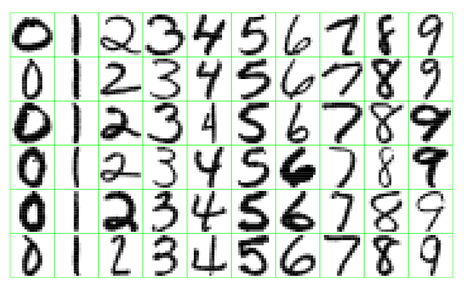
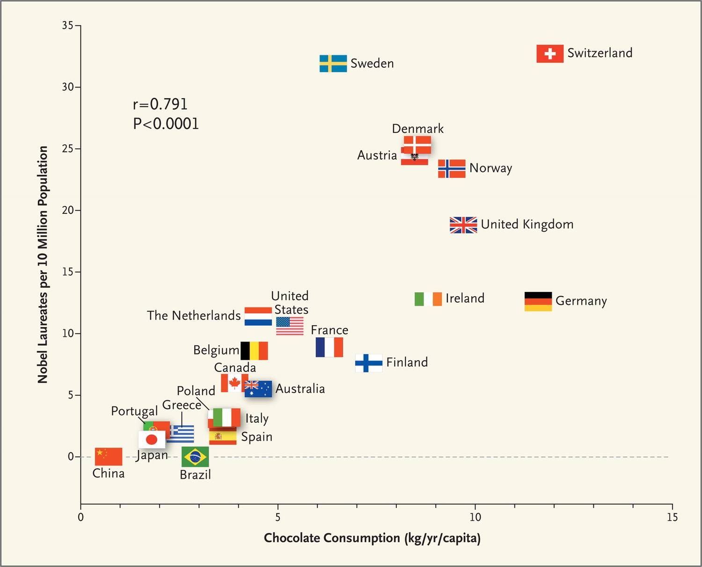
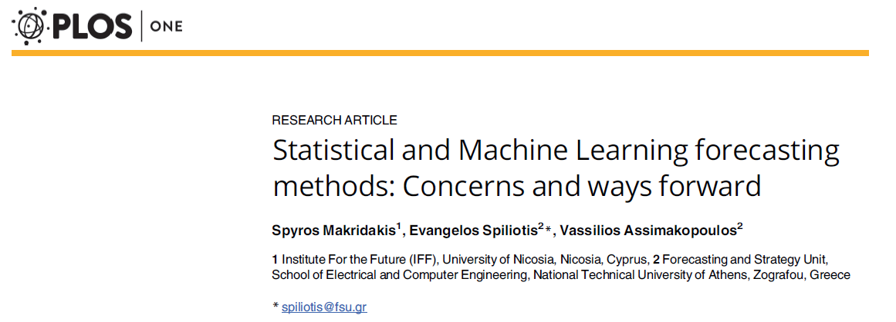

```{r setup, include=FALSE}
showsolA<-TRUE
showsolB<-TRUE
library(knitr)
opts_chunk$set(tidy.opts=list(width.cutoff=68),tidy=TRUE)
knitr::opts_chunk$set(echo = TRUE,tidy=TRUE,message=FALSE,warning=FALSE,strip.white=TRUE,prompt=FALSE,
                      cache=TRUE, size="scriptsize")

```


# Acknowledgements

* A lot of this material stems from Mette Langaas and her TAs (especiall Julia Debik). I would like to thank Mette for the permission to use her material!

* Some of the figures and slides in this presentation are taken (or are inspired) from @ISL.

---

# Introduction

## Learning material for this module

$~$

* James et al (2013): An Introduction to Statistical Learning. Chapter 2 (except 2.2.3).  

* Additional material (in this module page) on random variables, covariance matrix and the multivariate normal distribution (known for students who have taken TMA4267 Linear statistical models).


---

## What will you learn?

\vspace{2mm}

* Statistical learning and examples thereof
\vspace{1mm}

* Introduce relevant notation and terminology
\vspace{1mm}

* Prediction accuracy vs. model interpretability
\vspace{1mm}

* Bias-variance trade-off
\vspace{1mm}

* The basics of random vectors, covariance matrix and the multivariate normal distribution.

 

---

# What is statistical learning?

* _Statistical learning_ is the process of learning from data. We would like to 

    * *draw conclusions* about the relations between the variables (_\textcolor{red}{inference}_) or 
    * *find a predictive function* for new observations (_\textcolor{red}{prediction}_). 

* Want to find structures in the data that help us to learn something about the real world.

* Plays a key role in many areas of science, finance and industry. 

* A fundamental ingredient in the training of a modern data scientist.


---

##  Two variable types
\vspace{2mm}

**Quantitative** variables are variables from a continuous set, they have a numerical value. 

* Examples: a person's weight, a company's income, the age of a building, the temperature outside, the level of precipitation etc.

\vspace{4mm}

**Qualitative** variables are variables from a discrete set with $K$ different classes/labels/categories. 

* Examples: type of fruit \{apples, oranges, bananas, ...\}, sex \{male, female, other \}, education level \{none, low, medium, high\}. 

* Qualitative variables which have only two classes are called *binary* variables and are usually coded by 0 (no) and 1 (yes). 

---

# Examples of learning problems


* Predict the price of a stock 3 months from now, based on company performance measures and economic data. The response variable is quantitative (price).  _Continuous outcome_.

* Spam detection for emails.  _Binary outcome_ (yes, no).

* Identification of risk factors for Prostate cancer.  _Binary outcome_ (yes, no).

* Estimating the risk of heart disease or heart attack, given knowledge about condition, behaviour, age, or demographic, diet and clinical measurements. _Binary outcome_ (yes, no).


* Digit and image recognition. _Categorical outcome_.


---

<!-- South African coronary heart disease data: 462 observations and 10 variables. -->
<!-- ```{r heart, echo=FALSE, message=FALSE,fig.width=8, fig.height=8,out.width='16cm',fig.align = "center"} -->
<!-- library(ElemStatLearn) -->
<!-- library(ggplot2) -->
<!-- library(GGally) -->
<!-- SAheart$chd = as.factor(SAheart$chd) -->
<!-- #ggpairs(SAheart, ggplot2::aes(color=chd), upper="blank",  lower = list(continuous = wrap("points", alpha = 0.3, size=0.2))) -->
<!-- pairs(SAheart,col=as.numeric(SAheart$chd)+2) -->
<!-- ``` -->

<!-- --- -->

### Example 1: Handwritten digit recognition 
* Aim: To identify the numbers in a handwritten ZIP code, from a digitized image. 
* Classification problem with categorical response variable \{0, 1, 2, ..., 9\}.
\vspace{1mm}

\centering
{width=70%}
\vspace{1mm}

\flushleft
Examples of handwritten digits from U.S. postal envelopes. 
\scriptsize
Image taken from <https://web.stanford.edu/~hastie/ElemStatLearnII/>

---

### Example 2: Email classification (spam detection)  

$~$

* Goal: to build a spam filter. 

\vspace{1mm}

* This filter can based on the frequencies of words and characters in emails. 


$~$ 

The table below shows the average percentage of words or characters in an email message, based on 4601 emails of which 1813 were classified as a spam.

 
```{r spam, echo=FALSE,warning=FALSE}
spam_dataset = read.csv("data.csv",header=FALSE,sep=";")
spam_names = read.csv("names.csv",header=FALSE,sep=";")

#Set the names of the dataset dataframe:
names(spam_dataset) <- sapply((1:nrow(spam_names)),function(i) toString(spam_names[i,1]))

#make column y a factor variable for binary classification (spam or non-spam)
spam_dataset$y <- as.factor(spam_dataset$y)

dsmail = spam_dataset[which(spam_dataset$y==0),]
dsspam = spam_dataset[which(spam_dataset$y==1),]

means_mail = c(mean(dsmail[,19]), mean(dsmail$word_freq_free), mean(dsmail$word_freq_george),  mean(dsmail[,52]), mean(dsmail[,53]), mean(dsmail$word_freq_edu))
means_spam = c(mean(dsspam[,19]), mean(dsspam$word_freq_free), mean(dsspam$word_freq_george), mean(dsspam[,52]), mean(dsspam[,53]), mean(dsspam$word_freq_edu))
means = data.frame(rbind("not spam"= means_mail, "spam"= means_spam))

#kable(means, digits = 2, col.names = c("you", "free", "george", "!", "$", "edu"),format="html")
kable(means, digits = 2, col.names = c("you", "free", "george", "!", "$", "edu"))
```

 

<!-- ### Example 3: What makes a Nobel Prize winner?  -->

<!-- Perseverance, luck, skilled mentors or simply chocolate consumption? An article published in the New England Journal of Medicine have concluded with the following: -->

<!-- \vspace{2mm} -->

<!-- > Chocolate consumption enhances cognitive function, which is a sine qua non for winning the Nobel Prize, and it closely correlates  with the number of Nobel laureates in each country. It remains to be determined whether the consumption of chocolate is the  underlying mechanism for the observed association with improved cognitive function. -->

<!-- \vspace{2mm} -->

<!-- The figure shows the number of Nobel Laureates per 10 million population against countries' annual per capita chocolate consumption. -->

<!-- You can read the article [here](http://www.nejm.org/doi/full/10.1056/NEJMon1211064) and a informal review of the article [here](https://blogs.scientificamerican.com/the-curious-wavefunction/chocolate-consumption-and-nobel-prizes-a-bizarre-juxtaposition-if-there-ever-was-one/).  -->

<!-- --- -->

<!-- {width=650px,align=center} -->


<!-- --- -->


# The Supervised Learning Problem

\textcolor{blue}{\emph{Starting point}}:

* Outcome measurement $Y$, also called dependent variable,
response, target.

* Vector of $p$ predictor measurements $X=(X_1,\ldots,X_p)$, also called inputs,
regressors, covariates, features, independent variables.

* In the **regression problem**, $Y$ is quantitative (e.g price,
blood pressure).

* In the **classification problem**, $Y$ takes values in a finite,
unordered set (survived/died, digit 0-9, cancer class of
tissue sample).

* We have training data $(x_1, y_1), \ldots , (x_N , y_N )$. These are
observations (examples, instances) of these measurements.


---


## Supervised learning and its objectives

\vspace{2mm}

Our data set (training set) consists of $n$ measurement of the response variable $Y$ and of $p$ covariates $x$: 
$$(y_1, x_{11}, x_{12},\ldots, x_{1p}), (y_2, x_{21},\ldots, x_{2p}), \ldots, (y_n, x_{n1}, x_{n2},\ldots, x_{np}).$$
$~$


On the basis of the \emph{training data} we would like to:

* **accurately predict** unseen test cases. 

* **understand** which input affects the outcomes, and how.

* **assess the quality** of your predictions and inference.

\vspace{2mm}

The majority of problems studied in this course fall in the supervised learning category (exception: Module 10)


---

# Notation and key statistical concepts

See notes and p. 9--12 in the course book.


\vspace{6cm}

---

# The Unsupervised Learning Problem

* There is **no outcome variable** $y$, just a set of predictors (features) $x_i$
measured on a set of samples.

* Objective is more fuzzy -- find (hidden) patterns or groupings in the data - in order to _gain insight and understanding_. There is no _correct_ answer.

* Difficult to know how well your are doing.
 
$~$

Examples in the course:   

  * Clustering (M10)
  * Principal component analysis (M10)


---


# Overall philosophy 


* Important to understand the simpler methods first, in order
to grasp the more sophisticated ones.

$\rightarrow$ **Simpler methods often perform as well as fancier ones!**

$~$

* It is important to accurately _assess the performance of a
method_, to know how well or how badly it is working.


---

# Statistical Learning vs. Machine Learning

* Machine learning arose as a subfield of Artificial Intelligence.

* Statistical learning arose as a subfield of Statistics.

* There is much overlap -- both fields focus on supervised
and unsupervised problems:
    + Machine learning has a greater emphasis on large scale
applications and prediction accuracy.
    + Statistical learning emphasizes models and their
interpretability, and precision and uncertainty.

* The distinction has become more and more blurred,
and there is a great deal of “cross-fertilization”.

* Machine learning has the upper hand in Marketing!


---

* There is a controversy and some scepticism against ``too fancy'' ML methods. 

* Criticism: ML often re-invents existing methods and names them differently, but often without awareness of existing methods in statistics.

* Almost weekly new literature that delivers comparison. Often, the "simple" statistical methods "win".



---

A tweet by one of the co-authors of the course book, coincidentially...


---


## What is the aim in statistical learning?
\vspace{3mm}

We are talking about supervised methods now. Assume:

\vspace{2mm}

* we observe one _quantitative_ response $Y$ and  $p$ different predictors $x_1, x_2,... , x_p$. 

\vspace{1mm}

* We assume that there is a function $f$ that relates the response and the predictor variables: 
$$ Y = f(x) + \varepsilon,$$
where $\varepsilon$ is a random error term with mean 0 and independent of $x$. 

$~$

\centering
{\bf The aim is to estimate $f$.}

---

# Example 1

Sales of a product, given advertising budgets in different media.


---

# Example 2

\vspace{4mm}

Income for given levels of education.


---

There are two main reasons for estimating $f$:

* **Prediction**

* **Inference**

---

## Reason 1: Prediction
$~$

**Aim**: predict a response $Y$ given new observations $x$ of the covariates as accurately as possible. 

$~$

Notation:

$$\hat{Y} = \hat{f}(x).$$

* $\hat{f}$: estimated $f$ 

* $\hat{Y}$ prediction for $Y$ given $x$. 

\vspace{2mm}

* We _do not really care_ about the shape of $f$ ("black box").  
 $\rightarrow$ no interpretation of regression parameters when the aim is purely prediction!


---

There are two quantities which influence the accuracy of $\hat{Y}$ as a prediction of $Y$: 

* The _\textcolor{red}{reducible error}_ has to do with our estimate $\hat{f}$ of $f$. This error can be reduced by using the most _appropriate_ statistical learning technique. 
* The _\textcolor{red}{irreducible error}_ comes from the error term $\varepsilon$ and cannot be reduced by improving $f$. This is related to the unobserved quantities influencing the response and possibly the randomness of the situation.


For a given $\hat{f}$ and a set of predictors $X$ which gives $\hat{Y}=\hat{f}(X)$, we have

$$\text{E}[(Y-\hat{Y})^2] = \underbrace{(f(X)-\hat{f}(X))^2}_{reducible} + \underbrace{\text{Var}(\epsilon)}_{irreducible}$$

--- 

### Q: If there were a _deterministic_ relationship between the response and a set of predictors, would there then be both reducible and irreducible error?

<!-- --- -->

<!-- ### A:  -->

<!-- If we know all predictors and the (deterministic) connection to the reponse, and there is no random error added, then we will have no irreducible error. If there is a deterministic relationship, but we don't know all predictor values, then the non-observed predictors will give us irreducible error. -->

<!-- So, very seldom (maybe only in synthetic examples?) that there is only reducible error present. -->

---

## Reason 2: Inference

$~$

**Aim**: understand _how_ the response variable is affected by the various predictors (covariates). 

$~$

The _exact form_ of $\hat{f}$ is of _main interest_.

\vspace{2mm}

* Which predictors are associated with the response?
* What is the relationship between the response and each predictor?
* Can the relationship be linear, or is a more complex model needed?


<!-- --- -->

<!-- ## Regression and classification -->

<!-- **Regression** predicts a value from a continuous set.  -->

<!-- Example: Predict the profit given the amount of money spend on advertising. -->

<!-- **Classification** predicts the class membership.  -->

<!-- Example: Given blood pressure, weight and hip ratio predict if a patient suffers from diabetes (yes/no). -->

<!-- ### Q:  -->
<!-- Give an example of one regression and one classification problem (practical problem with data set available) that you would like to study in this course. -->

<!-- ### A: -->

<!-- See examples in M1 and M2. -->


---

# Estimating $f$

Overall idea: 

* Using available _training data_ $(x_1,y_n),\ldots (x_n,y_n)$ to estimate $\hat{f}$, such that $Y\approx \hat{f}(X)$ for any $(X,Y)$ (also those that have not yet been observed).

$~$

\textcolor{red}{Two main approaches:}

* Parametric methods
* Non-parametric methods


---

## Parametric methods
$~$

Asumption about the form or shape of the function $f$.  

The multiple linear model (M3) is an example of a parametric method: 

$$f(x) = \beta_0 + \beta_1 x_1 + ... + \beta_p x_p+\varepsilon \ , $$

with $\varepsilon \sim N(0,\sigma^2)$.

$~$

The task simplifies to finding estimates of the $p+1$ coefficients $\beta_0, \beta_1, .. ,\beta_p$. To do this we use the training data to fit the model, such that $$Y \approx \hat{\beta_0} + \hat{\beta_1} x_1 + ... + \hat{\beta_p} x_p \ .$$ 

---

Fitting a parametric models is thus done in two steps:

1. Select a form for the function $f$.  
2. Estimate the unknown parameters in $f$ using the training set.

---

## Non-parametric methods 

$~$

* Non-parametric methods seek an estimate of $f$ that gets close to the data points, but without making explicit assumptions about the form of the function $f$. 

\vspace{2mm}

* Example: $K$-nearest neighbour (KNN) algorithm, used in classification. KNN predicts a class membership for a new observation by making a majority vote based on its $K$ nearest neighbours. We will discuss the $K$-nearest neighbour algorithm in Module 4.


---

### KNN example
$~$

```{r, echo=FALSE, message=FALSE, warning=FALSE}
library(class)
library(dplyr)
library(ggpubr)
library(mvtnorm)
library(MASS)
library(ggplot2)

set.seed(9)

Sigma = matrix(c(2, 0, 0, 2), 2, 2)

mu1 = c(1, 1)
mu2 = c(3, 3)

X1 = mvrnorm(100, mu=mu1, Sigma=Sigma)
X2 = mvrnorm(100, mu=mu2, Sigma=Sigma)

class = c(rep("A",100), rep("B", 100))
class = as.factor(class)

df = data.frame(rbind(X1, X2), class)


test = expand.grid(x = seq(min(df[,1]-1), max(df[,1]+1), by=0.2), y=seq(min(df[,2]-1), max(df[,2]+1), by=0.2))


## k = 1
classif = class::knn(df[,1:2], test=test, cl=df[,3], k=1, prob=TRUE)
prob = attr(classif, "prob")

dataf = bind_rows(mutate(test, prob=prob, class="A", prob_cls=ifelse(classif==class, 1, 0)),
                  mutate(test, prob=prob, class="B", prob_cls=ifelse(classif==class, 1, 0)))

gg = ggplot(dataf)+geom_point(aes(x=x, y=y, colour=class), data=mutate(test, class=classif), size=0.01) 
gg = gg + geom_contour(aes(x=x, y=y, z=prob_cls, group=class, color=class), data=dataf, bins=2,size=0.5)
gg = gg + geom_point(aes(x=x, y=y, col=class), size=2, data=data.frame(x=df[,1], y=df[,2], class=df[,3]))
gg = gg + ggtitle("k = 1")+xlab("X1")+ylab("X2")+theme_minimal()

# k = 3
classif3 = class::knn(df[,1:2], test=test, cl=df[,3], k=3, prob=TRUE)
prob3 = attr(classif3, "prob")

dataf3 = bind_rows(mutate(test, prob=prob3, class="A", prob_cls=ifelse(classif3==class, 1, 0)),
                    mutate(test, prob=prob3, class="B", prob_cls=ifelse(classif3==class, 1, 0)))

gg3 = ggplot(dataf3)+geom_point(aes(x=x, y=y, colour=class), data=mutate(test, class=classif3), size=0.01)
gg3 = gg3 + geom_contour(aes(x=x, y=y, z=prob_cls, group=class, color=class), data=dataf3, bins=2, size=0.5)
gg3 = gg3 + geom_point(aes(x=x, y=y, col=class), size=2, data=data.frame(x=df[,1], y=df[,2], class=df[,3]))
gg3 = gg3 + ggtitle("k = 3")+xlab("X1")+ylab("X2")+theme_minimal()

## k = 10

classif10 = class::knn(df[,1:2], test=test, cl=df[,3], k=10, prob=TRUE)
prob10 = attr(classif10, "prob")

dataf10 = bind_rows(mutate(test, prob=prob10, class="A", prob_cls=ifelse(classif10==class, 1, 0)),
                  mutate(test, prob=prob10, class="B", prob_cls=ifelse(classif10==class, 1, 0)))

gg10 = ggplot(dataf10)+geom_point(aes(x=x, y=y, colour=class), data=mutate(test, class=classif10), size=0.05)
gg10 = gg10 + geom_contour(aes(x=x, y=y, z=prob_cls, group=class, color=class), data=dataf10, bins=2, size=0.5)
gg10 = gg10 + geom_point(aes(x=x, y=y, col=class), size=2, data=data.frame(x=df[,1], y=df[,2], class=df[,3]))
gg10 = gg10 + ggtitle("k = 10")+xlab("X1")+ylab("X2")+theme_minimal()

## k = 150

classif150 = class::knn(df[,1:2], test=test, cl=df[,3], k=150, prob=TRUE)
prob150 = attr(classif150, "prob")

dataf150 = bind_rows(mutate(test, prob=prob150, class="A", prob_cls=ifelse(classif150==class, 1, 0)),
                  mutate(test, prob=prob150, class="B", prob_cls=ifelse(classif150==class, 1, 0)))

gg150 = ggplot(dataf150)+geom_point(aes(x=x, y=y, colour=class), data=mutate(test, class=classif150), size=0.05)
gg150 = gg150 + geom_contour(aes(x=x, y=y, z=prob_cls, group=class, color=class), data=dataf150, bins=2, size=0.5)
gg150 = gg150 + geom_point(aes(x=x, y=y, col=class), size=2, data=data.frame(x=df[,1], y=df[,2], class=df[,3]))
gg150 = gg150 + ggtitle("k = 150")+xlab("X1")+ylab("X2")+theme_minimal()

ggarrange(gg,gg3,gg10,gg150)
```

---


### Parametric methods


Advantages | Disadvantages
------------------------------------ | ------------------------------------
Simple to use and easy to understand | The function $f$ is constrained to the specified form.\vspace{2mm}
Requires little training data | The assumed function form of $f$ will in general not match the true function, potentially giving a poor estimate.\vspace{2mm}
Computationally cheap| Limited flexibility
  
---

### Non-parametric methods

 
Advantages | Disadvantages
------------------------------------ | ------------------------------------
Flexible: a large number of functional forms can be fitted|Can overfit the data\vspace{6mm}
No strong assumptions about the underlying function are made|Computationally more expensive as more parameters need to be estimated\vspace{3mm}
Can often give good predictions |Much data are required to estimate (the complex) $f$.

---

# Prediction accuracy vs. interpretability
(we are warming up to the bias--variance trade--off)

**Inflexible** methods:

* Linear regression (M3)
* Linear discriminant analysis (M4)
* Subset selection and lasso (M6)

**Flexible** methods:

* KNN classification (M4), KNN regression, Smoothing splines (M7)
* Bagging and boosting (M8), support vector machines (M9)
* Neural networks (M11)

---

## Why would I ever prefer an inflexible method?
$~$

Example: Prediction of icome from "Years of Education" and "Seniority"\vspace{2mm}

\centering
{width=45%}
{width=45%}

A linear model vs a perfect fit.


---

<!-- The choice of a flexible or inflexible method depends on the goal in mind.  -->

<!-- * For **inference** an inflexible model is easier to interpret. -->
<!-- * For **prediction** a flexible model is more powerful. -->

<!-- If the aim is inference an inflexible model, which is easy to understand, will be preferred. On the other side, if we want to make as accurate predictions as possible, we are not concerned about the shape of $f$. A flexible method can be chosen, at the cost of model interpretability, and we treat $f$ like a black box. -->

$~$

**Potential problems:**

**Overfitting** occurs when the estimated function $f$ is too closely fit to the observed data points. 

**Underfitting** occurs when the estimated function $f$ is too rigid to capture the underlying structure of the data.

$~$

_We illustrate this by a toy example using polynomial regression._

---

## Polynomial regression example (simulation)

Consider a covariate $x$ observed between $x=-2, \ldots , 4$ and $n=61$ observations.

```{r data, echo=FALSE, fig.width=4, fig.height=2.7,fig.align = "center"}
library(ggplot2)
library(ggpubr)
set.seed(2)

x = seq(-2, 4, 0.1)
true_y = x^2

error = rnorm(length(x), mean=0, sd=2)
y = true_y + error

data = data.frame(x, y)
p00=ggplot(data= data, aes(x = x, y=y)) +geom_point(size=0.7) +theme_minimal()

print(p00)
```

---

We impose a relationship between reponse $Y$ and covariate $x$

$$ Y=x^2 + \varepsilon$$

with error (noise) term $\varepsilon\sim N(0,\sigma^2)$ with $\sigma=2$. It is a substitue for all the unobserved variables that are not in our equation, but that might influence $Y$.

* We call $Y=x^2$ the _truth_.
* $\varepsilon$ is the _irreducible error_.


---

```{r truth, echo=FALSE, fig.width=5, fig.height=3,fig.align = "center"}
p0 = ggplot(data= data, aes(x = x, y=y)) +geom_point(size=0.7) + geom_line(aes(x=x, y=true_y))+ggtitle("Truth")+theme_minimal()
print(p0)
```

---

Try to fit a function to the observations _without_ knowing the true relationship:

$~$

*  **poly1**: Simple linear model of the form $\beta_0+\beta_1 x$ fitted to the observations.  _Underfits_ the data. 

* **poly2**: Quadratic polynomial fit to the data, of the form $\beta_0+\beta_1 x +\beta_2 x^2$. This fits well.

* **poly10**: Polynomial of degree 10 fit of the form $\beta_0+\beta_1 x +\beta_2 x^2+\cdots +\beta_{10}x^{10}$ _Overfits_ the data.

* **poly20**: Polynomial of degree 10 fit of the form $\beta_0+\beta_1 x +\beta_2 x^2+\cdots +\beta_{20}x^{20}$ _Overfits_ the data.


---

```{r overunderfit,echo=FALSE, fig.width=5.5, fig.height=4,fig.align = "center"}
p1 = ggplot(data= data, aes(x = x, y=y)) +geom_point(size=0.7) + geom_line(aes(x=x, y=predict(lm(y~x))), col="red")+ggtitle("poly1")+theme_minimal()
p2 = ggplot(data= data, aes(x = x, y=y)) +geom_point(size=0.7) + geom_line(aes(x=x, y=predict(lm(y~poly(x,2)))), col="orange")+ggtitle("poly2")+theme_minimal()
p3 =  ggplot(data= data, aes(x = x, y=y)) +geom_point(size=0.7) + geom_line(aes(x=x, y=predict(lm(y~poly(x, 10)))), col="pink")+ggtitle("poly10")+theme_minimal()
p4 =  ggplot(data= data, aes(x = x, y=y)) +geom_point(size=0.7) + geom_line(aes(x=x, y=predict(lm(y~poly(x, 20)))), col="purple")+ggtitle("poly20")+theme_minimal()

ggarrange(p1,p2,p3, p4)

```

The degree of the polynomial is a _flexibility parameter_.

---

We can now ask: 

* Which of these models performs "best"? 

* Is there _one_ method that dominates all others?


---

# Assessing model accuracy

**No method** dominates all others over all possible data sets.

* That is why we need to learn about many different methods.
* For a given data set we need to know how to decide which method produces the _best_ results.
* We need to understand what _best_ means.
* How close is the predicted response to the true response value?

---

## Measuring the Quality of Fit

\vspace{2mm}

<!-- In regression, where we assume $Y  = f(x) + \varepsilon$, and  -->
<!-- $\hat{f}(x_i)$ gives the predicted response at $x_i$,  -->

The quality of fit can be measures as the *Training MSE* (mean squared error), using the data that were used to estimate $f$):

$$ \text{MSE}_{\text{train}}=\frac{1}{n}\sum_{i=1}^n (y_i-\hat{f}(x_i))^2$$
$~$


---

<!-- But: we are _not_ interested in how the method works on the training data. We want to know how good the method is when we use it on _previously unseen test data_ (e.g., future data). -->


Why is the training MSE not the real measure of interest?

$~$


Examples: 

* We don't want to predict last weeks stock price, we want to predict the stock price next week.

* We don't want to predict if a patient in the training data has diabetes (because we already know this), we want to predict if a new patient has diabetes.

---

### Training error for the polynomial example

$~$

```{r trainMSE, message=FALSE, warning=FALSE, echo=FALSE, fig.width=6,fig.height=3,fig.align="center",out.width='80%'}
library(ggplot2)
library(ggpubr)
# starting with predarray
# M matrices of size length(x) times nord
# first, only look at variablity in the M fits and plot M curves where we had 1
set.seed(2) # to reproduce

M=100 # repeated samplings,x fixed but new errors
nord=20
x = seq(-2, 4, 0.1)
true_y = x^2

error = matrix(rnorm(length(x)*M, mean=0, sd=2),nrow=M,byrow=TRUE)
testerror = matrix(rnorm(length(x)*M, mean=0, sd=2),nrow=M,byrow=TRUE)
ymat = matrix(rep(true_y,M),byrow=T,nrow=M) + error
testymat = matrix(rep(true_y,M),byrow=T,nrow=M) + testerror

predarray=array(NA,dim=c(M,length(x),nord))
for (i in 1:M)
{
  for (j in 1:nord)
  {
    predarray[i,,j]=predict(lm(ymat[i,]~poly(x,j,raw=TRUE)))
  }
}  


trainMSE=matrix(ncol=nord,nrow=M)
for (i in 1:M) trainMSE[i,]=apply((predarray[i,,]-ymat[i,])^2,2,mean)
stackmat=NULL
for (i in 1:M) stackmat=rbind(stackmat,cbind(rep(i,nord),1:nord,trainMSE[i,]))
colnames(stackmat)=c("rep","poly","trainMSE")
sdf=as.data.frame(stackmat) #NB have poly1-20 now - but first only use 1,2,20
yrange=range(sdf[,3])

p1=ggplot(data=sdf[1:nord,],aes(x=poly,y=trainMSE))+scale_y_continuous(limits=yrange)+geom_line()+theme_minimal()
pall= ggplot(data=sdf,aes(x=poly,group=rep,y=trainMSE,colour=rep))+scale_y_continuous(limits=yrange)+geom_line()+theme_minimal()+theme(legend.position="none")
ggarrange(p1,pall)

```

\vspace{2mm}

 
Left: one repetition, right: 100 repetitions of the training set.  

\vspace{2mm}

**Q**: Based on the training MSE - which model fits the data the best?


<!-- (But, how was these graphs made? Want to see the R code? You can see the code by looking at the 2StatLearn.Rmd file located at the same place as you found this file.) -->

---

## Test MSE

$~$

* Simple solution: estimate $\hat{f}$ using the training data (maybe my minimizing the training MSE), but choose the _best_ model using a separate _test set_.

\vspace{2mm}

* _Test MSE_ for a set of $n_0$ test observations $(x_{0j},y_{0j})$:

$$ \text{MSE}_{\text{test}}=\frac{1}{n_0}\sum_{j=1}^{n_0} (y_{0j}-\hat{f}(x_{0j}))^2$$

\vspace{2mm}

* Alternative notation:
$$\text{Ave}(y_0-\hat{f}(x_0))^2$$
(taking the average over all available test observations).

---

### Test error for the polynomial example

$~$

```{r traintestMSE, message=FALSE, warning=FALSE, echo=FALSE,fig.width=7,fig.height=3,fig.align="center",out.width='90%'}
library(ggplot2)
library(ggpubr)
set.seed(2) # to reproduce

M=100 # repeated samplings,x fixed but new errors
nord=20
x = seq(-2, 4, 0.1)
true_y = x^2

error = matrix(rnorm(length(x)*M, mean=0, sd=2),nrow=M,byrow=TRUE)
testerror = matrix(rnorm(length(x)*M, mean=0, sd=2),nrow=M,byrow=TRUE)
ymat = matrix(rep(true_y,M),byrow=T,nrow=M) + error

predarray=array(NA,dim=c(M,length(x),nord))
for (i in 1:M)
{
  for (j in 1:nord)
  {
    predarray[i,,j]=predict(lm(ymat[i,]~poly(x,j,raw=TRUE)))
  }
}  
trainMSE=matrix(ncol=nord,nrow=M)
for (i in 1:M) trainMSE[i,]=apply((predarray[i,,]-ymat[i,])^2,2,mean)
testMSE=matrix(ncol=nord,nrow=M)
for (i in 1:M) testMSE[i,]=apply((predarray[i,,]-testymat[i,])^2,2,mean)
stackmat=NULL
for (i in 1:M) stackmat=rbind(stackmat,cbind(rep(i,nord),1:nord,trainMSE[i,],testMSE[i,]))
colnames(stackmat)=c("rep","poly","trainMSE","testMSE")
sdf=as.data.frame(stackmat) 
yrange=range(sdf[,3:4])
p1=ggplot(data=sdf[1:nord,],aes(x=poly,y=trainMSE))+scale_y_continuous(limits=yrange)+geom_line()+theme_minimal()+theme(legend.position="none")
pall= ggplot(data=sdf,aes(x=poly,group=rep,y=trainMSE,colour=rep))+scale_y_continuous(limits=yrange)+geom_line()+theme_minimal()+theme(legend.position="none")
testp1=ggplot(data=sdf[1:nord,],aes(x=poly,y=testMSE))+scale_y_continuous(limits=yrange)+geom_line()+theme_minimal()
testpall= ggplot(data=sdf,aes(x=poly,group=rep,y=testMSE,colour=rep))+scale_y_continuous(limits=yrange)+geom_line()+theme_minimal()+theme(legend.position="none")
ggarrange(testp1,testpall)
```


Left: one repetition, right: 100 repetitions for the testMSE.


---

### Questions:

$~$

**Q1**: Based on the test MSE - which model fits the data the best?

\vspace{2mm}


**Q2:** What if we do not have access to test data?


\vspace{2mm}

**Q3:** Can we instead just use the training data MSE to choose a model? A low training error should also give a low test error?


\vspace{2mm}


**Q4:** Important observation: 

\vspace{2mm}

* The test error seems to have a minimum (U-shape) in between the extremes.


* The training error keeps going down.

\centering
\vspace{2mm}

Why? 

<!-- --- -->

<!-- Answers -->

<!-- **A1**: -->

<!-- If choosing flexibility -->

<!-- * _based on training MSE_:  poly20 wins -->
<!-- * _based on test MSE_: poly2 wins. -->

<!-- **A2:** In Module 5 we will look into using _cross validation_ to mimic the use of a test set. -->


<!-- **A3:** Sadly no, if we use a flexible model we will look at several cases where a low training error is a sign of overfitting, and will give a high test error. So, the training error is not a good estimator for the test error because it does not properly account for model complexity. -->

<!-- **A4:** See next slides. -->


<!-- ```{r,echo=FALSE,fig.width=7,fig.height=4,fig.align="center",out.width='90%'} -->
<!-- library(reshape2) -->
<!-- df=melt(sdf,id=c("poly","rep"))[,-2] -->
<!-- colnames(df)[2]="MSEtype" -->
<!-- ggplot(data=df,aes(x=as.factor(poly),y=value))+geom_boxplot(aes(fill=MSEtype))+theme_minimal() +xlab("poly") -->
<!-- ``` -->

<!-- Boxplot of the 100 repetitions (polynomial experiment). -->

<!-- **Q**: What can you read of the boxplot? Anything new compared to the previous plots? -->

<!-- --- -->

<!-- **A**: -->

<!-- Same data as above, but now presented jointly for training and test MSE, to focus on location and variability:  -->

<!-- Boxplot:  -->

<!-- * black line=median,  -->
<!-- * box from 1 to 3rd quantile,  -->
<!-- * IQR=inter quartile range= width of box -->
<!-- * whiskers to min and max, except when more than 1.5 times IQR from box, then marked as outlier with points. -->

 

---

# The Bias-Variance trade-off

\vspace{2mm}

The U-shape is the result of _two competing properties_ of statistical learning methods.

\vspace{2mm}

* Assume we have fitted a _regression_ curve 
$$Y  = f(x) + \varepsilon$$ 
to our training data $\{x_i, y_i\}$ for $i=1,..,n$, and $\varepsilon$ is an unobserved random variable that adds random, uncorrelated, mean-zero noise term with variance $\sigma^2$.\footnote{$\varepsilon$ is a substitute for all the unobserved variables that influence $Y$.}

\vspace{2mm}

* The training data was used to estimate $\hat{f}$. 

---

* We want to use $\hat{f}$ to obtain the predicted response value $\hat{f}(x_0)$ for an unseed test observation $(x_0,y_0)$.

* The _\textcolor{red}{expected test mean squared error (MSE)} at $x_0$_ is defined as:
$$\text{E}[(y_0 - \hat{f}(x_0))^2] \ .$$

$~$

* Compare this to the test MSE for the polynomical example ($\text{MSE}_{\text{test}}$): The average is simply replaced by the _theoretical version_ (expected value).

---

Using that $y_0=f(x_0)+\varepsilon$, this expected test MSE (at $X=x_0$) can be decomposed into three terms (board)
\begin{align*}
&\text{E}[(y_0 - \hat{f}(x_0))^2] = \\
& ... \\
& =  \underbrace{\text{Var}(\varepsilon)}_{\text{Irreducible error}} + \underbrace{\text{Var}(\hat{f}(x_0))}_{\text{Variance of prediction}} + \underbrace{\left( f(x_0) - \text{E}[\hat{f}(x_0)] \right)^2}_{\text{Squared bias}}
\end{align*}


<!-- \begin{align*} -->
<!-- & \text{E}[f(x_0)+\varepsilon - \hat{f}(x_0)]^2  \\ -->
<!-- &= \underbrace{\text{E}[f(x_0)^2]}_{=f(x_0)^2} +\text{E}[\varepsilon^2] + \text{E}[\hat{f}(x_0)^2] -2\text{E}[f(x_0)\hat{f}(x_0)] \\ -->
<!-- &= f(x_0)^2 + \text{Var}(\varepsilon) + \text{Var}(\hat{f}(x_0)) +  \text{E}[\hat{f}(x_0)]^2 \\ -->
<!-- & \qquad -2 f(x_0)\text{E}[\hat{f}(x_0)] \\ -->
<!-- & =  \underbrace{\text{Var}(\varepsilon)}_{\text{Irreducible error}} + \underbrace{\text{Var}(\hat{f}(x_0))}_{\text{Variance of prediction}} + \underbrace{\left( f(x_0) - \text{E}[\hat{f}(x_0)] \right)^2}_{\text{Squared bias}} -->
<!-- \end{align*} -->


---

$$\text{E}[(y_0 - \hat{f}(x_0))^2]=\cdots=\text{Var}(\varepsilon) +  \text{Var}(\hat{f}(x_0))+[\text{Bias}(\hat{f}(x_0))]^2$$

* _\textcolor{red}{Irreducible error}_. This term cannot be reduced regardless how well our statistical model fits the data. 

* _\textcolor{red}{Variance}_ of the prediction at $\hat{f}(x_0)$. Relates to the amount by which $\hat{f}(x_0)$ is expected to change for different training data. If the variance is high, there is large uncertainty associated with the prediction. 

* _\textcolor{red}{Squared bias}_. The bias gives an estimate of how much the prediction differs from the true mean. If the bias is low the model gives a prediction which is close to the true value.


---

* Note:
$$\text{E}[(y_0 - \hat{f}(x_0))^2]$$
is the **expected test MSE**. We can think of this as the average test MSE we would obtain if we repeatedly estimated $f$ using many training sets (as we did in our example), and then tested this estimate at $x_0$. 

* However, if we also assume that $X$ is a random variable, this is actually 
 $\text{E}[(Y - \hat{f}(x_0))^2 \mid X=x_0]$ 

* The **overall expected test MSE** can be computed by averaging the expected test MSE over all possible values of $x_0$ (averaging with respect to frequency in test set).

* Mathematically: $\text{E} \{ \text{E}[(Y - \hat{f}(X))^2 \mid X]\}$ (by the law of total expectation / law of double expectations).

---

### General rule
\vspace{4mm}

For more flexible models, the variance will _increase_ and the bias will _decrease_.

\vspace{4mm}

\centering
This is called the _\textcolor{red}{Bias-variance trade-off}_.


---

### Choosing the best model 

$~$

The aim is often to obtain **the most predictive model**. Ingredients:

\vspace{2mm}

1. **Training set**: The observations used to fit the statistical model $\rightarrow$ Training error

\vspace{2mm}

2. **Test sample**: new observations which were not used when fitting the model $\rightarrow$ Test error 


\vspace{4mm}

We have seen that

\vspace{4mm}

* Training error decreases for more complex/flexible models, but the test error has an **optimum**.

\centering
$\rightarrow$  **Bias-Variance  trade-off**


 
---


* Inflexible models: may lead to a poor fit (high bias).
* Flexible (complex) models: may overfit the data (high variance).
* Aim: find the optimum where the _\textcolor{red}{test MSE is minimal}_.

---


### Polynomial example (cont.)

See recommended exercise 2.

\vspace{2mm}

$Y=x^2$ is still the _truth_.

\vspace{2mm}

```{r biasvarianceforx,echo=FALSE, fig.width=8,fig.height=4,fig.align="center",out.width='90%'}
library(reshape2)
meanmat=matrix(ncol=length(x),nrow=nord)
varmat=matrix(ncol=length(x),nrow=nord)
for (j in 1:nord)
{
  meanmat[j,]=apply(predarray[,,j],2,mean)
  varmat[j,]=apply(predarray[,,j],2,var)
}
# nord times length(x)
bias2mat=(meanmat-matrix(rep(true_y,nord),byrow=TRUE,nrow=nord))^2

df=data.frame(rep(x,each=nord),rep(1:nord,length(x)),c(bias2mat),c(varmat),rep(4,prod(dim(varmat))))
colnames(df)=c("x","poly","squared bias","variance","irreducible error") #suitable for plotting
df$total=df$`squared bias`+df$variance+df$`irreducible error`
hdf=melt(df,id=c("x","poly"))
hdf1=hdf[hdf$poly==1,]
hdf2=hdf[hdf$poly==2,]
hdf10=hdf[hdf$poly==10,]
hdf20=hdf[hdf$poly==20,]

p1=ggplot(data=hdf1,aes(x=x,y=value,colour=variable))+geom_line()+theme_minimal()+ggtitle("poly1")
p2=ggplot(data=hdf2,aes(x=x,y=value,colour=variable))+geom_line()+theme_minimal()+ggtitle("poly2")
p10=ggplot(data=hdf10,aes(x=x,y=value,colour=variable))+geom_line()+theme_minimal()+ggtitle("poly10")
p20=ggplot(data=hdf20,aes(x=x,y=value,colour=variable))+geom_line()+theme_minimal()+ggtitle("poly20")
ggarrange(p1,p2,p10,p20)
```

 
For four different polynomial models (poly1,2,10 and 20), the squared bias, variance, irreducible error and the total sum. Plots based on 100 simulations for the polynomial example. 


---

```{r biasvarianceforpoly,echo=FALSE, fig.width=8,fig.height=4,fig.align="center"}
hdfatxa=hdf[hdf$x==-1,]
hdfatxb=hdf[hdf$x==0.5,]
hdfatxc=hdf[hdf$x==2,]
hdfatxd=hdf[hdf$x==3.5,]
pa=ggplot(data=hdfatxa,aes(x=poly,y=value,colour=variable))+geom_line()+ggtitle("x0=-1")+theme_minimal()
pb=ggplot(data=hdfatxb,aes(x=poly,y=value,colour=variable))+geom_line()+ggtitle("x0=0.5")+theme_minimal()
pc=ggplot(data=hdfatxc,aes(x=poly,y=value,colour=variable))+geom_line()+ggtitle("x0=2")+theme_minimal()
pd=ggplot(data=hdfatxd,aes(x=poly,y=value,colour=variable))+geom_line()+ggtitle("x0=3.5")+theme_minimal()
ggarrange(pa,pb,pc,pd)
```

 

At four different values for $x_0$, the squared bias, variance, irreducible error and the total sum. Plots based on 100 simulations for the polynomial example. 


---

```{r averageoverxs,echo=FALSE, fig.width=6,fig.height=3,fig.align="center",out.width='90%'}
hdf%>% group_by(poly,variable)%>% summarise("overall"=mean(value)) -> meandf
p=ggplot(data=meandf,aes(x=poly,y=overall,colour=variable))+geom_line()+ggtitle("overall")+theme_minimal()
p
```

Overall version (averaging over 61 gridpoints of $x$).

---

# References

<!-- # Classification (ev to be removed, with reference to see Module 4!!) -->

<!-- \vspace{2mm} -->
<!-- How about model accuracy in classification? -->
<!-- \vspace{2mm} -->

<!-- **Set-up:** Training observations $\{(x_1, y_1), ..., (x_n, y_n)\}$ where the response variable $Y$ is categorical, e.g $Y \in \mathcal{C} = \{0, 1, ..., 9\}$ or $Y \in \mathcal{C} = \{dog, cat,... ,horse\}$.  -->

<!-- **Aim: ** -->
<!-- To _build_ a classifier $f(x)$ that assigns a class label from $\mathcal{C}$ to a future unlabelled observation $x$ and to asses the _uncertainty_ in this classification.  -->

<!-- **Performance measure:** Most popular is the misclassification error rate (training and test version). -->


<!-- --- -->

<!-- ## Synthetic example -->

<!-- * Simulate $2\times 100$ observations from a bivariate normal distribution with mean vectors $\mu_A  = (1, 1)^T$, $\mu_B = (3, 3)^T$, and covariance matrix $\Sigma_A = \Sigma_B = \begin{pmatrix} 2\hspace{2mm}   0 \\ 0 \hspace{2mm} 2 \end{pmatrix}$.   -->

<!-- * Aim: Find a rule to classify a new observation to $A$ or $B$. -->


<!-- ```{r knn, message=FALSE,echo=FALSE, fig.width=5,fig.height=4,fig.align="center",out.width='55%'} -->
<!-- library(mvtnorm) -->
<!-- library(MASS) -->
<!-- library(ggplot2) -->

<!-- set.seed(9) -->

<!-- Sigma = matrix(c(2, 0, 0, 2), 2, 2) -->

<!-- mu1 = c(1, 1) -->
<!-- mu2 = c(3, 3) -->

<!-- X1 = mvrnorm(100, mu=mu1, Sigma=Sigma) -->
<!-- X2 = mvrnorm(100, mu=mu2, Sigma=Sigma) -->

<!-- class = c(rep("A",100), rep("B", 100)) -->
<!-- class = as.factor(class) -->

<!-- df = data.frame(rbind(X1, X2), class) -->

<!-- ggplot(df, aes(x=X1, y=X2, color=class))+geom_point(size=2)+theme_minimal() -->
<!-- ``` -->

<!-- --- -->

<!-- * **Training error rate**: -->
<!-- The proportion of mistakes that are made if we apply our estimator $\hat{f}$ to the training observations, i.e. $\hat{y}_i=\hat{f}(x_i)$  -->
<!-- $$\frac{1}{n}\sum_{i=1}^n \text{I}(y_i \neq \hat{y}_i) \ ,$$ -->
<!-- with indicator function I, which is defined as:  -->

<!-- $$\text{I}(a\neq\hat{a}) = \begin{cases} 1 \text{ if } a \neq \hat{a} \ , \\  -->
<!-- 0 \text{ else. } \end{cases}$$ -->

<!-- * The indicator function counts the number of times our model has made a wrong classification. The training error rate is the fraction of misclassifications made on our training set.  -->

<!-- * A very low training error rate may imply overfitting. -->

<!-- --- -->

<!-- * **Test error rate**: The fraction of misclassifications when our model is applied on a test set -->
<!-- $$\text{Ave}(I(y_0\neq \hat{y}_0)) \ ,$$ -->
<!-- where the average is over all the test observations $(x_0,y_0)$. -->

<!-- * Again, this gives a better indication of the true performance of the classifier (than the training error). -->

<!-- * We assume that a _good_ classifier is a classifier that has a _low_ test error. -->

<!-- --- -->

<!-- ## Bayes classifier -->

<!-- * The _Bayes classifier assigns an observation to the most likely class_, given its predictor values.   -->

<!-- * Suppose we have a quantitative response value that can be a member in one of $K$ classes $\mathcal{C} = \{c_1, c_2, ..., c_k, ..., c_K\}$. Further, suppose these elements are numbered $1, 2, ..., K$. The probability of that a new observation $x_0$ belongs to class $k$ is  -->
<!-- $$p_k(x_0) = \text{Pr}(Y=k | X=x_0), \quad k = 1, 2, ... K.$$ -->
<!-- This is the conditional class probability: the probability that $Y=k$ given the observation $x_0$.  -->

<!-- * Two-class example for two groups $\{A, B\}$. A new observation $x_0$ will be classified to $A$ if $\text{Pr}(Y=A | X=x_0) > 0.5$ and to class $B$ otherwise. -->

<!-- --- -->

<!-- ## Properties of the Bayes classifier -->

<!-- * It has the _smallest test error rate_.  -->

<!-- * The class boundaries using the Bayes classifier is called the _Bayes decision boundary_. -->

<!-- * The overall Bayes error rate is given as $$1-\text{E}(\text{max} \text{Pr}(Y=j\mid X))$$ where the expectation is over $X$. -->

<!-- * The Bayes error rate is comparable to the _irreducible error_ in the regression setting. -->

<!-- * Caveat: we never (or very seldom) know the conditional distribution of $Y$ given $X$ for real data $\rightarrow$ -->
<!-- The $K$-nearest neighbor classifier estimates this conditional distribution and then classifies a new observation based on this estimated probability. -->

<!-- --- -->

<!-- ## K-nearest neighbour classifier -->

<!-- The $K$-nearest neighbour classifier (KNN) works in the following way:  -->

<!-- * Given a new observation $x_0$ it searches for the $K$ points in our training data that are closest to it (Euclidean distance).  -->
<!-- * These points make up the neighborhood of $x_0$, $\mathcal{N}_0$.  -->
<!-- * The point $x_0$ is classified by taking a majority vote of the neighbors.  -->
<!-- * That means that $x_0$ is classified to the most occurring class among its neighbors -->
<!-- $$\text{Pr}(Y=j | X = x_0) = \frac{1}{K} \sum_{i \in \mathcal{N}_0} I(y_i = j).$$ -->

<!-- --- -->

<!-- We return to our synthetic data with $X_1$ and $X_2$ and two classes $A$ and $B$: -->

<!-- * Assume we have a new observation $X_0 = (x_{01}, x_{02})^T$ which we want to classify as belonging to the class $A$ or $B$.  -->
<!-- * To illustrate this problem we fit the $K$-nearest neighbor classifier to our simulated data set with $K = 1, 3, 10$ and $150$. -->

<!-- The small colored dots show the predicted classes for an evenly-spaced grid. The lines show the decision boundaries. If our new observation falls into the region within the red decision boundary, it will be classified as $A$. If it falls into the region within the green decision boundary, it will be classified as $B$.   -->

<!-- --- -->

<!-- ```{r, echo=FALSE, message=FALSE, warning=FALSE} -->
<!-- library(class) -->
<!-- library(dplyr) -->
<!-- library(ggpubr) -->

<!-- test = expand.grid(x = seq(min(df[,1]-1), max(df[,1]+1), by=0.2), y=seq(min(df[,2]-1), max(df[,2]+1), by=0.2)) -->


<!-- ## k = 1 -->
<!-- classif = class::knn(df[,1:2], test=test, cl=df[,3], k=1, prob=TRUE) -->
<!-- prob = attr(classif, "prob") -->

<!-- dataf = bind_rows(mutate(test, prob=prob, class="A", prob_cls=ifelse(classif==class, 1, 0)), -->
<!--                   mutate(test, prob=prob, class="B", prob_cls=ifelse(classif==class, 1, 0))) -->

<!-- gg = ggplot(dataf)+geom_point(aes(x=x, y=y, colour=class), data=mutate(test, class=classif), size=0.01)  -->
<!-- gg = gg + geom_contour(aes(x=x, y=y, z=prob_cls, group=class, color=class), data=dataf, bins=2,size=0.5) -->
<!-- gg = gg + geom_point(aes(x=x, y=y, col=class), size=2, data=data.frame(x=df[,1], y=df[,2], class=df[,3])) -->
<!-- gg = gg + ggtitle("k = 1")+xlab("X1")+ylab("X2")+theme_minimal() -->

<!-- # k = 3 -->
<!-- classif3 = class::knn(df[,1:2], test=test, cl=df[,3], k=3, prob=TRUE) -->
<!-- prob3 = attr(classif3, "prob") -->

<!-- dataf3 = bind_rows(mutate(test, prob=prob3, class="A", prob_cls=ifelse(classif3==class, 1, 0)), -->
<!--                     mutate(test, prob=prob3, class="B", prob_cls=ifelse(classif3==class, 1, 0))) -->

<!-- gg3 = ggplot(dataf3)+geom_point(aes(x=x, y=y, colour=class), data=mutate(test, class=classif3), size=0.01) -->
<!-- gg3 = gg3 + geom_contour(aes(x=x, y=y, z=prob_cls, group=class, color=class), data=dataf3, bins=2, size=0.5) -->
<!-- gg3 = gg3 + geom_point(aes(x=x, y=y, col=class), size=2, data=data.frame(x=df[,1], y=df[,2], class=df[,3])) -->
<!-- gg3 = gg3 + ggtitle("k = 3")+xlab("X1")+ylab("X2")+theme_minimal() -->

<!-- ## k = 10 -->

<!-- classif10 = class::knn(df[,1:2], test=test, cl=df[,3], k=10, prob=TRUE) -->
<!-- prob10 = attr(classif10, "prob") -->

<!-- dataf10 = bind_rows(mutate(test, prob=prob10, class="A", prob_cls=ifelse(classif10==class, 1, 0)), -->
<!--                   mutate(test, prob=prob10, class="B", prob_cls=ifelse(classif10==class, 1, 0))) -->

<!-- gg10 = ggplot(dataf10)+geom_point(aes(x=x, y=y, colour=class), data=mutate(test, class=classif10), size=0.05) -->
<!-- gg10 = gg10 + geom_contour(aes(x=x, y=y, z=prob_cls, group=class, color=class), data=dataf10, bins=2, size=0.5) -->
<!-- gg10 = gg10 + geom_point(aes(x=x, y=y, col=class), size=2, data=data.frame(x=df[,1], y=df[,2], class=df[,3])) -->
<!-- gg10 = gg10 + ggtitle("k = 10")+xlab("X1")+ylab("X2")+theme_minimal() -->

<!-- ## k = 150 -->

<!-- classif150 = class::knn(df[,1:2], test=test, cl=df[,3], k=150, prob=TRUE) -->
<!-- prob150 = attr(classif150, "prob") -->

<!-- dataf150 = bind_rows(mutate(test, prob=prob150, class="A", prob_cls=ifelse(classif150==class, 1, 0)), -->
<!--                   mutate(test, prob=prob150, class="B", prob_cls=ifelse(classif150==class, 1, 0))) -->

<!-- gg150 = ggplot(dataf150)+geom_point(aes(x=x, y=y, colour=class), data=mutate(test, class=classif150), size=0.05) -->
<!-- gg150 = gg150 + geom_contour(aes(x=x, y=y, z=prob_cls, group=class, color=class), data=dataf150, bins=2, size=0.5) -->
<!-- gg150 = gg150 + geom_point(aes(x=x, y=y, col=class), size=2, data=data.frame(x=df[,1], y=df[,2], class=df[,3])) -->
<!-- gg150 = gg150 + ggtitle("k = 150")+xlab("X1")+ylab("X2")+theme_minimal() -->

<!-- ggarrange(gg,gg3,gg10,gg150) -->
<!-- ``` -->

<!-- --- -->

<!-- * The choice of $K$ has a big influence on the result of our classification. For $K=1$ the classification is made to the same class as the one nearest neighbor. As $K$ gets very large, the decision boundary tends towards a straight line (which is the Bayes boundary in this set-up).    -->

<!-- * To find the optimal value of $K$ the typical procedure is to try different values of $K$ and then test the predictive power of the different classifiers, for example by cross-validation, which will be discussed in M5. -->

<!-- * After trying all choices for $K$ between 1 and 50, a few choices of $K$ gave the smallest misclassification error rate, estimating by leave-one out cross-validation (see M5). The smallest error rate is equal to 0.165 (16.5\% misclassification). -->

<!-- --- -->

<!-- ```{r knnerror,echo=FALSE,fig.width=7,fig.height=4,fig.align="center"} -->
<!-- misclas=numeric(50) -->
<!-- n = dim(df)[1] -->
<!-- set.seed(9) -->
<!-- for(k in 1:50){ -->
<!--   knn = knn.cv(train = df[,-3], cl=df[,3], k=k) -->
<!--   t = table(knn, df[,3]) -->
<!--   error = (n-sum(diag(t)))/n -->
<!--   misclas[k] = error -->
<!-- } -->

<!-- knn_ds = data.frame(X1 = 1:50, X2 = misclas) -->
<!-- gge = ggplot(knn_ds, aes(x = X1, y=X2)) + geom_point(color="blue") + geom_line() -->
<!-- gge = gge + xlab("Number of neighbors K") + ylab("Misclassification error") -->
<!-- gge = gge + ggtitle("Error rate for KNN with different choices of K")+theme_minimal() -->
<!-- gge -->
<!-- ``` -->

<!-- --- -->

<!-- $\rightarrow$ Bias-variance trade-off in a classification setting: -->

<!-- * A too low value of $K$ will give a very flexible classifier (with high variance and low bias) which will fit the training set too well (it will overfit) and make poor predictions for new observations.  -->

<!-- * Choosing a high value for $K$ makes the classifier loose its flexibility and the classifier will have low variance but high bias. -->

<!-- --- -->

<!-- ## The curse of dimensionality -->

<!-- * The nearest neighbor classifier can be quite good if the number of predictor $p$ is small and the number of observations $n$ is large. We need enough close neighbors to make a good classification.  -->

<!-- * The effectiveness of the KNN classifier falls quickly when the dimension of the preditor space is high.  -->

<!-- * Why? Because the nearest neighbors tend to be far away in high dimensions and the method no longer is local. This is referred to as the _curse of dimensionality_. -->


