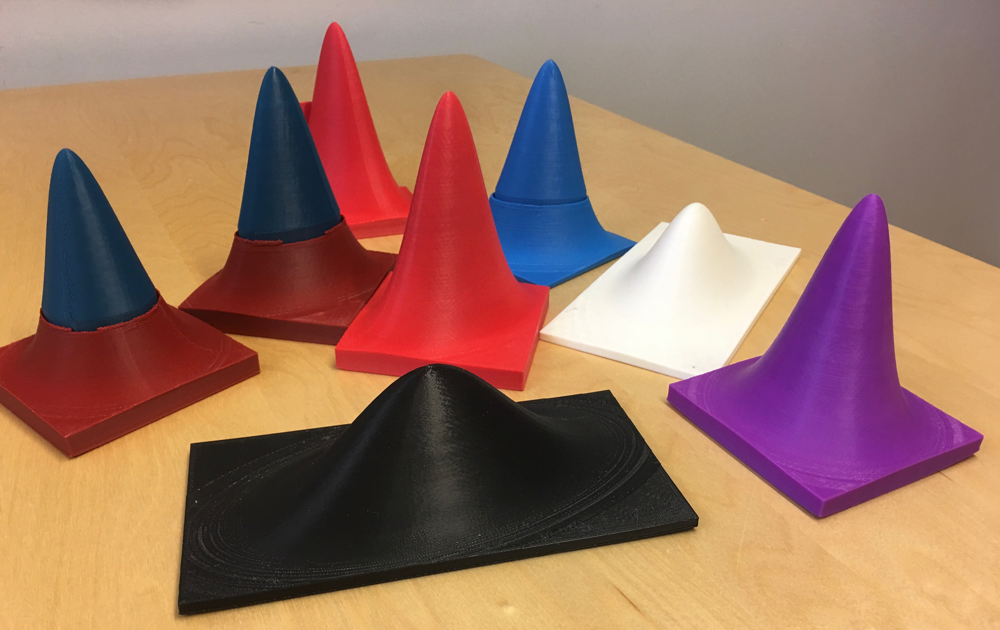

```{r setup, include=FALSE}
showsolA<-TRUE
showsolB<-TRUE
library(knitr)
opts_chunk$set(tidy.opts=list(width.cutoff=68),tidy=TRUE)
knitr::opts_chunk$set(echo = TRUE,tidy=TRUE,message=FALSE,warning=FALSE,strip.white=TRUE,prompt=FALSE,
                      cache=TRUE, size="scriptsize")
```

# Overview

\normalsize

* Random vectors,

* The covariance and correlation matrix and 

* The multivariate normal distribution

---

# Random vector

* A random vector $\mathbf{X}_{(p\times 1)}$ is a $p$-dimensional vector of random variables. 
    + Weight of cork deposits in $p=4$ directions (N, E, S, W).
    + Rent index in Munich: rent, area, year of construction, location, bath condition, kitchen condition, central heating, district.
* Joint distribution function: $f(\mathbf{x})$.
* From joint distribution function to marginal (and conditional distributions).
$$f_1(x_1)=\int_{-\infty}^{\infty}\cdots \int_{-\infty}^{\infty} f(x_1,x_2,\ldots,x_p)dx_2 \cdots dx_p$$
* Cumulative distribution (definite integrals!) used to calculate probabilites.
* Independence: $f(x_1,x_2)=f_1(x_1)\cdot f(x_2)$ and $f(x_1\mid x_2)=f_1(x_1).$

---

## Moments 
\vspace{2mm}

The moments are important properties about the distribution of $\mathbf{X}$. We will look at:

* E: Mean of random vector and random matrices.
* Cov: Covariance matrix.
* Corr: Correlation matrix.
* E and Cov of multiple linear combinations.

---

### The Cork deposit data

* Classical multivariate data set from Rao (1948).
* Weigth of bark deposits of $n=28$ cork trees in $p=4$ directions (N, E, S, W).

\tiny
```{r, echo=TRUE, eval=TRUE,size="tiny"}
corkds=as.matrix(
  read.table("https://www.math.ntnu.no/emner/TMA4268/2019v/data/corkMKB.txt")
  )
dimnames(corkds)[[2]]=c("N","E","S","W")
head(corkds)

dim(corkds)
```


---

 
* Here we have a random sample of $n=28$  cork trees from the population and observe a $p=4$ dimensional random vector for each tree.

* This leads us to the definition of random vectors and a random matrix for cork trees:

$$\mathbf{X}_{(28 \times 4)}=\left[ \begin{array}{cccc}X_{11} & X_{12} & X_{13}& X_{14}\\ X_{21} & X_{22} & X_{23}& X_{24}\\ X_{31} & X_{32} & X_{33}& X_{34}\\ \vdots & \vdots & \ddots & \vdots\\ X_{28,1} & X_{28,2} & X_{28,3}& X_{28,4}\\ \end{array} \right]$$

---

## Rules for means

* Random vector $\mathbf{X}_{(p\times 1)}$ with mean vector $\mathbf{\mu}_{(p\times 1)}$:

$$\mathbf{X}_{(p\times 1)}=\left[ \begin{array}{c}X_1\\ X_2\\ \vdots\\ X_p\\ \end{array}\right], \text{ and }\mathbf{\mu}_{(p \times 1)}=\text{E}(\mathbf{X})=\left[ \begin{array}{c}\text{E}(X_1)\\ \text{E}(X_2)\\ \vdots\\ \text{E}(X_p)\\ \end{array}\right]$$

  $\rightarrow$ Observe that $\text{E}(X_j)$ is calculated from the marginal distribution of $X_j$ and contains no information about dependencies between $X_{j}$ and $X_k$, $k\neq j$.

* Random matrix $\mathbf{X}_{(n\times p)}$ and random matrix $\mathbf{Y}_{(n\times p)}$:
$$\text{E}(\mathbf{X}+\mathbf{Y})=\text{E}(\mathbf{X})+\text{E}(\mathbf{Y})$$

(Rules of vector addition)

---

* Random matrix $\mathbf{X}_{(n\times p)}$ and conformable constant matrices $\mathbf{A}$ and $\mathbf{B}$:
$$\text{E}(\mathbf{A}\mathbf{X}\mathbf{B})=\mathbf{A}\text{E}(\mathbf{X})\mathbf{B}$$
Proof: Look at element $(i,j)$ of $\mathbf{A}\mathbf{X}\mathbf{B}$ 
$$e_{ij}=\sum_{k=1}^n a_{ik} \sum_{l=1}^p X_{kl}b_{lj}$$
(where $a_{ik}$ and $b_{lj}$ are elements of $\mathbf{A}$ and $\mathbf{B}$ respectively), and see that $\text{E}(e_{ij})$ is the element $(i,j)$ if $\mathbf{A}\text{E}(\mathbf{X})\mathbf{B}$.

**Q**: what are the univariate analog to this formula - that you studied in your first introductory course in statistics? What do you think happens if we look at $\text{E}(\mathbf{A}\mathbf{X}\mathbf{B})+\mathbf{d}$?

```{r, echo=FALSE, results='asis', eval=showsolB}
cat("
**A**: $$\\text{E}(aX+b)=a \\text{E}(X)+b$$
")
```

---

## The covariance
\vspace{2mm}

In the introductory statistics course we defined the covariance 
\begin{align*}
\rho_{ij} & =\text{Cov}(X_i,X_j)  =\text{E}[(X_i-\mu_i)(X_j-\mu_j)] \\
& =\text{E}(X_i \cdot X_j)-\mu_i\mu_j \ . 
\end{align*}

* What is the covariance called when $i=j$? 
* What does it mean when the covariance is
    + negative
    + zero
    + positive?
    
Make a scatter plot to show this.

---

## Variance-covariance matrix

* Consider random vector $\mathbf{X}_{(p\times 1)}$ with mean vector $\mathbf{\mu}_{(p\times 1)}$:
$$\mathbf{X}_{(p\times 1)} =\left[ \begin{array}{c} X_1\\ X_2\\ \vdots\\ X_p\\ \end{array} \right], \text{ and }\mathbf{\mu}_{(p\times 1)} =\text{E}(\mathbf{X})=\left[ \begin{array}{c} \text{E}(X_1)\\ \text{E}(X_2)\\ \vdots\\ \text{E}(X_p)\\ \end{array}\right]$$

* Variance-covariance matrix $\mathbf\Sigma$ (real and symmetric)
\begin{align*}
\mathbf\Sigma & =\text{Cov}(\mathbf{X})  
=\text{E}[(\mathbf{X}-\mathbf{\mu})(\mathbf{X}-\mathbf{\mu})^T] \\
& = \left[ \begin{array}{cccc} \sigma_{11} & \sigma_{12} & \cdots & \sigma_{1p}\\ \sigma_{12} & \sigma_{22} & \cdots & \sigma_{2p}\\ \vdots & \vdots & \ddots & \vdots\\ \sigma_{1p} & \sigma_{2p} & \cdots & \sigma_{pp}\\ \end{array}  \right] 
 = \text{E}(\mathbf{X}\mathbf{X}^T)-\mathbf{\mu}\mathbf{\mu}^T
\end{align*}


---


* The diagonal elements in $\mathbf\Sigma$, $\sigma_{ii}=\sigma_i^2$, are variances.

* The off-diagonal elements are covariances $\sigma_{ij}=\text{E}[(X_i-\mu_i)(X_j-\mu_j)]=\sigma_{ji}$.

* $\mathbf\Sigma$ is called variance, covariance and variance-covariance matrix and denoted both $\text{Var}(\mathbf{X})$ and $\text{Cov}(\mathbf{X})$.

---

### Exercise: the variance-covariance matrix
    
Let $\mathbf{X}_{4\times 1}$ have variance-covariance matrix
$$\mathbf\Sigma= \left[ \begin{array}{cccc} 2&1&0&0\\
      1&2&0&1\\
      0&0&2&1\\
      0&1&1&2\\
          \end{array}
          \right].$$
          
Explain what this means. 

---

### Correlation matrix
$~$

Correlation matrix $\mathbf{\rho}$ (real and symmetric)
$$\mathbf{\rho}=\left[ \begin{array}{cccc}
    \frac{\sigma_{11}}{\sqrt{\sigma_{11}\sigma_{11}}} &
    \frac{\sigma_{12}}{\sqrt{\sigma_{11}\sigma_{22}}} &
    \cdots &
    \frac{\sigma_{1p}}{\sqrt{\sigma_{11}\sigma_{pp}}}\\
    \frac{\sigma_{12}}{\sqrt{\sigma_{11}\sigma_{22}}} &
    \frac{\sigma_{22}}{\sqrt{\sigma_{22}\sigma_{22}}} &
    \cdots &
    \frac{\sigma_{2p}}{\sqrt{\sigma_{22}\sigma_{pp}}}\\
    \vdots & \vdots & \ddots & \vdots\\
      \frac{\sigma_{1p}}{\sqrt{\sigma_{11}\sigma_{pp}}} &
    \frac{\sigma_{2p}}{\sqrt{\sigma_{22}\sigma_{pp}}} &
    \cdots &
    \frac{\sigma_{pp}}{\sqrt{\sigma_{pp}\sigma_{pp}}}\\ \end{array}\right]=
 \left[ \begin{array}{cccc}
    1 & \rho_{12} & \cdots & \rho_{1p}\\
    \rho_{12} & 1 & \cdots & \rho_{2p}\\
    \vdots & \vdots & \ddots & \vdots\\
    \rho_{1p} & \rho_{2p} & \cdots & 1\\
\end{array}\right]$$

$$\mathbf{\rho}=(\mathbf{V}^{\frac{1}{2}})^{-1}
    \mathbf\Sigma(\mathbf{V}^{\frac{1}{2}})^{-1}, \text{   where    }
   \mathbf{V}^{\frac{1}{2}}=
 \left[ \begin{array}{cccc}
    \sqrt{\sigma_{11}} & 0& \cdots & 0\\
    0 & \sqrt{\sigma_{22}} & \cdots & 0\\
    \vdots & \vdots & \ddots & \vdots\\
    0 & 0 & \cdots & \sqrt{\sigma_{pp}}\\
\end{array} \right]$$

---

### Exercise: the correlation matrix

$~$

Let $\mathbf{X}_{4\times 1}$ have variance-covariance matrix
$$\mathbf\Sigma= \left[ \begin{array}{cccc} 2&1&0&0\\
      1&2&0&1\\
      0&0&2&1\\
      0&1&1&2\\
          \end{array}
          \right].$$
          Find the correlation matrix.
          
---

**A**: $$\rho=\left[ \begin{array}{cccc} 1&0.5&0&0\\
      0.5&1&0&0.5\\
      0&0&1&0.5\\
      0&0.5&0.5&1\\
          \end{array}
          \right]$$
          
---

### Linear combinations

$~$ 

Consider a random vector $\mathbf{X}_{(p\times 1)}$ with mean vector
    $\mathbf{\mu}=\text{E}(\mathbf{X})$ and
   variance-covariance matrix $\mathbf\Sigma=\text{Cov}(\mathbf{X})$.

The linear combinations 
$$\mathbf{Z}=\mathbf{C}\mathbf{X}=\left[ \begin{array}{c} \sum_{j=1}^p c_{1j}X_j\\ \sum_{j=1}^p c_{2j}X_j\\ \vdots \\ \sum_{j=1}^p c_{kj}X_j \end{array} \right]$$ 
have
$$\text{E}(\mathbf{Z})=\text{E}(\mathbf{C}\mathbf{X})=\mathbf{C}\mathbf{\mu}$$
$$\text{Cov}(\mathbf{Z})=\text{Cov}(\mathbf{C}\mathbf{X})=
   \mathbf{C}\mathbf\Sigma\mathbf{C}^T$$

[Proof](https://www.math.ntnu.no/emner/TMA4268/2018v/notes/CXproof.pdf)

**Exercise:** Study the proof - what are the most important transitions? (todo: study proof in Stahel and perhaps show on board)

---

### Exercise: Linear combinations

$$\mathbf{X}=\left[ \begin{array}{c} X_N\\
          X_E\\
X_S\\
          X_W\\
          \end{array}
          \right]k
          \mathbf{\mu}=\left[
      \begin{array}{c} \mu_N\\
          \mu_E\\
\mu_S\\
          \mu_W\\
          \end{array}
          \right], \text{ and } \mathbf\Sigma=\left[ \begin{array}{cccc}
    \sigma_{NN} & \sigma_{NE} & \sigma_{NS} & \sigma_{NW}\\
    \sigma_{NE} & \sigma_{EE} & \sigma_{ES}& \sigma_{EW}\\
        \sigma_{NS} & \sigma_{EE} & \sigma_{SS}& \sigma_{SW}\\
    \sigma_{NW} & \sigma_{EW} & \sigma_{SW} & \sigma_{WW}\\
\end{array} \right]$$

Scientists would like to compare the following three _contrasts_: N-S, E-W and (E+W)-(N+S),
and define a new random vector $\mathbf{Y}_{(3\times 1)}=\mathbf{C}_{(3\times 4)} \mathbf{X}_{(4\times 1)}$ giving the three contrasts.

* Write down $\mathbf{C}$.
* Explain how to find $\text{E}(Y_1)$ and $\text{Cov}(Y_1,Y_3)$.
* Use R to find the mean vector, covariance matrix and correlations matrix of $\mathbf{Y}$, when the mean vector and covariance matrix for $\mathbf{X}$ is given below.

---

\tiny

```{r,eval=TRUE,echo=TRUE,results="hold"}
corkds <- as.matrix(read.table("https://www.math.ntnu.no/emner/TMA4268/2019v/data/corkMKB.txt"))
dimnames(corkds)[[2]] <- c("N","E","S","W")
mu=apply(corkds,2,mean)
mu
Sigma=var(corkds)
Sigma
```

```{r,eval=TRUE,echo=TRUE,results="hold"}

(C <- matrix(c(1,0,-1,0,0,1,0,1,-1,1,-1,1),byrow=T,nrow=3))
```

```{r,eval=TRUE,echo=TRUE,results="hold"}
C %*% Sigma %*% t(C)
```

---

### The covariance matrix - more requirements?
$~$

Random vector $\mathbf{X}_{(p\times 1)}$ with mean vector $\mathbf{\mu}_{(p\times 1)}$ and covariance matrix
$$\mathbf\Sigma=\text{Cov}(\mathbf{X})=\text{E}[(\mathbf{X}-\mathbf{\mu})(\mathbf{X}-\mathbf{\mu})^T]=
\left[ \begin{array}{cccc}
    \sigma_{11} & \sigma_{12} & \cdots & \sigma_{1p}\\
    \sigma_{12} & \sigma_{22} & \cdots & \sigma_{2p}\\
    \vdots & \vdots & \ddots & \vdots\\
    \sigma_{1p} & \sigma_{2p} & \cdots & \sigma_{pp}\\
\end{array} \right]$$

---


* The covariance matrix is by construction symmetric, and it is common to require that the covariance matrix is positive semidefinite. This means that, for every vector $\mathbf{b}\neq \mathbf{0}$

$$\mathbf{b}^T \mathbf{\Sigma} \mathbf{B} \geq 0 \ .$$


* Why do you think that is?


Hint: Is it possible that the variance of the linear combination $\mathbf{Y}=\mathbf{b}^T\mathbf{X}$ is negative? 

---

## Multiple choice - random vectors
\vspace{2mm}

Choose the correct answer - time limit was 30 seconds for each question! Let's go!

### Question 1: Mean of sum
\vspace{2mm}

$\mathbf{X}$ and $\mathbf{Y}$ are two bivariate random vectors with $\text{E}(\mathbf{X})=(1,2)^T$
and $\text{E}(\mathbf{Y})=(2,0)^T$. What is $\text{E}(\mathbf{X}+\mathbf{Y})$?

* A: $(1.5,1)^T$
* B: $(3,2)^T$
* C: $(-1,2)^ T$
* D: $(1,-2)^T$

---

### Question 2: Mean of linear combination
\vspace{2mm}

$\mathbf{X}$ is a 2-dimensional random vector with $\text{E}(\mathbf{X})=(2,5)^T$ , and $\mathbf{b}=(0.5, 0.5)^T$ is a constant vector. What is $\text{E}(\mathbf{b}^T\mathbf{X})$?

* A: 3.5
* B: 7
* C: 2
* D: 5 

---

### Question 3: Covariance
\vspace{2mm}

$\mathbf{X}$ is a $p$-dimensional random vector with mean $\mathbf{\mu}$. Which of the following defines the covariance matrix?

* A: $E[(\mathbf{X}-\mathbf{\mu})^T(\mathbf{X}-\mathbf{\mu})]$ 
* B: $E[(\mathbf{X}-\mathbf{\mu})(\mathbf{X}-\mathbf{\mu})^T]$ 
* C: $E[(\mathbf{X}-\mathbf{\mu})(\mathbf{X}-\mathbf{\mu})]$  
* D: $E[(\mathbf{X}-\mathbf{\mu})^T(\mathbf{X}-\mathbf{\mu})^T]$

---

### Question 4: Mean of linear combinations
\vspace{2mm}

$\mathbf{X}$ is a $p$-dimensional random vector with mean $\mathbf{\mu}$
and covariance matrix $\mathbf\Sigma$. $\mathbf{C}$ is a constant matrix. 
What is then the mean of the $k$-dimensional random vector $\mathbf{Y}=\mathbf{C}\mathbf{X}$?

* A: $\mathbf{C}\mathbf{\mu}$
* B: $\mathbf{C}\mathbf\Sigma$
* C: $\mathbf{C}\mathbf{\mu}\mathbf{C}^T$
* D: $\mathbf{C}\mathbf\Sigma\mathbf{C}^T$

---

### Question 5: Covariance of linear combinations
\vspace{2mm}

$\mathbf{X}$ is a $p$-dimensional random vector with mean $\mathbf{\mu}$
and covariance matrix $\mathbf\Sigma$. $\mathbf{C}$ is a constant matrix. 
What is then the covariance of the $k$-dimensional random vector $\mathbf{Y}=\mathbf{C}\mathbf{X}$?

* A: $\mathbf{C}\mathbf{\mu}$
* B: $\mathbf{C}\mathbf\Sigma$
* C: $\mathbf{C}\mathbf{\mu}\mathbf{C}^T$
* D: $\mathbf{C}\mathbf\Sigma\mathbf{C}^T$

---

### Question 6: Correlation
\vspace{2mm}

$\mathbf{X}$ is a $2$-dimensional random vector with
covariance matrix 
\[ \mathbf\Sigma= \left[\begin{array}{cc}
          4 & 0.8 \\
          0.8 & 1\\
      \end{array}
    \right]\]
Then the correlation between the two elements of $\mathbf{X}$ are:

* A: 0.10
* B: 0.25
* C: 0.40
* D: 0.80

---

```{r, echo=FALSE, results='asis', eval=showsolB}
cat("
## Answers: 
1B, 2A, 3B, 4A, 5D, 6C 
")
```

---

# The multivariate normal distribution
\vspace{2mm}

Why is the mvN so popular?

* Many natural phenomena may be modelled using this distribution (just as in the univariate case).
* Multivariate version of the central limit theorem- the sample mean will be approximately multivariate normal for large samples.
* Good interpretability of the covariance.
* Mathematically tractable.
* Building block in many models and methods.


---

\centering
{width=80%}


3D multivariate Normal distributions

---

## The multivariate normal (mvN) pdf
\vspace{2mm}

The random vector $\mathbf{X}_{p\times 1}$ is multivariate normal $N_p$ with mean $\mathbf{\mu}$ and (positive definite) covariate matrix $\mathbf\Sigma$. The pdf is:

$$f(\mathbf{x})=\frac{1}{(2\pi)^\frac{p}{2}|\mathbf\Sigma|^\frac{1}{2}} \exp\{-\frac{1}{2}(\mathbf{x}-\mathbf{\mu})^T\mathbf\Sigma^{-1}(\mathbf{x}-\mathbf{\mu})\}$$

**Questions**: 

* How does this compare to the univariate version?
$$f(x)=\frac{1}{\sqrt{2\pi}\sigma}\exp\{ \frac{1}{2\sigma^2}(x-\mu)^2\}$$

* Why do we need the constant in front of the $\exp$?
* What is the dimension of the part in $\exp$? 

* What happens if the determinant $|\mathbf\Sigma| = 0$?

---

## Six useful properties of the mvN
\vspace{2mm}

Let $\mathbf{X}_{(p\times 1)}$ be a random vector from $N_p(\mathbf{\mu},\mathbf\Sigma)$.

1. The grapical contours of the mvN are ellipsoids (can be shown using spectral decomposition).

2. Linear combinations of components of $\mathbf{X}$ are (multivariate) normal 

3. All subsets of the components of $\mathbf{X}$ are (multivariate) normal (special case of the above).

4. Zero covariance implies that the corresponding components are independently distributed (in contrast to general distributions).


---

All of these are proven in TMA4267 Linear Statistical Models. 

The result 4 is rather useful! If you have a bivariate normal and observed covariance 0, then your variables are independent.

---
  
## Contours of multivariate normal distribution
\vspace{2mm}

* Contours of constant density for the $p$-dimensional normal distribution are ellipsoids defined by $\mathbf{x}$ such that
$$ (\mathbf{x}-\mathbf{\mu})^T\mathbf\Sigma^{-1}(\mathbf{x}-\mathbf{\mu})=b $$
where $b>0$ is a constant.

* These ellipsoids are centered at $\mathbf{\mu}$ and have axes $\pm \sqrt{b \lambda_i}\mathbf{e}_i$, where $\mathbf\Sigma\mathbf{e}_i=\lambda_i \mathbf{e}_i$, for $i=1,...,p$.

* To see this the spectral decomposition of the covariance matrix is useful.

* $(\mathbf{x}-\mathbf{\mu})^T\mathbf\Sigma^{-1}(\mathbf{x}-\mathbf{\mu})$ is distributed as $\chi^2_p$.

<!-- * The volume inside the ellipsoid of $\mathbf{x}$ values satisfying -->
<!-- $$ (\mathbf{x}-\mathbf{\mu})^T\mathbf\Sigma^{-1}(\mathbf{x}-\mathbf{\mu}) \le \chi^2_p(\alpha) $$ -->
<!-- has probability $1-\alpha$. -->

---

Note: 

_In M4: Classification the mvN is very important and we will often draw contours of the mvN as ellipses- and this is the reason why we do that. _


---

## Identify the mvNs from their contours
\vspace{4mm}

Let $\mathbf\Sigma=\left[\begin{array}{cc} \sigma_x^2 & \rho\sigma_{x}\sigma_{y}\\\rho\sigma_{x}\sigma_{y}&\sigma_y^2\\ \end{array} \right]$.

\vspace{4mm}
The following four figure contours have been generated:

* 1: $\sigma_x=1$, $\sigma_y=2$, $\rho=-0.3$
* 2: $\sigma_x=1$, $\sigma_y=1$, $\rho=0$
* 3: $\sigma_x=1$, $\sigma_y=1$, $\rho=0.5$
* 4: $\sigma_x=1$, $\sigma_y=2$, $\rho=0$

\vspace{8mm}

**Match the distributions to the figures on the next slide.** 


---

```{r cont,  echo=FALSE, fig.width=6, fig.height=6,fig.align = "center",out.width='65%'}
library(mvtnorm)
library(ggpubr)
x.points <- seq(-4,4,length.out=100)
y.points <- x.points
z <- matrix(0,nrow=100,ncol=100)
mu <- c(0,0)
sigmax <- 1
sigmay <- 2
rho <- -0.3

plot_cont <- function(sigmax,sigmay,rho){

sigma <- matrix(c(sigmax^2,sigmax*sigmay*rho,sigmax*sigmay*rho,sigmay^2),nrow=2)

for (i in 1:100) {
for (j in 1:100) {
  z[i,j] <- dmvnorm(c(x.points[i],y.points[j]),
  mean=mu,sigma=sigma)
 }
}
contour(x.points,y.points,z,xlim=c(-4.5,4.5),ylim=c(-4.5,4.5))
}

par(mfrow=c(2,2),oma=c(0,0,0,0),mar=c(0,0,0,0))
 
plot_cont(1,1,0)
text(-4,4,labels="A",cex=2)

plot_cont(1,1,0.5)
text(-4,4,labels="B",cex=2)

plot_cont(1,2,-0.3)
text(-4,4,labels="C",cex=2)

plot_cont(1,2,0)
text(-4,4,labels="D",cex=2)
```

Take a look at the contour plots - when are the contours circles, when ellipses?


---


## Multiple choice - multivariate normal
\vspace{2mm}

Choose the correct answer - time limit was 30 seconds for each question! Let's go!

\vspace{2mm}

### Question 1: Multivariate normal pdf
\vspace{2mm}

The probability density function is 
$(\frac{1}{2\pi})^\frac{p}{2}\det(\mathbf\Sigma)^{-\frac{1}{2}}\exp\{-\frac{1}{2}Q\}$ where $Q$ is

* A: $(\mathbf{x}-\mathbf{\mu})^T\mathbf\Sigma^{-1}(\mathbf{x}-\mathbf{\mu})$
* B: $(\mathbf{x}-\mathbf{\mu})\mathbf\Sigma(\mathbf{x}-\mathbf{\mu})^T$
* C: $\mathbf\Sigma-\mathbf{\mu}$

---

### Question 2:  Trivariate normal pdf
\vspace{2mm}

What graphical form has the solution to $f(\mathbf{x})=$ constant?

* A: Circle
* B: Parabola
* C: Ellipsoid
* D: Bell shape

---

### Question 3: Multivariate normal distribution
\vspace{2mm}

$\mathbf{X}_p \sim N_p(\mathbf{\mu},\mathbf\Sigma)$, and 
$\mathbf{C}$ is a $k \times p$ constant matrix. $\mathbf{Y}=\mathbf{C}\mathbf{X}$ is

* A: Chi-squared with $k$ degrees of freedom
* B: Multivariate normal with mean $k\mathbf{\mu}$
* C: Chi-squared with $p$ degrees of freedom
* D: Multivariate normal with mean $\mathbf{C}\mathbf{\mu}$

---

### Question 4: Independence
\vspace{2mm}

 Let $\mathbf{X}\sim N_3(\mathbf{\mu},\mathbf\Sigma)$, with
$$\mathbf\Sigma= \left[     
\begin{array}{ccc} 1&1&0\\
      1&3&2\\
      0&2&5\\
          \end{array}
          \right].$$
Which two variables are independent?

* A: $X_1$ and $X_2$
* B: $X_1$ and $X_3$
* C: $X_2$ and $X_3$
* D: None -- but two are uncorrelated.

---

### Question 5: Constructing independent variables?
\vspace{2mm}

Let $\mathbf{X}\sim N_p(\mathbf{\mu},\mathbf\Sigma)$. How can I construct a vector of independent standard normal variables from $\mathbf{X}$?

* A: $\mathbf\Sigma(\mathbf{X}-\mathbf{\mu})$
* B: $\mathbf\Sigma^{-1}(\mathbf{X}+\mathbf{\mu})$
* C: $\mathbf\Sigma^{-\frac{1}{2}}(\mathbf{X}-\mathbf{\mu})$
* D: $\mathbf\Sigma^{\frac{1}{2}}(\mathbf{X}+\mathbf{\mu})$


---

```{r, echo=FALSE, results='asis', eval=showsolB}
cat("
## Answers: 
1A 2C 3D 4B 5C 
")
```


---


# <a id="further"> Further reading/resources</a>

* [Videoes on YouTube by the authors of ISL, Chapter 2](https://www.youtube.com/playlist?list=PL5-da3qGB5IDvuFPNoSqheihPOQNJpzyy)


# Session info

\tiny
```{r eval=TRUE,include=TRUE}
devtools::session_info()$packages
```


# Acknowledgements

Thanks to Mette Langaas, who developed the first slide set in 2018 and 2019, and to Julia Debik for contributing to this module.

