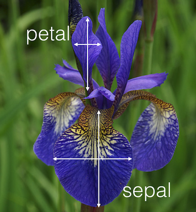

```{r setup, include=FALSE}
showsolA<-TRUE
showsolB<-TRUE
library(knitr)
opts_chunk$set(tidy.opts=list(width.cutoff=68),tidy=TRUE)
knitr::opts_chunk$set(echo = TRUE,tidy=TRUE,message=FALSE,warning=FALSE,strip.white=TRUE,prompt=FALSE,
                      cache=TRUE, size="scriptsize")
whichformat="latex"
```

# Introduction

## Learning material for this module

* James et al (2013): An Introduction to Statistical Learning. Chapter 4.  

We need more statistical theory than is presented in the textbook, which you find in this module page.

\vspace{2mm}

Some of the figures and slides in this presentation are taken (or are inspired) from “An Introduction to Statistical Learning, with applications in R” (Springer, 2013) with permission from the authors: G. James, D. Witten, T. Hastie and R. Tibshirani.

<!-- --- -->

<!-- ### Will be added after the lectures -->

<!-- * [Classnotes 28.01.2019](https://www.math.ntnu.no/emner/TMA4268/2019v/notes/M4L1notes.pdf). -->
<!-- * [Classnotes 31.01.2019](https://www.math.ntnu.no/emner/TMA4268/2019v/notes/M4L2notes.pdf).   -->

<!-- ### Move to -->

<!-- * [Part A: Introduction to classification, and modelling class densities ](#PartA) -->
<!-- * [Part B: Modelling posterior probabilites, ROC/AUC and comparions](#PartB) -->

---

## Topics in this module

**Part A: Introduction to classification, and modelling class densities **

* Aim of this module
* What is classification and what is discrimination?
* Loss function and the Bayes classifier 
* Modelling class densities
    + Linear discriminant analysis
    + Quadratic discriminant analysis
    + Naive Bayes (optional)
* Modelling posterior probabilities
    + KNN-classifier

---

**Part B: Modelling posterior probabilites, ROC/AUC and comparisions **

* Modelling posterior probabilities (cont.)
    + Linear regression for classification problems
    + Logistic regression
* Sensitivity, specificity, ROC and AUC
* Comparisons
* Extensions

---

<!-- \Large -->

<!-- **<a id="PartA">Part A</a> ** -->
<!-- \normalsize -->

<!-- ## What will you learn? -->

<!-- * What is classification and discrimination? -->
<!-- * What is the Bayes classifier and the Bayes risk? -->
<!-- * What is the sampling paradigm and what is modelled then? -->
<!-- * Linear discriminant analysis: model, method, results. -->
<!-- * Quadratic discriminant analysis: model, method, results. -->
<!-- * Naive Bayes - when and why? -->
<!-- * That is the diagnostic paradigm and what is modelled then? -->
<!-- * KNN - majority vote or estimate posterior class probability? -->

<!-- --- -->

# What is classification?
\vspace{2mm}

* By now our responses $Y$ was assumed _continuous_, while covariates were allowed to be _categorical_.

* Now we allow the response to be _categorical_.

* This is even more common than continuous responses. Examples:
    + Spam filters `email` $\in$ \{spam, ham\},
    + `Eye color` $\in$ \{blue, brown, green\}.
    + `Medical condition` $\in$ \{disease1, disease2, disease3\}.
    
<!-- *  Given a feature vector $X$ and a qualitative response $Y$ -->
<!-- taking values in the set $\mathcal{C}$, the classification task is to build -->
<!-- a function $C(X)$ that takes as input the feature vector $X$ -->
<!-- and predicts its value for $Y$; i.e. $C(X) \in \mathcal{C}$. -->


---

* Suppose we have a qualititative response value that can be a member in one of $K$ classes $\mathcal{C} = \{c_1, c_2, \ldots , c_K\}$. 

* In classification we build a function $f(X)$ that takes a vector of input variables $X$ and predicts its class membership, such that $Y \in \mathcal{C}$.

* We would also assess the _uncertainty_ in this classification. Sometimes the role of the different predictors may be of main interest. 

* We often build models that **predict probabilities of categories**, _given_ certain covariates $X$.

<!-- Discrimination: also focus on describing the class boundaries using _discriminant functions_. -->


<!-- --- -->

<!-- # Discrimination and classification -->

<!-- * Discrimination is concerned with the description and the separation of the classes and  -->
<!-- * classification with the allocation and the assignment of observations to predefined classes.  -->
<!-- * The two tasks are closely related and often overlap.   -->

---

### Example: The credit card data

The `Default` dataset is available from the ISLR package. 

\vspace{2mm}
{\bf Aim}: to predic whether an individual will default on his or her credit card payment, given the annual income and credit card balance. 

\textcolor{orange}{Orange: default=yes}, \textcolor{blue}{blue: default=no}.

\vspace{0mm}
 \centering
{width=50%}
 


---

## General classification setup

$~$

**Set-up:** Training observations $\{(x_1, y_1), ..., (x_n, y_n)\}$ where the response variable $Y$ is categorical, e.g $Y \in \mathcal{C} = \{0, 1, ..., 9\}$ or $Y \in \mathcal{C} = \{dog, cat,... ,horse\}$. 

$~$

**Aim: **
To _build_ a classifier $f(X)$ that assigns a class label from $\mathcal{C}$ to a future unlabelled observation $x$ and to asses the _uncertainty_ in this classification. 

$~$

**Performance measure:** Most popular is the misclassification error rate (training and test version).

---

### Training error

* **Training error rate**:
The proportion of mistakes that are made if we apply our estimator $\hat{f}$ to the training observations, i.e. $\hat{y}_i=\hat{f}(x_i)$ 
$$\frac{1}{n}\sum_{i=1}^n \text{I}(y_i \neq \hat{y}_i) \ ,$$
with indicator function I, which is defined as: 

$$\text{I}(a\neq\hat{a}) = \begin{cases} 1 \text{ if } a \neq \hat{a} \ , \\ 
0 \text{ else. } \end{cases}$$

* The indicator function counts the number of times our model has made a wrong classification. The training error rate is the fraction of misclassifications made on our training set. 

* A very low training error rate may imply overfitting.

---

### Test error

* **Test error rate**: The fraction of misclassifications when our model is applied on a test set
$$\text{Ave}(I(y_0\neq \hat{y}_0)) \ ,$$
where the average is over all the test observations $(x_0,y_0)$.

* Again, this gives a better indication of the true performance of the classifier (than the training error).

* We assume that a _good_ classifier is a classifier that has a _low_ test error.


---

## What are the methods?

$~$ 

**Three methods for classification** are discussed here:


* Logistic regression

* Linear and quadratic discriminant analysis

* $K$-nearest neighbours


---

## Linear regression for binary classification?

Suppose we have a binary outcome, for example whether a credit card user defaults $Y =$ `yes` or `no`, given covariates $X$ to predict $Y$. We could use _dummy encoding_ for $Y$ like

$$Y = \left\{ \begin{array}{ll}
0 & \text{if } \texttt{no} \ , \\
1 & \text{if } \texttt{yes} \ .
\end{array} \right.$$
Can we simply perform a linear regression of $Y$ on $X$ and
classify as `yes` if $\hat{Y}> 0.5$? 

* In this case of a binary outcome, linear regression does a
good job as a classifier, and is equivalent to linear
discriminant analysis which we discuss later.

* Since in the population $\text{E}(Y \mid X = x) = \text{Pr}(Y = 1 \mid X = x)$,
we might think that regression is perfect for this task.

* However, linear regression might produce probabilities less
than zero or bigger than one. 

$\rightarrow$ We need to use **logistic regression**.


--- 

### Linear vs. logistic regression

$~$

Let's anticipate a bit, to see why linear regression does not so well. We estimate the probability that someone defaults, given the credit card balance as predictor:
\vspace{2mm}


---

## Linear regression for categorical classification?

$~$

What when there are more than two possible outcomes? For example, a medical diagnosis $Y$, given predictors $X$ can be categorized as

$~$

$$Y = \left\{ \begin{array}{ll}
1 & \text{if } \texttt{stroke} \ , \\
2 & \text{if } \texttt{drug overdose} \ , \\
3 & \text{if } \texttt{epileptic seizure} \ .
\end{array} \right.$$

$~$

This suggests an ordering, but this is artificial.

$~$

* Linear and logistic regression are not appropriate here.
* We need _Multiclass logistic regression_ and _Discriminant Analysis_. 


---

### However:


* It is still possible to use linear regression for classification problems with two classes. It is actually not even a bad idea, and works well under some conditions. If the conditional class densities are (multivariate) normal with equal covariance matrices then this linear regression (with 0 and 1 response) will in fact give the same classification as linear discriminatn analysis (LDA). 

* For categorical outcomes with more than two level, it requires some extra work (multivariate $Y$ due to the dummy variable coding). 

* We leave linear regression for now.


* For two classes _binary regression_, in particular _logistic regression_, is very popular - and is up next.

---


# Logistic regression 

* In logistic regression we consider a classification problem with two classes.


* Assume that $Y$ is coded ($\mathcal{C} = \{1, 0\}$ or \{success, failure\}), and we focus on success $(Y=1)$. 

* We may assume that $Y_i$ follows a **Bernoulli distribution** with probability of success $p_i$.

$$Y_i = \begin{cases} 1 \text{ with probability } p_i, \\ 0 \text{ with probability } 1-p_i. \end{cases}$$

* We need a clever way to _link_ our covariates $X_1, \ldots, X_p$ with this probability $p_i$. Aim: want to relate the _linear predictor_
$$\eta_i = \beta_0 + \beta_1 x_{i1} + \ldots + \beta_p x_{ip}$$ 
to $P(X)=P(Y=1 \mid X)$. How?

---

* The idea is to use a so-called _link-function_ to link $p_i = P(X_i)$ with the linear predictor. 

* In logistic regression, we use the _logistic link function_

\begin{center}
\colorbox{lightgray}{\begin{minipage}{10cm}
\begin{equation}
\log\left( \frac{p_i}{1-p_i} \right) = \beta_0 + \beta_1 x_{i1} + \beta_2 x_{i2} + \ldots + \beta_p x_{ip} \ .
\end{equation}
\end{minipage}}
\end{center}

* **Q:** What is the rationale behind this? Other transformations that bring the linear predictor into a $0$ to $1$ range?


---

### Logistic regression with one covariate

* Equation (1) can be rearranged and solved for $p_i$. Let's look at this for only one covariate: 

$$ p_i= \frac{e^{\beta_0+\beta_1 x_i}}{1 + e^{\beta_0 + \beta_1 x_i}}.$$

* **Important:** These values $p_i$ will always lie in the interval between 0 and 1, with an S-shaped curve. 

* The parameter $\beta_1$ determines the rate of increase or decrease of the S-shaped curve, and the sign indicates whether the curve ascends or descends. 


---

### Example: `Default` credit card data
\vspace{2mm}

* The parameters are estimated using the method of maximum likelihood - we will look at that soon.

* Let's first do it! In R, this works with the `glm()` function, where we specify `family="binomial"`. 

\vspace{2mm}

\scriptsize
```{r, echo=T}
library(ISLR)
Default$default <- as.numeric(Default$default)-1
glm_default = glm(default~balance, data=Default, family="binomial")

summary(glm_default)$coef
```

---

Plotting the fitted line (in blue):

```{r defaultglm, echo=FALSE, fig.width=5, fig.height=3,fig.align = "center",out.width='70%'}
library(ggplot2)
glm_alpha = coef(glm_default)[1]
glm_beta = coef(glm_default)[2]

ggglm = ggplot(Default, aes(x=balance, y=default))+geom_point() + 
  geom_line(aes(x=balance, y=exp(glm_alpha+glm_beta*balance)/
                  (1+exp(glm_alpha+glm_beta*balance))), col="blue")


ggglm
```

Default data: here $\hat{\beta}_0=$ `r round(glm_alpha,2)` and $\hat{\beta}_1=$ `r round(glm_beta,3)`.


---

### Estimating the regression coefficients with ML

* The coefficients $\beta_0, \beta_1, \ldots$ are estimated with _maximum likelihood_ (ML).

* We assume that pairs of covariates and responses  $\{{\bf x}_i, y_i\}$ are measured independently of each other. Given $n$ such observation pairs, the likelihood function of a logistic regression model can be written as:
$$L(\boldsymbol{\beta}) = \prod_{i=1}^n L_i(\boldsymbol{\beta}) = \prod_{i=1}^n f(y_i; \boldsymbol{\beta}) = \prod_{i=1}^n (p_i)^{y_i}(1-p_i)^{1-y_i},$$
where $\boldsymbol{\beta} = (\beta_0, \beta_1, \beta_2, \ldots, \beta_p)^T$ enters into $p_i$

$$p_i= \frac{\exp(\beta_0+\beta_1 x_{i1}+\cdots + \beta_p x_{ip})}{1 + \exp(\beta_0 + \beta_1 x_{i1}+\cdots+\beta_p x_{ip})} \ .$$

---

* The maximum likelihood estimates are found by maximizing the likelihood.

* To make the math easier, we usually work with the log-likelihood (the log is a monotone transform, thus it will give the same result as maximizing the likelihood).

\vspace{-4mm}

\begin{align*} \log(L(\boldsymbol{\beta}))&=l(\boldsymbol{\beta}) =\sum_{i=1}^n \Big ( y_i \log p_i + (1-y_i) \log(1 - p_i )\Big ) \\ &= \sum_{i=1}^n \Big ( y_i \log \Big (\frac{p_i}{1-p_i} \Big) + \log(1-p_i) \Big ) \\
&= \sum_{i=1}^n \Big (y_i (\beta_0 + \beta_1 x_{i1}+\cdots + \beta_p x_{ip}) - \log(1 + e^{\beta_0 + \beta_1 x_{i1}+\cdots + \beta_p x_{ip}} \Big ).\end{align*}

---

* To maximize the log-likelihood function we find the $r+1$ partial derivatives, and set equal to 0. 

* This gives us a set of $p+1$ non-linear equations in the $\beta$s.

* This set of equations does not have a closed form solution.

* The equation system is therefore solved numerically using the _Newton-Raphson algorithm_ (or Fisher Scoring).


---

### Qualitative interpretation of the coefficients  

$~$

Let's again look at the regression output:

\scriptsize
```{r, echo=T}
summary(glm_default)$coef
```


\normalsize

* The $z$-statistic is equal to $\frac{\hat\beta}{SE(\hat\beta)}$, and is approximately $N(0,1)$ distributed\footnote{With this knowledge we can construct confidence intervals and test hypotheses about the $\beta$s, with the aim to understand which covariate(s) contribute to our posterior probabilites and classification.}

* The $p$-value is $\text{Pr}(|Z| > |z|)$ for a $Z\sim N(0,1)$ random variable

* `Balance` seems an important predictor for `Default` (yes/no), with a higher balance leading to a higher probability of defaulting ($\beta_1>0$).

---

### Quantitative interpretation of the coefficients  

\vspace{2mm}
Remember from equation (1) that

\begin{equation*}
\log\left( \frac{p_i}{1-p_i} \right) = \beta_0 + \beta_1 x_{i1} + \beta_2 x_{i2} + \ldots + \beta_p x_{ip} \ ,
\end{equation*}

thus

\begin{equation*}
 \frac{p_i}{1-p_i} = e^{\beta_0 + \beta_1 x_{i1} + \beta_2 x_{i2} + \ldots + \beta_p x_{ip}} = e^\eta_i \ .
\end{equation*}

\vspace{2mm}

The quantity $p_i/(1-p_i)$ is called the _\textcolor{red}{odds}_. Odds represent _\textcolor{red}{chances}_ (e.g. in betting).

$~$

1. You think your football team will win tonight with a probability $p=80\%$. What is the odds that it will win?

2. The odds for the best horse in a race is $9:1$. What is the probability that this horse will win?


---

### Why is the odds relevant? 

\vspace{2mm}
Let's again rearrange the _odds_ in the logistic regression model:

\begin{align*}
 \frac{p_i}{1-p_i} = \text{odds}(Y_i=1 \mid X=x)  & = \frac{\text{P}(Y_i=1 \mid X=x)}{\text{P}(Y_i=0 \mid X = x)} \\
 &= \exp(\beta_0) \cdot \exp(\beta_1 x_{i1}) \cdot \ldots \cdot  \exp(\beta_p x_{ip}) \ .
 \end{align*}

$~$
<!-- \begin{align*} -->
<!-- \eta_i&= \beta_0+\beta_1 x_{i1}+\beta_2 x_{i2}+\cdots + \beta_p x_{ip}\\ -->
<!-- p_i&= \frac{\exp(\eta_i)}{1+\exp(\eta_i)}\\ -->
<!-- \eta_i&=\ln(\frac{p_i}{1-p_i})\\ -->
<!-- \ln(\frac{p_i}{1-p_i})&=\beta_0+\beta_1 x_{i1}+\beta_2 x_{i2}+\cdots + \beta_p x_{ip}\\ -->
<!-- \frac{p_i}{1-p_i}=&\frac{P(Y_i=1|{\bf x}_i)}{P(Y_i=0|{\bf x}_i)}=\exp(\beta_0)\cdot \exp(\beta_1 x_{i1})\cdots\exp(\beta_p x_{ip}) -->
<!-- \end{align*} -->

$\rightarrow$ We have a _multiplicative model_ for the odds - which can help us to interpret our $\beta$s.

---

### The odds ratio

$~$

To understand the effect of a regression coefficient $\beta_j$, let's see what happens if we increase $x_{ij}$ to $x_{ij}+1$, while all other covariates are kept fixed.

\vspace{2mm}
Using simple algebra and the formula on the previous slide, you will see that

\begin{equation}
\frac{\text{odds}(Y_i=1 \mid X_{j} = x_{ij} + 1)}{\text{odds}(Y_i=1 \mid X_j = x_{ij})} = \exp(\beta_j)  \ .
\end{equation}

\vspace{2mm}

\begin{center}
\colorbox{lightgray}{\begin{minipage}{11cm}
{\bf Interpretation}: 
By increasing covariate $x_{ij}$ by one unit, we change the odds ratio for $Y_i=1$ by a factor $\exp(\beta_j)$.
\end{minipage}}
\end{center}

\begin{center}
\colorbox{lightgray}{\begin{minipage}{11cm}
{\bf Moreover}:
Taking the log on equation (2), it follows that $\beta_j$ can be interpreted as a {\bf log odds-ratio}.
\end{minipage}}
\end{center}

---

Let's now fit the logistic regression model for `default`, given `balance`, `income` and the binary variable `student` as predictors:

\scriptsize
```{r, echo=T}
glm_default2 = glm(default~balance + income + student, data=Default, family="binomial")

summary(glm_default2)$coef
```

\normalsize

**Questions:**

* What happens with the odds-ratio when `income` increases by 10'000 dollars?

<!-- $\rightarrow$ The odds ratio to default increases by a factor $\exp(10000\cdot \beta_{\text{income}})=$ `r round(exp(summary(glm_default2)$coef[3,1]*10000),2)` -->

* What happens with the odds-ratio when `balance` increases by 100 dollars?

<!-- $\rightarrow$ The odds ratio to default increases by a factor $\exp(100 \cdot \beta_{\text{balance}})=$ `r round(exp(summary(glm_default2)$coef[2,1]*1000),2)` -->


---

## Predictions

\vspace{2mm}

Let's catch up. Why were we doing all this in the first place?

\vspace{2mm}

**Answer:** We wanted to build a model that **predict probabilities of categories**, _given_ certain covariates $X$.

\vspace{4mm}
 
* For given parameter estimates $\hat\beta_0, \hat\beta_1, \ldots \hat\beta_p$ and a new observation ${\bf x}_0$, we can estimate the probability $\hat{p}({\bf x}_0)$ that the new observation belongs to the class defined by $Y=1$

$$\hat{p}({\bf x}_0) = \frac{e^{\hat{\eta}_0}}{1+e^{\hat{\eta}_0}} \ , $$

with linear predictor
$$\hat\eta_0 = \hat\beta_0 + \hat\beta_1 x_{01} + \ldots \hat\beta_p x_{0p} \ .$$

In the case of qualitative covariates, a dummy variable needs to be introduced. This is done as for linear regression. 


---

So in the `Default` example, we can predict the probability that someone defaults. 

For example: "What is the estimated probability that a student defaults with a balance of 2000, and an income of 40000?"

$$\hat{p}(X) = \frac{e^{\beta_0 + 2000 \cdot \beta_1 + 40000 \cdot \beta_2 + 1 \cdot \beta_3}}{ 1+  e^{\beta_0 + 2000 \cdot \beta_1 + 40000 \cdot \beta_2 + 1 \cdot \beta_3}} = 0.5196$$
\vspace{6mm}

Using R:
\tiny
```{r}
eta <- summary(glm_default2)$coef[,1] %*% c(1,2000,40000,1)
exp(eta)/(1+exp(eta))
```


---

## Example: South African heart disease data set

\vspace{2mm}

* `SAhert` data set from the `ElemStatLearn` package, a retrospective sample of males in a heart-disease high-risk region in South Africa. 

* 462 observations on 10 variables. 

* All subjects are male in the age range 15-64. 

* 160 cases (individuals who have suffered from a conorary heart disease) and 302 controls (individuals who have not suffered from a conorary heart disease).    

---

The response value (`chd`) and covariates

* `chd` : conorary heart disease \{yes, no\} coded by the numbers \{1, 0\}
* `sbp` : systolic blood pressure  
* `tobacco` : cumulative tobacco (kg)  
* `ldl` : low density lipoprotein cholesterol
* `famhist` : family history of heart disease. Categorical variable with two levels: \{Absent, Present\}.
* `obesity` : a numerical value
* `alcohol` : current alcohol consumption
* `age` : age at onset

The goal is to identify important risk factors. We start by loading and looking at the data:

---

\footnotesize
```{r,echo=showsolB}
library(ElemStatLearn)

d.heart <- SAheart
d.heart$chd <- as.factor(d.heart$chd)
d.heart <- d.heart[,c("sbp","tobacco","ldl","famhist","obesity","alcohol","age","chd")]
head(d.heart)
```
\normalsize


---

`pairs()` plot with $Y=1$ (case) in green and $Y=0$ (control) in blue:

```{r ggpairs_heart, message=FALSE,echo=FALSE, fig.width=6,fig.height=6,fig.align="center",out.width='100%'}
pairs(d.heart[,-c(8)],col=ifelse(d.heart$chd==0,"green","blue"))
```


---

Fitting the model using all predictors in R:

\tiny

```{r}
glm_heart = glm(chd~., data=d.heart, family="binomial")
summary(glm_heart)
```

---

* What are important predictors for CHD?

* How would you now calculate $\hat{p}(X)$ that someone will develop CHD, given covariates $X$?


---

## Want to learn more (theory) about logistic regression?

* In TMA4315 Generalized linear models there are 3 weeks with binary regression - mainly logistic regression. 

* The focus there is on all parts of the regression (not classification) with a mathematical focus on estimation, inference, model fit. 


---

## Multinomial logistic regression

The logistic regression model can be generalized for a response variable with more than two classes. Assume we have a response variable with $K$ possible classes and $r$ covariates. The probability that $Y$ belongs to class $k$, given an observation vector $\mathbf{x} = (x_1, x_2, \dots, x_r)^T$ is (usually) modelled by:

$$\ln \frac{P(Y = k | \mathbf{x})}{P(Y = K | \mathbf{x})}= \beta_{0k} + \beta_{1k} x_1 + \cdots + \beta_{rk} x_r.$$

The multinomial logistic regression model is implemented in the `glmnet` or `VGAM` package in `R`.

We will not discuss this further since LDA is more popular (than logistic regression) in the multi-class setting. And, as we shall see soon - they are not that different.


---


## Bayes classifier


* Suppose we have a quantitative response value that can be a member in one of $K$ classes $\mathcal{C} = \{c_1, c_2,\ldots, c_K\}$. Further, suppose these elements are numbered $1, 2, ..., K$. The probability that a new observation $x_0$ belongs to class $k$ is\footnote{This is the conditional probability: the probability that $Y=k$ given the observation $x_0$.}
$$p_k(x_0) = \text{Pr}(Y=k | X=x_0), \quad k = 1, 2, ... K \ .$$

* The _Bayes classifier assigns an observation to the most likely class_, given its predictor values.  


* **Example** for two groups $\{A, B\}$. A new observation $x_0$ will be classified to $A$ if $\text{Pr}(Y=A | X=x_0) > 0.5$ and to class $B$ otherwise.


---

## Properties of the Bayes classifier

* It has the _smallest test error rate_. 

* The class boundaries using the Bayes classifier is called the _Bayes decision boundary_.

* The overall Bayes error rate is given as $$1-\text{E}(\text{max} \text{Pr}(Y=j\mid X))$$ where the expectation is over $X$.

* The Bayes error rate is comparable to the _irreducible error_ in the regression setting.

* **Caveat**: we never (or very seldom) know the conditional distribution of $Y$ given $X$ for real data 

$\rightarrow$
The $K$-nearest neighbor classifier estimates this conditional distribution and then classifies a new observation based on this estimated probability.

---

## K-nearest neighbour classifier

\vspace{2mm}
The $K$-nearest neighbour classifier (KNN) works in the following way: 

* Given a new observation $x_0$ it searches for the $K$ points in our training data that are closest to it (Euclidean distance). 
* These points make up the neighborhood of $x_0$, $\mathcal{N}_0$. 
* The point $x_0$ is classified by taking a majority vote of the neighbors. 
* That means that $x_0$ is classified to the most occurring class among its neighbors
$$\text{Pr}(Y=j | X = x_0) = \frac{1}{K} \sum_{i \in \mathcal{N}_0} I(y_i = j).$$

---

## A synthetic example

* Simulate $2\times 100$ observations from a bivariate normal distribution with mean vectors $\mu_A  = (1, 1)^T$, $\mu_B = (3, 3)^T$, and covariance matrix $\Sigma_A = \Sigma_B = \begin{pmatrix} 2\hspace{2mm}   0 \\ 0 \hspace{2mm} 2 \end{pmatrix}$.  

* Aim: Find a rule to classify a new observation to $A$ or $B$.


```{r knn, message=FALSE,echo=FALSE, fig.width=5,fig.height=4,fig.align="center",out.width='55%'}
library(mvtnorm)
library(MASS)
library(ggplot2)

set.seed(9)

Sigma = matrix(c(2, 0, 0, 2), 2, 2)

mu1 = c(1, 1)
mu2 = c(3, 3)

X1 = mvrnorm(100, mu=mu1, Sigma=Sigma)
X2 = mvrnorm(100, mu=mu2, Sigma=Sigma)

class = c(rep("A",100), rep("B", 100))
class = as.factor(class)

df = data.frame(rbind(X1, X2), class)

ggplot(df, aes(x=X1, y=X2, color=class))+geom_point(size=2)+theme_minimal()
```

---


* Assume we have a new observation $X_0 = (x_{01}, x_{02})^T$ which we want to classify as belonging to the class $A$ or $B$. 
* To illustrate this problem we fit the $K$-nearest neighbor classifier to our simulated data set with $K = 1, 3, 10$ and $150$ (next slide).

\vspace{4mm}

Interpretation:

* The small colored dots show the predicted classes for an evenly-spaced grid. 
* The lines show the decision boundaries. 
* If our new observation falls into the region within the red decision boundary, it will be classified as $A$. If it falls into the region within the green decision boundary, it will be classified as $B$.  


---

```{r, echo=FALSE, message=FALSE, warning=FALSE}
library(class)
library(dplyr)
library(ggpubr)

test = expand.grid(x = seq(min(df[,1]-1), max(df[,1]+1), by=0.2), y=seq(min(df[,2]-1), max(df[,2]+1), by=0.2))


## k = 1
classif = class::knn(df[,1:2], test=test, cl=df[,3], k=1, prob=TRUE)
prob = attr(classif, "prob")

dataf = bind_rows(mutate(test, prob=prob, class="A", prob_cls=ifelse(classif==class, 1, 0)),
                  mutate(test, prob=prob, class="B", prob_cls=ifelse(classif==class, 1, 0)))

gg = ggplot(dataf)+geom_point(aes(x=x, y=y, colour=class), data=mutate(test, class=classif), size=0.01) 
gg = gg + geom_contour(aes(x=x, y=y, z=prob_cls, group=class, color=class), data=dataf, bins=2,size=0.5)
gg = gg + geom_point(aes(x=x, y=y, col=class), size=2, data=data.frame(x=df[,1], y=df[,2], class=df[,3]))
gg = gg + ggtitle("k = 1")+xlab("X1")+ylab("X2")+theme_minimal()

# k = 3
classif3 = class::knn(df[,1:2], test=test, cl=df[,3], k=3, prob=TRUE)
prob3 = attr(classif3, "prob")

dataf3 = bind_rows(mutate(test, prob=prob3, class="A", prob_cls=ifelse(classif3==class, 1, 0)),
                    mutate(test, prob=prob3, class="B", prob_cls=ifelse(classif3==class, 1, 0)))

gg3 = ggplot(dataf3)+geom_point(aes(x=x, y=y, colour=class), data=mutate(test, class=classif3), size=0.01)
gg3 = gg3 + geom_contour(aes(x=x, y=y, z=prob_cls, group=class, color=class), data=dataf3, bins=2, size=0.5)
gg3 = gg3 + geom_point(aes(x=x, y=y, col=class), size=2, data=data.frame(x=df[,1], y=df[,2], class=df[,3]))
gg3 = gg3 + ggtitle("k = 3")+xlab("X1")+ylab("X2")+theme_minimal()

## k = 10

classif10 = class::knn(df[,1:2], test=test, cl=df[,3], k=10, prob=TRUE)
prob10 = attr(classif10, "prob")

dataf10 = bind_rows(mutate(test, prob=prob10, class="A", prob_cls=ifelse(classif10==class, 1, 0)),
                  mutate(test, prob=prob10, class="B", prob_cls=ifelse(classif10==class, 1, 0)))

gg10 = ggplot(dataf10)+geom_point(aes(x=x, y=y, colour=class), data=mutate(test, class=classif10), size=0.05)
gg10 = gg10 + geom_contour(aes(x=x, y=y, z=prob_cls, group=class, color=class), data=dataf10, bins=2, size=0.5)
gg10 = gg10 + geom_point(aes(x=x, y=y, col=class), size=2, data=data.frame(x=df[,1], y=df[,2], class=df[,3]))
gg10 = gg10 + ggtitle("k = 10")+xlab("X1")+ylab("X2")+theme_minimal()

## k = 150

classif150 = class::knn(df[,1:2], test=test, cl=df[,3], k=150, prob=TRUE)
prob150 = attr(classif150, "prob")

dataf150 = bind_rows(mutate(test, prob=prob150, class="A", prob_cls=ifelse(classif150==class, 1, 0)),
                  mutate(test, prob=prob150, class="B", prob_cls=ifelse(classif150==class, 1, 0)))

gg150 = ggplot(dataf150)+geom_point(aes(x=x, y=y, colour=class), data=mutate(test, class=classif150), size=0.05)
gg150 = gg150 + geom_contour(aes(x=x, y=y, z=prob_cls, group=class, color=class), data=dataf150, bins=2, size=0.5)
gg150 = gg150 + geom_point(aes(x=x, y=y, col=class), size=2, data=data.frame(x=df[,1], y=df[,2], class=df[,3]))
gg150 = gg150 + ggtitle("k = 150")+xlab("X1")+ylab("X2")+theme_minimal()

ggarrange(gg,gg3,gg10,gg150)
```

---

* The choice of $K$ has a big influence on the result of our classification. For $K=1$ the classification is made to the same class as the one nearest neighbor. As $K$ gets very large, the decision boundary tends towards a straight line (which is the Bayes boundary in this set-up).   

* To find the optimal value of $K$ the typical procedure is to try different values of $K$ and then test the predictive power of the different classifiers, for example by cross-validation, which will be discussed in M5.

* After trying all choices for $K$ between 1 and 50, a few choices of $K$ gave the smallest misclassification error rate, estimating by leave-one out cross-validation (see M5). The smallest error rate is equal to 0.165 (16.5\% misclassification).

---

```{r knnerror1,echo=FALSE,fig.width=7,fig.height=4,fig.align="center"}
misclas=numeric(50)
n = dim(df)[1]
set.seed(9)
for(k in 1:50){
  knn = knn.cv(train = df[,-3], cl=df[,3], k=k)
  t = table(knn, df[,3])
  error = (n-sum(diag(t)))/n
  misclas[k] = error
}

knn_ds = data.frame(X1 = 1:50, X2 = misclas)
gge = ggplot(knn_ds, aes(x = X1, y=X2)) + geom_point(color="blue") + geom_line()
gge = gge + xlab("Number of neighbors K") + ylab("Misclassification error")
gge = gge + ggtitle("Error rate for KNN with different choices of K")+theme_minimal()
gge
```

---

## Bias-variance trade-off in a classification setting

\vspace{2mm}
Remember the bias-variance trade-off that we discussed in Module 2. 
\vspace{2mm}

Considerations:
\vspace{2mm}

* A too low value of $K$ will give a very flexible classifier (with high variance and low bias) which will fit the training set too well (it will overfit) and make poor predictions for new observations. 

* Choosing a high value for $K$ makes the classifier loose its flexibility and the classifier will have low variance but high bias.


\vspace{2mm}

$\rightarrow$ Critical to the success of the classifier to choose the correct level of flexibility ($K$).


---

## The curse of dimensionality

* The nearest neighbor classifier can be quite good if the number of predictor $p$ is small and the number of observations $n$ is large. We need enough close neighbors to make a good classification. 

* The effectiveness of the KNN classifier falls quickly when the dimension of the preditor space is high. 

* Why? Because the nearest neighbors tend to be far away in high dimensions and the method no longer is local. This is referred to as the _curse of dimensionality_.


---

Given a continuous random vector $X$ and categorical random variable $Y$, how do we get $\text{Pr}(Y=k | X=x_0)$?


\begin{center}
\colorbox{lightgray}{\begin{minipage}{10cm}
{\bf Bayes theorem}
\begin{align*}
p_k(X) = P(Y=k \mid X= x) &= 
\frac{P({\bf X}={\bf x} \cap Y=k)}{f({\bf x})}\\
&= \frac{ f_k(x) \pi_k}{\sum_{l=1}^K  f_l(x) \pi_l}
\end{align*}
\end{minipage}}
\end{center}

Here $f_k(x) = P(X=x \mid Y=k)$ is the pdf for $X$ in class $k$ and $\pi_k = P(Y=k)$ is the prior probability for class $k$. 


---

## Synthetic example: what is the Bayes error?

Suppose we have observations coming from two classes: \{<span style="color: #006400">green</span>, <span style="color:#FF8C00">orange</span>\}, where 
$$X_{\text{green}}\sim \mathcal{N}(-2, 1.5^2) \text{ and }
X_{\text{orange}}\sim \mathcal{N}(2, 1.5^2) $$
and that the probability of observing each class is equal.

* Where is the Bayes decision boundary here?
* How can we calculate the Bayes error rate (intuitively- see the graph)?
* What would you estimate the Bayes error rate to be?
* What if someone constructs a classifier and it has a lower error rate than the Bayes error rate - is this possible?

---

```{r, echo=FALSE, message=FALSE}
library(ggplot2)
library(ggpubr)
x = seq(-6, 6, by = 0.01)
n = length(x)
y1 = dnorm(x, mean = -2, sd=1.5)
y2 = dnorm(x, mean= 2, sd=1.5)

XY = data.frame(x, y1, y2)
ggplot(XY)+geom_line(aes(x=x, y=0.5*y1), col="darkgreen")+geom_line(aes(x=x, y=0.5*y2), col="orange")+ annotate("text", x = 1.7, y = 0.175, parse=TRUE, label = as.character(expression(paste(pi[1], "=", pi[2], "=", 0.5))))+labs(y=NULL, title=expression(pi[k]*f[k](x)))

```

---

```{r,echo=FALSE}
taildnorm=function(x,upper,lower,mean,sd,faktor)
{ 
  res=faktor*dnorm(x,mean=mean,sd=sd)
  res[x<lower]=0
  res[x>upper]=0
  return(res)
}

gg=ggplot(XY)+geom_line(aes(x=x, y=0.5*y1), col="darkgreen")+geom_line(aes(x=x, y=0.5*y2), col="orange")+geom_vline(xintercept=0, linetype="dashed")+ annotate("text", x = 1.7, y = 0.175, parse=TRUE, label = as.character(expression(paste(pi[1], "=", pi[2], "=", 0.5))))+labs(y=NULL, title=expression(pi[k]*f[k](x)))
gg+stat_function(fun=taildnorm,geom='area',fill="lightgreen",alpha=0.5,args=list(upper=6,lower=0,mean=-2,sd=1.5,faktor=0.5))+stat_function(fun=taildnorm,geom='area',fill="orange",alpha=0.5,args=list(upper=0,lower=-6,mean=2,sd=1.5,faktor=0.5))
```

Bayes error: `round(0.5*2*pnorm(0,mean=2,sd=1.5),2)`=`r round(0.5*2*pnorm(0,mean=2,sd=1.5),2)`

---

## Bayes decision rule - two paradigms

The most popular approach to classication is to use the Bayes decision rule with the 0/1 loss function= classify to the class with the largest $P(Y=k\mid X=x_0)$.

Two approaches:

* The **diagnostic paradigm**: We focus on _directly_ estimating the posterior distribution for the classes $P(Y=k \mid X=x)$.

* The **sampling paradigm**: There focus is on estimating the prior probabilities $\pi_k$ for the classes and the class conditional distributions $f_k(x)$. We classify to the class with the maximal product $\pi_k f_k(x)$.

We _first_ look at the sampling paradigm - and then we need to model the pdf for each class. Popular: the multivariate normal distribution!

---

## Univariate normal class distributions - the role of the prior

Suppose (again) we have observations coming from two classes: \{<span style="color: #006400">green</span>, <span style="color:#FF8C00">orange</span>\}, where 
$$X_{\text{green}}\sim \mathcal{N}(-2, 1.5^2) \text{ and }
X_{\text{orange}}\sim \mathcal{N}(2, 1.5^2) $$

In the figure below we have specified the prior probabilities to be equal, $\pi_1 = \pi_2 = 0.5$ and have plotted $\pi_k f_k(x)$ for the two classes. 

The decision boundary is where the point of intersection of the two lines is, because here $\pi_1 f_1(x)=\pi_2 f_2(x)$. Thus all points to left of the decision boundary will be classified as green and similarly, all points to the right of the decision boundary will be classified as orange. 

---

```{r, echo=FALSE, message=FALSE}
library(ggplot2)
library(ggpubr)
x = seq(-6, 6, by = 0.01)
n = length(x)
y1 = dnorm(x, mean = -2, sd=1.5)
y2 = dnorm(x, mean= 2, sd=1.5)

XY = data.frame(x, y1, y2)
ggplot(XY)+geom_line(aes(x=x, y=0.5*y1), col="darkgreen")+geom_line(aes(x=x, y=0.5*y2), col="orange")+geom_vline(xintercept=0, linetype="dashed")+ annotate("text", x = 1.7, y = 0.175, parse=TRUE, label = as.character(expression(paste(pi[1], "=", pi[2], "=", 0.5))))+labs(y=NULL, title=expression(pi[k]*f[k](x)))

```

---

We now specify different priors, such that $\pi_1 = 0.3$ and $\pi_2 = 0.7$. We see that this has affected the decision boundary, which now has shifted to the left.

```{r, message=FALSE, echo=FALSE}
ggplot(XY)+geom_line(aes(x=x, y=0.3*y1), col="darkgreen")+geom_line(aes(x=x, y=0.7*y2),col="orange")+geom_vline(xintercept=-0.45, linetype="dashed") +annotate("text", x = -2, y = 0.2, parse=TRUE, label =as.character(expression(pi[1] == 0.3)))+annotate("text", x=1, y=0.2, parse=TRUE, label=as.character(expression(pi[2]==0.7)))+labs(y=NULL, title=expression(pi[k]*f[k](x)))

```

---

# Linear and quadratic discriminant analysis

## Linear discriminant analysis (LDA)

Using Linear discriminant analysis we assume the class conditional distributions are normal (Gaussian).

### Univariate (p=1)

The univariate normal pdf
$$f(x) = \frac{1}{\sqrt{2\pi}\sigma} e^{-\frac{1}{2}\big(\frac{x-\mu}{\sigma}\big)^2},$$
has parameters $\mu$ (mean) and $\sigma$ (standard deviation).

Assume that we observe $K$ classes, where each class conditional distribution is normal, where the classes have mean $\mu_k$ and standard deviation $\sigma_k$:
$$f_k(x) = \frac{1}{\sqrt{2\pi}\sigma_k} e^{-\frac{1}{2}\big(\frac{x-\mu_k}{\sigma_k}\big)^2}$$
With LDA we assume that all of the classes have the _same standard deviation_ $\sigma_k = \sigma$.

In addition we have prior class probabilites $\pi_k=P(Y=k)$, so that $\sum_{k=1}^K \pi_k=1$.

---

We can insert the expression for each class distribution into Bayes formula to obtain the posterior probability $p_k(x) = P(Y = k | X = x)$:
$$p_k(x) = \frac{f_k({\bf x}) \pi_k}{f({\bf x})}=\frac{\pi_k \frac{1}{\sqrt{2\pi}\sigma} e^{-\frac{1}{2}\big(\frac{x-\mu_k}{\sigma}\big)^2}}{\sum_{l=1}^K \pi_l \frac{1}{\sqrt{2\pi}\sigma} e^{-\frac{1}{2}\big(\frac{x-\mu_l}{\sigma}\big)^2}} $$

Our rule is to classify to the class for which $p_k(x)$ is largest. 

It can be shown that this is equivalent to assigning $x$ to the class with the largest *discriminant score* $\delta_k(x)$:
$$\delta_k(x) = x\cdot \frac{\mu_k}{\sigma^2} - \frac{\mu_k^2}{2 \sigma^2}+\log(\pi_k).$$
This decision boundaries between the classes are *linear* in $x$. 


**Q:** So, what do we need to use this result in practice?

---

## Parameter estimators

In real life situations we will not know the prior probabilities, the class mean or standard deviation=need parameter estimators.

* Prior probability for class $k$ is  (often) estimated by taking the fraction of observations $n_k$ (out of $n$) coming from class $k$: $\hat{\pi}_k = \frac{n_k}{n}.$

* The mean value for class $k$ is simply the sample mean of all observations from class $k$:
$$\hat{\mu}_k = \frac{1}{n_k}\sum_{i:y_i=k} x_i.$$

* The standard deviation: sample standard deviation across all classes:
$$\hat{\sigma}^2=\frac{1}{n-K}\sum_{k=1}^K \sum_{i: y_i=k} (x_i-\hat{\mu}_k)^2 = \sum_{k=1}^K \frac{n_k - 1}{n - K} \cdot \hat{\sigma}_k^2.$$
$\hat{\sigma}_k$: estimated standard deviation of all observations from class $k$.

---

## How would the estimation affect our misclassification rate?

If $\mu_1=-2$, $\mu_2=2$, $\sigma=1.5$, $\pi_1=\pi_2=0.5$ we found that the class boundary is at 0 and the Bayes error is `round(2*0.5*pnorm(0,2,1.5))`=`r round(2*0.5*pnorm(0,2,1.5),2)`.

But, in a real life situation 

* we estimate the class boundary
* and we do not know the true distribution for the classes.

How can we then estimate the goodness of our estimator?

---

1. Use the training set to estimate parameters and class boundary:
2. Use the test set to estimate misclassification rate.

\footnotesize
```{r}
n=1000;pi1=pi2=0.5;mu1=-2;mu2=2;sigma=1.5;set.seed(1)
n1train=rbinom(1,n,pi1);n2train=n-n1train
n1test=rbinom(1,n,pi1);n2test=n-n1test
train1=rnorm(n1train,mu1,sigma);train2=rnorm(n2train,mu2,sigma)
test1=rnorm(n1test,mu1,sigma);test2=rnorm(n2test,mu2,sigma)
sigma2.1=var(train1);sigma2.2=var(train2)
estsigma2=((n1train-1)*sigma2.1+(n2train-1)*sigma2.2)/(n-2)

rule=0.5*(mean(train1)+mean(train2))+
  estsigma2*(log(n2train/n)-log(n1train/n))/(mean(train1)-mean(train2))

c((sum(train1>rule)+sum(train2<rule))/n, (sum(test1>rule)+sum(test2<rule))/n)
```
\normalsize

---


## Training error rate 

the proportion of mistakes that are made if we apply classifier $\hat{f}$ to the training observations, i.e. $\hat{y}_i=\hat{f}(x_i)$. $$\frac{1}{n}\sum_{i=1}^n \text{I}(y_i \neq \hat{y}_i).$$
Here I is the indicator function (to give our 0/1 loss) which is defined as: $$\text{I}(a\neq\hat{a}) = \begin{cases} 1 \text{ if } a \neq \hat{a} \\ 0 \text{ else } \end{cases}$$
The indicator function counts the number of times our model has made a wrong classification. The training error rate is the fraction of misclassifications made on our training set. 

A very low training error rate may imply overfitting.

---

## Test error rate

Here the fraction of misclassifications is calculated when our model is applied on a test set. From what we have learned about regression we can deduct that this gives a better indication of the true performance of the classifier (than the training error).
$$\text{Ave}(I(y_0\neq \hat{y}_0))$$
where the average is over all the test observations $(x_0,y_0)$.

We assume that a _good_ classifier is a classifier that has a _low_ test error.

---

## The confusion matrix

The confusion matrix is a table that can show the performance of classifier, given that the true values are known. 

We can make a confusion matrix from the training or test set, but will in most cases do so for the test set only.

The rows represent the true classes, while the columns represent the predicted classes. Inside the table we have counts (just labelled "correct" and "wrong" below - but should be numbers).
The sum of the diagonal is the total number of correct classifications. The sum of all elements off the diagonal is the total number of misclassifications.

```{r, echo=FALSE, warning=FALSE}
library(knitr)
library(kableExtra)

row1 = c("", "Predicted 1", "Predicted 2","...", "Predicted K")
row2 = c("True 1", "correct", "wrong", "...", "wrong")
row3 = c("True 2", "wrong", "correct","...", "wrong")
row4 = c("...", "...", "...", "...","...")
row5 = c("True K", "wrong", "wrong","...", "correct")


kable(rbind(row1, row2, row3,row4,row5), format=whichformat,row.names=FALSE)
```


---

The confusion matrix can be obtained in `R` by using the `table` function with the predicted classes and the true classes need to be given as function arguments, or directly using the `caret` package.

We will soon come back to the special case of two classes - where we may think of this as 
"-" (non disease) and "+" (disease). 

---

### Multivariate LDA (p>1)

Linear discriminant analysis can be generalized to situations when $p>1$ covariates are used. The decision boundaries are still linear.

The multivariate normal distribution function:
$$f(x) = \frac{1}{(2 \pi)^{p/2}|\boldsymbol{\Sigma}|^{1/2}}\exp({-\frac{1}{2}({\bf x}-\boldsymbol\mu)^T \boldsymbol{\Sigma}^{-1}({\bf x}-\boldsymbol\mu)})$$

This gives the following expression for the discriminant function:
$$\delta_k(x) = {\bf x}^T \boldsymbol{\Sigma}^{-1}\boldsymbol\mu_k - \frac{1}{2}\boldsymbol\mu_k^T \boldsymbol{\Sigma}^{-1}\boldsymbol\mu_k + \log \pi_k.$$

---

Some details on the derivation of the discriminant function - when $K=2$ classes, and the classes are denoted $0$ and $1$

$$P(Y=0 | X={\bf x}) = P(Y=1 | X={\bf x})$$
$$\frac{\pi_0f_0(x)}{\pi_0f_0(x)+\pi_1f_1(x)} = \frac{\pi_1f_0(1)}{\pi_0f_0(x)+\pi_1f_1(x)} $$
$$\pi_0 f_0({\bf x}) = \pi_1 f_1({\bf x})$$
$$\pi_0\frac{1}{(2 \pi)^{p/2}|\boldsymbol{\Sigma}|^{1/2}}
e^{\frac{1}{2}({\bf x}-\boldsymbol{\mu}_0)^T \boldsymbol{\Sigma}^{-1}({\bf x}-\boldsymbol{\mu}_0)} =  \pi_1\frac{1}{(2 \pi)^{p/2}|\boldsymbol{\Sigma}|^{1/2}}e^{\frac{1}{2}({\bf x}-\boldsymbol{\mu}_1)^T \boldsymbol{\Sigma}^{-1}({\bf x}-\boldsymbol{\mu}_1)} $$
$$log(\pi_0) -\frac{1}{2}({\bf x}-\boldsymbol{\mu}_0)^T \boldsymbol{\Sigma}^{-1}({\bf x}-\boldsymbol{\mu}_0) = log(\pi_1) -\frac{1}{2}({\bf x}-\boldsymbol{\mu}_1)^T \boldsymbol{\Sigma}^{-1}({\bf x}-\boldsymbol{\mu}_1) $$
$$log(\pi_0)  -\frac{1}{2}x^T\boldsymbol{\Sigma}^{-1}{\bf x} + {\bf x}^T\boldsymbol{\Sigma}^{-1}\boldsymbol{\mu}_0 - \frac{1}{2}\boldsymbol{\mu}_0^T\boldsymbol{\Sigma}^{-1}\boldsymbol{\mu}_0 = log(\pi_1)  -\frac{1}{2}{\bf x}^T\boldsymbol{\Sigma}^{-1}{\bf x} + {\bf x}^T\boldsymbol{\Sigma}^{-1}\boldsymbol{\mu}_1 - \frac{1}{2}\boldsymbol{\mu}_1^T\boldsymbol{\Sigma}^{-1}\boldsymbol{\mu}_1 $$
$$log(\pi_0) + {\bf x}^T\boldsymbol{\Sigma}^{-1}\boldsymbol{\mu}_0 - \frac{1}{2}\boldsymbol{\mu}_0^T\boldsymbol{\Sigma}^{-1}\boldsymbol{\mu}_0 = log(\pi_1) + {\bf x}^T\boldsymbol{\Sigma}^{-1}\boldsymbol{\mu}_1 - \frac{1}{2}\mu_1^T\boldsymbol{\Sigma}^{-1}\boldsymbol{\mu}_1$$
$$\delta_0({\bf x}) = \delta_1({\bf x}) $$

---

**Estimators for p>1:**

* Prior probability for class $k$ (unchanged from p=1): $\hat{\pi}_k = \frac{n_k}{n}.$

* The mean value for class $k$ is simply the sample mean of all observations from class $k$ (but now these are vectors):
$$\hat{\boldsymbol{\mu}}_k = \frac{1}{n_k}\sum_{i:y_i=k} {\bf X}_i.$$

* The covariance matrices for each class:
$$\hat{\boldsymbol{\Sigma}}_k=\frac{1}{n_k-1}\sum_{i:y_i=k} ({\bf X}_i-\hat{\boldsymbol{\mu}}_k ) ({\bf X}_i-\hat{\boldsymbol{\mu}}_k)^T$$

* Pooled version:
$$\hat{\boldsymbol{\Sigma}}= \sum_{k=1}^K \frac{n_k - 1}{n - K} \cdot \hat{\boldsymbol{\Sigma}}_k.$$

Optional: [Proof that the estimator $\hat{\boldsymbol{\Sigma}}_k$ is unbiased for each class (from TMA4267)](https://www.math.ntnu.no/emner/TMA4268/2018v/notes/ProofMeanS.pdf). Proof for pooled version not provided.

---

## Posterior probabilites 

Sometimes the probability that an observation comes from a class $k$ is more interesting than the actual classification itself. These class probabilities can be estimated from the priors and class conditional distributions, or from the discriminant functions:
\begin{align*}\hat{P}(Y=k | X=x)&=
\frac{\hat{\pi}_k \cdot \frac{1}{(2 \pi)^{p/2}|\hat{\boldsymbol{\Sigma}}|^{1/2}} \exp(-\frac{1}{2}
({\bf x}-\hat{\boldsymbol\mu}_k)^T \hat{\boldsymbol{\Sigma}}^{-1}
({\bf x}-\hat{\boldsymbol\mu}_k))}
{\sum_{l=1}^K \hat{\pi}_l 
\frac{1}{(2 \pi)^{p/2}|\hat{\boldsymbol{\Sigma}}|^{1/2}}
\exp(-\frac{1}{2}
({\bf x}-\hat{\boldsymbol\mu}_l)^T 
\hat{\boldsymbol{\Sigma}}^{-1}
({\bf x}-\hat{\boldsymbol\mu}_l))}\\
&=
\frac{e^{\hat{\delta}_k(x)}}{\sum_{l=1}^K e^{\hat{\delta}_l(x)}}.\end{align*}

---

## Quadratic Discriminant Analysis (QDA)
In quadratic discriminant analysis we assume that the distributions of the classes is multivariate normal (Gaussian), but with covariance matrix $\boldsymbol{\Sigma}_k$ for each class.  

The discriminant functions are now given by:
\begin{align*} \delta_k(x) &= -\frac{1}{2}(x-\mu_k)^T \boldsymbol{\Sigma}_k^{-1}(x-\mu_k)-\frac{1}{2}\log |\boldsymbol{\Sigma}_k| + \log \pi_k \\ &= -\frac{1}{2} x^T \boldsymbol{\Sigma}_k^{-1}x + x^T \boldsymbol{\Sigma}_k^{-1}\mu_k - \frac{1}{2} \mu_k^T \boldsymbol{\Sigma}_k^{-1}\mu_k - \frac{1}{2}\log |\boldsymbol{\Sigma}_k | + \log \pi_k.\end{align*} 
These decision boundaries are *quadratic* functions of $x$.

---

## LDA vs QDA

In QDA we are allowed for the covariance matrices to be different for the classes, but for LDA they are assumed to be the same, so QDA is more flexible than LDA.

**Q:**

* But, if the covariance matrices in theory are equal - will they not be estimated equal?
* Should we not always prefer QDA to LDA?

---

**A:**

Explanation similar to a "Bias-variance trade-off": 

If the assumption of equal covariance matrices is wrong

* then LDA may suffer from high bias for the parameter estimators.
* and QDA is better off. But, for small sample sizes the covariance matrices might be poorly estimated (high variance of estimators).

If the number of covariates is high:

* then QDA requires estimating $K\cdot p \cdot (p+1)/2$ parameters,
* while LDA only requires $p\cdot(p+1)/2$.

Therefore, LDA is less flexible than QDA and might therefore have much less variance.

---

## Naive Bayes (optional)

This is method that is popular when $p$ is large.

In Naive Bayes (Idiot's Bayes) we assume that each class density is the product of marginal densities - i.e. inputs are conditionally independent in each class.
$$f_k(x)=\prod_{j=1}^p f_{kj}(x_j)$$
This is generally not true, but it simplifies the estimation dramatically.

The original naive Bayes used univariate normal marginal distributions, but generalizations can be made.

Instead of estimating a full covariance matrix, only the diagonal elements are estimated.

This method often produces good results, even though the joint pdf is not the product of the marginal pdf. This might be because we are not focussing on estimation of class pdfs, but class boundaries.

---

### Example: Which type of iris species?

The `iris` flower data set was introduced by the British statistician and biologist Ronald Fisher in 1936. 

* Three plant species \{setosa, virginica, versicolor\} (50 observation of each), and 
* four features: `Sepal.Length`, `Sepal.Width`, `Petal.Length` and `Petal.Width`.   

```{r iris_pic, echo=FALSE, fig.cap="Iris plant with sepal and petal leaves", out.width = "30%"}

```

\scriptsize
<http://blog.kaggle.com/2015/04/22/scikit-learn-video-3-machine-learning-first-steps-with-the-iris-dataset/>

---

## Example: Classification of iris plants

We will use `sepal width` and `sepal length` to build a classificator, here 50 observations from each class available.

```{r irisex, echo=showsolA, warning=FALSE, message=FALSE}
attach(iris)
library(class)
library(MASS)
library(ggplot2)
library(dplyr)
kable(head(iris),format=whichformat)
```

---

```{r,echo=showsolA}
iris0_plot = ggplot(iris, aes(x=Sepal.Width, y=Sepal.Length, 
                              color=Species))+geom_point(size=2.5)
iris0_plot
```

---

### Iris: LDA

```{r,echo=TRUE,eval=TRUE}
# reporting on parameter estimates

grS=cbind(iris[iris$Species=="setosa",1:2])
grVe=cbind(iris[iris$Species=="versicolor",1:2])
grVi=cbind(iris[iris$Species=="virginica",1:2])
nk=dim(grS)[1]
apply(grS,2,mean)
cS=cov(grS)
apply(grVe,2,mean)
cVe=cov(grVe)
apply(grVi,2,mean)
cVi=cov(grVi)
C=(nk-1)*(cS+cVe+cVi)/(dim(iris)[1]-3)
C
eigen(C)
```

---

```{r irislda, echo=FALSE,message=FALSE, warning=FALSE}
testgrid = expand.grid(Sepal.Length = seq(min(iris[,1]-0.2), max(iris[,1]+0.2), 
              by=0.05), Sepal.Width = seq(min(iris[,2]-0.2), max(iris[,2]+0.2), 
              by=0.05))
iris_lda = lda(Species~Sepal.Length+Sepal.Width, data=iris, prior=c(1,1,1)/3)
res = predict(object = iris_lda, newdata = testgrid)
Species_lda = res$class
postprobs=res$posterior

iris_lda_df = bind_rows(mutate(testgrid, Species_lda))
iris_lda_df$Species_lda = as.factor(iris_lda_df$Species_lda)

irislda_plot = iris0_plot + geom_point(aes(x = Sepal.Width, y=Sepal.Length, 
                            colour=Species_lda), data=iris_lda_df, size=0.8)
irislda_plot
```


---

### Iris: QDA

```{r irisqda, echo=FALSE,message=FALSE, warning=FALSE}
iris_qda = qda(Species~Sepal.Length + Sepal.Width, data=iris, prior=c(1,1,1)/3)
Species_qda = predict(object = iris_qda, newdata = testgrid)$class

iris_qda_df = bind_rows(mutate(testgrid, Species_qda))
iris_qda_df$Species_qda = as.factor(iris_qda_df$Species_qda)

gridprobs=

irisqda_plot = iris0_plot + geom_point(aes(x = Sepal.Width, y=Sepal.Length, 
                            colour=Species_qda), data=iris_qda_df, size=0.8)
irisqda_plot
```

---

### Iris: compare LDA and QDA

We now want to compare the predictive performance of our two classifiers. We do this by dividing the original `iris` data set, randomly, into train and test samples of equal size:

```{r iriserror, echo=TRUE,message=FALSE, warning=FALSE}
set.seed(1)
train = sample(1:150, 75)

iris_train = iris[train, ]
iris_test = iris[-train, ]

iris_lda2 = lda(Species~Sepal.Length + Sepal.Width, 
                data=iris_train, 
                prior=c(1,1,1)/3)
```

---

```{r}
# Training error
table(predict(iris_lda2, newdata=iris_train)$class, 
      iris_train$Species)
# Test error
iris_lda2_predict = predict(iris_lda2, newdata=iris_test)
table(iris_lda2_predict$class, iris$Species[-train])

```

---

The LDA classifier has a training error rate of 15/75, that is 20 \%. When tested on a new set it correctly classified 24+13+23 times and misclassified 15 times. This gives a misclassification rate of
$$\text{Test error}_\text{LDA}  = \frac{15}{75} =0.2.$$

Using a different division into training and test set will give (small) changes to these numbers.

---

## Iris: training and test error for QDA

```{r iriserror2, message=FALSE, warning=FALSE}
iris_qda2 = qda(Species~Sepal.Length + Sepal.Width, data=iris_train, 
                prior=c(1,1,1)/3)
```

Important: use the same division into training and test set for methods we want to compare.

---

```{r}
# Training error
table(predict(iris_qda2, newdata=iris_train)$class, iris_train$Species)
# Test error
iris_qda2_predict = predict(iris_qda2, newdata=iris_test)
table(iris_qda2_predict$class, iris$Species[-train])
```

---

The QDA classifier has a training error rate of $16\%$. When tested on a new set, the misclassification error rate was
$$\text{Test error}_\text{QDA}  = \frac{18}{75}=.24$$

The LDA classifier has given the smallest test error for classifying iris plants based on sepal width and sepal length for our test set and should be preferred in this case.

1. Would another division of the data into training and test set give the same conclusion (that LDA is better than QDA for this data set)? (A: Not necessarily, but probably.)

We will look into other choice than dividing into one training and one test set in Module 5 (crossvalidation).

2. What about the other two covariates? Would adding them to the model (4 covariates) give a better classification rule? (A: Probably. Try if you want.)

---

## Fishers idea (Optional)

In 1936 R. A. Fisher developed LDA. 

* His aim was to find a linear combination of the explanatory variables which _maximized the ratio of its between class to within class variance_.
* In this way the observations are transformed so that they are separated as much as possible.
* His approach has the advantage that it is suited for visual inspection
and graphical description , it ``separates'' the populations.

Let the between-class variance be denoted
$\boldsymbol{B}=\sum_{m=1}^{M}(\boldsymbol{\mu}_{m}-
\bar{\boldsymbol{\mu}})(\boldsymbol{\mu}_{m}-\bar{\boldsymbol{\mu}})^{T}$, where
$\boldsymbol{\mu}_{m}$ denotes the mean of class $\omega_{m}$ and $\bar{\boldsymbol{\mu}}$ the overall
mean. 

The within-class variance is assumed equal for all classes and is
denoted $\boldsymbol{\Sigma}$ ($\boldsymbol{\Sigma}$ is assumed to have full rank).

---

The linear combination $\boldsymbol{l}^{T}\boldsymbol{X}$ that maximize 
${\boldsymbol{l}^{T}\boldsymbol{B}\boldsymbol{l}}/{\boldsymbol{l}^{T}\boldsymbol{\Sigma}\boldsymbol{l}}$ under the
constraint that $\boldsymbol{l}^{T}\boldsymbol{\Sigma}\boldsymbol{l}=1$ is found to be the scaled
eigenvectors of $\boldsymbol{\Sigma}^{-1}\boldsymbol{B}$ corresponding to the nonzero
eigenvalues of $\boldsymbol{\Sigma}^{-1}\boldsymbol{B}$.
The eigenvector corresponding to
the largest eigenvalue defines the first discriminant
$\boldsymbol{l}_{1}^{T}\boldsymbol{X}$. The second linear discriminant
$\boldsymbol{l}_{2}^{T}\boldsymbol{X}$ is constructed from 
the eigenvector corresponding to the second
largest eigenvalue and so on. (We also have
$Cov(\boldsymbol{l}_{j}^{T}\boldsymbol{X},\boldsymbol{l}_{i}^{T}\boldsymbol{X})=0$ for $i \ne j$ and
$Var(\boldsymbol{l}_{j}^{T}\boldsymbol{X})=1$.) 

---

The number of linear discriminants
equals the number of nonzero eigenvalues. Observations are assigned to the class of the
nearest (Euclidean distance) class mean in the discriminant
space. 

This equals classification to the nearest Mahalanobis distance
population mean in the input space. Again, the parameters
$\boldsymbol{\mu}_{i}$ and $\boldsymbol{\Sigma}$ and the between-class variance
$\boldsymbol{B}$ are usually unavailable. Replacing
the parameters by estimates from the training set leads to Fisher's
sample linear 
discriminants. 
 
---


# Diagnostic paradigm

Remember: 

* The **diagnostic paradigm**: We focus on _directly_ estimating the posterior distribution for the classes $P(Y=k \mid X=x)$.

* The **sampling paradigm**: There focus is on estimating the prior probabilities for the classes and the class conditional distributions. We classify to the class with the maximal product $\pi_k f_k(x)$.

Now we move to the _diagnostic paradigm_ and the $K$-nearest neighbor classifier.

The $K$-nearest neighbour classifier estimates $P(Y=k \mid X=x)$ and classifies a new observation based on this estimated probability

---

## Synthetic example for KNN classification

Consider a two-class example, and equal class prior probabilites. 

A new observation $x_0$ will be classified to $A$ if $P(Y=A | X=x_0) > 0.5$ and to class $B$ otherwise.

* The figure below shows a plot of 100 observations from two classes $A$ (red dots) and $B$ (turquoise dots),
* simulated from a bivariate normal distribution with mean vectors $\mu_A  = (1, 1)^T$ and $\mu_B = (3, 3)^T$ and a covariance matrix $\Sigma_A = \Sigma_B = \begin{pmatrix} 2\hspace{2mm}   0 \\ 0 \hspace{2mm} 2 \end{pmatrix}$.
* We want to find a rule to classify a new observation to class $A$ or $B$.

---

```{r synthAB, echo=FALSE}
library(mvtnorm)
library(MASS)
library(ggplot2)

set.seed(9)

Sigma = matrix(c(2, 0, 0, 2), 2, 2)

mu1 = c(1, 1)
mu2 = c(3, 3)

X1 = mvrnorm(100, mu=mu1, Sigma=Sigma)
X2 = mvrnorm(100, mu=mu2, Sigma=Sigma)

class = c(rep("A",100), rep("B", 100))
class = as.factor(class)

df = data.frame(rbind(X1, X2), class)

ggplot(df, aes(x=X1, y=X2, color=class))+geom_point(size=3)+geom_abline(slope=-1,intercept=4)
```

---

**Remark:** since the truth is known here we can calculate the Bayes boundary and the Bayes error. 

Since we have bivariate normal class distributions with common covariance matrix, the optimal boundary is given by LDA. The boundary will be at $\delta_A({\bf x})=\delta_B({\bf x})$, where $\delta_A({\bf x})= {\bf x}^T \boldsymbol{\Sigma}^{-1}\boldsymbol\mu_A - \frac{1}{2}\boldsymbol\mu_A^T \boldsymbol{\Sigma}^{-1}\boldsymbol\mu_A + \log \pi_A$, and for $\delta_B({\bf x})$ with $\boldsymbol\mu_B$.

$${\bf x}^T \boldsymbol{\Sigma}^{-1}\boldsymbol\mu_A - \frac{1}{2}\boldsymbol\mu_A^T \boldsymbol{\Sigma}^{-1}\boldsymbol\mu_A + \log \pi_A={\bf x}^T \boldsymbol{\Sigma}^{-1}\boldsymbol\mu_B - \frac{1}{2}\boldsymbol\mu_B^T \boldsymbol{\Sigma}^{-1}\boldsymbol\mu_B + \log \pi_B$$

$${\bf x}^T\boldsymbol{\Sigma}^{-1}(\boldsymbol\mu_A -\boldsymbol\mu_B)-\frac{1}{2}\boldsymbol\mu_A^T \boldsymbol{\Sigma}^{-1}\boldsymbol\mu_A +\frac{1}{2}\boldsymbol\mu_B^T \boldsymbol{\Sigma}^{-1}\boldsymbol\mu_B +\log \pi_A-\log \pi_B=0$$

Inserting numerical values gives:
$-x_1-x_2+4=0$, and boundary $x_2=4-x_1$.

```{r}
muA=matrix(c(1,1),ncol=1)
muB=matrix(c(3,3),ncol=1)
sigmainv=diag(2)/2
sigmainv%*%(muA-muB)
-0.5*t(muA)%*%sigmainv%*%muA+0.5*t(muB)%*%sigmainv%*%muB+log(0.5)-log(0.5)
```

The Bayes error can then be found by calculation of areas for the two class densities on the wrong side of the boundary, or by simulating many test data and counting misclassifications rates.

---

# K-nearest neighbour classifier

(warning: K is not the number of classes, but neighbours...)

The $K$-nearest neighbour classifier (KNN) works in the following way: 

* Given a new observation $x_0$ it searches for the $K$ points in our training data that are closest to it. 
* These points make up the neighborhood of $x_0$, $\mathcal{N}_0$. 
* The point $x_0$ is classified by taking a majority vote of the neighbors. 
* This means that KNN estimate the posterior class probability as:
$$\hat{P}(Y=j | X = x_0) = \frac{1}{K} \sum_{i \in \mathcal{N}_0} I(y_i = j).$$


---

# What did we cover today - and what is left?

* What is classification and discrimination?
* What is the Bayes classifier and the Bayes risk?
* What is the sampling paradigm and what is modelled then?
* Linear discriminant analysis: model, method, results.
* Quadratic discriminant analysis: model, method, results.
* Naive Bayes - when and why?
* That is the diagnostic paradigm and what is modelled then?
* KNN - majority vote or estimate posterior class probability?

Part B: more on methods that model and estimate the posterior class probabilites.

---


# So far - and moving on

\large

**<a id="PartB">Part B: Modelling posterior probabilites, ROC/AUC and comparisons</a>**

\normalsize

## What to remember from Part A?

### Aim: Discrimination and classification

Today - data from:

* Default: will a new customer `default` or not based on his/her status (`student` or not), `balance` and `income`?
* South African heart disease data set: classify to coronary heart disease or not, based on 9 covariates.

---

### Notation

**Training set:** observations (independent pairs) $\{(x_1, y_1), ..., (x_n, y_n)\}$ where the response variable $Y$ is _qualitative_ and labelled $1, 2, ..., K$.

The training set is used to construct the classification rule (by estimating parameters in class densities or posterior probabilites).

**Test set:** observations (independent pairs), same format as the training set.

The test set is used to evaluate the classification rule.

**Loss function:**: The misclassifications are given the loss 1 and the correct classifications loss 0 - this is called _0/1-loss_. 

---

### Bayes classifier

* Assume that we know or can estimate the probability that a new observation $x_0$ belongs to class $k$:
$$p_k(x_0) = P(Y=k | X=x_0), \quad k = 1, 2, ... K.$$
This is the probability that $Y=k$ given the observation $x_0$. The _Bayes classifier assigns an observation to the most likely class_, given its predictor values.  

---

### Two paradigms

* The **sampling paradigm**: There focus is on estimating the prior probabilities for the classes and the class conditional distributions. We classify to the class with the maximal product $\pi_k f_k(x)$. We have looked
at LDA (multivariate normal densities with equal covariance matrices) and QDA (ditto, but each class has it's own covariance matrix).

* The **diagnostic paradigm**: We focus on _directly_ estimating the posterior distribution for the classes $P(Y=k \mid X=x)$. We have looked at the KNN-classifier in Part A.

Focus now is on _diagnostic paradigm_ = we estimates $P(Y=k \mid X=x)$ and classify a new observation based on this estimated probability.

But first, what about linear regression $Y$ on ${\bf x}$ to make a classification?


---


# Confusion matrix, sensitivity, specificity

In a two class problem - assume the classes are labelled "-" (non disease) and "+" (disease). In a population setting we define the following event and associated number of observations.

```{r, echo=FALSE, warning=FALSE}
row1 = c("", "Predicted -", "Predicted +","Total")
row2 = c("True -", "True Negative TN", "False Positive FP","N")
row3 = c("True +", "False Negative FN", "True Positive TP","P")
row4 = c("Total", "N*", "P*"," ")
#kable(rbind(row1, row2, row3,row4), row.names=FALSE,format=whichformat,booktabs=TRUE)
print(rbind(row1, row2, row3,row4))
```
---

**Sensitivity** is the proportion of correctly classified positive observations: $\frac{\# \text{True Positive}}{\# \text{Condition Positive}}=\frac{\text{TP}}{\text{P}}$. 

**Specificity** is the proportion of correctly classified negative observations: $\frac{\# \text{True Negative}}{\# \text{Condition Negative}}=\frac{\text{TN}}{\text{N}}$.

We would like that a classification rule (or a diagnostic test) have both a high sensitivity and a high specificity.

---

Other useful quantities:

```{r, echo=FALSE, warning=FALSE}
row1 = c("Name", "Definition", "Synonyms")
row2 = c("False positive rate", "FP/N", "Type I error, 1-specificity")
row3 = c("True positive rate", "TP/P", "1-Type II error, power, sensitivity, recall")
row4=c("Positive predictive value (PPV)","TP/P*","Precision, 1-false discovery proportion")
row5=c("Negative predictive value (NPV)","TN/N*","")

#kable(rbind(row1, row2, row3,row4,row5), row.names=FALSE,format=whichformat,booktabs=TRUE)
print(rbind(row1, row2, row3,row4,row5))

```

(These two tables are tables 4.6 and 4.7 in our ISL-textbook.)

---

## Example Continued: South African heart disease

We want to evaluate our multiple logistic model for the `SAheart` data set. In order to investigate the training error and the test error, we divide the original data set, randomly, into two samples of equal size.
```{r}
set.seed(20)
d.heart <- SAheart
train_ID = sample(1:nrow(d.heart), nrow(d.heart)/2)
train_SA = d.heart[train_ID, ]
test_SA = d.heart[-train_ID, ]
```

---

We now fit a logistic regression model, using the training set only:

\footnotesize

```{r,echo=showsolB}
glm_SA = glm(chd~. , data=train_SA, family="binomial")
summary(glm_SA)
```
\normalsize

---

By comparing this outprint with the corresponding outprint above, we see that the estimated coefficients slightly differ. This is because a different data set has been used to fit the model. We previously used the full data set.  

We want to estimate the probability of a `chd` event for the observations in the test set. To do this we can insert the estimated coefficient into the logistic equation, remembering that `famhist` is a categorical covariate, modeled by a dummy variable: 
$$x_\text{famhist} = \begin{cases} 1, \quad \text{ if Present}, \\ 0, \quad \text{ if Absent}.\end{cases}$$
The estimated probability  of $Y=1$ if `famhist = "Present"`, given a vector $\mathbf{X}$ of covariate observations is:
$$\hat{p}(\mathbf{X}) =\frac{e^{-7.43 + 0.01 x_{\text{sbp}} + 0.09 x_{\text{tobacco}} + 0.16 x_\text{ldh} + 0.01 x_\text{adiposity}+1.04 \cdot 1 + 0.04 x_\text{typea}-0.04 x_\text{obesity}-0.005 x_\text{alcohol} +0.05 x_{\text{age}}}}{1+e^{-7.43 + 0.01 x_{\text{sbp}} + 0.09 x_{\text{tobacco}} + 0.16 x_\text{ldh} + 0.01 x_\text{adiposity}+1.04 \cdot 1 + 0.04 x_\text{typea}-0.04 x_\text{obesity}-0.005 x_\text{alcohol} +0.05 x_{\text{age}}}} .$$
Whereas, if `famhist = "Absent"` the estimated probability is:
$$\hat{p}(\mathbf{X}) =\frac{e^{-7.43 + 0.01 x_{\text{sbp}} + 0.09 x_{\text{tobacco}} + 0.16 x_\text{ldh} + 0.01 x_\text{adiposity}+1.04 \cdot 0 + 0.04 x_\text{typea}-0.04 x_\text{obesity}-0.005 x_\text{alcohol} +0.05 x_{\text{age}}}}{1+e^{-7.43 + 0.01 x_{\text{sbp}} + 0.09 x_{\text{tobacco}} + 0.16 x_\text{ldh} + 0.01 x_\text{adiposity}+1.04 \cdot 0 + 0.04 x_\text{typea}-0.04 x_\text{obesity}-0.005 x_\text{alcohol} +0.05 x_{\text{age}}}} .$$

---

The `predict` function does these calculations for us. When specifying `type="response"` the function returns the probabilities for $Y=1$.
```{r}
probs_SA = predict(glm_SA, newdata=test_SA, type="response")
```

From these probabilities we can obtain classifications, by specifying a threshold value. We have here chosen a threshold value of 0.5. By using the `ifelse` function we specify that all probabilities larger than 0.5 are to be classified as 1, while the remaining probabilities are to be classified as 0.

---


```{r}
pred_SA = ifelse(probs_SA > 0.5, 1, 0)

predictions_SA = data.frame(probs_SA, pred_SA, test_SA[,10])
colnames(predictions_SA) = c("Estim. prob. of Y=1","Predicted class","True class")
head(predictions_SA)
```

---

We can now use the confusion matrix to count the number of misclassifications. The below confusion matrix is calculated using the test set and comparing the predicted classes with the true classes.
```{r}
table(pred_SA, SAheart[-train_ID,10])
```
The logistic model has correctly classified 130+40 times, and misclassified 24+37 times. The misclassification test error rate is thus:
$$\text{Test error} = \frac{24+37}{231} \approx 0.264$$

---

The training error can be calculated in a similar fashion, but now we use the fitted model to make prediction for the training set. 
```{r}
SA_train_prob = glm_SA$fitted.values
SA_train_pred = ifelse(SA_train_prob>0.5, 1, 0)
conf_train = table(SA_train_pred, SAheart[train_ID, 10])
misclas_train = (231-sum(diag(conf_train)))/231
misclas_train
```
The train misclassification error rate is $\approx 25.1\%$.

---

## ROC curves and AUC

The receiver operating characteristics (ROC) curve gives a graphical display of the sensitivity against specificity, as the threshold value (cut-off on probability of success or disease) is moved over the range of all possible values. An ideal classifier will give a ROC curve which hugs the top left corner, while a straight line represents a classifier with a random guess of the outcome. 

The **AUC** score is the area under the AUC curve. It ranges between the values 0 and 1, where a higher value indicates a better classifier. 
<!-- An AUC score equal to 1 would imply that all observations are correctly classified.  -->
The AUC score is useful for comparing the performance of different classifiers, as all possible threshold values are taken into account.

---

### Example Continued: South African heart disease

In order to see how our model performs for different threshold values, we can plot a ROC curve:

```{r, message=FALSE, warning=FALSE,echo=showsolB}
library(pROC)
SA_roc = roc(SAheart[-train_ID, 10], probs_SA, legacy.axes=TRUE)
ggroc(SA_roc)+ggtitle("ROC curve")+ 
  annotate("text", x = 0.25, y = 0.30, label = "AUC = 0.7762")

```

---

To check where in the plot we find the default cut-off on 0.5, we need to calculate sensitivity and specificity for this cut-off:
```{r}
res=table(pred_SA, SAheart[-train_ID,10])
sens=res[2,2]/sum(res[2,])
spec=res[1,1]/sum(res[1,])
sens
spec
```

Observe that the value `r sens` (on y-axis) and `r spec` (on x-axis) is on our ROC curve.

The ROC-curve is made up of all possible cut-offs and their associated sensitivity and specificity.

---

# Which classification method is the best?

## Advantages of discriminant analysis

* Discriminant analysis is more stable than logistic regression when the classes are well-separated.
* Discriminant analysis is more stable than logistic regression if the number of observations $n$ is small and the distribution of the predictors ${\bf X}$ is approximately (multivariate) normal.

---

## Linearity

Assume a binary classification problem with one covariate. Recall that logistic regression can be written:
$$\log \Big ( \frac{p(x)}{1-p(x)}\Big ) = \beta_0 + \beta_1 x.$$

For LDA we have that $p_0(x)$ is the probability that the observation $x$ belongs to class 0, while $p_1(x)=1-p_0(x)$ is the probability that it belongs to class 1. 

Observe that this show that our class boundary is linear. 

Compulsory Exercise 1, Problem 3a.

---

\begin{align*}\log \frac{P(Y=0 |  X = x)}{P(Y=1 | X=x)} &= \log \frac{\pi_0}{\pi_1} + \log \frac{f_0(x)}{f_1(x)} \\ &= \log \frac{\pi_0}{\pi_1} -\frac{1}{2 \sigma^2}(x-\mu_0)^2 + \frac{1}{2 \sigma^2}(x-\mu_1)^2 \\ &= \log \frac{\pi_0}{\pi_1} - \frac{1}{2 \sigma^2} (x^2 - 2 x \mu_0 + \mu_0^2 - x^2 + 2 x \mu_1 - \mu_1^2) \\ &= \log \frac{\pi_0}{\pi_1} -\frac{1}{2 \sigma^2}(\mu_0^2 - \mu_1^2)+\frac{1}{\sigma^2}(\mu_0 - \mu_1) x \\ &= \alpha_0 + \alpha_1 x \end{align*}

The two methods can thus be written in the same form (linear in parameters and in $x$). The difference is in *how* the parameters $(\alpha_0,\alpha_1,\beta_0,\beta_1)$ are estimated.

---

### LDA vs logistic regression

* Logistic regression uses the diagnostic paradigm, and models the posterior distribution $P(Y=1|{\bf x})$.
* Linear discriminant analysis models the class conditional densities $f_k({\bf x})$.
* The results are usually quite similar, but 
    + LDA is "more available" in the multi-class setting
    + if the class conditional distributions are multivariate normal then LDA (or QDA) is preferred
    + if the class conditional distributions are far from multivariate normal then logistic regression is preferred
    + in medicine for two-class problems logistic regression is often preferred (for interpretability) and (always) together with ROC and AUC (for model comparison).
    
### and KNN?

* KNN is used when the class boundaries are non-linear.

---

## Extensions for classifications

* Module 5: how to use cross-validation in model evaluation and model selection
* (Module 6: model selection - but mainly regression)
* Module 7: maybe a taste of nonlinear methods 
* Module 8: classification trees (binary splits for the covariates)
* Module 9: support vector machines
* Module 11: neural nets

---


# <a id="further"> Further reading </a>

* More on logistic regression from TMA4315 Generalized linear models H2018: [TMA4315M3: Binary regression](https://www.math.ntnu.no/emner/TMA4315/2018h/3BinReg.html)
* [Videoes on YouTube by the authors of ISL, Chapter 4](https://www.youtube.com/playlist?list=PL5-da3qGB5IC4vaDba5ClatUmFppXLAhE)

---

# <a id="Rpackages"> R packages</a>

```{r, eval=FALSE}
# packages to install before knitting this R Markdown file
# to knit the Rmd
install.packages("knitr")
install.packages("rmarkdown")
# nice tables in Rmd
install.packages("kableExtra")
# cool layout for the Rmd
#plotting
install.packages("ggplot2") # cool plotting
install.packages("ggpubr") # for many ggplots
install.packages("GGally") # for ggpairs
#datasets
install.packages("ElemStatLearn") 
install.packages("ISLR")
#data manipulations
install.packages("dplyr")
install.packages("reshape")
# classificaton
install.packages("class")
install.packages("pROC")
# div statistics
install.packages("MASS")
install.packages("mvtnorm")
install.packages("DAAG")
```

# Acknowledgements

Thanks to Julia Debik for contributing to this module page.


