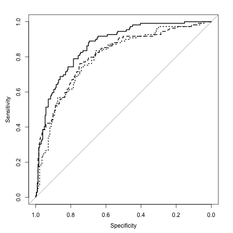

```{r setup, include=FALSE}
showsolA<-TRUE
showsolB<-TRUE
library(knitr)
opts_chunk$set(tidy.opts=list(width.cutoff=68),tidy=TRUE)
knitr::opts_chunk$set(echo = TRUE,tidy=TRUE,message=FALSE,warning=FALSE,strip.white=TRUE,prompt=FALSE,
                      cache=TRUE, size="scriptsize")
whichformat="html"
```


# Theoretical exercises

## Problem 1: Bank notes and LDA (with calculations by hand)

To distinguish between genuine and fake bank notes measurements of length and diagonal of an image part of the bank notes have been performed. For 1000 bank notes (500 of each of genuine and false) this gave the following values for the mean and the covariance matrix (using unbiased estimators), where the first value is the length of the bank note.

Genuine bank notes:
$$
   \bar{\bf x}_G=\left[     \begin{array}{c} 214.97 \\ 141.52  \end{array} \right]
\text{ and }
   \hat{\boldsymbol \Sigma}_G=\left[     \begin{array}{cc} 0.1502 & 0.0055 \\ 0.0055 & 0.1998 
\end{array} \right]
$$

Fake bank notes:
$$
   \bar{\bf x}_F= \left[     \begin{array}{c} 214.82 \\ 139.45  \end{array} \right]
\text{ and }
   \hat{\boldsymbol \Sigma}_F= \left[     \begin{array}{cc} 0.1240 & 0.0116 \\ 0.0116 & 0.3112 
\end{array} \right]
$$


a. Assume the true covariance matrix for the genuine and fake bank notes are the same. How would you estimate the common covariance matrix?

b. Explain the assumptions made to use linear discriminant analysis to classify a new observation to be a genuine or a fake bank note. Write down the classification rule for a new observation (make any assumptions you need to make).

c. Use the method in b. to determine if a bank note with length 214.0 and diagonal 140.4 is genuine or fake.

Hint: the following formula might be useful.
$$\left[
\begin{array}{cc} a & b \\ c & d \end{array} 
\right]^{-1} = \frac{1}{ad-bc}
\left[
\begin{array}{cc} d & -b \\ -c & a \end{array} 
\right]$$


## Problem 2: Odds (Exercise 4.7.9 in ISL textbook)
This problem has to do with *odds*.

a. On average, what fraction of people with an odds of 0.37 of defaulting on their credit card payment will in fact default?  
b. Suppose that an individual has a 16\% chance of defaulting on her credit card payment. What are the odds that she will default?

## Problem 3: Logistic regression (Exercise 4.7.6 in ISL textbook)
Suppose we collect data for a group of students in a statistics class with variables $x_1$ = hours studied, $x_2$ = undergrad GPA, and $Y$ = receive an A. We fit a logistic regression and produce estimated coefficient, $\hat{\beta}_0 = -6, \hat{\beta}_1 = 0.05, \hat{\beta}_2 = 1$.  

  a. Estimate the probability that a student who studies for 40 h and has an undergrad GPA of 3.5 gets an A in the class.  
  b. How many hours would the student in part a) need to study to have a 50\% chance of getting an A in the class?


## Problem 4: Sensitivity, specificity, ROC and AUC

We have a two-class problem, with classes 0=non-disease and 1=disease, and a method $p(x)$ that produces probability of disease for a covariate $x$. In a population we have investigated $N$ individuals and know the predicted probability of disease $p(x)$ and true disease status for these $N$. 

a. We choose the rule $p(x)>0.5$ to classify to disease. Define the sensitivity and the specificity of the test.
b. Explain how you can construct a reciever operator curve (ROC) for your setting, and why that is a useful thing to do. In particular, why do we want to investigate different cut-offs of the probability of disease?
c. Assume that we have a competing method $q(x)$ that also produces probability of disease for a covariate $x$. We get the information that the AUC of the $p(x)$-method is 0.6 and the AUC of the $q(x)$-method is 0.7. What is the definition and interpretation of the AUC? Would you prefer the $p(x)$ or the $q(x)$ method for classification?


# Data analysis with R 

## Problem 5 (Exercise 4.7.10 in ISL textbook)

This question should be answered using the `Weekly` data set, which is part of the `ISLR`packages. This data is similar in nature to the `Smarket` data from this chapter's lab, except that it contains 1,089 weekly returns for 21 years, from the beginning of 1990 to the end of 2010.  

a. Produce numerical and graphical summaries of the `Weekly` data. Do there appear to be any patterns?  
b. Use the full data set to perform a logistic regression with `Direction` as the response and the five lag variables plus `Volume`as predictors. Use the `summary` function to print the results. Do any of the predictors appear to be statistically significant? If so, which ones?  
c. Compute the confusion matrix and overall fraction of correct predictions. Explain what the confusion matrix is telling you about the types of mistakes made by logistic regression.  
d. Now fit the logistic regression model using a training data period from 1990 to 2008, with `Lag2` as the only predictor. Compute the confusion matrix and the overall fraction of correct predictions for the held out data (that is, the data from 2009 and 2010).  
e. Repeat d) using LDA.
f. Repeat d) using QDA.
g. Repeat d) using KNN with $K=1$.
h. Which of these methods appear to provide the best results on this data?
i. Experiment with different combinations of predictors, including possible transformations and interaction, for each of the methods. Report the variables, method, and associated confusion matrix that appears to provide the best results on the held out data. Note that you should also experiment with values for $K$ in the KNN classifier.

## Problem 6 (Exercise 4.7.11 in ISL textbook)
In this problem, you will develop a model to predict whether a given car gets high or low gas mileage based on the `Auto` data set.

a. Create a binary variable, `mpg01`, that contains a 1 if `mpg` contains a value above its median, and a 0 if `mpg` contains a value below its median. You can compute the median using the `median()` function. Note that you may find it helpful to use the `data.frame()` function to create a single data set containing both `mpg01`and the other `Auto` variables.
b. Explore the data graphically in order to investigate the association between `mpg01` and the other features. Which of the other features seems most likely to be useful in predicting `mpg01`? Scatter plots and boxplots may be useful tools to answer this question. Describe your findings.
c. Split the data into a training set and a test set.
d. Perform LDA on the training data in order to predict `mpg01` using the variables that seemed most associated with `mpg01` in b. What is the test error of the model obtained?
e. Repeat d) using LDA.
f. Repeat d) using logistic regression.
g. Repeat d) using KNN with different values of $K$. Which value of $K$ seems to perform the best on this data?


## Problem 7: Sensitivity, specificity, ROC and AUC

a. Install the `DAAG` package and load the `frogs` data set. This data set consists of 212 observations of the following variables:  

  * `pres.abs`: a binary variable (0/1) indicating the presence/absence of frogs at a particular location.
  * `northing` : reference point
  * `easting` : reference point
  * `altitude` : altitude in meters
  * `distance` : distance to nearest extant population, in meters
  * `NoOfPools` : number of potential breeding pools
  * `NoOfSites` : Number of potential breeding sites within a radius of 2 km
  * `avrain` : mean rainfall during Spring
  * `meanmin` : mean minimum temperature during Spring
  * `meanmax` : mean maximum temperature during Spring  


```{r frogex, message=FALSE, echo=FALSE}
library(DAAG)
attach(frogs)
library(knitr)
library(kableExtra)
# kable(head(frogs), digits=2,format=whichformat,booktabs=TRUE)
```


b. Fit a logistic model to the `frogs` data set, where `pres.abs` is the response variable and `distance`, `NoOfPools` and `meanmin` are covariates. Call this model `glmfit`. Classify as present (`pres.abs=1`) if the probability of present is $\ge 0.5$.    

i. Compute the confusion matrix for `glmfit`. 
ii. What type of error can you find from this confusion matrix?
iii. Plot an ROC curve for `glmfit`. What is the AUC score?

Hint: use function `glmres=roc(response=frogs$pres.abs,predictor=glmfit$fitted)` in `library(pROC)` where the predictor is a vector with your predicted posterior probabilites for the test set, and then `plot(glmres)` and `auc(glmres)`.

c. Repeat i-iii in b. but now with an LDA model with the same covariates. Call the fitted LDA model `lfit`.

Hint: LDA can be fitted with function `lda` in `library(class)` and predicted values found using `lpred=predict(object=lfit)$posterior[,1]`. Then use `lres=roc(response=frogs$pres.abs,predictor=lpred)`.

d. We have used the same data set to fit the models and to calculate the ROC and AUC. It that a sensible strategy? 


## Problem 8: Compulsory exercise 1 in 2018

In this problem, we use a `wine` dataset of chemical measurement of two variables, `Color_intensity` and `Alcalinity_of_ash`, on 130 wines from two cultivars in a region in Italy. 

The data set is a subset of a data set from <https://archive.ics.uci.edu/ml/datasets/Wine>, see that page for information of the source of the data.

Below you find code to read the data, plot the data and to divide the data into a training set and a test set. To get your own unique division please change the seed (where it says `set.seed(4268)` you change 4268 to your favorite number).

```{r,warning=FALSE,results="hold",message=FALSE,error=FALSE}
library(ggplot2)
library(GGally)
library(class)
library(MASS)
library(pROC)
wine=read.csv("https://www.math.ntnu.no/emner/TMA4268/2018v/data/Comp1Wine.csv",sep=" ")
wine$class=as.factor(wine$class-1)
colnames(wine)=c("y","x1","x2")
ggpairs(wine, ggplot2::aes(color=y))

n=dim(wine)[1]
set.seed(4268) #to get the same order if you rerun
ord = sample(1:n) #shuffle, without replacement 
test = wine[ord[1:(n/2)],] # first half is test, second train - could have been opposite
train = wine[ord[((n/2)+1):n],]
```

In our data the two classes are named `y` and coded $Y=0$ and $Y=1$, and we name $x_1$= `Alcalinity_of_ash`=`x1` and $x_2$=`Color_intensity`=`x2`.

### a) Logistic regression 
We assume a logistic regression model for observation $i$, $i=1,\ldots,n$:
$$
P(Y_i = 1| {\bf X}={\bf x}_i) = p_i = \frac{e^{\beta_0 + \beta_1x_{i1} + \beta_2 x_{i2}}}{ 1+ e^{\beta_0 + \beta_1x_{i1} + \beta_2x_{i2}}}
$$

* Use this expression to show that logit$(p_i)=\log(\frac{p_i}{1-p_i})$ is a linear function in $x_1$ and $x_2..
* Fit a logistic regression model with model formula `y~x1+x2` to the training set.
* Give an interpretation of $\hat{\beta}_1$ and $\hat{\beta}_2$.
* We use the rule to classify to class 1 for an observation with covariates ${\bf x}$ if $\hat{\text{Pr}}(Y=1\mid {\bf x})>0.5$. Write down the formula for the class boundary between the classes. What type of boundary is this?
* Make a plot with the training observations and the class boundary. Hint: in `ggplot` points are added with `geom_point` and a line with `geom_abline(slope=b, intercept=a)` where $a$ and $b$ comes from your class boundary, and title with `ggtitle`.
* Use the `summary` output to _manually_ derive the predicted probability $\hat{\text{Pr}}(Y=1\mid x_1=17, x_2=3)$. What is the interpretation of this value?
* Compute predicted probabilites for all observations in the test set.
* Make the confusion table for the test set when using 0.5 as cutoff for the probabilities. Calculate the sensitivity and specificity on the test set. How would you evaluate the performance of this classification?


### b) K-nearest neighbor classifier 
To decide the class of an new observation, the KNN classifier uses the nearest neighbours in the following way,
$$
P(Y=1|X=x_0) = \frac{1}{K}\sum_{i\in \mathcal{N_0}}I(y_i=j).
$$

* Explain this expression does, and what the different elements are.
* Use KNN with $K=3$ to classify the wines in the test set. 
* Make the confusion table for the test set when using 0.5 as cutoff. Calculate the sensitivity and specificity on the test set. How would you evaluate the performance of this classification? 
* Repeat with $K=9$. Which of these two choices of $K$ would you prefer and why? Why don't we just choose $K$ as high or as low as possible? 

Comment: The following code was not given to the students, but there was some confusion on the `KNN3prob` below, so not the code is included.

```{r, include=TRUE, eval=FALSE}
KNN3 = knn(train = train[,-1], test = test[,-1], k = 3, cl = train$y, prob = F)
t3 = table(test$y, KNN3)
t3
apply(t3,1,sum)
n = length(test$y)
error = (n-sum(diag(t3)))/n
error
KNN3probwinning = attributes(knn(train = train[,-1], test = test[,-1], k = 3, cl = train$y, prob = TRUE))$prob
KNN3prob <- ifelse(KNN3 == "0", 1-KNN3probwinning, KNN3probwinning)
#cbind(KNN3prob,KNN3,KNN3probwinning) to check that this is correct
KNN3roc=roc(response=test$y,predictor=KNN3prob)
cbind(KNN3roc$threshold, KNN3roc$sens, KNN3roc$specificities)
```


```{r, include=TRUE, eval=FALSE}
KNN9= knn(train = train[,-1], test = test[,-1], k = 9, cl = train$y, prob = F)
t9 = table(test$y, KNN9)
t9
error = (n-sum(diag(t9)))/n
error
KNN9probwinning = attributes(knn(train = train[,-1], test = test[,-1], k = 9, cl = train$y, prob = TRUE))$prob
KNN9prob <- ifelse(KNN9 == "0", 1-KNN9probwinning, KNN9probwinning)
KNN9roc=roc(response=test$y,predictor=KNN9prob)
cbind(KNN9roc$threshold, KNN9roc$sens, KNN9roc$specificities)
table(KNN3,KNN9)
```


### c) LDA (& QDA) 
In linear discriminant analysis, with $K$ classes, we assign a class to a new observation based on the posterior probability 

$$P(Y=k | {\bf X}={\bf x}) = \frac{\pi_k f_k({\bf x})}{\sum_{l=1}^K \pi_l f_l({\bf x})},$$
where 
$$f_k({\bf x}) = \frac{1}{(2 \pi)^{p/2}|\boldsymbol{\Sigma}|^{1/2}}e^{-\frac{1}{2}({\bf x}-\boldsymbol{\mu_k})^T \boldsymbol{\Sigma}^{-1}({\bf x}-\boldsymbol{\mu_k})}.$$

* Explain what is $\pi_k$, $\boldsymbol{\mu}_k$, $\boldsymbol{\Sigma}$ and $f_k(x)$ in our `wine` problem.
* How can we estimate $\pi_k$, $\boldsymbol{\mu}_k$ and $\boldsymbol{\Sigma}$? Compute estimates for these quantities based on the training set.

In a two class problem ($K=2$) the decision boundary for LDA between class 0 and class 1 is where $x$ satisfies
$$
P(Y=0 | {\bf X}={\bf x}) = P(Y=1 | {\bf X}={\bf x}).
$$

* Show that we can express this as 
\begin{align}
\delta_0({\bf x}) &= \delta_1({\bf x}),
\end{align}
where
\begin{align}
\delta_k({\bf x}) &= {\bf x}^T \boldsymbol{\Sigma}^{-1}\boldsymbol{\mu}_k - \frac{1}{2}\boldsymbol{\mu}_k^T \boldsymbol{\Sigma}^{-1}\boldsymbol{\mu}_k + \log \pi_k; \quad k\in\{0,1\}.
\end{align}
* Perform LDA on the training data (using R).
* We use the rule to classify to class 1 for an observation with covariates ${\bf x}$ if $\hat{P}(Y=1\mid {\bf x})>0.5$. Write down the formula for the class boundary between the classes.
* Make a plot with the training observations and the class boundary. Add the test observations to the plot (different markings). Hint: in `ggplot` points are added with `geom_points` and a line with `geom_abline(slope=b, intercept=a)` where $a$ and $b$ comes from your class boundary.
* Make the confusion table for the test set when using 0.5 as cut-off. Calculate the sensitivity and specificity on the test set. How would you evaluate the performance of this classification? 
* If you where to perform QDA instead of LDA, what would be the most important difference between the QDA and LDA philosophy?


### d) Compare classifiers 
* Compare your results from the different classification methods (logistic regression, your preferred KNN, LDA) based on the 0.5 cut-off on posterior probability classification rule. Which method would you prefer?
* Explain what an ROC curve is and why that is useful. Would your preference (to which method is the best for our data) change if a different cut-off was chosen?  Answer this by producing ROC-curves for the three methods on the test set. Also calculate AUC. Hint: use function `res=roc(response=test$y,predictor)` in `library(pROC)` where the predictor is a vector with your predicted posterior probabilites for the test set, and then `plot(res)` and `auc(res)`.


# Old exam problems (not sure to keep them here - ev. better to give full exam at a later point in the course?)

## Problem 9 (from exam 2018)

In this problem you may use that the probability density function for a $p$-dimensional multivariate normal random variable ${\bf X}$ with mean ${\boldsymbol \mu}$ and variance-covariance matrix ${\boldsymbol \Sigma}$ is given as:
$$f({\bf x}) = \frac{1}{(2 \pi)^{p/2}|\boldsymbol{\Sigma}|^{1/2}}\exp({-\frac{1}{2}({\bf x}-\boldsymbol\mu)^T \boldsymbol{\Sigma}^{-1}({\bf x}-\boldsymbol\mu)})$$
We will not discuss how to estimate the mean and variance-covariance matrix here,
so you may assume that they are known.

**Q10:** Write down the mathematical model assumptions for a linear discriminant
analysis with two classes (coded as 0 and 1) and $p$ explanatory variables and explain what the different ingredients are.

**Q11:** Explain how you derive the mathematical formula for the posterior probability for class 1.

**Q12:** Derive the mathematical formula for the class boundary between the two
classes, given that the classification rule is to classify to the class with the highest posterior probability.

**Q13:** Is this boundary linear or non-linear in the space of the explanatory variables?


## Problem 10  (from exam 2018)

We will look at data on diabetes (`diabetes` is `0` if not present and `1` if present) from a population of women of Pima Indian heritage in the US, available in the R `MASS` package. The following covariates were collected for each woman:

* `npreg`: number of pregnancies
* `glu`: plasma glucose concentration in an oral glucose tolerance test
* `bp`: diastolic blood pressure (mmHg)
* `skin`: triceps skin fold thickness (mm)
* `bmi`: body mass index (weight in kg/(height in m)$^2$)
* `ped`: diabetes pedigree function.
* `age`: age in years

We will use a training set (called `train`) with 200 observations (132 non-diabetes and 68 diabetes cases) and a test set (called `test`) with 332 observations (223 non-diabetes and 109 diabetes cases). Our aim is to make a classification rule for diabetes (or not) based on the available data. 

Below you find R-code and results from fitting a logistic regression to the `train` data set.

**Q14:** Write down the statistical model for the logistic regression.

**Q15:** Explain what is the estimated effect of the `ped` covariate on getting diabetes. 

**Q16:** Would you predict that a person with the following characteristics has diabetes? 

Person: `npreg`=2, `glu`=145, `bp`=85, `skin`=35, `bmi`=37, `ped`=0.7, `age`=40.

**Q17:** Draw a feedforward neural network with the same architecture as the logistic regression and specify which activation function(s) is/are used. Label nodes and connections with the same notation as for the mathematical model for the logistic regression. 

The `test` data set was used to evaluate the performance of the logistic regression. A receiver--operator curve (ROC) was constructed and is the solid curve in the figure below (the dotted and dashed curves will be studie in Q24).

**Q18:** Explain briefly how a ROC curve is constructed. Your explanation should include the words cut-off, confusion matrix, sensitivity, specificity. 

Look at the confusion matrix (probability cut-off 0.5) reported for the test set in the bottom part of the print-out in the figure below.

**Q19:** Which point on the ROC curve does this cut-off correspond to?

```{rm,echo=TRUE,eval=FALSE}
# logistic regression
> fitlogist=glm(diabetes~npreg+glu+bp+skin+bmi+ped+age,data=train,
family=binomial(link="logit"))
> summary(fitlogist)
Call:
glm(formula = diabetes ~ npreg + glu + bp + skin + bmi + ped + 
    age, family = binomial(link = "logit"), data = train)
Coefficients:
             Estimate Std. Error z value Pr(>|z|)    
(Intercept) -9.773062   1.770386  -5.520 3.38e-08 ***
npreg        0.103183   0.064694   1.595  0.11073    
glu          0.032117   0.006787   4.732 2.22e-06 ***
bp          -0.004768   0.018541  -0.257  0.79707    
skin        -0.001917   0.022500  -0.085  0.93211    
bmi          0.083624   0.042827   1.953  0.05087 .  
ped          1.820410   0.665514   2.735  0.00623 ** 
age          0.041184   0.022091   1.864  0.06228 .  
---
Signif. codes:  0 '***' 0.001 '**' 0.01 '*' 0.05 '.' 0.1 ' ' 1
(Dispersion parameter for binomial family taken to be 1)
    Null deviance: 256.41  on 199  degrees of freedom
Residual deviance: 178.39  on 192  degrees of freedom
AIC: 194.39
Number of Fisher Scoring iterations: 5

> predlogist=predict(fitlogist,newdata=test,type="response")
> testclasslogist=ifelse(predlogist > 0.5, 1, 0)
> table(test$diabetes, testclasslogist)
   testclasslogist
      0   1
  0 200  23
  1  43  66
>  # note: 223 true non-diabetes and 109 true diabetes cases
> library(pROC)
> roclogist=roc(test$diabetes,predlogist)
> auc(roclogist)
Area under the curve: 0.8659
> plot(roclogist, lty="solid")
```

```{r, out.width="300pt",echo=FALSE}

```

ROC-curves for logistic (solid), bagged trees (dashed) and quadratic discriminant analysis (dotted) for the diabetes test data set.
