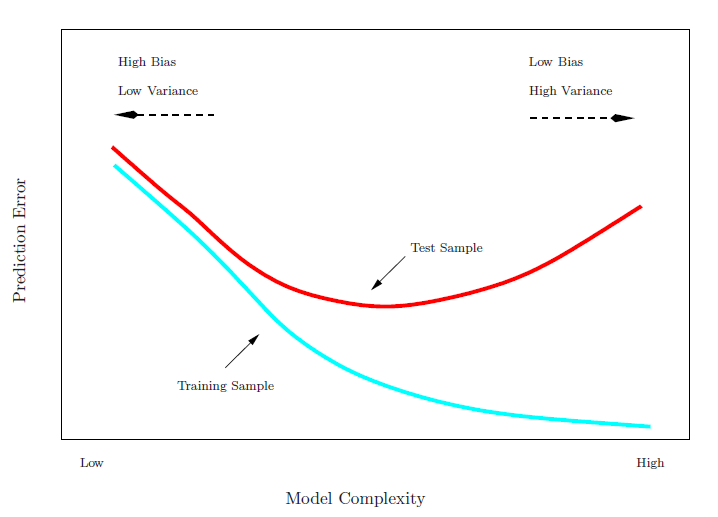
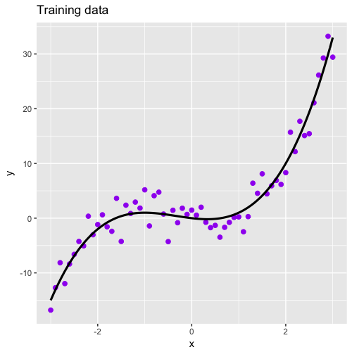

```{r setup, include=FALSE}
showsolA<-TRUE
showsolB<-TRUE
library(knitr)
opts_chunk$set(tidy.opts=list(width.cutoff=68),tidy=TRUE)
knitr::opts_chunk$set(echo = TRUE,tidy=TRUE,message=FALSE,warning=FALSE,strip.white=TRUE,prompt=FALSE,
                      cache=TRUE, size="scriptsize")
whichformat="latex"
```

---

Last update: February 2nd, 2020

---

# Acknowledgements

* A lot of this material stems from Mette Langaas and her TAs. I would like to thank Mette for the permission to use her material!

* Some of the figures and slides in this presentation are taken (or are inspired) from @james.etal.


# Introduction

## Learning material for this module

\vspace{2mm}

* James et al (2013): An Introduction to Statistical Learning, Chapter 5.  

* All the material presented on these module slides.

\vspace{2mm}
Additional material for the interested reader: Chapter 7 (in particular 7.10) in Friedman et al (2001): Elements of Statistical learning.

---

## What will you learn?

* What is model assessment and model selection?
* Ideal solution in a data rich situation.
* Cross-validation and what is best: 
    + validation set 
    + leave-one-out cross-validation (LOOCV) 
    + $k$-fold CV 

* Bootstrapping - how and why.


---

# Performance of a learning method

* Our models are "good" when they can generalize.

* We want a learning method to perform well on new data (low test error). 

* Inference and understanding of the true pattern (in contrast to overfitting)

This is important both for 

**Model selection**

Estimate the _performance_ of different models (often different order of complexity within one model class) to _choose the best model_.

**Model assessment**

Estimating the performance (prediction error) of the final model, on new data.

---

## Training vs Test Error

\vspace{2mm}

Recall:

* The _test error_ is the average error that results from using a
statistical learning method to predict the response on a new
observation, one that was not used in training the method.

* The _training error_ can be easily calculated by
applying the statistical learning method to the observations
used in its training.

* The training error rate often is quite different from the
test error rate.

* **The training error can
dramatically underestimate the test error**.

---

\centering
{width=80%}


---

## Loss functions 

\vspace{2mm}

In order to define how we measure error, we must first decide for a **loss function**. Here we use:

\vspace{2mm}

* _\textcolor{red}{Mean squared error}_ (quadratic loss) for regression problems (continuous outcomes) $Y_i=f({\boldsymbol x}_i)+\varepsilon_i$, $i=1,\ldots, n$:  

$$\text{MSE}=\frac{1}{n}\sum_{i=1}^n (y_i-\hat{f}({\boldsymbol x}_i))^2 \ .$$

* _\textcolor{red}{Misclassification rate}_ (0/1 loss) for classification problems where we classify to the class with the highest probability $P(Y=j\mid {\boldsymbol x}_0)$ for $j=1,\ldots,K$:
$$\frac{1}{n}\sum_{i=1}^n \text{I}(y_i \neq \hat{y}_i) \ .$$ 

---

### Example 
\vspace{2mm}

We aim to do _model selection_ in KNN-regression, where true curve is
$f(x)=-x+x^2+x^3$ with $x \in [-3,3]$. $n=61$ for the training data.

\vspace{2mm}

\centering
{width=50%}

---

### KNN regression (chapter 3.5 in course book)
\vspace{2mm}

* The KNN regression method provides a prediction at a value $x_0$ by finding the closest $K$ points (Euclidean distance) and calculating the average of the observed $y$ values at the points in the respective neighborhood $\mathcal{N}_0$ 

$$\hat{f}(x_0)=\frac{1}{K}\sum_{i\in \mathcal{N}_0} y_i \ .$$


* We have considered $K=1,\ldots,25$, and repeated the experiment $M=1000$ times (that is, $M$ versions of training and test set). 


---

### Remember: The bias-variance trade-off
\vspace{2mm}


For KNN: $K$ small = high complexity; $K$ large = low complexity. 

<!-- <figure><figcaption>Regression problem: bias-variance traceoff</figure> -->
\centering
{width=75%}


---

### The challenge

\vspace{2mm}

* In the above examples we knew the truth, so we could assess training and test error.

* In reality this is of course not the case.

* We need approaches that work with real data!

---

##The data-rich situation (often unrealistic)

\vspace{2mm}
If we had a large amount of data we could divide our data into three parts:

* **Training set**: to fit the model
* **Validation set**: to select the best model (_model selection_)
* **Test set**: to assess how well the model fits on new independent data (_model assessment_)


\vspace{2mm}

**Q**: Before we had just training and test. Why do we need the additional validation set?

**A**: We have not discussed model selection before.

\vspace{2mm}

**Q**: Why can't we just use the training set for training, and then the test set both for model selection and for model evaluation?

**A**: We will be too optimistic if we report the error on the test set when we have already used the test set to choose the best model.


---

* If you have a lot of data -- great --  then you do not need Module 5. 

* But, this is very seldom the case -- so we will study other solutions based on efficient sample reuse with _resampling_ data.

* An alternative strategy for model selection (using methods penalizing model complexity, e.g. AIC or lasso) is covered in Module 6.

We will look at _cross-validation_ and the _bootstrap_.

---

# Cross-validation (CV)

"Model selection" situation: We assume that test data is available (and has been put aside), and we want to use the rest of our data to find the model that performs "best", that is, _with lowest test error_.


This can be done by:

* the validation set approach (not strictly a _cross_-validation approach).
* leave one out cross-validation (LOOCV).
* $k$-fold cross-validation (CV), typically $k=5$ or $10$.


We will also discuss that there is a "right and a wrong way" to do CV

* selection bias - all elements of a model selection strategy need to be within the CV-loop


---

## The validation set approach  

\vspace{2mm}

* Consider the case when you have a data set consisting of $n$ observations. 

* To fit a model and to evaluate its predictive performance you randomly divide the data set into two parts ($n/2$ sample size each): 

    + a _training set_ (to fit the model) and 
    + a _validation set_ (to make predictions of the response variable for the observations in the validation set)

\vspace{4mm}

{width=70%,centering}


---

### Example of validation set approach
\vspace{2mm}

Auto data set (library `ISLR`): predict `mpg` (miles pr gallon) using polynomial function of `horsepower` (of engine), $n=392$. What do you see?
 

```{r auto, echo=FALSE, fig.width=4, fig.height=3,fig.align = "center",out.width='70%'}
library(ISLR)
library(ggplot2)
library(ggpubr)
library(reshape2)
set.seed(123)
n=dim(Auto)[1]

testMSEmat=matrix(ncol=11,nrow=10)
for (newsample in 1:11)
{
  trainid=sample(n,n/2)
  for (polydeg in 1:10)
  {
    lm.fit=lm(mpg~poly(horsepower,polydeg),data=Auto,subset=trainid)
    lm.pred=predict(lm.fit,Auto)[-trainid]
    testMSEmat[polydeg,newsample]=mean((Auto$mpg[-trainid]-lm.pred)^2)
  }
}
yrange=c(15,28)

plotdf=data.frame("testMSE"=testMSEmat[,1],"degree"=1:10)
g0=ggplot(plotdf,aes(x=degree))+geom_line(y=testMSEmat[,1])+scale_y_continuous(limits = yrange)+scale_x_continuous(breaks=1:10)+labs(y="Validation set", x="Degree of polynomial")
g0+theme_minimal()
```

---


But what if we select another split into two parts? Many splits:

```{r auto2, echo=FALSE, fig.width=4, fig.height=3,fig.align = "center",out.width='70%'}
cols=rainbow(10)
g1=g0+geom_line(aes(x=1:10,y=testMSEmat[,2]),colour=cols[1])
g1=g1+geom_line(aes(x=1:10,y=testMSEmat[,3]),colour=cols[2])
g1=g1+geom_line(aes(x=1:10,y=testMSEmat[,4]),colour=cols[3])
g1=g1+geom_line(aes(x=1:10,y=testMSEmat[,5]),colour=cols[4])
g1=g1+geom_line(aes(x=1:10,y=testMSEmat[,6]),colour=cols[5])
g1=g1+geom_line(aes(x=1:10,y=testMSEmat[,7]),colour=cols[6])
g1=g1+geom_line(aes(x=1:10,y=testMSEmat[,8]),colour=cols[7])
g1=g1+geom_line(aes(x=1:10,y=testMSEmat[,9]),colour=cols[8])
g1=g1+geom_line(aes(x=1:10,y=testMSEmat[,10]),colour=cols[9])
g1=g1+geom_line(aes(x=1:10,y=testMSEmat[,11]),colour=cols[10]) +labs(y="Validation set", x="Degree of polynomial") + theme_minimal()
g1
g1valid=g1
#ggarrange(g0,g1)
```

$\rightarrow$ No consensus which model really gives the lowest validation set MSE.

---

### Drawbacks with the validation set approach

\vspace{2mm}

* _\textcolor{red}{High variability}_ of validation set error due to dependency on the set of observation included in the training and validation set.

\vspace{2mm}

* _\textcolor{red}{Smaller sample size}_ for model fit, as only half of the observations are in the training set. Therefore, the validation set error may tend to overestimate the error rate on new observations for a model that is fit on the full data set (the more data, the lower the error).

---

Better ideas?

---

## Leave-one-out cross-validation (LOOCV)

Leave-one-out cross-validation (LOOCV) addresses the limitations of the validation set approach.

\vspace{2mm}

**Idea:**

* Only **one observation at a time** is left out and makes up the new observations (test set). 
* The remaining $n-1$ observations make up the training set. 
* The procedure of model fitting is repeated $n$ times, such that each of the $n$ observations is left out once. In each step, we calculate the MSE as

$$\text{MSE}_i=(y_i-\hat{y}_i)^2 \ .$$

* The **total prediction error** is the mean across these $n$ models


$$\text{CV}_{n}=\frac{1}{n}\sum_{i=1}^n \text{MSE}_i \ .$$

---

### Regression example: LOOCV

<!--  -->

```{r auto_loocv, echo=FALSE, fig.width=5, fig.height=4,fig.align = "center",out.width='70%'}
library(ISLR)
library(boot)
library(ggplot2)
set.seed(123)
n=dim(Auto)[1]
testMSEvec=NULL
start=Sys.time()
for (polydeg in 1:10)
  {
    glm.fit=glm(mpg~poly(horsepower,polydeg),data=Auto)
    glm.cv1=cv.glm(Auto, glm.fit,K=n)
    testMSEvec=c(testMSEvec,glm.cv1$delta[1])
}
stopp=Sys.time()
yrange=c(15,28)
plotdf=data.frame("testMSE"=testMSEvec,"degree"=1:10)
g0=ggplot(plotdf,aes(x=degree,y=testMSE))+geom_line()+geom_point()+scale_y_continuous(limits = yrange)+scale_x_continuous(breaks=1:10)+labs(y="LOOCV")
g0+theme_minimal()
```


\tiny
```{r,echo=FALSE,eval=FALSE}
library(ISLR) #for Auto data set
library(boot) #for cv.glm
library(ggplot2) #for plotting
set.seed(123)
n=dim(Auto)[1]
testMSEvec=NULL
start=Sys.time()
for (polydeg in 1:10)
  {
    glm.fit=glm(mpg~poly(horsepower,polydeg),data=Auto)
    glm.cv1=cv.glm(Auto, glm.fit,K=n)
    testMSEvec=c(testMSEvec,glm.cv1$delta[1])
}
stopp=Sys.time()
yrange=c(15,28)
plotdf=data.frame("testMSE"=testMSEvec,"degree"=1:10)
g0=ggplot(plotdf,aes(x=degree,y=testMSE))+geom_line()+geom_point()+scale_y_continuous(limits = yrange)+scale_x_continuous(breaks=1:10)+labs(y="LOOCV")
g0+theme_minimal()
```
\normalsize

---

### Issues with leave-one-out cross-validation

\vspace{1mm}

* Pros: 
    + No randomness in training/validation splits!
    + Little bias, since nearly the whole data set used for training (compared to half for validation set approach).
    
* Cons: 
    + Expensive to implement -- need to fit $n$ different models.
    + High variance since: two training sets only differ by one observation - which makes estimates from each fold highly correlated and this can lead to that their average can have high variance$^\star$.

\vspace{5mm}
\scriptsize
$^\star$ Recall that
$$\text{Var}(\sum_{i=1}^na_iX_i)=\sum_{i=1}^n\sum_{j=1}^n a_ia_j\text{Cov}(X_i,X_j)$$
$$=\sum_{i=1}^na_i^2\text{Var}(X_i)+2\sum_{i=2}^n \sum_{j=1}^{i-1}
a_ia_j\text{Cov}(X_i,X_j).$$ 

---

### LOOCV for multiple linear regression

\vspace{2mm}

There is a nice shortcut for LOOCV in the case of linear regression:

$$ \text{CV}_{n}=\frac{1}{n}\sum_{i=1}^n \left( \frac{y_i-\hat{y}_i}{1-h_{ii}} \right) ^2 \ ,$$

where $h_i$ is the $i$th diagonal element (leverage) of the hat matrix ${\bf H}={\bf X}({\bf X}^T{\bf X})^{-1}{\bf X}^T$, and $\hat{y}_i$ is the $i$th fitted value from the original least squares fit.

\vspace{2mm}

$\rightarrow$ Need to fit the model only once!


---

## $k$-fold cross-validation

$~$

To address the drawbacks of LOOCV, we can leave out not just one single observation in each iteration, but $1/k$-th of all data.

$~$

**Procedure:**

* Split the data into $k$ (more or less) equal parts.
* Use $k-1$ parts to fit and the $k$th part to validate.
* Do this $k$ times and leave out another part in each round.

The MSE is then estimated in each of the $k$ iterations ($\text{MSE}_1,\ldots,\text{MSE}_k$), and the the $k$-fold CV is

$$\text{CV}_k = \frac1k \sum_{i=1}^k \text{MSE}_i \ .$$


---

**Comparison of LOOCV and $k$-fold CV**:

\centering
LOOCV: 

{width=70%}

$k$-fold: 

{width=70%}


<!-- See class notes for drawing. -->

---

### Formally

* Indices of observations - divided into $k$ folds: $C_1, C_2, \ldots, C_k$.
* $n_k$ elements in each fold, if $n$ is a multiple of $k$ then $n_k=n/k$.

$$\text{MSE}_k=\frac{1}{n_k}\sum_{i\in C_k}(y_i-\hat{y}_i)^2$$
where $\hat{y}_i$ is the fit for observation $i$ obtained from the data with part $k$ removed. 

$$\text{CV}_{k}=\frac{1}{n} \sum_{j=1}^k n_j \text{MSE}_j$$

Observe: setting $k=n$ gives LOOCV.

---

### Regression example: $5$ and $10$-fold cross-validation

```{r auto_510fold, echo=FALSE, fig.width=5, fig.height=4,fig.align = "center",out.width='70%'}
library(ISLR)
library(boot)
library(ggplot2)
set.seed(123)
n=dim(Auto)[1]
testMSEvec5=NULL
testMSEvec10=NULL
start=Sys.time()
for (polydeg in 1:10)
  {
    glm.fit=glm(mpg~poly(horsepower,polydeg),data=Auto)
    glm.cv5=cv.glm(Auto, glm.fit,K=5)
    glm.cv10=cv.glm(Auto, glm.fit,K=10)
    testMSEvec5=c(testMSEvec5,glm.cv5$delta[1])
    testMSEvec10=c(testMSEvec10,glm.cv10$delta[1])
}
stopp=Sys.time()
yrange=c(15,28)
plotdf=data.frame("testMSE5"=testMSEvec5,"degree"=1:10)
g0=ggplot(plotdf,aes(x=degree,y=testMSE5))+geom_line()+geom_point()+scale_y_continuous(limits = yrange)+scale_x_continuous(breaks=1:10)+labs(y="CV")+ggtitle("5 and 10 fold CV")
g0+geom_line(aes(y=testMSEvec10),colour="red")+geom_point(aes(y=testMSEvec10),colour="red")+ggtitle("5 fold (black), 10 fold (red)")+theme_minimal()
```


```{r,echo=FALSE,eval=FALSE}
library(ISLR)
library(boot)
library(ggplot2)
set.seed(123)
n=dim(Auto)[1]
testMSEvec5=NULL
testMSEvec10=NULL
start=Sys.time()
for (polydeg in 1:10)
  {
    glm.fit=glm(mpg~poly(horsepower,polydeg),data=Auto)
    glm.cv5=cv.glm(Auto, glm.fit,K=5)
    glm.cv10=cv.glm(Auto, glm.fit,K=10)
    testMSEvec5=c(testMSEvec5,glm.cv5$delta[1])
    testMSEvec10=c(testMSEvec10,glm.cv10$delta[1])
}
stopp=Sys.time()
yrange=c(15,28)
plotdf=data.frame("testMSE5"=testMSEvec5,"degree"=1:10)
g0=ggplot(plotdf,aes(x=degree,y=testMSE5))+geom_line()+geom_point()+scale_y_continuous(limits = yrange)+scale_x_continuous(breaks=1:10)+labs(y="CV")+ggtitle("5 and 10 fold CV")
g0+geom_line(aes(y=testMSEvec10),colour="red")+geom_point(aes(y=testMSEvec10),colour="red")+ggtitle("5 fold (black), 10 fold (red)")+theme_minimal()
```
\normalsize

---

10 reruns (different splits) of the 10-CV method - to see variability:

```{r auto_510fold_10, echo=FALSE, fig.width=5, fig.height=4,fig.align = "center",out.width='70%'}
library(ISLR)
library(boot)
library(ggplot2)
set.seed(123)
n=dim(Auto)[1]
start=Sys.time()
testMSEmat=matrix(ncol=11,nrow=10)

for (polydeg in 1:10)
  {
    glm.fit=glm(mpg~poly(horsepower,polydeg),data=Auto)
    for (newsample in 1:11)
    {
        glm.cv10=cv.glm(Auto, glm.fit,K=10)
      testMSEmat[polydeg,newsample]=glm.cv10$delta[1]
    }
}

stopp=Sys.time()
yrange=c(15,28)

plotdf=data.frame("testMSE"=testMSEmat[,1],"degree"=1:10)
g0=ggplot(plotdf,aes(x=degree))+geom_line(y=testMSEmat[,1])+scale_y_continuous(limits = yrange)+scale_x_continuous(breaks=1:10)+labs(y="CV10")
#g0

cols=rainbow(10)
g1=g0+geom_line(aes(x=1:10,y=testMSEmat[,2]),colour=cols[1])
g1=g1+geom_line(aes(x=1:10,y=testMSEmat[,3]),colour=cols[2])
g1=g1+geom_line(aes(x=1:10,y=testMSEmat[,4]),colour=cols[3])
g1=g1+geom_line(aes(x=1:10,y=testMSEmat[,5]),colour=cols[4])
g1=g1+geom_line(aes(x=1:10,y=testMSEmat[,6]),colour=cols[5])
g1=g1+geom_line(aes(x=1:10,y=testMSEmat[,7]),colour=cols[6])
g1=g1+geom_line(aes(x=1:10,y=testMSEmat[,8]),colour=cols[7])
g1=g1+geom_line(aes(x=1:10,y=testMSEmat[,9]),colour=cols[8])
g1=g1+geom_line(aes(x=1:10,y=testMSEmat[,10]),colour=cols[9])
g1=g1+geom_line(aes(x=1:10,y=testMSEmat[,11]),colour=cols[10])
g1+theme_minimal()
#ggarrange(g0,g1)
```

There still _is_ variability, but _much less_ than for validation set approach.

---

### Issues with $k$-fold cross-validation

\vspace{2mm}

1. The _result may vary_ according to how the folds are made, but the variation is in general lower than for the validation set approach.

2. Computational load lower with $k=5$ or $10$ than LOOCV.

3. The training set is $(k-1)/k$ times the size of the original data set - the estimate of the prediction error is biased upwards.

4. This bias is the smallest when $k=n$ (LOOCV), but we know that LOOCV has high variance.

5. Due to the _bias-variance-trade-off_, $k$-fold CV often gives more accurate estimates of the test error rate than does LOOCV.  
$\rightarrow$ $k=5$ or $k=10$ is used as a compromise. 

---

### Choosing the best model

\vspace{2mm}

* There is a model parameter (maybe $K$ in KNN or the degree of the polynomial), say $\theta$, involved to calculate $\text{CV}_j$, $j=1,\ldots, k$
\vspace{1mm}

* Based on the CV vs $\theta$-plot we can choose the model with _the smallest ${\text{CV}_k}$_ as our best model.
\vspace{1mm}

* We then fit this model using the whole data set (not the test part, that is still kept away), and evaluate the performance on the test set.


---

**One standard error rule:**

Denote by $\text{MSE}_j(\theta)$, $j=1,\ldots, k$ the $k$ parts of the MSE that together give the $\text{CV}_k$.

We can compute the sample standard deviation (standard error) of all $\text{MSE}_j(\theta)$, $j=1,\ldots, k$ 
$$\hat{\text{SE}}(\text{CV}_k(\theta))= \sqrt{\sum_{j=1}^k (\text{MSE}_j(\theta) - \overline{\text{MSE}}(\theta))/(k-1)} \, $$

for each value of the complexity parameter $\theta$.\footnote{Strictly speaking, this estimate is not quite valid. Why?}

<!-- and then use $\text{SE}(\theta)=\text{SD}(\theta)/\sqrt{k}$ as the standard deviation of $\text{CV}_k$. -->


The _one standard error rule_ is to choose the simplest model (_e.g._, with lowest polynomial degree) within one standard error of the minimal error.

<!-- , that is, we move $\theta$ in the direction of simplicity until it ceases to be true that  -->

<!-- $$\text{CV}(\theta)\le \text{CV}(\hat{\theta})+ \hat{\text{SE}}(\text{CV}_k(\hat\theta)) \ .$$ -->

<!-- This will be the simplest model whose error is within one standard error of the minimal error. -->


---

### $k$-fold cross-validation in classification

\vspace{3mm}

What do we need to change from our regression set-up?

\vspace{3mm}

* For LOOCV $\hat{y}_i$ is the fit for observation $i$ obtained from the data with observations $i$ removed, and ${\text{Err}_i}=I(y_i\neq \hat{y}_i)$ . LOOCV is then 
$$\text{CV}_{n}=\frac{1}{n} \sum_{i=1}^n {\text{Err}_i}$$


* The $k$-fold CV is defined analogously.


---

### Can we use CV for model assessment?
\vspace{2mm}

* Assume we already have our model (maybe found by using the methods from Module 6), so we want to perform model assessment based on all our data.

* Then we can use CV with all data (then the validation part is really the test part) and report on the model performance using the validation parts of the data as above.

\vspace{2mm}

### Can we use CV both for model selection and model assessment?
\vspace{2mm}

* Not really: using the test set for both model selection and estimation tends to overfit the test data, and the bias will be underestimated.  

* Solution: you can use two layers of CV - also called _nested CV_. See drawing in class.


---

## The right and the wrong way to do cross-validation

[ISL book slides, page 17](https://lagunita.stanford.edu/c4x/HumanitiesScience/StatLearning/asset/cv_boot.pdf): model assessment.

* We have a two-class problem and would like to use a simple classification method, however, 
* we have many possible predictors (e.g., $p=5000$) and not a big sample size (e.g., $n=50$).

We use this strategy to produce a classifier:

1. We calculate the correlation between the class label and each of the $p$ predictors, and choose the $d=25$ predictors that have the highest (absolute value) correlation with the class label. (We need to have $d<n$ to fit the logistic regression uniquely.)
2. Then we fit our classifier (here: logistic regression) using only the $d=25$ predictors.

How can we use cross-validation to produce an estimate of the performance of this classifier? 


---

**Q**: Can we apply cross-validation only to step 2? Why (not)?

**A:** No, **step 1 is part of the training procedure** (the class labels have already been used) and must be part of the CV to give an honest estimate of the performance of the classifier. 

$~$

* Wrong: Apply cross-validation in step 2.
* Right: Apply cross-validation to steps 1 and 2.

$~$

Note: We will see in the Recommended Exercises that doing the wrong thing can give a misclassification error approximately 0 - even if the "true" rate is 50%. 

---

### Selection bias in gene extraction on the basis of microarray gene-expression data

\vspace{2mm}

Article by [Christophe Ambroise and Geoffrey J. McLachlan, PNAS 2002](http://www.pnas.org/content/99/10/6562).


{width=105%, align=center}


 
<!-- * In the context of cancer diagnosis and treatment, we consider the -->
<!-- problem of constructing an accurate prediction rule on the basis of -->
<!-- a relatively small number of tumor tissue samples of known type -->
<!-- containing the expression data on very many (possibly thousands) -->
<!-- genes.  -->

<!-- * Recently, results have been presented in the literature -->
<!-- suggesting that it is possible to construct a prediction rule from -->
<!-- only a few genes such that it has a negligible prediction error rate. -->

<!-- * However, in these results the test error or the leave-one-out -->
<!-- cross-validated error is calculated without allowance for the selection -->
<!-- bias.  -->

\vspace{10mm}

See also this nice [anecdote at about 7min 15 in the video](https://www.youtube.com/watch?v=S06JpVoNaA0).


---


# The Bootstrap

\vspace{2mm}

* Flexible and powerful statistical tool that
can be used to quantify _uncertainty_ associated with an estimator or statistical learning method.

\vspace{2mm}

* Very popular to obtain standard errors or confidence intervals for a coefficient, when parametric theory does not provide it.

\vspace{2mm}

* We will look at getting an estimate for the standard error of a sample median and of a regression coefficient.


---

* The inventor: Bradley Efron in 1979 - [see interview](https://www.youtube.com/watch?v=6l9V1sINzhE).

* The name? _To pull oneself up by one's bootstraps_ from "The Surprising
Adventures of Baron Munchausen" by Rudolph Erich Raspe:

_The Baron had fallen to the bottom of a deep lake. Just
when it looked like all was lost, he thought to pick himself
up by his own bootstraps._


* **Idea: Use the data itself to get more information about a statistic (an estimator).**

<!-- --- -->

<!-- ## Example: The mean $\bar{X}$ -->

<!-- Assume we have univariate random variables  $X_1, X_2, \ldots, X_n$, with some common mean $\mu$ and variance $\sigma^2$. -->

<!-- We can then form the average: $\bar{X}=\frac{1}{n} \sum_{i=1}^n X_i$, which we often use as an estimator for $\mu$. -->

<!-- If we want to estimate $\sigma^2$, a popular estimator is $S^2=\frac{1}{n-1}\sum_{i=1}^n (X_i-\bar{X})^2$, -->

<!-- If the observations are _independent_ (and identically distributed) we know that the variance of $\bar{X}$ is given by $\text{Var}(\bar{X})=\frac{\sigma^2}{n}$, -->
<!-- which we may estimate as $\widehat{\text{Var}}(\bar{X})=\frac{S^2}{n}$. -->

<!-- To form a confidence interval for $\mu$ we need to assume a distribution for the $X_i$s. If we assume that the $X_i$s are independent and normal $N(\mu,\sigma^2)$  and can get a 95% confidence interval from -->

<!-- $$ \bar{X}\pm t_{0.025,n-1}\frac{S}{\sqrt{n}}$$ -->

---

## Example: the standard deviation of the sample median?

\vspace{2mm}

* Assume that we observe a random sample $X_1, X_2, \ldots, X_n$ from an unknown probability distribution $f$. We are interested in saying something about the population median, thus we calculate the sample median $\tilde{X}$.  
$\rightarrow$ Q: How accurate is $\tilde{X}$ as an estimator?

* If we would know our distribution $F$, we could sample from $F$, and use simulations to answer our question.

* However, without knowledge of the distribution, we cannot calculate the standard deviation of our estimator, thus $\text{SD}(\tilde{X})$.

* That's where the bootstrap method comes into play.

---

Let's first assume we would know $f$, for example $X\sim N(0,1)$. Then we can repeatedly take samples and calculate the standard deviation of all medians to obtain an estimate:

\scriptsize
```{r,eval=TRUE, echo=TRUE}
set.seed(123)
n=101
B=1000
estimator=rep(NA,B)
for (b in 1:B)
{
  xs=rnorm(n)
  estimator[b]=median(xs)
}
sd(estimator)
```

---

```{r boot1, echo=FALSE, fig.width=5, fig.height=4,fig.align = "center",out.width='70%'}
ggplot(data=data.frame(x=estimator),aes(x=x))+
  geom_density()
```

---

## Moving from simulation to bootstrapping ($f$ unknown)

\vspace{2mm}

* The bootstrap method is using the observed data to estimate the _empirical distribution_ $\hat{f}$, that is each observed value of $x$ is given probability $1/n$.

* A _bootstrap sample_ $X^*_1,X^*_2,\ldots, X^*_n$ is a random sample drawn from $\hat{f}$.

* A simple way to obtain the bootstrap sample is to _draw with replacement from $X_1, X_2, \ldots, X_n$_.

* **Note**: Our bootstrap sample consists of $n$ members of $X_1, X_2, \ldots, X_n$ - some appearing more than once, other not appearing at all.

---

Compare the sample median
\scriptsize
```{r, eval=TRUE, echo=TRUE}
set.seed(123)
n=101
original=rnorm(n)
median(original)
```

\normalsize
to the median from **one bootstrap-sample**: 
\scriptsize
```{r, eval=TRUE, echo=TRUE}
boot1=sample(x=original,size=n,replace=TRUE)
median(boot1)
```

\normalsize
However, drawing only _one_ such sample does not help much.

---

## The bootstrap algorithm for estimating standard errors

\vspace{2mm}

1. Drawing $B$ bootstrap samples: drawn with replacement from the original data.

\vspace{1mm}

2. Evaluate the statistic of interest on _each of the $B$ bootstrap samples_ to get $\tilde{X}^*_b$ for the $b$th bootstrap sample.

\vspace{1mm}

3. Estimate squared standard error by
$$\frac{1}{B-1}\sum_{b=1}^B (\tilde{X}^*_b-\frac{1}{B}\sum_{b=1}^B \tilde{X}^*_b)^2 \ ,$$
which is the empirical standard deviation from the $B$ estimates  $\tilde{X}^*_b$, $b=1,\ldots,B$.


---

### Illustration for the median example (with a for-loop in R)

\scriptsize
```{r, eval=TRUE, echo=TRUE}
set.seed(123)
n=101
original=rnorm(n)
median(original)
B=1000
estimator=rep(NA,B)
for (b in 1:B)
  {
  thisboot=sample(x=original,size=n,replace=TRUE)
  estimator[b]=median(thisboot)
}
sd(estimator)
```


---

The distribution of the 1000 sampled estimates:

```{r boot2, echo=FALSE, fig.width=5, fig.height=4,fig.align = "center",out.width='70%'}
ggplot(data=data.frame(x=estimator),aes(x=x))+
  geom_density()

```

---

### Alternative: the built-in `boot` function from library  `boot`

\scriptsize
```{r, eval=TRUE, echo=TRUE}
library(boot)
boot.median=function(data,index) return(median(data[index]))
B=1000
boot(original,boot.median,R=B)
```

---

## With or without replacement?

\vspace{2mm}

In bootstrapping we sample _with replacement_ from our observations.

\vspace{4mm}

**Q:** What if we instead sample _without replacement_?

\vspace{2mm}

**A:** Then we would always get the same sample - given that the order of the sample points is not important for our estimator.

\vspace{4mm}

(Sidenote: In permutation testing we sample without replacement to get samples under the null hypothesis - a separate field of research.)

---

### Example: multiple linear regression 

We assume, for observation $i$:
$$Y_i= \beta_0 + \beta_{1}  x_{i1} + \beta_2 x_{i2} + ... + \beta_p x_{ip} + \varepsilon_i,$$ where $i=1,2,...,n$. The model can be written in matrix form:
$${\bf Y}={\bf X} \boldsymbol{\beta}+{\boldsymbol{\varepsilon}}.$$

The least squares estimator: $\hat{\boldsymbol\beta}=({\bf X}^T{\bf X})^{-1} {\bf X}^T {\bf Y}$
has $\text{Cov}(\boldsymbol\beta)=\sigma^2({\bf X}^T{\bf X})^{-1}$.

In the recommended exercises we will look at how to use bootstrapping to estimate the covariance of the estimator.\footnote{
Why is that "needed" if we already know the mathematical formula for the standard deviation? Answer: not needed - but OK to look at an example where we know the "truth".}

\vspace{2mm}
\normalsize

**Note**: Our bootstrap samples can also be used to make confidence intervals for the regression coefficients or prediction intervals for new observations. This means that we do not have to rely on assuming that the error terms are normally distributed!

---

## A related method: Bagging 

\vspace{2mm}

Bagging (_bootstrap aggregation_) is a special case of _ensemble methods_.

\vspace{2mm}

* In Module 8 we will look at bagging, which is built on bootstrapping and the fact that it is possible to reduce the variance of a prediction by taking the average of many model fits.

* Particularly useful for estimation methods with large variances (like regression trees).

* Idea: 
      + Draw $B$ bootstrap samples from your data and train the method for each sample $b$ in order to get $\hat{f}^{\star b}(x)$.
      + To obtain a prediction, average over all predictions to obtain 
      $$\hat{f}_{bag}(x) = \frac{1}{B} \sum_{b=1}^B \hat{f}^{\star b}(x) \ .$$


--- 

* Like this, we obtain a new model that has a smaller variance than each of the individual model. If the bootstrap samples were independent (which they are of course not), the variance (thus prediction error) would be reduced by

$$\text{Var}(\bar{X})=\frac{\sigma^2}{B} \ .$$
\vspace{2mm}

* In reality, the variance reduction is less. For a pairwise correlation $\rho$ we would have $\rho\sigma^2 + \frac{1-\rho}{B}\sigma^2$.

\vspace{2mm}

* Models that have poor prediction ability (as we may see can happen with regression and classification trees) might benefit greatly from bagging. More in Module 8.


---

# Summing up

## Take home messages

* Use $k=5$ or $10$ fold cross-validation for model selection or assessment.
* Use bootstrapping to estimate the standard deviation of an estimator, and understand how it is performed.


---

# Further reading

* [Videoes on YouTube by the authors of ISL, Chapter 5](https://www.youtube.com/playlist?list=PL5-da3qGB5IA6E6ZNXu7dp89_uv8yocmf), and corresponding [slides](https://lagunita.stanford.edu/c4x/HumanitiesScience/StatLearning/asset/cv_boot.pdf)
* [Solutions to exercises in the book, chapter 5](https://rstudio-pubs-static.s3.amazonaws.com/65561_43c0eaaa8565414eae333b47038f716c.html)


---


## Interactive lecture (Rest of today)

\vspace{2mm}

* You may work alone, in pairs or larger groups - lecturer and TA will supervise.

* Please **bring your laptop**!

---


* **20min:** [Introduction to R Markdown (by lecturer)](https://htmlpreview.github.io/?https://github.com/stefaniemuff/statlearning/blob/master/5Resample/RMarkdownIntro.html) and the template to be used for Compulsory exercise 1 (approx 20 minutes). Download
from [course page](https://wiki.math.ntnu.no/tma4268/2020v/subpage6) and also install the packages listed at the beginning of the exercise sheet.

* **Rest of time:** Introduction to problems on cross-validation and bootstrap; work with problems and some discussion.


---