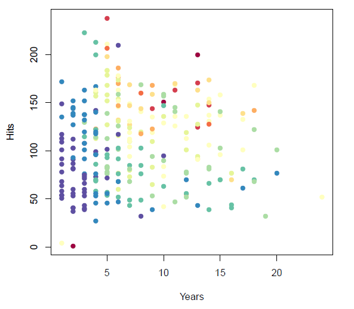

```{r setup, include=FALSE}
showsol<-TRUE
library(knitr)
opts_chunk$set(tidy.opts=list(width.cutoff=68),tidy=TRUE)
knitr::opts_chunk$set(echo = TRUE,tidy=TRUE,message=FALSE,warning=FALSE,strip.white=TRUE,prompt=FALSE,
                      cache=TRUE, size="scriptsize")
whichformat="latex"
```

---

Last update: March 1, 2020

--- 

# Acknowledgements

* A lot of this material stems from Mette Langaas and her TAs (in particular Thea Roksv\aa g, who developed the set of slides, but also Mette Langaas and Julia Debik). Thanks to Mette for the permission to use the material!

* Some of the figures and slides in this presentation are taken (or are inspired) from @james.etal.

---

# Introduction 

## Learning material for this module

\vspace{2mm}

* James et al (2013): An Introduction to Statistical Learning. Chapter 8.  
* All the material presented on these module slides.

<!-- * [Classnotes 04.03.2019](https://www.math.ntnu.no/emner/TMA4268/2019v/notes/M8L1notes.pdf)  -->
<!-- * [Classnotes 07.03.2019](https://www.math.ntnu.no/emner/TMA4268/2019v/notes/M8L2notes.pdf)  -->

 
---

## What will you learn?

\vspace{2mm}

You will get to know

* Decision trees
    * Regression trees  
    * Classification trees  
* Pruning a tree
* Bagging
* Variable importance
* Random forests
* Boosting

and learn how to apply all that.

--- 

## Example 1 (from chapter 8.1; `Hitters` data)
\vspace{1mm}

* Baseball players' salaries may depend on their experience (in years) and the number of hits.

* High salaries (yellow, red) vs low salaries (blue, green), salaries given on $\log$-scale. How can these be stratified for prediction of the salary? 

\centering
{width=60%}

---

## Main idea of tree-based methods
\vspace{2mm}

* Divide the area into rectangles with similar salaries. 

* Idea: Derive a set of decision (splitting) rules for segmenting the predictor space into a number of finer and finer regions. 


* All points in the same region will be given the same predictive value (the mean of all values in that square, or a majority vote).


 
Visualisaztion in two dimensions:

\centering
{width=50%}


---

The series of splitting rules can be visualized with a _regression tree_.

The following tree (which corresponds to the split in the previous slide) has three _leafs_ (terminal nodes), and two _internal nodes_:

$~$

\centering
 

{width=50%}


--- 

## More than two predictors?

\vspace{2mm}

* With more than two predictors we cannot draw the partition of the data in a coordinate system, but we can still draw the regression tree. 

* Before we discuss how the algorithm splits the data into regions, let us look at a somewhat more interesting example.


---

## Example 2: Detection of Minor Head Injury
\tiny
(Artificial data)
\vspace{2mm}

\normalsize

* Data from patients that enter hospital. The aim is to quickly assess whether a patient as a brain injury or not (binary outcome = classification problem).

* Patients are investigated and (possible) asked questions.

* Our job: To build a good model to predict quickly if someone has a brain injury. The method should be 

    +  **easy** to interpret for the medical personell that are not skilled in statistics, and 

    + **fast**, such that the medical personell quickly can identify a patient that needs treatment. 
    

    
$\rightarrow$ This can be done by using tree-based methods. 


\vspace{4mm}

\small
Note: Of course, the model should be built _before_ a new emergency patient arrives, using data that is already available.


---


The dataset includes data about 1321 patients and is a modified and smaller version of the (simulated) dataset `headInjury` from the `DAAG` library. 

\footnotesize

```{r,echo=FALSE}
library(DAAG)
options(digits=6)
headInjury2=read.table("headInjury2.txt",header=TRUE)
colnames(headInjury2)=c("amnesia","bskullf","GCSdecr","GCS.13","GCS.15","risk","consc","oskullf","vomit","brain.injury","age")

n=nrow(headInjury2)
set.seed(1)
train=sample(1:nrow(headInjury2),850)
test=setdiff(1:nrow(headInjury2),train)
headInjury2$brain.injury=factor(headInjury2$brain.injury)
for (i in 1:9) headInjury2[[i]]=as.factor(headInjury2[[i]])
#head(headInjury2[,c(1:9,11,10)])
head(headInjury2)
```
\normalsize

---


* The variable `brain.injury` will be the response of our model (=1 if a person has an acute brain injury, =0 otherwise). 

\vspace{0mm}

* 250 (19%) of the patients have a clinically important brain injury. 

\vspace{0mm}

* The 10 variables used as explanatory variables describe the state of the patient, for example

    + Is he/she vomiting?
    + Is the Glasgow Coma Scale (GCS) score\footnote{The GCS scale goes back to an article in the Lancet in 1974, and is used to describe the level of consciousness of patients with an acute brain injury. See <https://www.glasgowcomascale.org/what-is-gcs/>} after 2 hours equal to 15 (or not)?
    + Has he/she an open scull fracture?
    + Has he/she had a loss of consciousness?
    + and so on. 


---

The classification tree made from a training set of 850 randomly drawn observations (training set) for the head injury example looks like this:


```{r injury1, echo=FALSE, fig.width=7, fig.height=6,fig.align = "center",out.width='70%'}
library(tree)
headtree=tree(brain.injury~.,headInjury2,subset=train)
plot(headtree, type="uniform")
text(headtree,pretty=1)
```

<!-- ```{r injury2, echo=FALSE, fig.width=5, fig.height=4,fig.align = "center",out.width='70%'} -->
<!-- # competing method, gives different result due to other parameter defaults -->
<!-- library(rpart) -->
<!-- headrpart=rpart(brain.injury~.,headInjury2,subset=train,method="class") -->
<!-- plot(headrpart) -->
<!-- text(headrpart) -->
<!-- ``` -->

\small
Note: The split criterion at each node is to the left. For example, "GCS.15:0" means that "GCS.15=0" goes left, and "GCS.15=1" goes right.

---

\footnotesize
```{r,echo=TRUE,eval=TRUE}
print(headtree)
```
\normalsize

---

* By using simple decision rules related to the most important explanatory variables the medical staff can now assess the probability of a brain injury. 

* The decision can go "top down", because the most informative predictors are usually split first. 

* Example: The staff might check if the Glasgow Coma Scale of the patient is 15 after 2h, and if it was 13 at the beginning. In that case, the probability of brain injury is estimated to be 0.944 (node 7 in printout). 


**Advantages**:

* Decision trees are easier to interpret than many of the classification (and regression) methods that we have studied so far.

* Decision trees provide an easy way to visualize the data for non-statisticians.

---

## Some terminology 

* CARTs (Classification and regression trees) are usually drawn upside down, where the top node is called the *root*.

* The *terminal nodes* or *leaf nodes* are the nodes at the bottom. These are written symbolically as $R_j$ for $j = 1, 2, ..., J$ 

* The $R_j$ will be referred to as _non-overlapping regions_ and are high-dimensional rectangles (boxes).

* *Internal nodes* are all nodes between the root and the terminal nodes. These nodes correspond to the partitions of the predictor space.

* *Branches*: segment of the tree connecting the nodes.

\vspace{2mm}
We will consider only binary splits on one variable, but multiway splits and linear combination of variabes are possible - but not so common.

---

# Regression tree (continous outcome)

Assume that we have a dataset consisting of $n$ pairs $(\boldsymbol{x}_i,y_i)$, $i=1,\ldots,n$, and each predictor is ${\boldsymbol{x}}_i=(x_{i1},x_{i2},...,x_{ip})$. The aim is to predict $y_i$.

\vspace{2mm}
Two steps:

1. Divide the predictor space into non-overlapping regions $R_1,R_2,\ldots,R_J$.

2. For every observation that falls into region $R_j$ we make the same prediction - which is the mean of the responses for the training observations that fall into $R_j$.

\vspace{2mm}

**But**: How to divide the predictor space into non-overlapping regions $R_1,R_2,\ldots,R_J$? 

---

We could try to minimize the RSS (residual sums of squares) on the training set given by

$$
\text{RSS}=\sum_{j=1}^J \sum_{i \in R_j}(y_i-\hat{y}_{R_j})^2,
$$

where $\hat{y}_{R_j}$ is the mean response for the training observations in region $j$. The mean $\hat{y}_{R_j}$ is also the predicted value for a new observations that falls into region $j$. 

To do this we need to consider every partition of the predictor space, and compute the RSS for each partition.

**But**: An exhaustive search over possible splits is _computationally infeasible_! \footnote{In fact, constructing optimal binary decision trees is an NP-complete problem (Hyafil and Rivest, 1976).}

---

<!-- Ripley (1996, p 216): Two types of optimality. a) Optimality of the partitioning of the predictor space : only feasible for small dimensions. b)  -->


## Recursive binary splitting 

\vspace{2mm}

* A _greedy_ approach is taken (aka top-down) - called _recursive binary splitting_: Find a split that minimizes RSS at each step\footnote{This does not necessarily give the optimal global solution, but will give the best solution at each split, given what is done previously.}.

* We start at the top of the tree and divide the predictor space into two regions, $R_1$ and $R_2$ by making a decision rule for one of the predictors $x_1, x_2,...,x_p$. If we define the two regions by $R_1(j,s)=\{x \mid x_j<s\}$ and $R_2(j,s)=\{x \mid x_j\geq s\}$, it means that we need to find the (predictor) $j$ and (splitting point) $s$ that minimize
$$\sum_{i: x_i \in R_1(j,s)}(y_i-\hat{y}_{R_1})^2+\sum_{i: x_i \in R_2(j,s)}(y_i -\hat{y}_{R_2})^2 \ ,$$
where $\hat{y}_{R_1}$ and $\hat{y}_{R_2}$ are the mean responses for the training observations in $R_1(j,s)$ and $R_2(j,s)$ respectively. This way we get the two first branches in our decision tree.

---

* We repeat the process to make branches further down in the tree. 

* For every iteration we let each single split depend on _only one of the predictors_, giving us two new branches. 

* This is done _successively_ and in each step we choose the split that gives the _\textcolor{red}{best split at that particular step}_, _i.e.,_ the split that gives the smallest RSS. 

* However, this time, instead of splitting the entire predictor
space, we split only _\textcolor{red}{one of the previously identified regions}_.

* Continue splitting the predictor space until we reach some _stopping criterion_. For example we stop when a region contains less than 10 observations or when the reduction in the RSS is smaller than a specified limit.


\vspace{1mm}


**Q**: Why is this algorithm called _greedy_?

<!-- **A**: The winner takes it all, and don't consider splits that further down the tree might give a tree with a lower overall RSS. -->

---

## Regression tree: ozone example

\vspace{2mm}

Consider the `ozone` data set from the `ElemStatLearn` library. The data set consists of 111 observations on the following variables:

* `ozone` : the concentration of ozone in ppb
* `radiation`: the solar radiation (langleys)
* `temperature` : the daily maximum temperature in degrees F
* `wind` : wind speed in mph

```{r, echo=FALSE}
library(ElemStatLearn)
library(RColorBrewer)
myozone=ElemStatLearn::ozone
colnames(myozone)=c("ozone","radi","temp","wind")
```

\vspace{2mm}

\scriptsize
```{r, echo=TRUE}
head(myozone)
```


---

Let's fit a regression tree with `ozone` as our response variable and `temperature` and `wind` as predictors.

\scriptsize
```{r,echo=c(2:6,7)}
set.seed(300)
ozone.trainID = sample(1:111, 75)
ozone.train = myozone[ozone.trainID, ]
ozone.test = myozone[-ozone.trainID,]
```

\normalsize
Use the default settings in the tree function:
\scriptsize
```{r}
ozone.tree = tree(ozone~temp+wind, data=ozone.train)
```


```{r ozone1, echo=FALSE, fig.width=7, fig.height=6,fig.align = "center",out.width='60%'}
#par(pty="s")
plot(ozone.tree,type="uniform")
text(ozone.tree)
```


---

* We see that `temperature` is the "most important" predictor for predicting the ozone concentration. 
Observe that we can split on the same variable several times.

* Focus on the regions $R_j$, $j=1,\ldots, J$. What is $J$ here? 

<!-- Answer: $J=5$ (= the number of leaf nodes). -->

<!-- \vspace{2mm} -->
<!-- Below we see the partition of the `ozone` data set given in the `ozone.tree`, where  -->

<!-- * the ozone levels have been color-coded, where a darker color corresponds to a higher ozone concentration.  -->
<!-- * each rectangle corresponds to one leaf node.  -->
<!-- * each number corresponding to a leaf node has been found by taking an average of all observations (in the training set) in the corresponding region (rectangle).  -->
<!-- * each partition line corresponds to one internal node of a binary partition. -->


---

### Tree- vs region plot
\vspace{2mm}

```{r, eval=TRUE,echo=FALSE,fig.width=8, fig.height=5}
# to make two figures next to eachother
par(mfrow=c(1,2),pty="s")
o.class = cut(ozone.train$ozone, breaks= 7)
col.oz = brewer.pal(9, "BuGn")
palette(col.oz[3:9])
plot(ozone.tree,type="uniform")
text(ozone.tree,cex=0.8)
plot(wind~temp, col=o.class, data=ozone.train, pch=20)
partition.tree(ozone.tree, add=TRUE,cex=0.8)
```

\vspace{-2mm}
**Q**:

* Explain the connection between the tree and the region plot.
* Advantages and disadvantages of letting each single split depend on only one of the predictors?
* Does our tree include interactions between variables?

<!-- --- -->

<!-- **A:**  -->

<!-- * Each leaf node correspons to one region with prediction $\hat{y}_{R_j}$, and each internal note corresponds to a vertical or a horizontal line. -->

<!-- * If the true connection between the response onzone and temperature and wind was so that splits should have been made on the diagonal of the temperature and wind space, that would take many splits on each of temperature and wind to produce. (See more below where we ask the same question for the classification setting.) -->
<!-- * Yes, we may have different effect of wind for different values of temperature. -->

---

## R: function `tree` in library `tree`

\vspace{2mm}

* R package `tree` by Brian D. Ripley [@tree2019].

* You get information about the function when you type `?tree` into the `R` console.

* Note: The default choice for a function to minimize is the deviance, and for normal data (as we may assume for regression), the deviance is proportional to the RSS.

<!-- --- -->

<!-- * Tree growth is limited to a depth of 31 by the use of integers to label nodes. -->

<!-- * Factor predictor variables can have up to 32 levels. This limit is imposed for ease of labelling, but since their use in a classification tree with three or more levels in a response involves a search over $2^{(k-1)} - 1$ groupings for $k$ levels, the practical limit is much less. -->

* A competing R function is `rpart`, explained in <https://cran.r-project.org/web/packages/rpart/vignettes/longintro.pdf>


---

### Stopping criterion
\vspace{2mm}

* When building the tree, we can (in principle) split until each leaf corresponds to one data point.
* Usually we use a less stringent stopping criterion, like the minimal number of nodes per region and/or the minimum reduction in the RSS.

* For example, the default in `tree()`: is given by `mincut=5, minsize=10, mindev=0.01`, thus a minimal size of 5 nodes, the smallest nodes that are potentially split is 10, and the minimal reduction in deviance (RSS) equal to 0.01. 
* We could make the ozone tree much deeper by decreasing the minimal size of a region and chanding the minimum reduction in RSS:

\scriptsize
```{r, results="asis"}
ozone.tree2 = tree(ozone~temp+wind, 
                  data=ozone.train, 
                  control = tree.control(75, mincut = 2, minsize = 4, mindev = 0.001)
                  )
```

---

With the above command, the tree would become very fine. Overfitting?

```{r ozone2, echo=FALSE, fig.width=7, fig.height=6,fig.align = "center",out.width='70%'}
plot(ozone.tree2)
text(ozone.tree2,cex=0.8)
```


---


## Tree performance

\vspace{2mm}

* Test the predictive performance of our regression tree by using a training and a test set. 
* For the two trees (the shallow and the deep one from above), we get the following test MSEs:

\scriptsize
```{r}
ozone.pred = predict(ozone.tree, newdata=ozone.test)
ozone.MSE = mean((ozone.pred-ozone.test$ozone)^2)
ozone.MSE

ozone.pred2 = predict(ozone.tree2, newdata=ozone.test)
ozone.MSE2 = mean((ozone.pred2-ozone.test$ozone)^2)
ozone.MSE2
```

\vspace{1mm}

\normalsize
_\textcolor{red}{How do we know if our tree performs good, or if there would be trees with a better predictive performance?}_

---


# Pruning 

* If we have a data set with many predictors or choose a stringent stopping criterion, we may fit a (too) large tree. Thus, the number of observations from the training set that falls into some of the regions $R_j$ may be small $\rightarrow$ _\textcolor{red}{overfitting}_? 


* A smaller tree with fewer splits leads to fewer regions $R_1, \ldots, R_J$ with more observations. This might lead to lower variance and better interpretation at the cost of more bias.

* One possible alternative to the process described above is to grow the tree only so long as the decrease in the RSS due to each split exceeds some (high) threshold.

* This strategy will result in smaller trees, but is _\textcolor{red}{too short-sighted}_: a seemingly worthless split early on in the tree might be followed by a very good split — that is, a split that leads to a large reduction in RSS later on.


---

## Cost complexity pruning 

* Better idea: to grow a very large tree $T_0$, and then _\textcolor{red}{prune}_ it back in order to obtain a _\textcolor{red}{subtree}_.


* _\textcolor{red}{Cost complexity pruning}_ is used for this: We try to find a subtree $T\subset T_0$ that (for a given value of $\alpha$) minimizes
$$
C_{\alpha}(T)=Q(T)+\alpha |T|,
$$
where $Q(T)$ is our cost function, $|T|$ is the number of terminal nodes in tree $T$. The parameter $\alpha$ is then a parameter penalizing the number of terminal nodes, ensuring that the tree does not get too many branches. 


* For regression trees (continous outcome) we choose 
$$Q(T)=\sum_{m=1}^{|T|}\sum_{x_i\in R_m}(y_i - \hat{y}_{R_m})^2 \ .$$


---

* For $\alpha>0$ we get a pruned tree (note: the same pruned tree within a small range of $\alpha$).

* For $\alpha=0$ we get $T_0$. 

* As $\alpha$ increases we get shorter and shorter trees.


So, which value of $\alpha$ is best?

* We can use $K$-fold cross-validation to find out!

* Importantly, by increasing $\alpha$, branches get pruned in a _hierarchical (nested) fashion_.


Please study this [note from Bo Lindqvist in MA8701 in 2017 - Advanced topics in Statistical Learning and Inference](https://www.math.ntnu.no/emner/TMA4268/2018v/notes/CART1MA87012017BoLindqvist.pdf) for an example of how we perform cost complexity pruning in detail. Alternatively, this method, with proofs, are given in @Ripley, Section 7.2.


---

## Building a regression  tree: Algorithm 8.1

1. Use recursive binary splitting to grow a large tree on the training
data, stopping only when each terminal node has fewer than some
minimum number of observations.

2. Apply cost complexity pruning to the large tree in order to obtain a
sequence of best subtrees, as a function of $\alpha$.

3. Use $K$-fold cross-validation to choose $\alpha$. That is, divide the training
observations into $k$ folds. For each $k = 1,\ldots, K$:
      + Repeat Steps 1 and 2 on all but the $k$th fold of the training data.
      + Evaluate the mean squared prediction error on the data in the left-out $k$th fold, as a function of $\alpha$.
      + Average the results for each value of $\alpha$, and pick $\alpha$ to minimize the average error.
      
4. Return the subtree from Step 2 that corresponds to the chosen value of $\alpha$.


---

### Pruning the ozone tree

Let us start with the tree with many leaves, and then prune it with 5-fold CV. We can then plot the CV error as a function of tree size (instead of $\alpha$ -- why?):

\scriptsize
```{r ozone.cv, echo=TRUE, fig.width=6, fig.height=5,fig.align = "center",out.width='50%'}
set.seed(563)
ozone.tree <- tree(ozone~temp+wind, 
                  data=ozone.train, 
                  control = tree.control(nrow(myozone), mincut = 2, minsize = 4, mindev = 0.001)
                  )
cv.ozone <- cv.tree(ozone.tree,K=5)
plot(cv.ozone$dev ~  cv.ozone$size,type= "b", lwd=2, col="red", xlab="Tree Size", ylab="Deviance")
```

\normalsize
Interestingly, a tree with 5 leaves performs best - which corresponds to the original choice.

<!-- --- -->

<!-- If we have a large dataset with many explanatory variables and terminal nodes, we can also prune the tree if we want to create a simpler tree and increase the interpretability of the model. -->

<!-- In the [classification tree](classtree2) (grown with deviance) we saw that we got several unnecessary splits. This is also something that can be avoided by pruning.  -->

<!-- In the [classification tree](classtree3) (grown with Gini index) there were 78 leafs - maybe we want a more easily interpretable tree? -->

<!-- But, there are many possible pruned versions of our full tree. Can we investigate all of these? -->


---

# Classification trees (binary or categorical outcome)

\vspace{2mm}

* Remember the minor head injury example: Binary outcome (disease yes/no).

\vspace{1mm}

* Now allow for $K\geq 2$ number of classes for the response.

\vspace{1mm}

* Building a decision tree in this setting is similar to building a regression tree for a quantitative response, but there are two main differences: _the prediction_ and _the splitting criterion_.

---

**1) The prediction:**   

* In the regression case we use the mean value of the responses in $R_j$ as a prediction for an observation that falls into region $R_j$. 
\vspace{2mm}

* For the _\textcolor{red}{classification case}_, however, we have two possibilities: 

    * **Majority vote**: Predict that the observation belongs to the most commonly occurring class of the training observations in $R_j$.  
    * Estimate the **probability** that an observation $x_i$ belongs to a class $k$, $\hat{p}_{jk}(x_i)$, and then classify according to a **threshold value**. This estimated probability is the proportion of class $k$ training observations in region $R_j$, with $n_{jk}$ observations. Region $j$ has $N_j$ observations
    $$\hat{p}_{jk} = \frac{1}{N_j} \sum_{i:x_i \in R_j} I(y_i = k)=\frac{n_{jk}}{N_j}.$$ 

---

**2) The splitting criterion:**  We do not use RSS as a splitting criterion for a qualitative variable. Instead we can use some _measure of impurity_ of the node. For leaf node $j$ and class $k=1,\ldots, K$:

* **Gini index**:
$$
G=\sum_{k=1}^K \hat{p}_{jk}(1-\hat{p}_{jk}) \ ,
$$
which is small if all of the $\hat{p}_{jk}$'s are close to 0 or 1.

\vspace{1mm}

* **Cross entropy**:
$$
D=-\sum_{k=1}^K \hat{p}_{jk}\log\hat{p}_{jk} \ .
$$
Here $\hat{p}_{jk}$ is the proportion of training observation in region $j$ that are from class $k$. 


When making a split in our classification tree, we want to minimize the Gini index or the cross-entropy.

---

Why don't we just minimize the misclassification error $$E= 1- \max_k{\hat{p}_{jk}} \ ?$$

**A**: 

* The Gini index and Entropy are _measure of impurity_. They are more sensitive to changes in the node probabilities. 

* Example for two classes: Assume we have two classes with 400 nodes each, written as $(400,400)$. Now we can choose between two splits:
    + Split 1: (100,300) and (300,100)  
    + Split 2: (200,400) and (200,0).

Both splits result in 25% misclassification. Which of these splits is better? Probably the second one, because it produces a _pure node_.


---

* Moreover, The Gini index and Entropy are differentiable (preferred for numerical optimization!)

```{r purity, echo=FALSE, fig.width=6, fig.height=5,fig.align = "center",out.width='60%'}
p=seq(0.001,0.999,length=1000)
gini=2*p*(1-p)
ent=-p*log(p)-(1-p)*log(1-p)
misc= pmin(1-p,p)
plot(p,misc,xlab="p",ylab="",ylim=c(0,0.5),type="l",main="K=2")
lines(p,ent*(0.5/max(ent)),col="red")
lines(p,gini,col="blue")
legend(0.3,0.2,legend=c("misclassification","cross-entropy","Gini"),fill=c("black","red","blue"))
```

---

### Minor head injury - split with cross-entropy

\vspace{1mm}

We use the 850 training samples to get a tree using cross-entropy (deviance):


\scriptsize
```{r}
tree.HIClass=tree(brain.injury~.,
                  data=headInjury2,
                  subset=train,split="deviance")
summary(tree.HIClass)

```

 

<!-- Deviance=$-2 \sum_{j}\sum_{k}n_{jk}\log(\hat{p}_{jk})$ for all nodes $j$ and classes $k$. -->
<!-- (Formula on page 255 of @MASS.) -->
 
\vspace{6mm}
**Remark**: the deviance ($-2\log(L)$) is a scaled version of the cross entropy: 
$$-2\sum_{k=1}^K n_{jk} \log\hat{p}_{jk}\ , \text{where} \quad   \hat{p}_{jk}=\frac{n_{jk}}{N_j}\ , $$ thus `split="deviance"` implies that we split according to the entropy criterion.

---


\scriptsize
```{r headInjury, echo=TRUE, fig.width=6, fig.height=5,fig.align = "center",out.width='50%'}
plot(tree.HIClass,type="proportional")
text(tree.HIClass,pretty=1)
```

\normalsize

* With `type="proportional" `, the length of branches are now proportional to the decrease in impurity.

* The classification tree has two terminal nodes with factor "0" originating from the same branch. Why do we get this "unnecessary" split? (Hint: Node purity)

---

### Minor head injury - split with Gini index

\vspace{2mm}

The same analysis with the Gini index:

\vspace{2mm}

\scriptsize
```{r}
tree.HIClassG=tree(brain.injury~.,headInjury2,
                  subset=train,split="gini")
summary(tree.HIClassG)
```


---

\scriptsize
```{r headInjury2, echo=TRUE, fig.width=8, fig.height=6,fig.align = "center",out.width='70%'}
plot(tree.HIClassG,type="proportional")
text(tree.HIClassG,pretty=1)
```

\normalsize

This is a very bushy tree!

---

### Checking predictions
\vspace{2mm}

We also use the classification tree to predict the status of the patients in the test set. 

$~$

With the deviance: 

$~$

\tiny

```{r}
library(caret)
tree.pred=predict(tree.HIClass,headInjury2[test,],type="class")
(confMat <- confusionMatrix(tree.pred,reference=headInjury2[test,]$brain.injury)$table)
1 - sum(diag(confMat))/sum(confMat[1:2, 1:2])
```


---

\normalsize

With the Gini-index:

$~$

\tiny

```{r}
tree.predG=predict(tree.HIClassG,headInjury2[test,],type="class")
(confMatG <- confusionMatrix(tree.predG,reference=headInjury2[test,]$brain.injury)$table)
1 - sum(diag(confMatG))/sum(confMatG[1:2, 1:2])
```

---

Study the confusion matrices on the previous slide:

* Which algorithm makes more errors?

* Is one type of mistakes more severe than the other? 

* Discuss if/how it is possible to change the algorithm in order to decrease the number of severe mistakes.

<!-- Idea: If one type of errors is more severe, can change the threshold for prediction. -->


---

## Building a classification tree: Algorithm 8.1

\vspace{2mm}

* Like for regression trees, we would like to find classification trees that are good at prediction.

* Algorithm 8.1 can be used with misclassification, the Gini index, or cross-entropy instead of the RSS as quality measure.

---


### Finding an optimal classification tree 
\vspace{2mm}

We prune the classification tree that was built with the deviance criterion. We use the misclassification error to do so\footnote{While trees should be built using the deviance or the Gini index, pruning is typically done with the misclassification criterion.}:

\vspace{3mm}

\scriptsize

```{r headInjury3, echo=TRUE, fig.width=5, fig.height=4,fig.align = "center",out.width='50%'}
set.seed(1)
cv.head=cv.tree(tree.HIClass, FUN= prune.misclass)
plot(cv.head$size,cv.head$dev,type="b",
                   xlab="Terminal nodes",ylab="Misclassifications")
```


 
<!-- I think it is not possible to prune according to the Gini index - why?? -->


---

The function `cv.tree` automatically does $10$-fold cross-validation. `dev` is here the number of misclassifications.

\vspace{3mm}

\scriptsize

```{r}
print(cv.head)
```

---

* We have done cross-validation on our training set of 850 observations. According to the plot, the number of misclassifications is as low for 7, 8 or 9 nodes, so we choose 7 terminal nodes as the smallest model (lowest variance). 

* We prune the classification tree according to this value:

\vspace{4mm}

\scriptsize
```{r}
prune.HIClass=prune.misclass(tree.HIClass,best=7) 
```

---

\scriptsize
```{r headInjury4, echo=TRUE, fig.width=6, fig.height=5,fig.align = "center",out.width='60%'}
plot(prune.HIClass)
text(prune.HIClass,pretty=1)
```


\normalsize
$\rightarrow$ No unnecessary splits left, and we have a simple and interpretable decision tree. 

How is the predictive performance of the model affected?

---

\scriptsize

```{r}
tree.pred.prune <- predict(prune.HIClass,headInjury2[test,],type="class")
(confMat <- confusionMatrix(tree.pred.prune,headInjury2[test,]$brain.injury)$table)
1 - (sum(diag(confMat))/sum(confMat[1:2,1:2]))
```

\normalsize

\vspace{4mm}

$\rightarrow$ We see that the misclassification rate is as small as before, thus the pruned tree is as good as the original tree for the test data.

\vspace{2mm}

$\rightarrow$ If you want, you can apply the same pruning procedure to the very bushy Gini-grown tree.

---


<!-- \scriptsize -->

<!-- ```{r headInjury5, echo=TRUE, fig.width=6, fig.height=5,fig.align = "center",out.width='60%'} -->
<!-- set.seed(10) -->
<!-- cv.headG=cv.tree(tree.HIClassG,FUN=prune.misclass) -->
<!-- plot(cv.headG$size,cv.headG$dev,type="b", -->
<!--                    xlab="Terminal nodes",ylab="Misclassifications") -->

<!-- ``` -->


<!-- --- -->


<!-- \scriptsize -->

<!-- ```{r headInjury6, echo=TRUE, fig.width=7, fig.height=5,fig.align = "center",out.width='70%'} -->
<!-- prune.HIClassG=prune.misclass(tree.HIClassG,best=7)  -->
<!-- plot(prune.HIClassG) -->
<!-- text(prune.HIClassG,pretty=1) -->
<!-- ``` -->


<!-- \normalsize -->

<!-- Compare this tree to the one from pruning the deviance-based tree. -->


\vspace{2mm}


### Questions: 

\vspace{2mm}

Discuss the bias-variance tradeoff of a regression tree when increasing/decreasing the number of terminal nodes, i.e: 

\vspace{2mm}

* What happens to the bias?
* What happens to the variance of a prediction if we reduce the tree size? 

<!-- --- -->

<!-- **A**: -->

<!-- As the tree size increase the bias will decrease, and the variance will increase. This is the same as any other method when we increase the model complexity. -->


---

# Trees versus linear models


* What if we have $x_1$ and $x_2$ and the true class boundary (two classes) is linear in $x_1$, $x_2$ space. How can we do that with our binary recursive splits?


* What about a rectangular boundary?


\centering
{width=50%}


---

# From trees to forests

**Advantages (+)**

* Trees automatically select variables.
* Tree-growing algorithms scale well to large $n$, growing a tree greedily.
* Trees can handle mixed features (continouos, categorical) seamlessly, and can deal with missing data.
* Small trees are easy to interpret and explain to people.
* Some believe that decision trees mirror human decision making.
* Trees can be displayed graphically.

**Disadvantages (-)**

* Large trees are not easy to interpret.
* Trees do not generally have good prediction performance (high variance).
* Trees are not very robust, a small change in the data may cause a large change in the final estimated tree.

---

## What is next?

\vspace{2mm}

Several of the above listed disadvantages can be addressed by 
\vspace{2mm}


* **Bagging**: grow many trees (from bootstrapped data) and average - to get rid of the non-robustness and high variance by averaging.

* **Random forests**: inject more randomness (and even less variance) by just allowing a random selection of predictors to be used for the splits at each node.

* **Boosting**: make one tree, then another based on the residuals from the previous, repeat. The final predictor is a weighted sum of these trees.

\vspace{2mm}

In addition:

\vspace{2mm}

* **Variable importance** - to see which variables make a difference (now that we have many trees).


---

## Leo Breiman - the inventor of CART, bagging and random forests

\vspace{1mm}
Quotation from [Wikipedia](https://en.wikipedia.org/wiki/Leo_Breiman)
\vspace{1mm}

\begin{quote}
Leo Breiman (January 27, 1928 – July 5, 2005) was a distinguished statistician at the University of California, Berkeley. He was the recipient of numerous honors and awards, and was a member of the United States National Academy of Science.

Breiman's work helped to bridge the gap between statistics and computer science, particularly in the field of machine learning. His most important contributions were his work on classification and regression trees and ensembles of trees fit to bootstrap samples. Bootstrap aggregation was given the name bagging by Breiman. Another of Breiman's ensemble approaches is the random forest.
\end{quote}

See also [Breimans obituary](https://www.berkeley.edu/news/media/releases/2005/07/07_breiman.shtml)

<!-- --- -->

<!-- From [Breimans obituary](https://www.berkeley.edu/news/media/releases/2005/07/07_breiman.shtml) -->
<!-- \vspace{1mm} -->

<!-- \begin{quote} -->
<!-- BERKELEY – Leo Breiman, professor emeritus of statistics at the University of California, Berkeley. -->

<!-- "It is trite to say so, but Leo Breiman was indeed a Renaissance man, and we shall miss him greatly," said Peter Bickel, professor of statistics and chairman this summer of UC Berkeley's statistics department. -->

<!-- Breiman retired in 1993, but as a Professor in the Graduate School, he continued to get substantial National Science Foundation grants and supervised three Ph.D. students. Bickel said that some of Breiman's best work was done after retirement. -->

<!-- \end{quote} -->

<!-- --- -->

<!-- \begin{quote} -->
<!-- "In particular," said Bickel, "he developed one of the most successful state-of-the-art classification programs, 'Random Forest.' This method was based on a series of new ideas that he developed in papers during the last seven years, and it is extensively used in government and industry." -->

<!-- Breiman's best known work is considered to be "Classification and Regression Trees," a work in collaboration with three other scholars that facilitates practical applications, such as the diagnosis of diseases, from a multitude of symptoms. -->

<!-- \end{quote} -->

<!-- --- -->

---

# Bagging 

\vspace{2mm}

* Decision trees often suffer from high variance. By this we mean that the trees are sensitive to small changes in the predictors: If we change the observation set, we may get a very different tree. 

* Another way to understand "high variance" is that, if we split our training data into two parts and fit a tree on each, we might get rather different decision trees.

\vspace{2mm}

Let's draw a new training set (`train2`) for our data and see what happens if we fit our full classification tree (deviance grown).

---

The two classification trees contructed from $850$ observations each (different random subsets):

 

```{r headInjury7, echo=FALSE, fig.width=9, fig.height=5,fig.align = "center",out.width='90%'}
set.seed(33)
N=dim(headInjury2)[1]
train2=sample(1:N,850) # Draw a new training sample (same size).
tree.HIClass2=tree(brain.injury~.,
                   data=headInjury2,subset=train2,split="deviance") 
par(mfrow=c(1,2))
plot(tree.HIClass);text(tree.HIClass,pretty=0)
plot(tree.HIClass2);text(tree.HIClass2,pretty=0)

```


* We get two different trees that will give different predictions for a test set.

$\rightarrow$ To reduce the variance of decision trees we can apply _bootstrap aggregating_ (_bagging_), invented by Leo Breiman in 1996 [@Breiman1996].

---

## Recall: Variance for independent datasets

\vspace{2mm}

* Assume we have $B$ _i.i.d._ observations of a random variable $X$ each with the same mean and with variance $\sigma^2$. We calculate the mean $\bar{X} = \frac{1}{B} \sum_{b=1}^B X_b$. The variance of the mean is
$$\text{Var}(\bar{X}) = \text{Var}\Big(\frac{1}{B}\sum_{b=1}^B X_b \Big) = \frac{1}{B^2} \sum_{b=1}^B \text{Var}(X_b) = \frac{\sigma^2}{B}.$$
By averaging we get reduced variance. This is the basic idea!

 

* For decision trees, if we have $B$ training sets, we could estimate $\hat{f}_1({\boldsymbol x}),\hat{f}_2({\boldsymbol x}),\ldots, \hat{f}_B({\boldsymbol x})$ and average them as
$$ \hat{f}_{avg}({\boldsymbol x})=\frac{1}{B}\sum_{b=1}^B \hat{f}_b({\boldsymbol x}) \ .$$

However, we do not have many independent data set - so we use _bootstrapping_ to construct $B$ data sets.

---

## Recall: Bootstrapping 

\vspace{2mm}

* Problem: we want to draw samples from a population with distribution $f$.

* But: we do not know $f$ and do not have a population to draw from, we only have our one sample.

* Solution: we may use our sample as an empirical estimate for the distribution $f$ - by assuming that each sample point has probability $1/n$ for being drawn. 

* Therefore: we draw _\textcolor{red}{with replacement}_ $n$ observations from our sample - and that is our first _bootstrap sample_.

* We repeat this $B$ times and get $B$ bootstrap samples - that we use as our $B$ data sets.

---

## Bagging = Bootstrap aggregating 

\vspace{2mm}

* Idea: For each bootstrap sample $b=1,\ldots, B$ we construct a decision tree, $\hat{f}^{*b}(x)$, and we then use information from all of the trees to draw inference. 

* For a _regression tree_, we take the average of all of the predictions and use this as the final result:
$$
\hat{f}_{bag}(x)=\frac{1}{B}\sum_{b=1}^B \hat{f}^{*b}(x).
$$

* For a _classification tree_ we record the predicted class (for a given observation $x$) for each of the $B$ trees and use the most occurring classification (_majority vote_) as the final prediction - or alternatively average posterior probabilities for each class.

---

* Originally, @Breiman1996 suggested to prune each tree, but later research has found that it is better to leave the trees at maximal size (a bushy tree), to make the trees as different from each other as possible\footnote{Note also that deeper trees have smaller bias.}.

\vspace{1mm}

* The number $B$ is chosen to be as large as "necessary". An increase in $B$ will not lead to overfitting, and $B$ is not regarded as a tuning parameter. If a goodness of fit measure is plotted as a function of $B$ (soon) we see that (given that $B$ is large enough) increasing $B$ will not change the goodness of fit measure.

\vspace{1mm}

* To find out which number $B$ is sufficient, we do _not_ need to run cross-validation, but can do something smarter (next slide).


---

## Out-of-bag error estimation

\vspace{1mm}

* Recall (module 5) that the probability that an observation is in the bootstrap sample is approximately $1-e^{-1}$=`r round(1-exp(-1),2)` ($\approx 2/3$).

* When an observation is left out of the bootstrap sample it is not used to build the tree, and we can use this observation as a part of a "test set" to measure the predictive performance and error of the fitted model, $\hat{f}^{*b}(x)$. 

* For $B$ bootstrap samples, observation $i$ will be outside the bootstrap sample in approximately $B/3$ of the fitted trees. Obtain a single prediction by averaging (regression problem) or taking the majority vote/mean probability (classification problem) of the $B/3$ predictions.

\vspace{2mm}

**Terminology:**

* The observations left out are referred to as the _\textcolor{red}{out-of-bag}_ (OOB) observations.

* The measured error of the $B/3$ predictions is called the _\textcolor{red}{out-of-bag error}_. 


<!-- Based on these $B/3$ predictions we can make one single prediction (_OOB prediction_) and measure the prediction error (_OOB error_).  -->

---

## Example

\vspace{1mm}

We can do bagging by using the function `randomForest()` in the `randomForest` library.

\vspace{2mm}

\scriptsize

```{r}
library(randomForest)
set.seed(1)
r.brain.bag <- randomForest(brain.injury~.,
                 data=headInjury2,subset=train,
                 mtry=10,ntree=500,importance=TRUE)
r.brain.bag$confusion
1-sum(diag(r.brain.bag$confusion))/sum(r.brain.bag$confusion[1:2,1:2])
```
\normalsize

\vspace{4mm}

The variable `mtry=10` because we want to consider all $10$ predictors in each split of the tree. The variable `ntree=500` because we want to average over $500$ trees.


---

Predictive performance of the bagged tree on unseen test data:

\vspace{2mm}

\scriptsize

```{r}
yhat.bag=predict(r.brain.bag,newdata=headInjury2[test,])
misclass.bag=table(yhat.bag,headInjury2[test,]$brain.injury)
print(misclass.bag)
1-sum(diag(misclass.bag))/(sum(misclass.bag))
```

\normalsize

Note: The misclassification rate has increased slightly for the bagged tree (as compared to our previous full and pruned tree). **Typically, we would expect an improvement!**

---

<!-- ## Prediction by majority vote vs. by averaging the probabilities  -->

<!-- \vspace{1mm} -->

<!-- * Consider the case when you have grown $B$ classification tree with a binary response with classes 0 and 1. You might wonder which approach to choose to make a final prediction: majority vote or an average of the probabilities? Or would the prediction be the same in each case?  -->

<!-- \vspace{1mm} -->

<!-- * The difference between these two procedures can be compared to the difference between the mean value and median of a set of numbers. If we average the probabilities and make a classification thereafter, we have the mean value. If we sort all of our classifications, so that the classifications corresponding to one class would be lined up after each other, followed by the classifications corresponding to the other class we obtain the median value.  -->

<!-- --- -->

<!-- We examine this by an example:  -->

<!-- Suppose we have $B=5$ (no, $B$ should be higher - this is only for illustration) classification tree and have obtained the following 5 estimated probabilities: \{0.4, 0.4, 0.4, 0.4, 0.9 \}. If we average the probabilities, we get 0.5, and if we use a cut-off value of 0.5, our predicted class is 1. However, if we take a majority vote, using the same cut of value, the predicted classes will be \{0, 0, 0, 0, 1 \}. The predicted class, based on a majority vote, would accordingly be 0. -->

<!-- The two procedures thus have their pros and cons: By averaging the predictions no information is lost. We do not only get the  final classification, but the probability for belonging to the class 0 or 1. However, this method is not robust to outliers. By taking a majority vote, outliers have a smaller influence on the result.  -->

<!-- --- -->

## When should we use bagging?

\vspace{2mm}

Bagging can also be used for prediction methods (regression and classification) that are not trees. 

* According to @Breiman1996 Bagging can improve accuracy when, 

    * the vital element is the instability of the prediction method.
    * perturbing the learning set can cause significant changes in the predictor constructed.

\vspace{4mm}

@Breiman1996 suggests that these methods should be suitable for bagging:

\vspace{2mm}

* Neural nets
* Classification and regression trees
* Subset selection in linear regression

<!-- \vspace{1mm} -->

<!-- However, bagging is not suitable for nearest neighbour classification, since the stability of these methods with respect to perturbations of the data distinguishes them from competitors such as trees and neural nets. -->

---


## Variable importance plots

\vspace{1mm}

* Bagging typically (but not always) improves accuracy of predictions.

\vspace{1mm}

* Drawback: It becomes difficult to interpret the results. Instead of having one tree, the resulting model consists of many trees (it is an _ensemble method_). So, which predictors are (how) important?

\vspace{1mm}

* _\textcolor{red}{Variable importance plots}_ show _the relative importance of the predictors:_ the predictors are sorted according to their importance, such that the top variables have a higher importance than the bottom variables. 

\vspace{1mm}

* There are in general two types of variable importance plots: 

    * variable importance based on decrease in node impurity.
    * variable importance based on randomization.

---

### Variable importance based on node impurity

\vspace{1mm}

The term *important* relates to _total decrease in the node impurity, over splits for a predictor_, and is defined differently for regression trees and classification trees.

\vspace{4mm}

**Regression trees:** 


* The importance of each predictor is calculated using the RSS. 
* The algorithm records the total amount that the RSS is decreased due to splits for each predictor (there may be many splits for one predictor for each tree). 
* This decrease in RSS is then averaged over the $B$ trees.

\vspace{1mm}
**Classification trees:** 

* The importance of each predictor is calculated using the Gini index. 
* The importance is the mean decrease (over all $B$ trees) in the Gini index by splits of a predictor.


\vspace{3mm}
**R-hint**: `varImpPlot()` function (or `importance`) in `randomForest` with `type=2`.

---

### Example 1: Ozone data (regression tree)

\vspace{1mm}


\scriptsize
```{r ozoneImp, echo=TRUE, fig.width=6, fig.height=5,fig.align = "center",out.width='50%'}
set.seed(4268)
ozone.rf <- randomForest(ozone~temp+wind, data=ozone.train, ntree=500, mtry=2,keep.forest=FALSE,importance=TRUE)
varImpPlot(ozone.rf,type=2,pch=20)
```

\vspace{2mm}
\normalsize
This is a bit boring (only two predictors). More interesting example?

---

### Example 2: Auto data (regression tree)

\vspace{1mm}

The data relates fuel consumption (`mpg`) to 10 aspects of automobile desing and performance.

\vspace{2mm}

\scriptsize

```{r autoImp, echo=TRUE, fig.width=6, fig.height=5,fig.align = "center",out.width='50%'}
data(mtcars)
mtcars.rf <- randomForest(mpg ~ ., data=mtcars, ntree=1000, 
                          keep.forest=FALSE,
                          mtry=10,
                          importance=TRUE)
varImpPlot(mtcars.rf,type=2,pch=20)
```

---

### Example 3: Head injury (classification tree)

\vspace{1mm}

\scriptsize

```{r brain, echo=TRUE, fig.width=6, fig.height=5,fig.align = "center",out.width='50%'}
varImpPlot(r.brain.bag,type=2,pch=20)
```

---

### Another approach: Variable importance based on randomization

\vspace{2mm}

Variable importance based on randomization is calculated using the OOB sample. 
\vspace{1mm}

* Computations are carried out for one bootstrap sample at a time. 
* Each time a tree is grown the OOB sample is used to test the predictive power of the tree. 
* Then for one predictor at a time, repeat the following: 
     + permute the OOB observations for the $j$th variable $x_j$ and calculate the new OOB error. 
     + If $x_j$ is important, permuting its observations will decrease the predictive performance. 
* The difference between the two is averaged over all trees (and normalized by the standard deviation of the differences). 


\vspace{4mm}
**R-hint**: `varImpPlot()` (or `importance()`) function with `type=1`.

---

\scriptsize
```{r autoImp2, echo=TRUE, fig.width=6, fig.height=5,fig.align = "center",out.width='50%'}
varImpPlot(mtcars.rf,type=1,pch=20)
```


---

The two types together: do they agree?

\scriptsize
```{r autoImp3, echo=TRUE, fig.width=6, fig.height=5,fig.align = "center",out.width='70%'}
varImpPlot(mtcars.rf,pch=20,main="")
```

---

# Random Forests 

 

* If there is a strong predictor in the dataset, the decision trees produced by each of the bootstrap samples in the bagging algorithm becomes very similar: Most of the trees will use the same strong predictor in the top split. 

* We have seen this for our example trees for the minor head injury example, the predictor `GCS.15` was chosen in the top split every time. This is probably the case for a large amount of the bagged trees as well.

* Not optimal, as we get $B$ trees that are highly correlated. We don't get a large reduction in variance by averaging $\hat{f}^{*b}(x)$ when the correlation between the trees is high. 

* We actually even saw a decrease in the predictive performance for the bagged tree compared to the pruned tree and the full tree.


---

## The effect of correlation on the variance of the mean

\vspace{3mm}

* The variance of the average of $B$ observations of _i.i.d._ random variables $X$, each with variance $\sigma^2$ is $\frac{\sigma^2}{B}$. Now, suppose we have $B$ observations of a random variable $X$ which are identically distributed, each with mean $\mu$ and variance $\sigma^2$, but not independent. 

* That is, suppose the variables have a positive correlation $\rho$
$$\text{Cov}(X_i, X_j) = \rho \sigma^2, \quad i \neq j.$$

---

The variance of the average is 
$$\begin{aligned} \text{Var}(\bar{X}) &= \text{Var}\Big( \frac{1}{B}\sum_{i=1}^B X_i \Big) \\
&= \sum_{i=1}^B \frac{1}{B^2} \text{Var} (X_i) + 2 \sum_{i=2}^B \sum_{j=1}^{i-1} \frac{1}{B^2} \text{Cov} (X_i, X_j) \\
&= \frac{1}{B} \sigma^2 + 2 \frac{B(B-1)}{2}\frac{1}{B^2} \rho \sigma^2 \\
&= \frac{1}{B} \sigma^2 + \rho \sigma^2 - \frac{1}{B} \rho \sigma^2 \\
&= \rho \sigma^2 + \frac{1-\rho}{B}\sigma^2\\
&= \frac{1-(1-B)\rho}{B} \sigma^2\\ \end{aligned}$$

Check: $\rho=0$ and $\rho=1$? 

<!-- (Most negative values of $\rho$ will not give a positive definite covariance matrix. The covariance matrix is positive definite if $\rho>-1/(B-1)$.) -->

```{r,eval=FALSE,echo=FALSE}
varmean=function(B=100,rho,sigma2=1) return(sigma2*(1-(1-B)*rho)/B)
rhovec=seq(-1,1,length=100)
plot(rhovec,varmean(rho=rhovec),type="b")
```


---

* _Random forests_ provide an improvement over bagged trees by a small tweak that _\textcolor{red}{decorrelates the trees}_. This
reduces the variance when we average the trees.

* As in bagging, we build a number of decision trees on bootstrapped training samples.

* But each time a split in a tree is considered, a _random selection_ of $m$ predictors is
chosen as split candidates from the full set of $p$ predictors.
The split is allowed to use only one of those m predictors.

* A fresh selection of $m$ predictors is taken at each split, typically 
    * $m\approx \sqrt p$ (classification),  
    * $m=p/3$ (regression).

\vspace{2mm}

The general idea is that for very correlated predictors $m$ is chosen to be small.


---

### How many trees?

\vspace{2mm}

* The number of trees, $B$, is not a tuning parameter, and the best is to choose it large enough. 

* If $B$ is sufficiently large (three times the number needed for the random forest to stabilize), the OOB error estimate is equivalent to LOOCV [see @Efron_Hastie2016, p. 330].

---

ISLR Figure 8.10, gene expression data set with 15 classes and 500 predictors:
\vspace{-3mm}

\centering
{width=80%}

---

## Example 

\vspace{2mm}

We decorrelate the brain injury classification trees by using the `randomForest()` function again, but this time we set `mtry=3` (instead for `mtry=10`). This means that the algorithm only considers three of the predictors in each split. We choose $3$ because we have $10$ predictors in total and $\sqrt{10}\approx 3$. 

\vspace{2mm}

\scriptsize

```{r}
set.seed(1)

r.brain.rf = randomForest(brain.injury~.,
                data=headInjury2,subset=train,
                mtry=3,ntree=500,importance=TRUE)

```

---

We check the predictive performance as before:

\scriptsize

```{r}
r.brain.rf$confusion
1-sum(diag(r.brain.rf$confusion[1:2,1:2]))/(sum(r.brain.rf$confusion[1:2,1:2]))

yhat.rf=predict(r.brain.rf,newdata=headInjury2[test,])

misclass.rf=table(yhat.rf,headInjury2[test,]$brain.injury)
print(misclass.rf)

1-sum(diag(misclass.rf))/(sum(misclass.rf))
```
\normalsize

The misclassification rate is slightly decreased compared to the bagged tree (and to the pruned tree).

---

By using the `varImpPlot()` function we can study the importance of each predictor.

\scriptsize
```{r brainImp, echo=TRUE, fig.width=8, fig.height=5,fig.align = "center",out.width='70%'}
varImpPlot(r.brain.rf,pch=20, main="")
```

\normalsize

As expected `GCS.15` (GCS=15 at 2h) is a strong predictor along with `bskullf` (basal skull facture) and `age`. This means that most of the trees will have these predictors in the top split.

---

## Iris example -- bagging
\tiny
(borrowed from \url{https://gist.github.com/ramhiser/6dec3067f087627a7a85})

\vspace{3mm}

\scriptsize

```{r, echo=FALSE}
library(dplyr)
```

```{r,echo=showsol,eval=TRUE}
rf_out <- randomForest(Species ~ ., data=iris, mtry=4, ntree=500)
rf_out$confusion
```

\vspace{3mm}

```{r iris, echo=FALSE, fig.width=8, fig.height=4,fig.align = "center",out.width='60%'}
# Extracts variable importance (Mean Decrease in Gini Index)
# Sorts by variable importance and relevels factors to match ordering
var_importance <- data_frame(variable=setdiff(colnames(iris), "Species"),
                             importance=as.vector(importance(rf_out)))
var_importance <- arrange(var_importance, desc(importance))
var_importance$variable <- factor(var_importance$variable, levels=var_importance$variable)

p <- ggplot(var_importance, aes(x=variable, weight=importance, fill=variable))
p <- p + geom_bar() + ggtitle("Variable Importance from Random Forest Fit")
p <- p + xlab("Demographic Attribute") + ylab("Mean Decrease in Gini Index")
p <- p + scale_fill_discrete(name="Variable Name")
p=p + theme(axis.text.x=element_blank(),
          axis.text.y=element_text(size=12),
          axis.title=element_text(size=16),
          plot.title=element_text(size=18),
          legend.title=element_text(size=16),
          legend.text=element_text(size=12))
p
```

---


## Iris example -- random forest
\tiny
(borrowed from \url{https://gist.github.com/ramhiser/6dec3067f087627a7a85})

\vspace{3mm}


\scriptsize

```{r,echo=showsol,eval=TRUE}
rf_out=randomForest(Species~.,data=iris,mtry=2,ntree=500)
rf_out$confusion
```

\vspace{3mm}

```{r iris2, echo=FALSE, fig.width=8, fig.height=4,fig.align = "center",out.width='60%'}
var_importance <- data_frame(variable=setdiff(colnames(iris), "Species"),
                             importance=as.vector(importance(rf_out)))
var_importance <- arrange(var_importance, desc(importance))
var_importance$variable <- factor(var_importance$variable, levels=var_importance$variable)

pp <- ggplot(var_importance, aes(x=variable, weight=importance, fill=variable))
pp <- pp + geom_bar() + ggtitle("Variable Importance from Random Forest Fit")
pp <- pp + xlab("Demographic Attribute") + ylab("Mean Decrease in Gini Index")
pp <- pp + scale_fill_discrete(name="Variable Name")
pp=pp + theme(axis.text.x=element_blank(),
          axis.text.y=element_text(size=12),
          axis.title=element_text(size=16),
          plot.title=element_text(size=18),
          legend.title=element_text(size=16),
          legend.text=element_text(size=12))
pp
```

---

# Boosting 

_Boosting_ is an alternative approach for improving the predictions resulting from a decision tree. 
We will only consider the description of boosting regression trees (and not classification trees) in this course.

In boosting the trees are grown _sequentially_ so that each tree is grown using information from the previous tree. 

* First build a decision tree with $d$ splits (and $d+1$ terminal notes).
* Next, improve the model in areas where the model didn't perform well. This is done by fitting a decision tree to the _residuals of the model_. This procedure is called _learning slowly_. 
* The first decision tree is then updated based on the residual tree, but with a weight. 
* The procedure is repeated until some stopping criterion is reached. Each of the trees can be very small, with just a few terminal nodes (or just one split).

---

**Algorithm 8.2: Boosting for regression trees**

1. Set $\hat{f}(x) = 0$ and $r_i = y_i$ for all $i$ in the training set.
2. For $b=1,2,...,B$, repeat:  
    a) Fit a tree $\hat{f}^b$ with $d$ splits ($d+1$ terminal nodes) to the training data.  
    b) Update $\hat{f}$ by adding in a shrunken version of the new tree: $$\hat{f}(x) \leftarrow \hat{f}(x)+\lambda \hat{f}^b(x).$$  
    c) Update the residuals, $$r_i \leftarrow r_i - \lambda \hat{f}^b(x_i).$$  
3. The boosted model is $\hat{f}(x) = \sum_{b=1}^B \lambda \hat{f}^b(x).$

Boosting has three tuning parameters which need to be set ($B$, $\lambda$, $d$), and can be found using cross-validation.

---

**Tuning parameters**

* **Number of trees $B$**. Could be chosen using cross-validation. A too small value of $B$ would imply that much information is unused (remember that boosting is a slow learner), whereas a too large value of $B$ may lead to overfitting. 

* **Shrinkage parameter $\lambda$**. Controls the rate at which boosting learns. $\lambda$ scales the new information from the $b$-th tree, when added to the existing tree $\hat{f}$. Choosing a small value for $\lambda$ ensures that the algorithm learns slowly, but will require a larger $B$. Typical values of $\lambda$ is 0.1 or 0.01.

* **Interaction depth $d$**: The number of splits in each tree. This parameter controls the complexity of the boosted tree ensemble (the level of interaction between variables that we may estimate). By choosing $d=1$ a tree stump will be fitted at each step and this gives an additive model.

---

# Example: Boston data set 
\tiny
(ISLR book, Sections 8.3.2 to 8.3.4.)

\normalsize
Remember the data set: The aim is to predict the median value of owner-occupied homes (in 1000\$)

We first run through trees, bagging and random forests - before arriving at boosting. 

\scriptsize


```{r}
library(MASS)
set.seed(1)
train = sample(1:nrow(Boston), nrow(Boston)/2)
head(Boston)
```

---

### Regression tree
$~$

\scriptsize
```{r}
tree.boston=tree(medv~.,Boston,subset=train) 
summary(tree.boston); 
```

---

\scriptsize
```{r boston1, echo=TRUE, fig.width=7, fig.height=5,fig.align = "center",out.width='70%'}
plot(tree.boston)
text(tree.boston,pretty=0)
```

\normalsize
Remember: 

* The `tree()` function has a built-in default stopping criterion. 
* You can change this with the `control` option, for example by setting `control = tree.control(mincut = 2, minsize = 4, mindev = 0.001)`. 

---

### Need to prune?
$~$

\scriptsize

```{r boston2, echo=TRUE, fig.width=8, fig.height=6,fig.align = "center",out.width='70%'}
cv.boston=cv.tree(tree.boston)
plot(cv.boston$size,cv.boston$dev,type='b')
```

\normalsize

It looks like the most complex tree was selected.

---

### Pruning
\vspace{1mm}

Want to prune anyway (even if most complex tree was selected)? For example, pruning to a node-5 tree works as follows:

\scriptsize

```{r boston3, echo=TRUE, fig.width=8, fig.height=6,fig.align = "center",out.width='70%'}
prune.boston=prune.tree(tree.boston,best=5)
plot(prune.boston)
text(prune.boston,pretty=0)
```

---

### Test error for full tree
\vspace{1mm}

Because the full tree (with 7 nodes) was the best, we continue with this one.

\scriptsize
```{r boston4, echo=TRUE, fig.width=5, fig.height=4,fig.align = "center",out.width='50%'}
yhat=predict(tree.boston,newdata=Boston[-train,])
boston.test=Boston[-train,"medv"]
plot(yhat,boston.test, pch=20)
abline(0,1)
```

```{r}
mean((yhat-boston.test)^2)
```

---

### Bagging

\vspace{2mm}

\small
Remember: For bagging you can use the `randomForest()` function, but include all variables (here `mtry=13`).

\scriptsize
```{r}
library(randomForest)
set.seed(1)
bag.boston=randomForest(medv~.,data=Boston,subset=train,mtry=13,importance=TRUE)
bag.boston
```

<!-- \small -->
<!-- Error rate for the test set: -->

<!-- \scriptsize -->
<!-- ```{r} -->
<!-- mean((yhat.bag-boston.test)^2) -->
<!-- ``` -->

---

### Test error for bagged tree

\vspace{1mm}


\scriptsize
```{r boston5, echo=TRUE, fig.width=5, fig.height=4,fig.align = "center",out.width='50%'}
yhat.bag = predict(bag.boston,newdata=Boston[-train,])
plot(yhat.bag, boston.test,pch=20)
abline(0,1)
```


\scriptsize
```{r}
bag.boston=randomForest(medv~.,data=Boston,subset=train,mtry=13,ntree=25)
yhat.bag = predict(bag.boston,newdata=Boston[-train,])
mean((yhat.bag-boston.test)^2)
```

---

### Random forest

\vspace{2mm}

Let's go from bagging to a random forest\footnote{n.b., why are we now speaking of a forest and no longer of a tree?}, using 6 randomly selected predictors for each tree:

\scriptsize
```{r}
set.seed(1)
rf.boston=randomForest(medv~.,data=Boston,subset=train,mtry=6,importance=TRUE)
yhat.rf = predict(rf.boston,newdata=Boston[-train,])
mean((yhat.rf-boston.test)^2)
```

\vspace{2mm}
\normalsize
It's interesting to see how the prediction error further decreased with respect to simple bagging.

---

### Variable importance
$~$

\scriptsize

```{r}
importance(rf.boston)
```

\normalsize

Interpretation?

---

And the variable importance plots

\scriptsize
```{r boston6, echo=TRUE, fig.width=6, fig.height=4,fig.align = "center",out.width='80%'}
varImpPlot(rf.boston,main="")
```

\normalsize
To understand what this means, please check again the meaning of the variables by typing `?Boston`. 


---

### Boosting 

\vspace{2mm}

And finally, we are boosing the Boston trees! We boost with 5000 trees and allow the interaction depth (number of splits per tree) to be of degree 4:

\vspace{2mm}

\scriptsize

```{r}
library(gbm)
set.seed(1)
boost.boston=gbm(medv~.,data=Boston[train,],
                 distribution="gaussian",
                 n.trees=5000,interaction.depth=4)
summary(boost.boston,plotit=FALSE)
```

---

**Partial dependency plots - integrating out other variables **

\small
`rm` (number of rooms) and `lstat` (% of lower status population) are the most important predictors. Partial dependency plots show the effect of individual predictors, integrated over the other predictors see @hastie_etal2009, Section 10.13.2.

\scriptsize

```{r boston7, echo=TRUE, fig.width=5, fig.height=3,fig.align = "center",out.width='40%'}
plot(boost.boston,i="rm",ylab="medv")
plot(boost.boston,i="lstat",ylab="medv")
```

---

**Prediction on test set**

* Calculate the MSE on the test set, first for the model with $\lambda=0.001$ (default), then with $\lambda=0.2$.

* We could have done cross-validation to find the best $\lambda$ over a grid, but it seems not to make a big difference.

$~$

\scriptsize

```{r}
yhat.boost=predict(boost.boston,newdata=Boston[-train,],n.trees=5000)
mean((yhat.boost-boston.test)^2)
boost.boston=gbm(medv~.,data=Boston[train,],distribution="gaussian",
                 n.trees=5000,interaction.depth=4,shrinkage=0.2,verbose=F)
yhat.boost=predict(boost.boston,newdata=Boston[-train,],n.trees=5000)
mean((yhat.boost-boston.test)^2)
```

---

\scriptsize

```{r boston8, echo=TRUE, fig.width=5, fig.height=4,fig.align = "center",out.width='60%'}
plot(yhat.boost,boston.test,pch=20)
abline(0,1)
```

---

# Short poll

Go to [slido.com](http://www.slido.com) and enter the code #4296 to participate.


---

# Summing up with feedback

Please give me your opinion about

* The "muddiest" (unclearest) point that you have in Module 8.

* The main points you *think* you learned in Module 8.

I can catch up on these points next Friday.

Link to google form:

[https://docs.google.com/forms/d/e/1FAIpQLSfHDlHGbO1FxR3JcSxIzg5cIJKnbNrBYu7xXOlLjObHnFSQZg/viewform?usp=sf_link](
https://docs.google.com/forms/d/e/1FAIpQLSfHDlHGbO1FxR3JcSxIzg5cIJKnbNrBYu7xXOlLjObHnFSQZg/viewform?usp=sf_link)


---


 
# Further reading

* [Videoes on YouTube by the authors of ISL, Chapter 8](https://www.youtube.com/playlist?list=PL5-da3qGB5IB23TLuA8ZgVGC8hV8ZAdGh), and corresponding [slides](https://lagunita.stanford.edu/c4x/HumanitiesScience/StatLearning/asset/trees.pdf).

* [Solutions to exercises in the book, chapter 8](https://rstudio-pubs-static.s3.amazonaws.com/65564_925dfde884e14ef9b5735eddd16c263e.html)


---

# References

\tiny
