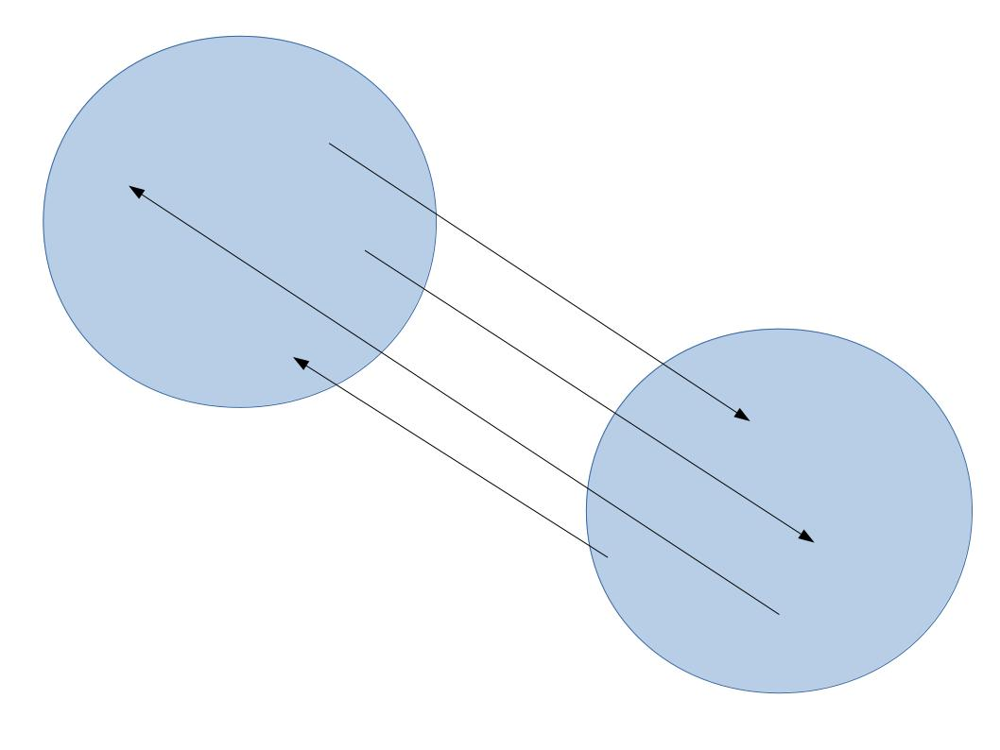
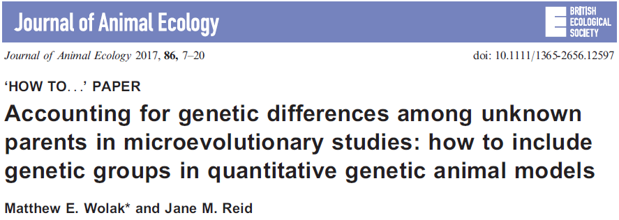
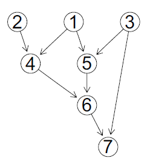
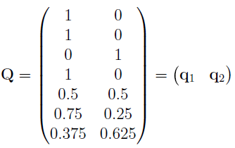
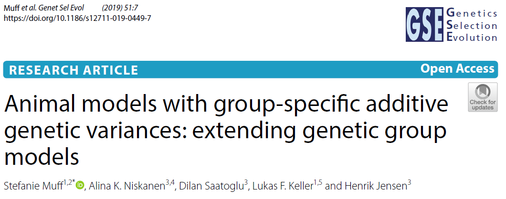
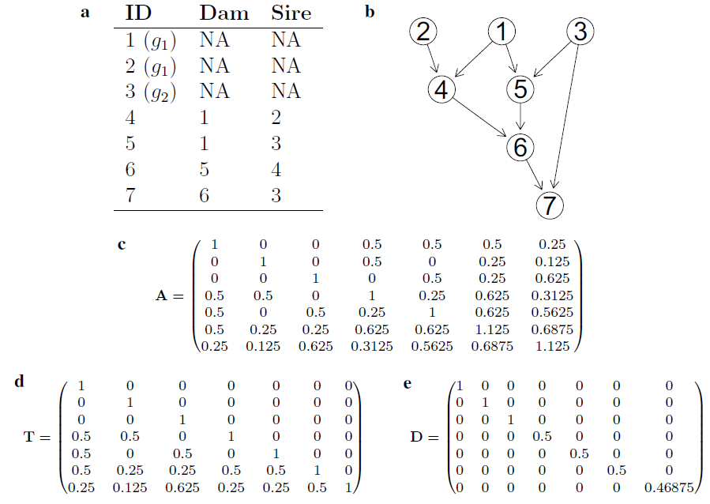
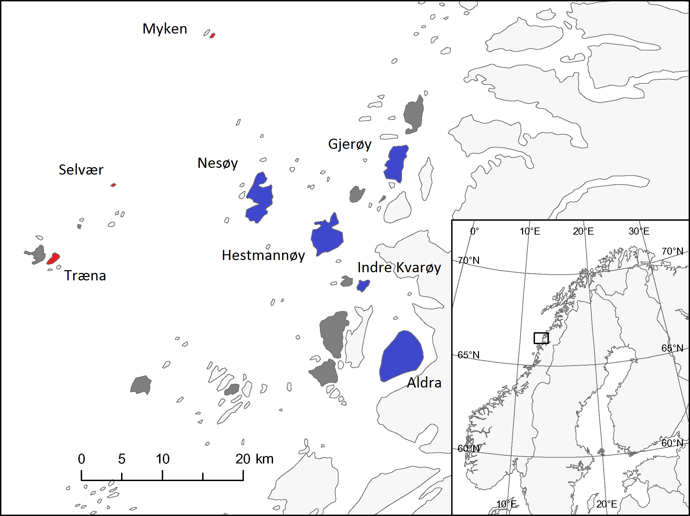

```{r setup, include=FALSE}
library(knitr)
opts_chunk$set(tidy.opts=list(width.cutoff=68),tidy=TRUE)
knitr::opts_chunk$set(echo = TRUE,tidy=TRUE,message=FALSE,warning=FALSE,strip.white=TRUE,prompt=FALSE,
                      cache=TRUE, size="scriptsize")
whichformat="latex"
```

## Overview

\vspace{3mm}

* Genetic group models 
    * Differences in means
    * Differences in additive genetic variance (VA)
 
\vspace{2mm} 
* Marker-based regression using genomic data

---

## How I became an ecological statistician

\vspace{3mm}

* Master in mathematics  

* PhD in computational structural biology  
 
* Certificate of Advanced Studies in applied statistics  

* Postdoc in medical and ecological statistics

\vspace{2mm}

Since Sept.\ 2019: Associate Professor in Statistics, CBD, Department of Mathematical Sciences, NTNU Trondheim 

\vspace{5mm}

I'm often not sure if I am 

\vspace{2mm}
* a mathematician?
* a biostatistician?  
* an ecological statistician?  
* an applied statistician? 

---

## Research interests 

\vspace{3mm}

* _\textcolor{red}{Measurement error modeling}_ (methods \& applications), see _e.g._ @muff.etal2015, @muff.keller2015, @muff.etal2018.

\vspace{3mm}

* _\textcolor{red}{Bayesian statistics}_ (ideal for taming measurement errors!).

\vspace{3mm}

* _\textcolor{red}{Quantitative genetics}_, see @ponzi.etal2018, @ponzi.etal2019, @muff.etal2019.

\vspace{3mm}

* _\textcolor{red}{Movement ecology}_, see @weinberger.etal2016 @gehr.etal2016 or @muff.etal2019b.

---

# Part I: Genetic group animal models

## The basic animal model
\vspace{3mm}

* Given phenotypic measurements $y_i$ for individuals $1\leq i \leq n$, the most simple form of the animal model is 
$$
y_i = \mu + a_i + e_i \ ,
$$
where $e_i \sim \text{N}(0,\sigma_E^2)$ and ${\mathbf a}^\top = (a_1, \ldots, a_n)^\top \sim \text{N}({\mathbf a},\sigma_A^2 \mathbf{A})$ with additive genetic variance $\sigma_A^2$ and additive genetic relatedness matrix $\mathbf{A}$.

\vspace{3mm}

* The model can be extended by additional fixed or random effects.  
\vspace{3mm}

*  **Assumptions**: 
    + All individuals derive from the same genetic population.
    + The breeding values ($a_i$) encode for the deviation from the mean of this population and thus have an expected value $\text{E}[a_i]=0$.

--- 

## Systematic deviation from the assumptions

\vspace{3mm}

For example

* in cross-bred livestock.
* when genetically different wild subpopulations mix (migration).

\centering
{width=50%}

\vspace{3mm}

\flushleft
$\Rightarrow$ Individuals have a genetic origin that stems _\textcolor{red}{partially from both populations}_.

\vspace{2mm}
**Consequence**: Biased estimates of $\sigma_A^2$ and breeding values.

---

## Genetic group models

\vspace{3mm}

Great overview by @wolak.reid2017

\vspace{2mm}

\center
{width=80%}

\vspace{3mm}
\vspace{3mm}

\flushleft
**Idea**: Allow for ``founder populations'' that differ in the _mean breeding value_.

---


### Example for two isolated groups
\vspace{3mm}

Simple model for a phenotypic trait $y_i$ with mean $\mu$, breeding values $a_i$ and environmental component $e_i$:
\vspace{-3mm}

\begin{align*} 
&\text{group 1:} \hspace{-14mm}  & y_i &= \mu +    \underbrace{a_i}_{u_i} +  e_i \ ,\\
&\text{group 2:}  \hspace{-14mm} & y_i &= \mu +  \underbrace{g_2 + a_i}_{u_i} +   e_i \ , 
\end{align*}
\vspace{-3mm}
thus 

$$ u_i \sim \text{N}(0,\sigma_A^2 \mathbf{A})  \quad   \text{in group 1}. $$ 
$$ u_i \sim \text{N}(g_2,\sigma_A^2 \mathbf{A}) \quad     \text{in group 2}.$$
\vspace{3mm}

* **Interpretation:** The total additive genetic effects $u_i$ (thus probably also the mean phenotypic values) differ between the two groups.


* **Example:** Systematic differences in wing length, weight,...

---


General formulation of genetic group model with $r$ groups
$$
 y_i  = \mu + \underbrace{\sum_{j=1}^r q_{ij}g_j +  a_i}_{u_i} + e_i  \ , \quad \mathbf{a}^\top \sim \text{N}(\mathbf{0},\sigma_A^2\mathbf{A}) \ ,
$$
 

where $0\leq q_{ij} \leq 1$ is the proportional _\textcolor{red}{contribution of group $j$ to the genome of individual $i$}_.

\vspace{3mm}
\vspace{3mm}

How do we obtain the $q_{ij}$?

---

### Example
\vspace{3mm}

* Group 1: Founders nodes 1 and 2 
* Group 2: Founder node 3 

\vspace{3mm}

\center
{width=30%} \hspace{6mm} {width=45%}

\vspace{10mm}

\flushleft

\small

**How to?** E.g. by using the `ggcontrib()` function from the `nadive` R package [@nadiv].

---


## Genetic group models for heterogeneous variances
\vspace{3mm}

* **Caveat:** Additive genetic variances $\sigma_A^2$ are assumed the same within the groups. 
\vspace{4mm}

* **Idea**: Replace 
\begin{align*}
 y_i &= \mu + \sum_{j=1}^r q_{ij}g_j + \textcolor{red}{a_i}  +  e_i & (\text{homogeneous } \sigma_A^2) \quad\\ 
\text{by} \\[2mm]
y_i &= \mu + \sum_{j=1}^r q_{ij}g_j + \textcolor{red}{\sum_{j=1}^r a_{ij}}  +  e_i \ , & (\text{heterogeneous }  \sigma_{A_j}^2)  
\end{align*}
where $(a_{1j}, \ldots, a_{nj})^\top \sim \text{N}(0, \sigma_{A_j}^2 \mathbf{A}_j)$.
\vspace{4mm}


* **Two challenges**: 

    1) Segregation variances between the groups.
    2) Finding the group-specific relatedness matrics $\mathbf{A}_j$.


---

Addressing these challenges was the purpose of this publication:

\center
{width=90%}

---

## Challenge 1: Segregation variances

\vspace{3mm}

In principle, we would need to "blow up" our models with segregation variances [e.g., @garcia-cortes.etal2006]\footnote{Segregation variance refers to the increase in variance caused by differences in allele combinations, average allelic effects, and linkage disequilibrium at and between loci underlying the phenotype in the mixing breeds}. In our notation:
$$y_i = \mu + \sum_{j=1}^r q_{ij}g_j + \sum_{j=1}^r a_{ij}  + \sum_{j < k} s^{(jk)}_i +  e_i \ ,$$
$$\mathbf{s}^{(12)}\sim \text{N}(\mathbf{0},\sigma_{s_{12}}^2 \mathbf{A}_{12})  \ ,$$
thus we would need to estimate $r + \left( \begin{matrix} r\\ 2 \end{matrix}\right)$ variances.

\vspace{10mm}

**But is this relevant here?**

--- 

* The segregation variance when crossing two genetic groups (e.g., breeds) can be computed as
$$\sigma_S^2 =\frac{1}{2} \sum_{i=1}^m (\alpha_i^c)^2 \ ,$$
where $\alpha_i^c$ denotes the mean additive genetic difference between the groups due to locus $i$ (Lynch and Walsh, 1998), and $m$ is the number of loci that determine the trait.

\vspace{3mm}

* Why can we often safely ignore $\sigma_S^2$?

\pause

\vspace{3mm}

Under the _infinitesimal model_ assumption, all $\alpha_i^c$ are very small, and thus $\sigma_S^2 \approx 0$. 
---

---

## Challenge 2: Finding group-specific relatedness matrices $\mathbf{A}_j$

\vspace{3mm}

<!-- * To understand how to obtain the $\mathbf{A}_j$s, let us recall some properties about the pedigree-based relatedness matrix $\mathbf{A}$. -->

<!-- \vspace{3mm}  -->

* First we recall: $\mathbf{A}$ can be decomposed by a _generalized Cholesky decomposition_ into  
$$
\mathbf{A} = \mathbf{T} \mathbf{D} \mathbf{T}' \ ,
$$
with lower triangular matrix $\mathbf{T}$ and transposed $\mathbf{T}'$, and diagonal matrix $\mathbf{D}=\text{Diag}(d_{11},\ldots , d_{nn})$ [@henderson1976].

\vspace{3mm}

* $\mathbf{T}$ traces the flow of alleles from one generation to the other.

\vspace{3mm}

* The diagonal entries of $\mathbf{D}$ scale the Mendelian sampling variance.

---

### Example
\vspace{3mm}

{width=90%}

---

## Basic idea
\vspace{3mm}

Find $\mathbf{A}_j$ by deriving group-specific versions $\mathbf{T}_j$ and $\mathbf{D}_j$ and then use that

$$\mathbf{A}_j = \mathbf{T}_j \mathbf{D}_j \mathbf{T}_j ' \ .$$

---

## Finding $\mathbf{T}_j$

\vspace{3mm}

* $T_j$ for group $j$ represents the transmission of alleles through the generations _within each group_.

\vspace{3mm}

* This can be obtained when we _scale each row_ of $\mathbf{T}$ by $\mathbf{q}_j$ or, equivalently, by 
$$\mathbf{T}_j = \mathbf{T} \cdot \text{Diag}(\mathbf{q}_j) \ , $$
for diagonal matrix $\text{Diag}(\mathbf{q}_j)$.

---

**Toy-example:**

Given

$$\mathbf{T}  = \begin{pmatrix}
1 & 0 & 0\\
0.5 & 1 & 0 \\
0.25 & 0.5 & 1 \\
\end{pmatrix}$$ 

and a vector of group-membership proportions for group 1

$$\mathbf{q}_1 = \left( \begin{matrix} 1 \\ 0.5\\ 0  \end{matrix} \right) \ ,$$
we obtain

$$\mathbf{T}_1  =\mathbf{T} \cdot \text{Diag}(\mathbf{q}_1) =   \begin{pmatrix}
1 & 0 & 0\\
0.5 & 0.5 & 0 \\
0.25 & 0.25 & 0 \\
\end{pmatrix}$$ 
 
 

---

## Finding $\mathbf{D}_j$

\vspace{3mm}

* **Main finding**: 
\colorbox{lightgray}{\begin{minipage}{10cm}
Given the entries $d_{ii}$ in the diagonal matrix $\mathbf{D}$, we get
$$d^{(j)}_{ii} = 1 - q_{ij}(1-d_{ii}) \ .$$
\end{minipage}}

\vspace{2mm}
\small

* Why? The original entries are
\begin{equation*}
d_{ii} = 
 \left\{\begin{array}{ll}
       1 \ , & \text{0 parent known},\\
                             
       1-  0.25  - 0.25 (F_{p})\ , & \text{1 parent known},\\
       1 - 0.5 -  0.25 (F_{s} + F_{d}) \ , & \text{2 parents known}. \\
        \end{array}\right.
\end{equation*}
where $F_p$, $F_s$ and $F_d$ are the pedigree-based inbreeding coefficients of the known parent(s).

\vspace{1mm}

* The group-specific versions $d^{(j)}_{ii}$ are then obtained as
\begin{equation*}
d^{(j)}_{ii} =
\left\{\begin{array}{ll}
       1 \ , & \text{0 parent known},\\
       1-  0.25 \cdot q_{ij}^{(p)} (1 + F_{p})\ , & \text{1 parent known},\\
       1 - 0.5 \cdot q_{ij} (1 +  \frac{F_{s} + F_{d}}{2}) \ , & \text{2 parents known}. \\
        \end{array}\right.
\end{equation*}
* Plus some algebraic rearrangements.

---

### Caveat: $\mathbf{D}_j$ is an approximation

$~$

* This idea to find $\mathbf{D}_j$ is an _approximation_. 

$~$

* Why? We assumed that parental inbreeding can be scaled by the genetic group proportions $q_{ij}$.

$~$

* The correct way would be to use the actual _\textcolor{red}{partial (i.e. group-specific) parental inbreeding coefficients}_ $F_s^{(j)}$ and $F_d^{(j)}$, which capture inbreeding emerging _within group $j$_.

$~$

* These can be obtained with some extra work, but we showed that approximations are _\textcolor{red}{typically not critical}_.

---

## Computations

\vspace{3mm}

* Deriving $\mathbf{T}_j$ and $\mathbf{D}_j$ from $\mathbf{T}$ and $\mathbf{D}$ is cheap (simple algebraic transformations).

\vspace{3mm}

* The resulting $\mathbf{A}_j$ are _\textcolor{red}{singular}_. Replace 0's on the diagonal with a small value like $10^{-6}$. 

\vspace{3mm}

* All operations can also directly be carried out using $\mathbf{A}^{-1}$.

\vspace{3mm} 

* Models can be fitted with ingegrated nested Laplace approximations [INLA, @rue.etal2009] or MCMC [using e.g., MCMCglmm, @hadfield2010].

---

## Example: House sparrow system

\vspace{2mm}

* House sparrow metapoplation at the Helgeland coast.

\vspace{2mm}

* Study running since 1993.

\vspace{2mm}

* Island-system can be broken up into three groups: _inner_, _outer_ and _other_ islands.


\vspace{3mm}
  
  \center
{width=60%}
 
 
---

# Part II: Marker-based regression
 
 
---

# Acknowledgements

- The Centre for Biodiversity Dynamics (CBD) and the research council of Norway (projects 221956 and 223257)

- All my collaborators, in particular Henrik Jensen and Lukas F.\ Keller

- All the people that are collecting fantastic field data.

---

# References

\tiny