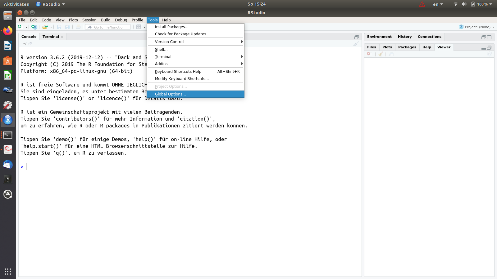

```{r setup, include=FALSE}
knitr::opts_chunk$set(echo = TRUE,tidy=TRUE,message=FALSE,warning=FALSE,results="hold",
                      cache=T)
showsol<-FALSE
```

(Latest changes: 03.01.20: first version for 2020)

R is a free software environment for statistical computing and graphics. It runs on a wide variety of UNIX platforms, Windows and MacOS. R can be downloaded from http://www.r-project.org/.

We recommend that you run R using the RStudio IDE (integrated development environment). RStudio can be downloaded from http://rstudio.org/.  
Notice: you need to download both R and RStudio.

If you need help on installing R and RStudio on you laptop computer, contact orakel@ntnu.no. If you want to work at Nullrommet or Banachrommet at Matteland, R and RStudio is already installed for you. 

# Part A: Using RStudio - what are the different windows?  

Start RStudio. Then you (probably) have the following four windows.  

  * **Source** (aka script window) - upper left window: where you write your code and keep track of your work. 
  * **Console** - lower left window: where the R commands are executed (so here is where you R installation lives). Sometimes also referred to as command window.   
  * **Environment/History/Connections/Presentation** - upper right window: the objects that you have in your workspace, and the commands you have executed, and more.   
  * **Files/Plots/Packages/Help/Viewer**- lower right: overview of your files, the plots you produce, the packages you have installed and loaded, and more.  
  
**Source window**: (Make the source window active.) To start writing a script press File- New File- R Script. To open an existing file, press File- Open File- and select the file you want to open. The file will open in the source window. To save this file, press File- Save as- and go to the working directory there you want to put your TMA4268 R files and save the file as "name".R (example: `myRintro.R`). Files with R code usually have extension `.R`. 

**Console window**: (Make the console window active.) To see your working directory, you can write `getwd()`, and you will get your location as output. You can also set your working directory to a certain folder of choise by writing `setwd("location")` (Example: `setwd("M:/Documents/TMA4268/")`). Now you are certain that all your files will be put in this folder. 

**Quitting**: It is always important to be able to quit a program: when you are finished you may choose RStudio-Quit Rstudio (top menu outside of the windows). Alternatively, you may write `q()`in the console window to quit R (the parenthesis is because q is a function that can have arguments to be given within the parentheses and you call the function without any arguments). You will be asked if you want to save your script and workspave. If you want to reuse your script later (and of cause you want to do that - we aim at reproduciable research), you should save it! If you answer yes to "Save workspace image" all the objects you have created are found in a `.RData` file (more about objects soon). This could be useful if you don't want to run all the commands in the script again, because if you start R in the same working directory all the objects you have created will be automatically availble to you. However, we recomend to **not** save `.RData` files unless you really need it (could take up much space!). We recomend to turn off the "Save workspace image" by going into Tools->Global Options..->General->Save workspace to .RData on exit-> Never.
{scale=1}
{heigth=60%, width=60%}

You can download the **RStudio IDE cheat sheet**: <https://github.com/rstudio/cheatsheets/raw/master/rstudio-ide.pdf>

# Part B: Trying out R-commands
To exceute your commands, you can either type directly in the console or run the commands from the source window. In the **source window**, you can run the current line by pressing Ctrl and Enter (Windows) or CMD and Enter (MacOS), or you can run select lines by marking them and pressing Ctrl + Enter. You can also use the Run-button in the top right corner of the window to run selected lines or commands, and the Source-button in the top right corner to run everything in your Source window. We recomend to always use the source window and save the script, in this way your code will not disappear!
 
**Q**: Open a new script and save it as `"MyRbeginner.R"`. Write and execute the following commands in the script. What have you done mathematically here?
```{r, eval=FALSE}
2+3
2*6
3*10^4-3*5^2
10^2-1
10^(2-1)
sqrt(9)
log(3,base=10)
?log
log
log10(3)
log(3)
exp(34)
gamma(3)
factorial(5)
choose(10,4)
1:4
c(1,2,3,4)
seq(from = 1, to = 4, by = 1)
sum(1:5)
prod(1:5)
heights = c(192,185,174,195,173)
shoes = c(46,43,40,45,40)
ratio <- heights/shoes
ratio
```
Here we have created three objects: `heights`, `shoes` and `ratio`. Observe: we can both use `=` and `<-` for assigning content to an object. Notice now that the objects you assigned values to (`heights, shows, ratio`) appear in the Enviroment window (sorted as Data, Values or Functions, but you should only have Values so far).

The function `c` combines values into a vector (concatenate).  Also, all the commands you have run are reported in the History window. 

If you want to add comments, you do that by starting with a hashtag symbol:
```{r, eval=FALSE}
# now we quit 
q()
```
Save your work - and we will try to open it later.

# Part C: Vectors and matrices  
R can handle both numeric and non numeric data. The concatenate `c`-function can handle both numeric and non-numeric data, but be careful when mixing them.

**Q**: Go through theses commands and see what is produced.


```{r, eval=T}
x = c(1,2,3)
typeof(x)
y = c("a", "b", "c")
typeof(y)
u = c("1", "2", "3")
typeof(u)
v = as.numeric(u)
typeof(v)
z = c("red", 1, "yellow", 2)
typeof(z)
#w = z - 1 this gives error
```

Logical operators are also available, `==` for equality, `!=` for not equal to, `>=` for greater than or equal to, etc.
```{r, eval=T}
gender = factor(c("male", "female", "female", "male"))
gender
sum(gender == "male")
table(gender)
```

Useful for vectors:  
```{r, eval=FALSE}
x = 1:5
x = seq(from=1, to=5, length=5)
x = c(1,2,3,4,5)
2 %in% x
6 %in% x
x[2]
x[2] = 10
x[3:4] = 0
x[-2] = 1
x[c(1,4)] = 4
x[x>4] = 10
x
y = log(x)
z = exp(y)
z = z + y
y = x * y
z = y / x
a = t(x)%*%y        # t(): transpose
min(x)
max(x)
sum(x)
mean(x)
var(x)
length(x)
sort(x)
order(x)
sort(x) == x[order(x)]
sample(1:10)
sample(1:10, replace = T)
```

Notice the length of your vectors when doing calculations with two vectors. 
```{r, eval=T}
x = 1:5
y = 2
x - y
5*x
z = 10:15
w = 1:2
z - w
```
What happens here?

For matrices:
```{r}
A = matrix(1:6, nrow = 3, ncol = 2)
A
```

```{r}
B = matrix(1:6, nrow = 2, ncol = 3, byrow = TRUE )
B
```

```{r}
A%*%B                      # matrix multiplication
A*t(B)
A%*%t(A)
A^2
```
The functions `cbind` (column bind) and `rbind` (row bind) can also be used to create matrices:
```{r, eval=FALSE}
x1 = 1:3
x2 = c(7,6,6)
x3 = c(12,19,21)
A = cbind(x1,x2,x3)    # Bind vectors x1, x2, and x3 into a matrix.
# Treats each as a column.
A = rbind(x1,x2,x3)    # Bind vectors x1, x2, and x3 into a matrix.
# Treats each as a row.
```
Other matrix commands are
```{r, eval=FALSE}
dim(A)             # get the dimensions of a matrix
nrow(A)            # number of rows
ncol(A)            # number of columns
apply(A,1,sum)     # apply the sum function to the rows of A
apply(A,2,sum)     # apply the sum function to the columns of A
sum(diag(A))       # trace of A
A = diag(1:3)
solve(A)           # inverse of A, in general solve(A,b) solves Ax=b wrt x
det(A)             # determinant of A
```


# Part D: Basics about plotting
Create a plot 
```{r, eval=T}
x <- seq(-4,4,length=500)
y <- x^2 - 1
plot(x,y,type="l", main="My plot", xlab = "x", ylab = "y")
abline(v=3)
abline(h=5)
```

To draw the plot in the way you want, check the help pages of the plot function to see which input values you can change to make your plot look the way you want to.

The package `ggplot2` is a powerful tool for making nice plots. In this package, the function `ggplot(data,aes(x=x,y=y))` makes the foundation of the plot with the data `data` and features of the plot are added with `+geom_point()`, `+geom_boxplot()`, `+xlab("Temperature")` ect. If you want to learn more about the grammar of graphics you should start by reading [Chapter 3 of the book `R for Data Science`](http://r4ds.had.co.nz/data-visualisation.html).

Before diving in to this, the list below shows some basic tools for plotting using both `plot()`and `ggplot()` (the last from the `ggplot2` package). For `ggplot` we must first save the data into a object and build the foundation of the plot with `ggplot()` before we run these functions. See "Visualizations in R" for more plotting and check out https://ggplot2.tidyverse.org/reference/ for more functions of the `ggplot2` package.


Description	                    | Base Graphics     |	ggplot2           |
--------------------------------|-------------------|-------------------|
Plot y versus x using points    | plot(x, y)	      | + geom_point()       |
Boxplot of x                    |	boxplot(x)        |	+ geom_boxplot() |
Histogram of x                  |	hist(x)           |	+ geom_histogram()  |

Plotting will be an important part of any statistical analysis course. 

# Part E: Writing a simple function  

When starting a function, you should start with the name of the function and state if the function takes input values. Then you write the function code inside the branches ${}$. Remember to return the output of the function using `return()`.

```{r, eval=T}
myfunction <- function(x,y) 
  #myfunction is the name, x and y are the names of the inputs
{
  n <- c(length(x), length(y))
  m <- c(sum(x), sum(y))
  p <- m/n
  return(p)
}
```

**Q**: If `x` and `y` are two vectors of different lengths - what does then the function return?

To start using the function, you must first run it through the console so that it is in your enviroment (mark and run). Then you call the function name and give your inputs like this. 
```{r, eval=T}
a = 1:10
b = seq(from = 0.1, to = 1, length = 10)
p = myfunction(x = a, y = b) #assign output to a variable p
p
```

You can also use `if/else` sentences, `for/while`-loops and `print()`.
```{r, eval=FALSE}
lett = c("a", "b", "c", "d", "e", "f", "g", "h")
for(i in 1:length(lett)){
  print("Now we work with:")
  print(lett[i])
  if(lett[i]=="b"){
    print(lett[i])
  }
  else 
  {
    if (lett[i]=="d"){
    print(lett[i])
    }
    else{
    print("not b or d")
    }
  }
}
```
While loopes can be written in a similar mannar, using `while` instad of `for`.

# Part F: Lists and data frames
Lists and data frames are good tools for storing and accessing your data. 

## Lists

Using a list, there is no restrictions to the type of data you want to store. 

```{r, tidy = T, eval = F}
a = c("male", "female", "male", "male")
b = matrix(c(1:6), ncol = 2)
c = rnorm(100, mean = 0, sd = 1)
my_list = list(a = a, b = b, c = c)
```
The list `my_list` now consists of three objects, `a, b` and `c`. To access the data in you list, you write
```{r, tidy = T, eval = F}
my_list[[1]] #a
my_list[[2]] #b
my_list[[3]] #c
```
or
```{r, tidy = T, eval = F}
my_list$a #a
my_list$b #b
my_list$c #c
```
To access the second element in the object `a`, you write `my_list[[1]][2]` or `my_list$a[2]`.

## Data frames

When using a data frame, you need all your elements in the data frame to be of equal length.
```{r, tidy = T, eval = F}
Sick = c(0,1,1,0,0,0,1,0)
Age = c(50,15,39,35,26,20,10,69)
Sex = factor(c("male", "female", "female", "male", "male", "male", "female", "male"))
df = data.frame(Sick = Sick, Age = Age, Sex = Sex)
```
To access the vectors in the data frame, 
```{r, tidy = T, eval=F}
df$Sick
df$Age 
df$Sex
```
Similar to a list, we access elements in the data frame using `df$Sex[2]`. If your data frame is very large, it is easier to view typing `View(df)`. 


# Part G: Loading and writing files  

There are several ways to read and write diffferent file types in R. txt-files (tab separated) and csv-files (comma separated) are the most common ones, and we show here how to write and read such files. Remember to check the format of your file before reading it into R. You may also choose Enviroment (window upper right) -Import Data set - and get help.

## csv-files (comma separated)

If your dataframe `df` from part F are still in your environment, you can save it (write file) as a csv-file using the command `write.csv()`. Use the Help-window and search for `write.csv` or type `?write.csv` in the console to see which arguments to include.
```{r,eval=FALSE}
write.csv(df,file="MyFirstFile.csv",row.names = FALSE) 
```
The file is now saved in your working directory. To save it somewhere else, you can either use `setwd("~/your_selected_folder/")` before writing the file, or include the path when saving it `write.csv(df,file="~/your_selected_folder/MyFirstFile.csv")`. 

To a read a csv-file into R, we use a similar command `read.csv()`. Remember to name the data when reading it, else it will not be stored in your environment.
```{r,eval=FALSE}
getwd() #path of your working directory
list.files() #files in the folder 
myDf = read.csv(file="MyFirstFile.csv", header = TRUE)
```
To read a file from another folder, you can either use `setwd("~/your_selected_folder/")` before reading the file, or include the path when reading it `read.csv(file="~/your_selected_folder/MyFirstFile.csv", header=TRUE)`.

## txt-files (tab separated)

If you want to save your data as a txt-file, you can use the command `write.table()`. With this function you can choose which format you want to save the file as with the argument `sep=`. For a txt-file, set `sep="\t"` and name your file .txt. (You can also use this for csv - `sep=","`). Use the Help-window and search for `write.table` or type `?write.table` in the console to see which arguments to include.
```{r,eval=FALSE}
write.table(df, file="MyFirstFile.txt", sep="\t", row.names = FALSE) 
```
To read the txt-file into R, use the command `read.table()` and remember to set the argument `sep="\t"`.
```{r,eval=FALSE}
myDf = read.table(file="MyFirstFile.txt", sep="\t", header=TRUE) 
```

## Printing to and reading from other file formats
There exists many packages to read different type of input data. A quick google search will guide you! Reading `xls` files can be done using the package `readxl`, but we recomend to NEVER use this format. Always write your files as txt or csv, and if you have to read a `xls` file, be very careful about the format of the file!

## Executing the commands in an R-file with `source`
Open again the file `myRintro.R` in your source window. Then either write:
```{r, eval=FALSE}
source("myRintro.R") #given that your working directory is wher myRintro.R is saved
```
or source with the source button in the upper right corner of the source window. 

It is also possible to source a file from the internet, for example a version of Part B can be sources from the TMA4268 catalog:
```{r, eval=FALSE}
source("https://www.math.ntnu.no/emner/TMA4268/2019v/1Intro/RintroPartB.R",echo=TRUE)
```
Here `echo=TRUE` echoes the commands being run- in addition to the results of the commands.


## Exporting plots - some alternatives
We will talk more about generating random data from different distribution in `Rintermediate.R`. However, the following commands draws 100 realizations from the standard normal distribution and makes a boxplot. Write these commands and run them.

```{r, eval=TRUE}
ds = rnorm(100)
boxplot(ds)
```

Now, we want to export this plot - maybe to be put on a webpage or just for fun (we will use R Markdown for our compulsory exercises and will then not need to export plots).

You may save the plot (for example as pdf or svg) by pressing Export in the Plots window, or alternatively you may write
```{r ,eval=FALSE}
dev.copy2pdf(file="box.pdf")
```
This will produce a pdf-file that is saved to your working directory.    

A third solution 
```{r,eval=FALSE}
pdf("box.pdf")
boxplot(ds)
dev.off()
```
to make a file named box.pdf with the boxplot, then it is possible to save many plots together in one pdf-file - just add more plots before closing the pdf-file with `dev.off()`. For more on exporting plots, take a look at http://www.sthda.com/english/wiki/creating-and-saving-graphs-r-base-graphs. 

# Part H: Functions and packages

We have already seen how to make functions in Part E and we have used some existing functions like `boxplot()`, `sample()` and `rnorm()`. R is a free and open source program where everyone can contribute with making functions, and there exists *a lot*. Functions are available through packages (collection of functions (and data)) that can be installed and loaded into R. Some are already included in the default R session, like the package `stats` that includes many basic functions for doing statistics. Making your own functions are an important part of programming and statistical analysis, but using existing functions and packages often makes life easier. 

Every statistical researcher who would like to to get their new statistitical methods used will make an R package and distribute it with their article (on the new method). Most books also comes with R packages with data sets and functions. Our ISL book has the package `ISLR`, hosted on the most widely used service for R packages: CRAN. See the official page for the package here: <https://cran.r-project.org/web/packages/ISLR/index.html>.

To install an R package from CRAN you go to the Packages tab and see if the packages is already available on your computer. If you see ISLR in this list just press the square next to ISLR to load the package into R.

If you don't see ISLR you will have to download it from CRAN. Do this by either pressing Install on the top left corner of the Packages window, CRAN is already filled as "Install from" and then write "ISLR" as the name of the package to install, and nice to have chosen "install dependencies" (then packages that ISLR depend on will also be installed). Then press "Install". You might have to select from different mirrors for CRAN - choose Norway, and you are good to go. Then "ISLR" should pop up in the list of packages installed, and you tick (in the square) to load the package into R. 

Alternatively (easier way), in the console (or source) window you may write:
```{r, eval=FALSE}
install.packages("ISLR")
library(ISLR) # to make the package available in the current session
```
Now the packages is installed and loaded to the current session. Remember that whenever starting a new session, you need to reload the packages you want to use, using the `library()` function, or ticking the square next to ISLR in the Packages window. You don't need to install it again, it is already on your computer.

```{r, eval=FALSE}
library(help="ISLR")
```
**Q**: Look at the contents of the `ISLR` to see that only data sets are available - you may also see that by selecting the name ISLR in the Packages window. To know more about the data set named `NCI60` either just select the data set in the Packages window, or write `help(NCI60)` after ISLR is loaded. What can you say about `NCI60`?

Another package that we will use is `car`.

**Q**: Install the `car` package from CRAN, check the content of the package (data sets and functions) and investigate

We will be using a lot of packages in this course, and the ones we use will be listed on the start of each module page. We would assume that you have loaded these packages if you want to reproduce that statistical analyses on the module pages.

Before start using the functions of the package, it is often a good idea to visit the help pages of the package to see which functions and data sets are available, how they are used, what they calculate, and the output they give, etc.. These pages are found in the Help window to the left or typing `?name` in the console, (ex. `?mean`).

In the stats package, you find functions for making and evaluating distributions. We use the function `rnorm` to sample independent data from the univariate normal distribution.  
```{r, eval=FALSE}
rnorm #lists the function code
?rnorm #help pages for the function
rnorm() #gives error
rnorm(n=100,mean=0,sd=1) #draw random samples from this distribution
?lm # more to see, will be what we use to perform linear regression
```


# What is next?
You may now move to [Rintermediate.html](https://www.math.ntnu.no/emner/TMA4268/2020v/1Intro/Rintermediate.html) to see how R can be used on topics that should already be familiar to you from TMA4240/TMA4245 Statistics - or similar courses. Or, if you did ST1201 you can look at an overview of how the methods in ST1201 can be performed in R: [ST1201inR.html](https://www.math.ntnu.no/emner/TMA4268/2019v/1Intro/ST1201inR.html)

# Acknowledgements

We thank Mette Langaas and her PhD students from 2018 and 2019 for building up the original version of this sheet.
