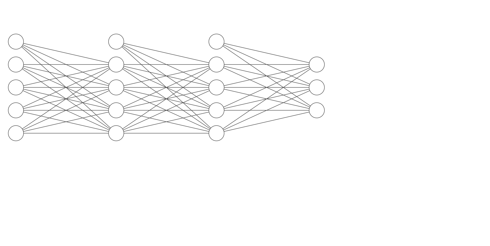
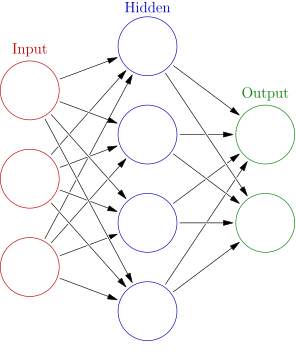

```{r setup, include=FALSE}
showsolA=TRUE
showsolB=TRUE
library(knitr)
opts_chunk$set(tidy.opts=list(width.cutoff=68),tidy=TRUE)
knitr::opts_chunk$set(echo = TRUE,tidy=TRUE,message=FALSE,warning=FALSE,strip.white=TRUE,prompt=FALSE,
                      cache=TRUE, size="scriptsize",fig.width=5,fig.height=4.5,fig.align = "center",out.width='70%')
whichformat="html"

library(nnet)
library(NeuralNetTools)
library(caret)
library(dplyr)
#library(keras)
```


---


## Problem 1

### a) 

Write down the equation that describes and input is related to output in this network, using general activation functions $\phi_o$, $\phi_h$ and $\phi_{h^\star}$ and bias nodes in all layers. What would you call such a network?

{width=100%}


### b) 

The following image is the illustration of an artificial neural network at Wikipedia. 

* What can you say about this network architecture
* What do you think it can be used for (regression/classification)?


{width=50%}


### c) 

What are the similarities and differences beween a feedforward neural network with one hidden layer with `linear` activation and `sigmoid` output (one output) and logistic regression?


### d) 

In a feedforward neural network you may have $10'000$ weights to estimate but only $1000$ observations. How is this possible?

## Problem 2

### a) 

Which network architecture and activation functions does this formula correspond to?
$$ \hat{y}_1({\bf x})=\beta_{01}+\sum_{m=1}^5 \beta_{m1}\cdot \max(\alpha_{0m}+\sum_{j=1}^{10} \alpha_{jm}x_j,0)$$
How many parameters are estimated in this network?

### b) 
Which network architecture and activation functions does this formula give?

$$ \hat{y}_1({\bf x})=(1+\exp(-\beta_{01}-\sum_{m=1}^5 \beta_{m1}\max(\gamma_{0m}+\sum_{l=1}^{10} \gamma_{lm}\max(\sum_{j=1}^{4}\alpha_{jl}x_j,0),0))^{-1}$$

How many parameters are estimated in this network?

### c) 
In a regression setting: Consider

* A sum of non-linear functions of each covariate in Module 7.
* A sum of many non-linear functions of sums of covariates in feedforward neural networks (one hidden layer, non-linear activation in hidden layer) in Module 11.

Explain how these two ways of thinking differ? Pros and cons?

## Problem 3: Handwritten digit recognition data

The following problem involves classification of handwritten digits from 0 to 9. For more details see `?zip.train` in `ElemStatLearn` R package or see Section 11.7 in the Book Elements of Statistical Learning.

Note: the `ElemStatLearn` package has been archived from CRAN, so to get ahold of the data, download the archived package from https://cran.r-project.org/src/contrib/Archive/ElemStatLearn/ElemStatLearn_2015.6.26.tar.gz, and then in RStudio, click the "Packages" tab, then click "Install", select "Install from: Package Archive File", and then select the `.tar.gz` file you downloaded above. 

We have images of handwritten digits in grayscale of size $16\times16$ which are stored as vectors of size 256. There are 7291 training observations and 2007 test observations


```{r,results="hide", echo=F, eval=T}
library(ElemStatLearn)
# code from help(zip.train)
findRows = function(zip, n) {
 # Find  n (random) rows with zip representing 0,1,2,...,9
 res = vector(length=10, mode="list")
 names(res) = 0:9
 ind = zip[,1]
 for (j in 0:9) {
    res[[j+1]] = sample( which(ind==j), n ) }
 return(res) }
digits = vector(length=10, mode="list")
names(digits) = 0:9
rows = findRows(zip.train, 6)
for (j in 0:9) {
    digits[[j+1]] = do.call("cbind", lapply(as.list(rows[[j+1]]), 
                       function(x) zip2image(zip.train, x)) )
}
im = do.call("rbind", digits)
image(im, col=gray(256:0/256), zlim=c(0,1), xlab="", ylab="")
dim(zip.train)

dim(rbind(zip.train, zip.test))
```

---

### a) 
Preprocessing is important before we fit a neural network. Standardize the features and transform the digits to factors for both train and test data.

Remember that it is important to decide on the scale based on the training data, and then apply the same standardization for both training and test data (i.e., centering around the same mean and transforming to the same variance).


### b) 

One of the simplest ways of fitting simple neural networks in R is via the `nnet()` function in the R package `nnet` (this was not discussed in the lecture, but is useful to know anyway). Install the package and check the help file typing `?nnet` into the console. 

(i) What is the main limitation of the `nnet()` function?

(ii) Use a feedforward-network with one hidden layer to train and predict using the `nnet()` function. Include 5 hidden nodes plus a bias node in the input and hidden layers. What is the number of parameters? 

(iii) Look at the confusion table for the test data. How good does the network perfom? 

# Problem 4: Deep Learning with Keras

We again work on a handwritten digit recognition problem, but now we use the data from the keras library. This dataset consists of 60000 training data of $28\times28$ grayscale images and 10000 test data.

For more info see [here: https://keras.rstudio.com/](https://keras.rstudio.com/).

If you have already installed `keras` ignore the following chunk of code

```{r,eval = FALSE}
# Install the keras R package 
install.packages("keras")
# Install the core Keras library + TensorFlow
library(keras)
install_keras()
# for machines with NVIDIA GPU
# install_keras(tensorflow = "gpu") 
```


### Data Preprocessing

```{r}
library(keras)
mnist = dataset_mnist()
x_train = mnist$train$x
y_train = mnist$train$y
x_test = mnist$test$x
y_test = mnist$test$y

# reshape
x_train = array_reshape(x_train, c(nrow(x_train), 28*28))
x_test = array_reshape(x_test, c(nrow(x_test), 28*28))
# rescale
x_train = x_train / 255
x_test = x_test / 255

y_train = to_categorical(y_train, 10)
y_test = to_categorical(y_test, 10)
```

### a)
In order to fit a model in keras we can use the following steps. We fit a densely (or fully) conected neural network with 2 hidden layers. Fill in the missing inputs and run the model.

##### 1. Define the model

```{r, eval =FALSE}
model = keras_model_sequential() %>% 
  layer_dense(units = 8, activation = 'relu', input_shape = c(...)) %>% # fill in the length of the input layer 
  layer_dense(units = 8, activation = 'relu') %>%
  layer_dense(units = 10, activation = ...) # fill in the name of the activation function
```

Possible choices of the activation function are 'sigmoid', 'softmax' or the identity function (which means that we don't have to define any activation argument in the last layer). What is the use of identity function?

##### 2. Compile 


```{r, eval=FALSE}
model %>% compile(
optimizer = "rmsprop",
loss = ..., metrics = c(...)
)
```

Possible choices of loss function are 'binary_crossentropy', 'categorical_crossentropy' and 'mse'. For metrics you can use 'mean_absolute_error' or 'accuracy'.

##### 3. Train 

```{r, eval=FALSE}
history = model %>% fit(x_train, y_train,
epochs = 20,
batch_size = 128,
validation_split = 0.2)
```

You can find more information about the different arguments in the `fit()` function here: https://keras.rstudio.com/reference/fit.html

Report the accuracy on the test data.

```{r, eval=FALSE}
str(history)
plot(history)
model %>% evaluate(x_test,y_test)
```

What is the number of parameters?

### b)

Now fit a model with 2 hidden layers with 128 units each. What do you see?

### c)

In order to avoid the problem we have seen in b), we can use weight reguralization (L1 and L2 norms) or dropout. Apply these methods to the network from b). 

**R-hint:** for weight reguralization you can use  
```{r,eval=F}
layer_dense(units = 16, activation = "relu", input_shape = 28*28, 
            
            kernel_regularizer = regularizer_l2(l = 0.001))
```
and for dropout you can use  `layer_dropout(0.5) %>%` after each hidden layer. For more details see [here](https://keras.rstudio.com/articles/tutorial_overfit_underfit.html).


### d)

Now, let's try using convolutional neural network (CNN) instead of densely(fully)-connected neural network (DNN). We're building a CNN model that consists of three convolutional layers with the max pooling layers. The convolutional layers are followed by the flatten layer and dense layer. For more information, you can refer to [here](https://tensorflow.rstudio.com/tutorials/advanced/images/cnn/).

The 2nd following code script builds the CNN model and its number of trainable parameters are almost the same as that of the DNN model shown in a) so that we can compare the performance difference between the DNN model and the CNN model when their model size (i.e., number of trainable parameters) are the same. Fill in the missing inputs and run the model.

```{r, eval=FALSE}
# re-define `x_train`, ..., `y_test` to keep them as 2-dimensional.
mnist = dataset_mnist()
x_train = mnist$train$x
y_train = mnist$train$y
x_test = mnist$test$x
y_test = mnist$test$y

# rescale
x_train = x_train / 255
x_test = x_test / 255

y_train = to_categorical(y_train, 10)
y_test = to_categorical(y_test, 10)
```

```{r, eval=FALSE}
# define a CNN model
model <- keras_model_sequential() %>% 
  layer_conv_2d(filters = 8, kernel_size = c(3,3), activation = "relu", 
                input_shape = c(...)) %>% 
  layer_max_pooling_2d(pool_size = c(2,2)) %>% 
  layer_conv_2d(filters = 16, kernel_size = c(3,3), activation = "relu") %>% 
  layer_max_pooling_2d(pool_size = c(2,2)) %>% 
  layer_conv_2d(filters = 22, kernel_size = c(3,3), activation = "relu") %>% 
  layer_flatten() %>% 
  layer_dense(units = 10, activation = ...)
summary(model)
```

```{r, eval=F}
# run
model %>% compile(
optimizer = "rmsprop",
loss = "categorical_crossentropy", metrics = c("accuracy")
)

history = model %>% fit(x_train, y_train,
epochs = 20,
batch_size = 128,
validation_split = 0.2)

str(history)
plot(history)
```