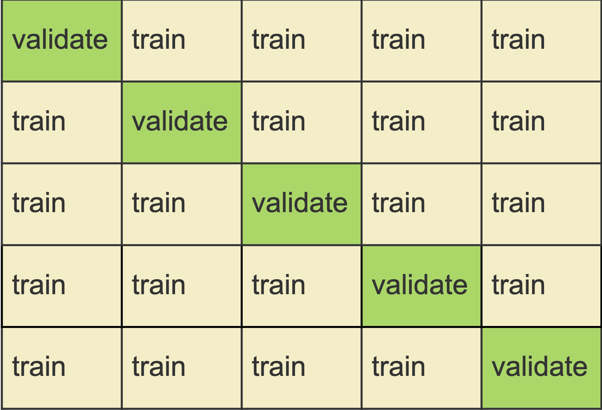

```{r setup, include=FALSE}
library(knitr)
knitr::opts_chunk$set(echo = TRUE,tidy=TRUE,message=FALSE,warning=FALSE,strip.white=TRUE,prompt=FALSE,
                      cache=TRUE, size="scriptsize")
```

<!-- rmarkdown::render("5CVandBoot-sol.Rmd","all",encoding="UTF-8") -->


# Recommended exercises on cross-validation

## Problem 1: Explain how $k$-fold cross-validation is implemented 

a)  See Figure 1

{#id .class width=50% height=50%}


b) In run 1 fold 1 is kept aside and folds 2 - 5 are used to train the method. The error is calculated on fold 1 ($\text{MSE}_1$).
We do this for the remaining 4 runs. The cross-validation error is given by

$$
CV_5 = \frac{1}{n} \sum_{j=1}^5 n_j\cdot \text{MSE}_j \ ,
$$
where $n_j$ is the size of the $j^\text{th}$ fold.

For a regression problem $\text{MSE}_j = \frac{1}{n_j}\sum_{i \in V_j} (y_i - \hat y_i)^2$ for all $i$ in the validation set $V_j$.
For a binary classification problem the error might be the average of correctly classified observations.


c) Find the optimal number of neighbours $k$ in KNN or the optimal polynoimial degree in polynomial regression.

d) For a calssification problem we can use CV to choose between QDA or LDA.


## Problem 2: Advantages and disadvantages of $k$-fold Cross-Validation

a) The validation set approach:

D: The $k$-fold cross validation is computationally more expensive.

A: The advandge is that it has less variance and less bias (the validation set approach unifies the bad things of two worlds, so to say).


b) In LOOCV there is no radomness in the splits. 

A: $k$-fold-CV is computationally less expensive, as we run the model $k$ times where $k \ll n$

A: $k$-fold-CV has less variance, because in LOOCV we are averaging from $n$ fitted models that are trained on nearly the same data, therefore we have positively correlated data.

D: $k$-fold-CV has more bias, as in LOOCV we use a larger data set to fit the model, which gives a less biased version of the test error.


c) We know that if $k=n=$ LOOCV the estimator of test error will have small bias but high variance and it is computationally expensive.

If $k$ is too small (for example 2), the estimator will have larger bias but lower variance.

Experimental research (simulations) has found that $k = 5$ or $k=10$ to be good choice.


## Problem 3: Selection bias and the "wrong way to do CV".

No solution is provided on top of the guidelines in the exercise sheet.


# Recommended exercises on bootstrapping

## Problem 4: Probability of being part of a bootstrap sample


a) $P(\text{draw } X_i) = \frac{1}{n}$ and $P(\text{not draw } X_i) =1-P(\text{draw } X_i) = 1 - \frac{1}{n}$


b) $P(\text{not draw any } X_i) = (1 - \frac{1}{n})^n$ and $P(\text{draw at least one } X_i) =1 - (1 - \frac{1}{n})^n$


c) $P(X_i \text{ in bootstrap sample}) = 1 - (1 - \frac{1}{n})^n \approx 1-\exp(-1) = 0.632$

d)

```{r,echo=T,eval=T}
n=100
B=10000
j=1
res=rep(NA,B)
for (b in 1:B) res[b]=(sum(sample(1:n,replace=TRUE)==j)>0)
mean(res)
```

The approximation becomes quickly very good as $n$ increases, as the following graph shows:
```{r,fig.width=5, fig.height=4,fig.align="center"}
curve(1-(1-1/x)^x,1,100,ylim=c(0.6,1),xlab="n",ylab="1-(1-1/n)^n")
abline(h=1-1/exp(1),lty=2)
```


## Problem 5: Estimate standard deviation and confidence intervals with bootstrapping

We repeat the following for $b = 1,\cdots,B$:

* Draw with replacement a bootstrap sample
* Fit the model 
* Store $\hat{\beta_b}$

Calculate $\hat{SD}(\hat{\beta}) =\sum_{b=1}^B \sqrt{\frac{1}{B-1} \sum_{b=1}^B (\hat{\beta_b} - \frac{1}{B}\sum_{b=1}^B \hat{\beta_b})}.$

For the $95\%$ CI, we can calculate the 0.025 and 0.975 quantiles of the sample $\hat{\beta_b},$ $b=1,\cdots,B.$


## Problem 6: Implement problem 5


```{r,}
library(carData)
boot.fn = function(data, index){
  return(coef(lm(wages~., data = SLID, subset = index)))
}

beta_hat = c()
B = 1000
for(i in 1:B){
  beta_hat[i] = boot.fn(SLID, sample(nrow(SLID), nrow(SLID), replace = T))["age"]
}

```

We can for example look at the histogram of the samples of $\hat\beta$ to get an idea of the distribution:
```{r,fig.width=5, fig.height=4}
library(ggplot2)
data = data.frame(beta_hat = beta_hat, norm_den = dnorm(beta_hat, mean(beta_hat), sd(beta_hat)))
ggplot(data)+
  geom_histogram(aes(x = beta_hat, y = ..density..),  fill = "grey80", color = "black") +
  geom_line(aes(x = beta_hat, y = norm_den), color = "red")+
  theme_minimal()
```

The $95\%$ CI for $\hat{\beta}_{age}$ can now be derived by either using the 2.5\% and 97.5\% quantiles of the samples, or by using the $\hat\beta \pm 1.96\cdot \text{SD}(\hat\beta)$ idea:

```{r}
sd(beta_hat)
quantile(beta_hat, c(0.025, 0.975))
c(mean(beta_hat) - 1.96*sd(beta_hat), mean(beta_hat) + 1.96*sd(beta_hat))
```

We can compare these results to what we would obtain directly from fitting the model and calcualating the confidence interval
```{r}
SLID.lm = lm(wages ~ ., data = SLID)
confint(SLID.lm )
```
As expected, the 95\% CI for `age` is essentially the same as the one we obtained from bootstrapping.


If you prefer to use the built in function `boot()`

```{r}
library(boot)
bo = boot(SLID, boot.fn, 1000)
bo
```

---

# Summing up

## Take home messages

* Use $k=5$ or $10$ fold cross-validation for model selection or assessment.
* Use bootstrapping to estimate the standard deviation of an estimator, and understand how it is performed before module 8 on trees.


# Further reading

* [Videoes on YouTube by the authors of ISL, Chapter 5](https://www.youtube.com/playlist?list=PL5-da3qGB5IA6E6ZNXu7dp89_uv8yocmf), and corresponding [slides](https://lagunita.stanford.edu/c4x/HumanitiesScience/StatLearning/asset/cv_boot.pdf)
* [Solutions to exercises in the book, chapter 5](https://rstudio-pubs-static.s3.amazonaws.com/65561_43c0eaaa8565414eae333b47038f716c.html)
