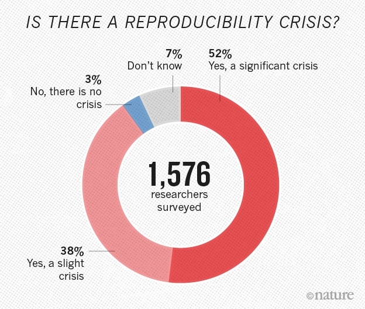
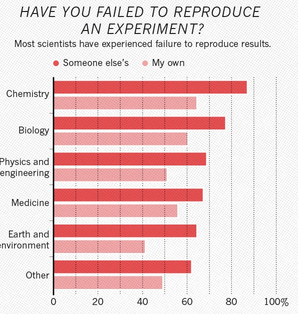
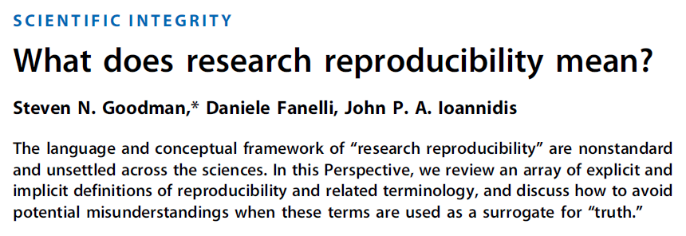
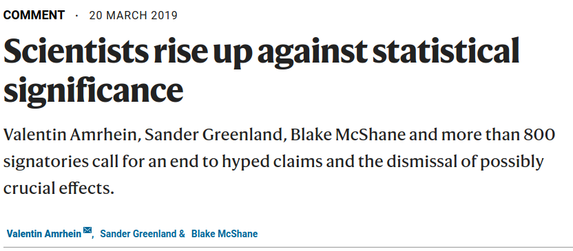

 

```{r setup, include=FALSE}
library(knitr)
## set global chunk options
opts_chunk$set(fig.path='figure/', 
cache.path='cache/', fig.align='center', 
fig.show='hold', par=TRUE, fig.align='center', cache=FALSE, 
message=FALSE, 
warning=FALSE,
echo=FALSE, out.width="0.4\\linewidth", fig.width=6, fig.height=4.5, size="scriptsize", width=40)
options(size="scriptsize")
opts_chunk$set(message = FALSE)
```

---

## Background

$~$

* In November 2022, Bob and I were involved in teaching a PhD course on _Open and Reproducible Science_.

\vspace{2mm}

* 2.5 credit points.

\vspace{2mm}

* Taking place in the Alpine center in Finse.

\vspace{2mm}

* Roughly 25 participants.

---

We received very positive feedback from the students. 

\vspace{4mm}

\begin{quote}

 "I think this course should be continued."
 
 \vspace{2mm}

 "There are many colleagues who love the idea of open science but they feel isolated nad do not have a direction to move ahead. I will recommend this course to them."
 
  \vspace{2mm}

 "I would recommend the course to all PhDs and post-docs at my department/collaborators"
 
 \vspace{2mm}
 
 "I hope that more young researchers can join the course in the future. I think the information and skills after such course can influence significantly someone's career or even change it."
 
  \vspace{2mm}
  
  Our students: "This course should be on offer as a transferable skills course at NTNU!" 

\end{quote}


---

### Course content

$~$

* Introduction on terminology (open science, reproducibility, transparancy)

\vspace{1mm}

* Data Management Plan (DMP)

\vspace{1mm}

* Data collection and data handling

\vspace{1mm}

* Data repositories

\vspace{1mm}

* FAIR data principles

\vspace{1mm}

* Using version control (git/GitHub)

\vspace{1mm}

* Reproducible work flows / neat coding strategies

\vspace{1mm}

* Best practice in data analysis and reporting results

--- 

## Why is this relevant?

A survey carried out by _Nature_ in 2016, sheds light on researcher's experiences and thoughts.


{width=45%} {width=45%}

---



---

{width=60%}{width=40%}

{width=50%}{width=45%}

---

## Open and reproducible research...

$~$

* ...benefits the researcher (easy to track what you did, modify analyses, builds trust in your work, increases citation rates etc).

\vspace{2mm}

* ...benefits the research community (others can build on your data, code and results).

\vspace{2mm}

* ...benefits society (more insight for money, more trustworthy results, more scientific progress).

\vspace{2mm}

* ...are thus _basic skills any researcher in the future will HAVE to master_!

---

### Other institutions are a step ahead

$~$

For example, the Center for Reproducible Science, University of Zurich:

$~$

https://www.crs.uzh.ch/en.html

---

### Our idea

$~$

Given the positive feedback on the mentioned course (and the negative feedback on other TS courses) and the importance of the topic, we wondered:

$~$

 
* Is it possible to set up a transferable skills course at the department/faculty/entire NTNU?
 
 $~$
 
* If yes, what would be the strategy forward?
