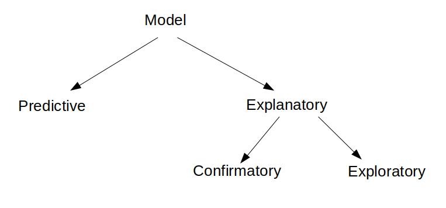

```{r setup, include=FALSE}
library(knitr)
## set global chunk options
opts_chunk$set(fig.path='figure/', 
cache.path='cache/', fig.align='center', 
fig.show='hold', par=TRUE, fig.align='center', cache=FALSE, 
message=FALSE, 
warning=FALSE,
echo=FALSE, out.width="0.4\\linewidth", fig.width=6, fig.height=4.5, size="scriptsize", width=40)
options(size="scriptsize")
opts_chunk$set(message = FALSE)
```

## Introduction and overview

$~$

* "Best practices in data analysis" is a huge field.

$~$

* Today: some words on model selection. 


---

## Developing a model

$~$

In statistics courses, the correct models often "fall from heaven": The model family and the terms in the model were almost always given.

$~$

However, it is often not immediately obvious which terms are relevant to include in a model.  

$~$

Importantly, the approach to find a model **heavily depends on the aim** for which the model is built.  
$~$

The following distinction is important:

 * The aim is to \alert{predict} future values of $y$ from known regressors.
 * The aim is to \alert{explain} $y$ using known regressors. Ultimately, the aim is to _find causal relationships_.


---


$\rightarrow$ Even among statisticians there is no real consensus about how, if, or when to select a model: 


Note: The first sentence of a paper in _Methods in Ecology and Evolution_ from 2016 is: ``Model selection is difficult.''

---

Why is finding a model so hard? 

$~$

Note that a model is only an _approximation_ to reality. The aim of a data analysis is to understand something about the real world thanks to _simplifications_.

$~$
 

Box (1979): **``All models are wrong, but some are useful.''**

$~$

$\rightarrow$ There is often not a "right" or a "wrong" model -- but there are more and less useful ones. 

$\rightarrow$ Finding a model with good properties is sometimes an art... 

---

## Two examples


$~$


1. **Understanding the effect of mercury (Hg) in the soil**
_Research question:_ Is the Hg level in the environment (soil) of people's homes associated to the Hg levels in their bodies (urin, hair)?  
_Method:_ Measurements of Hg concentrations on people's properties, as well as measurements and survey of children and their mothers living on these properties.

$~$

2. **Prognostic factors for body fat**  
_Research question:_  Which factors allow for precise estimation (prediction) of body fat?  
_Method:_ Study with 241 male participants. Measured variable were, among others, body fat (\%), age, weight, body size, BMI, neck thickness and abdominal girth.


---

## Predictive and explanatory models

$~$

Before we continue to discuss model/variable selection, we need to be clear about the scope of the model:

$~$


* \textcolor{red}{Predictive models}: These are models that aim to predict the outcome of future subjects.  
**Example:** In the bodyfat example the aim is to predict people's bodyfat from factors that are easy to measure (age, BMI, weight,..). 

$~$

* \textcolor{red}{Explanatory models}: These are models that aim at understanding the (causal) relationship between covariates and the response.  
**Example**: The mercury study aims to understand if Hg-concentrations in the soil (covariable) influence the Hg-concentrations in humans (response).

$~$
 
$\rightarrow$ The model selection strategy depends on this distinction.
 
---

## Prediction vs explanation

$~$

> When the aim is \textcolor{red}{prediction}, the best model is the one that best predicts the fate of a future subject. This is a well defined task and "objective" variable selection strategies to find the model which is best in this sense are potentially useful. 

$~$

> However, when used for \textcolor{red}{explanation} the best model will depend on the scientific question being asked, and **automatic variable selection strategies have no place**. 

$~$

\scriptsize [@clayton.hills1993]


---

## Model selection for predictive models

$~$

* Cross-validation (CV)

$~$

* AIC, BIC, DIC, ...

$~$

* If you want, even forward and backward selection is ok.

$~$

* Any (other) optimization procedure of some "cost function".

---

## Model selection for explanatory models?

$~$
\begin{tcolorbox}
Model selection may lead to biased parameter estimates, thus do not draw (biological, medical,..) conclusions from models that were optimized for prediction, for example by AIC/AICc/BIC minimization!
\end{tcolorbox}


$~$
\scriptsize See, e.g., [@freedman1983] and [@copas1983].


---

$~$

"Explanation" means that you will want to interpret the regression coefficients, 95\% CIs and $p$-values. It is then often assumed that some sort of causality ($x\rightarrow y$) exists.

$~$

In such a situation, you should formulate a \textcolor{red}{confirmatory model}:

$~$

\begin{tcolorbox}
\begin{itemize}
\item Start with a {\bf clear hypothesis.}

\vspace{2mm}

\item Select your covariates according to {\bf a priori knowledge.}

\vspace{2mm}

\item Ideally, formulate {\bf only one} or a few model(s) {\bf before you start analysing your data}.
\end{itemize}

\end{tcolorbox}

\vspace{8mm}


You might consider _pre-registration_.


---

Confirmatory models have a long tradition medicine. In fact, the main conclusions in a study are only allowed to be drawn from the main model (which needs to be specified even before data are collected):

\vspace{2mm}

{width=90%}
$~$

\scriptsize [@clayton.hills1993]


---

## Model selection bias -- coded example


$~$

https://github.com/stefaniemuff/statlearning/tree/master/OpenScience/bestPracticeAnalysis/Rcode_exercise

$~$

\begin{tcolorbox}
{\bf Aim of the example:} \\
To illustrate how model selection purely based on AIC can lead to biased parameters and overestimated effects.

\end{tcolorbox}


---

## Confirmatory vs. exploratory

$~$

Any _additional analyses_ that you potentially do with your data have the character of _exploratory models_. 

\vspace{2mm}

$\rightarrow$ Two sorts of explanatory models/analyses:

\vspace{2mm}

\textcolor{red}{Confirmatory}: 

\begin{tcolorbox}

\begin{itemize}
\item Clear hypothesis and a priori  selection of regressors for the response. 
\item No variable selection! 
\item Allowed to interpret the results and draw quantitative conclusions.  
\end{itemize}

\end{tcolorbox}


\pause

\textcolor{red}{Exploratory}: 

\begin{tcolorbox}
\begin{itemize}
\item Build whatever model you want, but the results should only be used to generate new hypotheses, a.k.a. ``speculations''.
 \item Clearly label the results as ``exploratory''.
\end{itemize}
    
\end{tcolorbox}

---

## Summary



---

# References

\scriptsize
