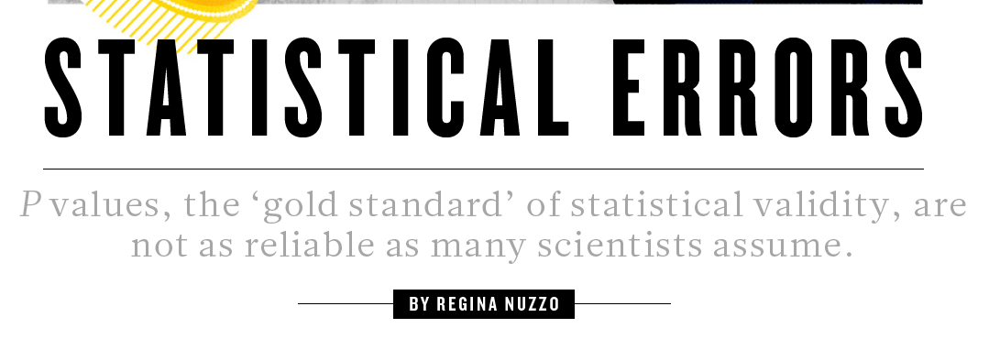
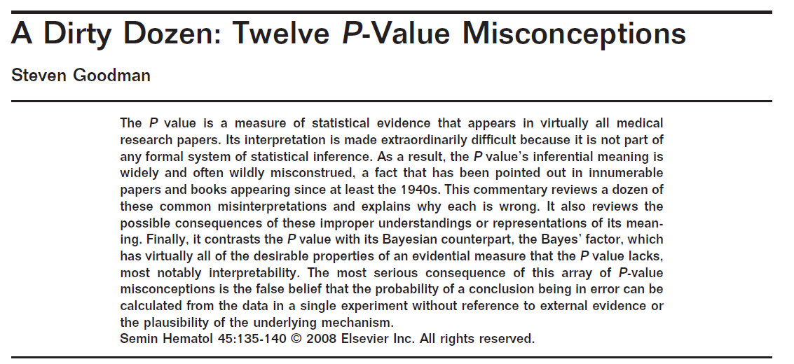
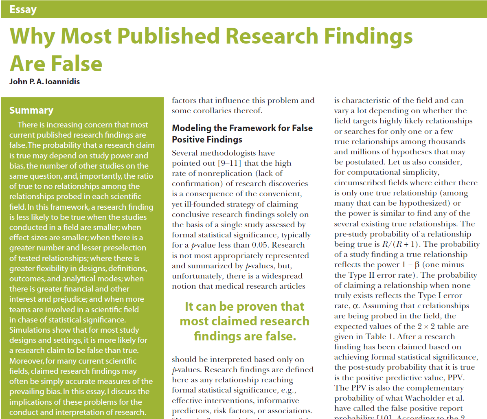
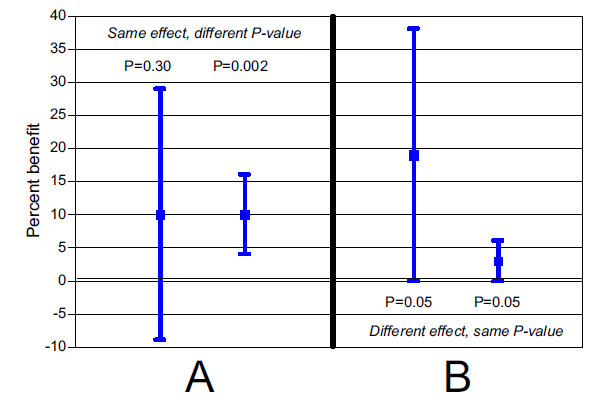
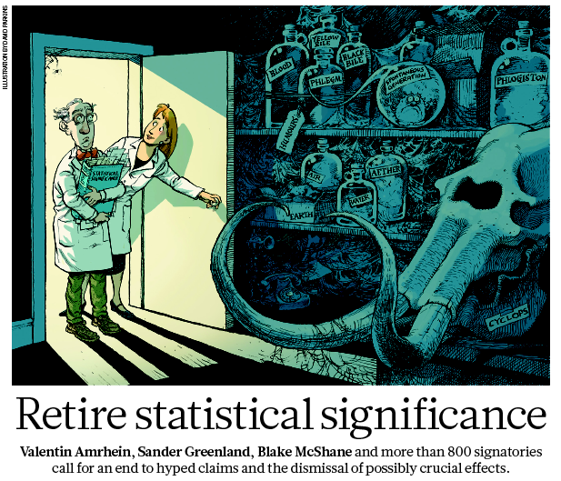
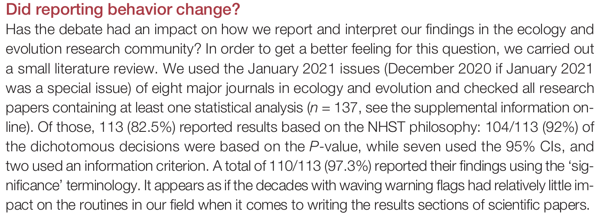
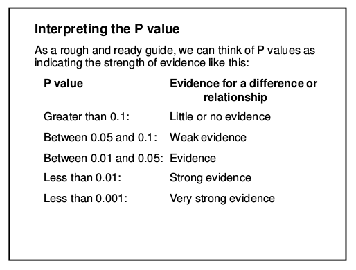
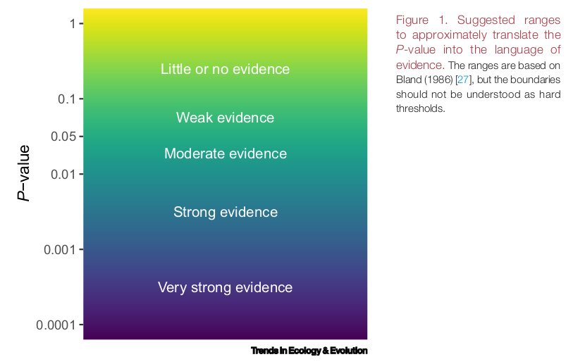
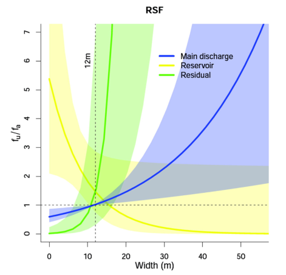

```{r setup, include=FALSE}
library(knitr)
## set global chunk options
opts_chunk$set(fig.path='figure/', 
cache.path='cache/', fig.align='center', 
fig.show='hold', par=TRUE, fig.align='center', cache=FALSE, 
message=FALSE, 
warning=FALSE,
echo=FALSE, out.width="0.4\\linewidth", fig.width=6, fig.height=4.5, size="scriptsize", width=40)
options(size="scriptsize")
opts_chunk$set(message = FALSE)
```

 


## The ongoing controversy around $p$-values

$~$

\centering
{width=90%}


$~$

\flushleft
\scriptsize
[@wasserstein.lazar2016]

---

## Lots of publications in the past decades...

$~$


{width=50%}{width=50%}
{width=50%}{width=40%}

$~$

\scriptsize
@ioannidis2005, @goodman2008, @nuzzo2014, @amrhein.etal2019, ...

---

## $P$-values / statistical significance criticism 

$~$

$P$-value **criticism is** as **old** as statistical significance testing (1920s!). Issues:

$~$

* The sharp line $p<0.05$ is _arbitrary_.

$~$

* $P$-hacking / data dredging: Search until you find a result with $p<0.05$. 

$~$

* Publication bias: Studies with $p<0.05$ are more likely to be published than "non-significant" results. 

$~$

* HARKING: Hypothesizing After the Results are Known.

$~$

* Model selection using $p$-values $\rightarrow$ **model selection bias**.

---

Note: R.A. Fisher, the "inventor" of the $p$-value (1920s) didn't mean the $p$-value to be used in the way it is used today, which is: doing a single experiment and use $p<0.05$ for a conclusion.

$~$

From @goodman2016:

$~$

> Fisher used "significance" merely **to indicate that an observation was worth following up, with refutation of the null hypothesis justified only if further experiments  "rarely failed" to achieve significance**.  This is in stark contrast to the modern practice of making claims based on a single demonstration of statistical significance.
 

$~$

\pause

\centering


<!-- ---  -->


<!-- ## But wait, what is the problem with the $p$-value? -->

<!-- $~$ -->

<!-- The $p$-value is not a very intuitive concept... -->

<!-- $~$ -->

<!-- **Formal definition** -->

<!-- The $p$-value is the probability to observe a data summary (e.g., a $t$-value) that is at least as extreme as the one observed, given that the Null Hypothesis is correct. -->

<!-- $~$ -->


<!-- ```{r pValFig, fig.width=9, fig.height=4.5,out.width="9cm"} -->
<!-- par(mfrow=c(1,2)) -->

<!-- zz1 <- qnorm(0.025) -->
<!-- zz2 <- qnorm(0.975) -->
<!-- zz3 <- qnorm(0.05) -->

<!-- cord.x1 <- c(-4,seq(-4,zz1,0.01),zz1)  -->
<!-- cord.y1 <- c(0,dnorm(seq(-4,zz1,0.01)),0)  -->

<!-- cord.x2 <- c(zz2,seq(zz2,4,0.01),4)  -->
<!-- cord.y2 <- c(0,dnorm(seq(zz2,4,0.01)),0)  -->

<!-- curve(dnorm(x,0,1),-4,4,ylab="density",main="Two-sided p-value",xlab="") -->
<!-- polygon(cord.x1,cord.y1,col='gray') -->
<!-- polygon(cord.x2,cord.y2,col='gray') -->
<!-- text(-3,0.05,labels="2.5%") -->
<!-- text(3,0.05,labels="2.5%") -->

<!-- cord.x3 <- c(-4,seq(-4,zz3,0.01),zz3)  -->
<!-- cord.y3 <- c(0,dnorm(seq(-4,zz3,0.01)),0)  -->

<!-- curve(dnorm(x,0,1),-4,4,ylab="density",main="One-sided p-value",xlab="") -->
<!-- polygon(cord.x3,cord.y3,col='gray') -->
<!-- text(-3,0.05,labels="5%") -->

<!-- ``` -->


---

## Right or wrong?

$~$

Go to www.menti.com and use indicated code.

Which of these statements are right or wrong?

 
$~$

1. The $p$-value is the probability that the null hypothesis is true.

\vspace{2mm}

2. $p=0.02$ means that the alternative hypothesis is true with 98\% probability. 

\vspace{2mm}


3. The $p$-value is the type-1 error rate.

\vspace{2mm}


4. The $p$-value is the probability that the result happened by chance.

\vspace{2mm}

5. If $p>0.05$, we can conclude that there is no effect.

\vspace{2mm}

6. Two studies with $p>0.05$ and $p<0.05$ are in a conflict.

\vspace{7mm}


<!-- \pause -->

<!-- \centering -->

<!-- \textcolor{red}{Sorry, but this is all bullshit...} -->

---


## Significance thresholding is arbitrary

$~$

* Is there a significant difference between $p=0.049$ and $p=0.051$...?? 

\pause
\vspace{2mm}


> **No: ** \textcolor{red}{The difference between significant and non-significant is not necessarily significant.}

\vspace{2mm}

\pause

* Does $p>0.05$ automatically imply that a variable is unimportant or that it has no effect?

\pause
\vspace{2mm}

> **No**: \textcolor{red}{Absence of evidence is not evidence of absence} [@altman_bland1995]. \textcolor{red}{The null hypothesis cannot be proved.}

\pause
 
$~$


Reasons for large $p$-values:

* Low sample size ($\rightarrow$ low power).
* The truth is not far from the null hypothesis. 
* Collinear covariates.

---

$~$

* "Statistical significance" is often used almost synonymously with "there is an effect".

\vspace{2mm}

* But we all know: Correlation is not causation.


---

## Significance vs relevance

$~$

Paul D. Ellis in _The Essential Guide to Effect Sizes_ (2010, chapter 2):

\vspace{6mm}


> Indeed, statistical significance, which partly reflects sample size, may say nothing at all about the practical significance of a result. [....] To extract meaning from their results [...] scientists need to look beyond $p$ values
and effect sizes and **make informed judgments about what they see**.
 
\vspace{6mm}


 
 
---


\vspace{2mm}

* A low $p$-value does not automatically imply that a variable is "important" -- and vice versa.

\vspace{2mm}

* "Is there an effect?" vs. "How much of an effect is there?" 

$~$

\flushleft

\centering
{width=50%}

\vspace{2mm}


\scriptsize

@goodman2008

\flushleft
\normalsize


$~$

**Problem:** The $p$-value blands the estimated effect size with its uncertainty.


<!-- ## Are two studies in conflict? -->

<!-- $~$ -->

<!-- * In the following example, two studies find the same effect size, but one is significant ($p=0.02$) and the other one is not ($p=0.09$). -->

<!-- $~$ -->

<!-- \centering -->
<!-- {width=60%} -->

<!-- \scriptsize -->
<!-- @amrhein.etal2019 -->


<!-- \flushleft -->
<!-- \normalsize -->
<!-- \pause -->

<!-- \vspace{6mm} -->

<!-- * This is obviously no conflict, only the uncertainty is different. -->

<!-- \vspace{2mm} -->

<!-- * **Again:** The $p$-value blands the effect size with its uncertainty. -->


---


## Shall we abolish $p$-values?

$~$

<!-- * The journal _Basic and Applied Social Psychology_ had some years back banned $p$-values. -->

\centering
{width=60%}


\flushleft
\vspace{6mm}

* But that throws the baby out with the bath water. It's as if we would forbid trains because they cannot fly to South America...

\vspace{2mm}

* $p$-values are not "good" or "bad". They have **strengths** and **weaknesses**.


---

## What should we do then?

$~$

\centering

{width=50%}

\scriptsize

\normalsize

$~$

\flushleft
* In many situations it is not justified to make a strict yes/no decision.\footnote{\scriptsize And we are usually not forced to! In contrast to e.g. clinical trials.}

\vspace{2mm}

* **Instead**: accumulating evidence over more and more studies.\footnote{\scriptsize That's why it is so important to publish non-significant results, too! And: the importance of meta-analyses.}


---

## A small literature review

$~$




---


## Suggestion 1: Language matters!

\vspace{2mm}

Rewrite your results and use a _\textcolor{red}{gradual interpretation of the $p$-value}_.

\vspace{2mm}

For single (observational) studies, the following has been suggested already decades ago [@bland_1986]:

\vspace{5mm}

\centering
{width=60%}

---

{width=100%}
$~$

\centering
{width=70%}


---

## Suggestion 2: Report effect sizes, 95% CIs, and figures

$~$ 

Ask:

\vspace{2mm}

* Is the effect size (biologically, medically, socially...) _relevant_?

$~$

* Which range of true effects is statistically _compatible_ with the
observed data?  

$~$
\centering
$\rightarrow$ 95% confidence interval

$~$

$~$

\flushleft

$~$

\scriptsize 

However 

$~$


* The choice of 95% is again somewhat arbitrary. We could also go for 90% or 99% or any other interval.

$~$


* The 95\% CI should **not be misused for simple hypothesis testing** in the sense of "Is 0 in the confidence interval or not?" -- that is just significance testing.

---

A results table from an example where I was involved [@imo.etal2018]:

\centering
{width=80%}

$~$
 

> We found very strong evidence for a positive association between the number of amalgam fillings and mercury concentration in urine (regression coefficient: 0.33; 95% CI: 0.24–0.42; p < 0.001).

$~$


>  We found no evidence for an association of mercury concentrations in soil with concentrations in urine (regression coefficient: 0.02; 95% CI: −0.06–0.10; p = 0.64).

---

A graphical description often says more than thousand words...

$~$

Do you prefer

\centering
{width=60%} 


---


or ... ?


\centering{width=60%}

$~$

\flushleft
\scriptsize
[@weinberger.etal2016]

---

## The interpretation of the $p$-value depends!

$~$

* Observational vs experimental study

\vspace{2mm}

* Exploratory vs confirmatory analysis 


---

## Practice in drug regulation

\vspace{4mm}

Clinical trials (CTs) for **drug approval** underlie strict requirements -- since decades. 

$~$

* CTs are **randomized controlled trials**.

\vspace{2mm}

* **Study protocols** that are published even before any patient is treated.

\vspace{2mm}

* **Pre-registration** of study protocols and analysis plans.

\vspace{2mm}

* **Two Trials Rule**: 

$~$

> \textcolor{orange}{"at least two adequate and well-controlled studies,
each convincing on its own, to establish effectiveness."}

<!-- At least two subsequent studies with $p< 0.025$ (one-sided test, since direction of effect is known). -->

$~$

$~$


---


$~$

* Clinical trials are _experimental_ and _confirmatory_, and there are very strict regulations.

$~$
  
   > \textcolor{orange}{$\rightarrow$ We can draw a causal conclusion.}


\vspace{4mm}


* On the other hand, in Ecology: (Often) observational studies, lots of researchers degrees of freedom, usually no preregistration, exploratory data analysis, no study protocols, model selection,...
  
  $~$
  
   > \textcolor{orange}{$\rightarrow$ We are mostly detecting correlations.}

$~$


---

# Exercise

$~$

* Work in teams of 2-3 and choose one of the papers I will give you. 

$~$

* Check how the authors reported their results.

$~$


* Make concrete suggestions (e.g., example sentences) how the authors could have better presented their results. 

$~$

The material can be found here:

https://github.com/stefaniemuff/statlearning/tree/master/OpenScience

---

# "Homework"

$~$

I recommend you to read the following short articles (you find the pdfs on the literature list):

$~$

* Scientists rise up against statistical significance (2019). Amrhein et al., _Nature_, 567, p.\ 305--307, https://doi.org/10.1038/d41586-019-00857-9

\vspace{2mm}

*  The ASA statement on $p$-values: context, process, and purpose (2016). Wasserstein and Lazar, _The American Statistician_, 70:2, 129-133, https://doi.org/10.1080/00031305.2016.1154108


\vspace{2mm}


* Rewriting results sections in the language of evidence (2022). Muff et al., _Trends in Ecology and Evolution_, 37, 203--210, https://doi.org/10.1016/j.tree.2021.10.009

---

# References

\scriptsize
